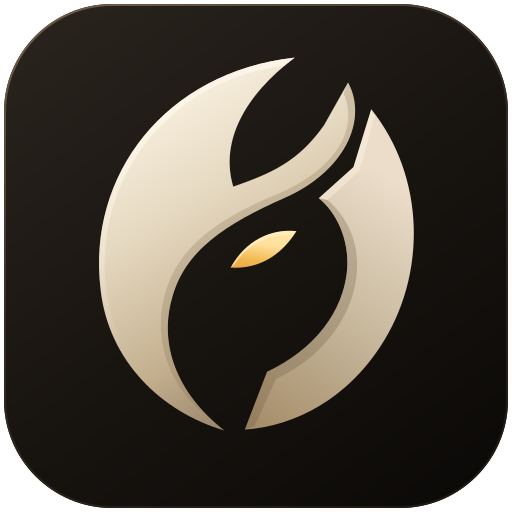

# SpaceFace emblem — The Unclosed Eye



Original, hand-authored vector artwork for SpaceFace. **The Unclosed Eye** is a working art title, not a new canonical faction, religion, artifact or story requirement. These notes describe this asset; they do not replace the game's visual direction.

## The shape

An asymmetric folded crescent and a detached counterform surround a single ember. The upper fold does not close; the lower cleft remains open. The silhouette can suggest a face, an aperture or an incomplete orbital machine without depicting a spacecraft or literal helmet.

The signature treatment uses restrained bone/alloy planes and amber. The flat and one-color versions retain the same three-part silhouette. The 16–32 px optical master widens the breaks and enlarges the ember instead of shrinking all the detail indiscriminately.

The story can give the mark a meaning later. A found mechanism, a hull stamp or a navigation sign are possibilities, not canon. The design does not depend on any of them.

## Files

| File | Use |
| --- | --- |
| `spaceface-emblem.svg` | Transparent signature master; satin-alloy vector shading, larger uses on dark backgrounds. |
| `spaceface-emblem-flat.svg` | Transparent bone/amber version; two-color printing and flat UI. |
| `spaceface-emblem-mono.svg` | Single filled path, `currentColor`; decals, masks, engraving, inline UI and light backgrounds. Standalone default is black. |
| `spaceface-emblem-reverse.svg` | Warm-bone one-color version for dark backgrounds. |
| `spaceface-emblem-small.svg` | Transparent optical master for 16–32 px; wider gaps and larger ember. |
| `spaceface-launcher.svg` | Signature on a warm gunmetal rounded-square tile. |
| `spaceface-favicon.svg` | Small optical master on a solid dark tile; uses the available canvas more fully than the large launcher. |
| `preview.html` | Offline visual specimen, actual-size strip, light/dark applications and links to the SVGs. Open directly in a browser. |
| `export-icons.py` | Reproducible PNG, Windows ICO and macOS ICNS exporter; validates SVG structure before rendering. |

All SVGs use a 512 × 512 viewBox. They contain no bitmap images, external resources, fonts, JavaScript or filters. Signature shading is ordinary SVG gradients and closed path facets. Negative space is transparent, not painted black. The launcher and favicon intentionally have backgrounds.

## Practical usage

Keep the supplied orientation and aspect ratio. The internal voids and the separation of the ember are part of the mark, not holes to fill. For an unfamiliar background, use a one-color version or the launcher tile rather than adding an outline or glow.

For ordinary UI embedding:

```html

```

`currentColor` in the mono file inherits a surrounding color when the SVG markup is **inline**, not through an external ``. For a light symbol in an ordinary ``, use the reverse file. Separate SVG image files have independent ID scopes; when inlining multiple instances in one document, prefix their title, description, gradient and clip IDs and the corresponding references.

No launcher, favicon link, package configuration, gameplay or story file is changed by this asset-only addition. Native exports are ready for a launcher integration but have not been installed into or tested in a packaged SpaceFace build.

## Native exports

The delivery ZIP includes rendered exports. To regenerate from the repository SVGs:

```sh
python -m pip install -r assets/brand/requirements.txt
python assets/brand/export-icons.py --out assets/brand/exports
```

The Python exporter uses CairoSVG, which requires the Cairo system library on platforms where it is not already installed. The SVG files themselves have no runtime dependency on Python or CairoSVG.

Outputs: launcher PNGs at 16, 20, 24, 32, 40, 48, 64, 128, 256, 512 and 1024 px; transparent signature PNGs at 256, 512, 1024 and 2048 px; `spaceface.ico` with nine individually rendered resolutions; and `spaceface.icns`. The ICO retains the optical master in its small representations instead of deriving every size from a single raster. Each output size is rendered from an SVG, with supersampling for curved edges.

`export-receipt.json` records exact source SHA-256 hashes and export checks. ICO frames are decoded and compared byte-for-byte; the largest ICNS frame is decoded. Those checks are file validation, not a claim of native OS integration testing.

## Provenance

Created for this SpaceFace request from newly authored Bézier paths. No third-party logo, stock icon, font glyph, traced image or embedded generated bitmap is used. The existing repository's warm Field Hardware palette informed the material treatment. This is not a trademark-clearance report.
