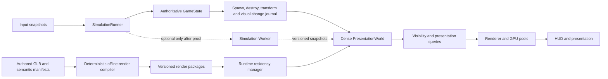

<!-- LIFETIME: STABLE -->

# SpaceFace 2026 performance modernization execution plan

Status: **admitted source plan for PQ-034 through PQ-044; live lifecycle, leases, acceptance, and receipts remain in `design/program/`**

Authority: user direction → `ARCHITECTURE.md` → `design/program/` queue and active packet → this
selected source plan → packet-specific implementation notes.

Research appendix: [`PERFORMANCE_OPTIMIZATION_CONSTELLATION.md`](./PERFORMANCE_OPTIMIZATION_CONSTELLATION.md)
contains the broader option set, rejected alternatives, OSS survey, and large-port possibilities.
This document deliberately selects the work SpaceFace should actually do.

## 1. Executive decision

SpaceFace should pause further performance-sensitive architecture expansion and execute the following
program in order:

1. Establish a repeatable equivalence and performance harness.
2. Finish foreground/background lifecycle correctness.
3. Separate simulation scheduling from presentation scheduling without changing tick semantics.
4. Move authored ship and place geometry compilation out of gameplay and into deterministic release
   tooling.
5. Replace render-time scans of general `GameState` objects with a dense, event-maintained
   `PresentationWorld`.
6. Replace the proven per-job hostile full scan with deterministic batched spatial queries.
7. Upload only dirty GPU buffer ranges in high-churn pools.
8. Upgrade Electron to a supported Chromium/V8/GPU stack.
9. Use clean pass-level evidence to select the remaining GPU work.
10. Move simulation to a Worker only if the post-refactor trace proves presentation blocking still
    prevents simulation from keeping cadence.

Items 1 through 8 are the serious modernization program. Items 9 and 10 are evidence-selected
continuations, not excuses to postpone the first eight.

The central diagnosis is not that SpaceFace renders too much art. The central diagnosis is that its
runtime still performs work that a mature game would either compile offline, maintain incrementally,
or express in dense render-oriented data:

- ship/place render geometry is cloned, transformed, normalized, merged, and sometimes de-indexed
  while the game is running;
- the renderer traverses broad object collections repeatedly and performs interpolation and
  transform work before rejecting culled views;
- render diagnostics repeat collection scans and allocate fresh publication objects;
- one NPC-jobs query performs an `O(jobs × entities)` hostile search despite an existing spatial
  index;
- several dynamic GPU pools mark complete attributes dirty even when only a range changed;
- simulation, rendering, UI, and admission work share one main-thread frame callback, so a render or
  admission stall can create simulation catch-up work in the next callback;
- the desktop runtime is many major versions behind the supported Electron line.

Those are engineering defects worth fixing even when the game is not drawing a visually dense scene.

## 2. Non-negotiable outcome

The optimized game must be the same game.

Every packet must preserve:

- authoritative fixed-timestep results for the same seed and input tape;
- system order and event order;
- input response, flight behavior, AI decisions, combat outcomes, economy results, save continuation,
  and RNG consumption;
- authored geometry, textures, materials, animation, sockets, moving parts, VFX, lighting, bloom,
  HUD information, accessibility, and default quality;
- browser/Electron route parity;
- current WebGL2 support until a separately accepted backend proves equivalence;
- exact semantic identity where pixel identity is not stable across GPU drivers.

Performance work may change internal representation, scheduling, compilation location, allocation,
batching, query strategy, upload granularity, or backend. It may not obtain a pass by deleting authored
content, reducing default quality, lowering population, hiding effects, narrowing draw distance, or
changing gameplay.

> “Do not gain performance by reducing content, population, effects, draw distance, render quality, or default visual quality.”

### 2.1 Synchronized product baseline

The performance program is applied to the current integrated game, not to an older isolated checkout.
The baseline now includes the intro/menu redesign from `6271ca29`, the compact flight-HUD treatment from
`dcbe4a20`, and the Massline/gameplay fixes already integrated on `master`; equivalence must preserve
both the player-facing design and the newer gameplay semantics. A performance packet may refactor how
those surfaces are produced, but it may not restore the prior UI, drop information, or replace the
current visual language merely because an older candidate was easier to optimize.

The dock/hulk/debris source remaster checkpoint at `427d9897` is also preserved as authored work. It is
explicitly a source-only, partial-form checkpoint: the release pair remains unpromoted until the visual
and release gates pass. Performance work must neither revert those sources nor promote them by bypassing
asset acceptance. Source preservation and runtime promotion remain separate decisions.

## 3. What is proved today, and what is not

### 3.1 Current evidence

| Evidence | What it establishes | What it does not establish |
|---|---|---|
| July 23 60-second route: about 317 entities, rAF p95 near the display cadence, no unexpected over-32 ms frame intervals | A steady route can run smoothly on the same project | It does not cover heavy authored-asset admission or sustained dense combat |
| July 16 entity-residency capture: transitional rAF p95 66.6 ms, p99 233.3 ms, maximum 533.3 ms, long tasks, several authored upgrade jobs measured in seconds | Runtime asset admission has produced severe visible stalls | It does not prove every listed asset still has the same cost after later changes |
| July 25 profile: frame-GPU average around 25.6 ms, `bloomScene` around 20.5 ms, rAF p95 183.2 ms, plus Blender/export contention and an abnormally slow no-op control | The captured machine was badly contended and the frame was GPU-active | It is not a trustworthy clean baseline or proof that bloom itself is the root cause |
| Entity-sync scale probe: adding 1,000 roots raised sync p95 into roughly the 2.6–3.5 ms range, including far-culled roots | broad render traversal scales with roots that do not contribute pixels | It does not predict the exact gain from the final dense mirror |
| Current source inspection | the concrete defects named below exist in the live implementation | source inspection alone cannot rank their whole-frame effect |

### 3.2 Interpretation

SpaceFace has two different performance modes:

1. a steady-state route that can already approach the display floor; and
2. transitions, dense populations, runtime asset work, or contended presentation that can produce
   severe stalls.

That is why a single average FPS number is inadequate. This plan treats frame consistency, transition
latency, simulation cadence, GPU duration, allocation/GC, and scale behavior as separate results.

### 3.3 Claims intentionally not made

- Bloom is not declared broken from the contaminated July 25 trace. The current bloom pipeline is
  already small and avoids MSAA on its intermediates.
- Rapier is not declared a dominant cost without a trace selecting physics.
- A complete ECS rewrite is not presumed necessary.
- WebGPU is not presumed faster merely because it is newer.
- A renderer or engine port is not justified before the selected architectural defects are removed.

### 3.4 Feasibility and confidence

| Change | What is known | Feasibility | Equivalence risk | Classification |
|---|---|---|---|---|
| Lifecycle correctness | incomplete lifecycle policy and disabled browser throttling are present; an implementation lane already exists | High | Low outside intentionally hidden states | obvious overdue platform work |
| Scheduler/presentation seam | simulation and presentation share one callback today | High | Medium, controlled by tick-tape parity | professional prerequisite, not a speed miracle by itself |
| Offline render compiler | runtime clone/transform/merge/de-index code and long admission jobs are directly observed | High | Medium, controlled by semantic asset parity | highest-confidence stall removal |
| Dense `PresentationWorld` | repeated broad scans and pre-cull transform/LOD work are directly observed | High | High, controlled by shadow mode | highest-confidence scale refactor |
| Batched spatial hostile query | the `O(jobs × entities)` scan and an existing index are directly observed | Very high | Low | obvious algorithmic oversight |
| Dirty-range GPU uploads | complete attributes are marked dirty and the installed renderer supports update ranges | High | Low/Medium | obvious missing upload optimization; whole-frame effect must be measured |
| Electron modernization | 31.x is outside the currently supported lines | Very high | Medium due accumulated breaking changes | required platform maintenance |
| GPU pipeline branch | one contaminated capture points at GPU work but does not isolate its cause | High after a clean trace | branch-dependent | real work, diagnosis not yet selected |
| Simulation Worker | the seam is feasible; causal necessity is not established | Medium/High | High | conditional large refactor |
| WebGPU/TSL backend | supported by the installed Three.js line but officially experimental | Medium | High | deliberate vertical slice, not a current commitment |

The first seven rows are not speculative rewrites. They address code and platform conditions present
in the live repository. The final three are deliberately prevented from consuming the program until
their causal trigger is proved.

## 4. Target architecture



`GameState` remains authoritative and readable by simulation systems. `PresentationWorld` is a derived,
disposable mirror optimized for interpolation, culling, batching, GPU publication, and rendering.
Render packages are generated artifacts; authored GLBs and semantic manifests remain source truth.

## 5. Program sequence

| Order | Packet | Size | Decision | Primary payoff |
|---:|---|---|---|---|
| 0 | PERF-00 Equivalence and attribution harness | Medium | Do now | makes every later claim falsifiable |
| 1 | PERF-01 Lifecycle correctness | Small | Finish and accept existing lane | removes hidden/minimized work and resume storms |
| 2 | PERF-02 Scheduler/presentation seam | Medium | Do now | removes overload amplification and enables safe parallelism |
| 3 | PERF-03 Offline semantic render compiler | Large | Do now | removes seconds-scale runtime geometry work |
| 4 | PERF-04 Dense `PresentationWorld` | Large | Do now | makes render cost scale with changed/visible data |
| 5 | PERF-05 Deterministic hot-query service | Medium | Do now | removes proven `O(jobs × entities)` behavior |
| 6 | PERF-06 Dirty-range GPU uploads | Medium | Do now | reduces CPU copies, driver traffic, and pool stalls |
| 7 | PERF-07 Electron modernization | Medium | Do now | obtains supported Chromium/V8/GPU behavior |
| 8 | PERF-08 GPU pipeline correction | Medium/Large | Select branch from clean trace | attacks the measured remaining GPU limiter |
| 9 | PERF-09 Simulation Worker | Large | Conditional | isolates simulation only if main-thread coupling remains causal |
| 10 | PERF-10 WebGPU vertical slice | Large | Conditional | tests a future backend without betting the game |

PERF-00 is a dependency of every result. PERF-01 and the first half of PERF-02 may proceed while the
offline compiler is built. PERF-04 depends on the change-journal seam created by PERF-02. PERF-06 may
begin on unleased pools before PERF-04 and then adopt `PresentationWorld` handles. PERF-08 begins only
after PERF-07 so it measures the runtime intended to ship.

## 6. Equivalence principle

The optimized game must be observably the same game. Decide what evidence is proportionate to the
change — the point is to be *right*, not to build a complete measurement apparatus before touching
code.

**Simulation equivalence:** the same seed and input tape must produce the same authoritative results —
fixed-timestep outputs, system/event order, RNG consumption, flight/AI/combat/economy outcomes, and
save continuation. If you change sim behavior you did not intend to change, that is a regression.

**Presentation equivalence:** authored geometry, materials, transforms, sockets, visibility/LOD
selection, render order, animation, HUD information, and accessibility must be preserved. Any
player-visible difference is a bug unless it fixes a separately documented one.

**Proportionality:** a one-line refactor does not need the same proof as a renderer overhaul. Run
`npm run check:baseline` before and after edits as the default; reach for broader or route-level
evidence when the change actually warrants it, and stop when further verification isn't going to
change the outcome. Don't loop on it.

A handful of representative routes (boot→flight, normal flight, denser population, combat,
mining/tether, dock/station, save/load, cold/warm asset admission, lifecycle transitions) are the
useful checklist when you need route-level confidence — not a mandatory 12-cell matrix for every
packet. The existing deterministic simulation goldens and focused tests already cover most
equivalence; lean on them.

The full validation ladder and broker-managed route evidence live in
[`docs/VALIDATION_WORKFLOW.md`](../docs/VALIDATION_WORKFLOW.md) if you need them.

## 7. PERF-00 — Equivalence and attribution harness

### Defect

Existing probes contain valuable measurements, but a run can still mix browser delay, game callback
time, GPU time, and unrelated process contention. They also do not provide one baseline/candidate
equivalence report that can close a major refactor.

### Implementation

1. Add a versioned scenario manifest describing seed, save, input tape, camera tape, entity multiplier,
   required telemetry, and expected route completion marker.
2. Add a baseline/candidate runner that launches each candidate in alternating order and writes one
   comparison directory.
3. Move current performance counters behind a common frame identifier:
   `display-frame`, `simulation-tick`, `render-frame`, `GPU-query`, and `background-job`.
4. Add invalidation reasons: slow no-op control, unrelated high-CPU process, GPU timer disjoint,
   renderer fallback, asset-cache mismatch, wrong display refresh, or route divergence.
5. Add the deterministic simulation and presentation-semantic comparisons from Section 6.
6. Add a machine-readable verdict with separate fields for equivalence, measurement validity, and
   improvement. One cannot substitute for another.

### File map

- extend `scripts/lib/performanceScenarioDriver.mjs`;
- extend `scripts/probe-performance-profile.mjs`;
- extend `src/core/perfRuntime.js`;
- extend `src/render/postTelemetry.js`;
- add `scripts/lib/performanceEquivalence.mjs`;
- add `scripts/validation-manifests/performance-closure.json`;
- add `test/performance-equivalence-contract.test.mjs`;
- emit ignored evidence below `.devshots/perf/closure/<candidate>/`.

### Completion proof

The harness can tell three things apart: the same game, a valid measurement, and a faster one.
A quick way to prove it works: deliberately flip one sim field and one presentation field and
confirm the harness catches each. Don't over-build the apparatus — it needs to be trustworthy
enough to gate later work, not exhaustive.
### Exit condition

Don't start claiming later packets are faster until this harness can actually distinguish
"same game," "valid capture," and "faster." If it can't, that's the gap to close first.
## 8. PERF-01 — Foreground/background lifecycle correctness

### Current state

A separate protected worktree, `codex/perf-01a-background-lifecycle`, is already implementing this
area. Its changes are not accepted merely because they exist. Do not overwrite or duplicate that lane.

### Defect

The primary desktop window currently disables Chromium background throttling, while simulation and
render scheduling do not have a complete minimized/hidden/suspend/resume state machine. This can waste
resources offscreen and can feed a large elapsed interval back into the fixed-step loop on resume.

### Required lifecycle

Use explicit states:

- `foreground-visible`;
- `foreground-occluded`;
- `hidden-or-minimized`;
- `system-suspended`;
- `restoring`.

Window events and `document.visibilityState` publish one idempotent lifecycle command. On entry to a
non-presenting state:

- stop presentation scheduling and GPU submission;
- stop cosmetic/UI clocks that have no background meaning;
- preserve authoritative state and save safety;
- do not accumulate wall time for a later catch-up burst.

On restore:

- reset the presentation timestamp;
- resume from the latest committed fixed tick;
- prewarm only resources invalidated by the platform;
- render one coherent snapshot before accepting player input that assumes a visible response.

Foreground gameplay behavior remains unchanged. Hidden-window behavior becomes explicit shell policy
rather than accidental background execution.

### File map

- `electron/main.cjs`;
- `src/main.js`;
- `src/core/loop.js`;
- `test/loop-lifecycle.test.mjs`;
- `scripts/check-electron-background-lifecycle.mjs`;
- `scripts/check-launch-policy.mjs`.

### Completion proof

Foreground play is unchanged; minimized/hidden windows stop doing GPU/sim work; restore
doesn't cause a multi-tick storm or input loss; suspend/resume and lock/unlock are clean;
both browser and packaged Electron behave. Run whatever focused checks convince you it's
correct — `test/loop-lifecycle.test.mjs` and the lifecycle scripts are the natural owners.
## 9. PERF-02 — Separate simulation scheduling from presentation scheduling

### Defect

`src/core/loop.js` currently advances up to four fixed ticks and performs renderer/UI work from the
same rAF callback. When presentation stalls, the next callback can inherit multiple simulation ticks,
making the callback longer and increasing the chance of another delayed frame. The loop also exposes
no clean boundary for a future Worker.

### End state

Introduce:

- `SimulationRunner`: owns accumulator semantics, fixed ticks, system order, RNG/time, and publication
  of a completed tick revision;
- `PresentationRunner`: owns rAF, interpolation alpha, renderer/UI scheduling, and lifecycle;
- `PresentationJournal`: records spawned, destroyed, moved, and visually changed stable entity IDs
  during each tick;
- `InputCommandSnapshot`: immutable commands consumed at a fixed-tick boundary;
- `CompletedTick`: revision, sim time, journal span, and state digest marker.

The first implementation remains on the main thread. It is a semantic extraction, not premature
parallelism.

### Implementation order

1. Characterize current accumulator, cap, and discarded-time behavior with input tapes.
2. Extract `SimulationRunner` behind a compatibility adapter that produces the same tick sequence.
3. Extract `PresentationRunner` without changing rAF order.
4. publish input only at fixed-tick boundaries.
5. Emit a journal from authoritative spawn/destroy and transform/visual-version owners.
6. Make renderer/UI consume `CompletedTick` plus interpolation alpha rather than assuming they own
   simulation advancement.
7. Add telemetry for backlog cause: simulation work, presentation work, admission work, or external
   scheduling.

### File map

- refactor `src/core/loop.js`;
- add `src/core/simulationRunner.js`;
- add `src/core/presentationRunner.js`;
- add `src/core/presentationJournal.js`;
- route input snapshot creation from `src/systems/input.js` without changing raw-axis/action semantics;
- add focused runner and journal tests under `test/`.

### Completion proof

Deterministic scenario digests match the pre-extraction loop; callback traces cleanly
separate fixed-tick ownership from presentation; lifecycle transitions don't create catch-up
work; the game stays playable after each extraction commit. The point is a clean seam, not
a speed win in this packet.
### Exit condition

Don't move simulation to another thread in this packet. The purpose is to make that later
change possible without rewriting gameplay, and to stop presentation stalls from being an
opaque whole-loop failure.
## 10. PERF-03 — Offline semantic render compiler

### Defect

The live render path still contains a runtime compiler:

- `src/render/assetLoader.js` compiles blueprints and clones matrices;
- `src/render/partsLibrary.js` serially decodes assets, clones geometries, applies matrices, merges
  geometry, normalizes attributes, promotes quantized data, and may call `toNonIndexed()`;
- cold and even some cache-hit authored upgrade jobs have measured from hundreds of milliseconds into
  multiple seconds.

This work is deterministic from release inputs and should not run during play.

### Render-package format

For every release ship/place, generate:

```text
<asset-id>/
  render.glb
  render-package.json
```

`render.glb` contains immutable, pre-transformed render clusters. `render-package.json` contains:

- compiler and schema version;
- source manifest and content hashes;
- stable semantic node IDs;
- sockets, hardpoints, docking anchors, trail anchors, lights, and effect anchors;
- dynamic surfaces and moving-part group boundaries;
- material pipeline keys and texture references;
- LOD/HLOD records, bounds, collision references, and spatial-cluster IDs;
- geometry/material hashes used by the equivalence oracle.

Authored source GLBs remain the source of truth. Render packages are reproducible generated outputs.

### Compiler pipeline

1. Validate the exact release manifest and dependency hashes.
2. Load the source GLB and semantic metadata.
3. Separate immutable geometry from sockets, dynamic surfaces, and moving groups.
4. Bake immutable node transforms.
5. Normalize required vertex attributes without expanding indexed geometry unless semantically
   unavoidable.
6. Weld only bit-identical vertices.
7. Reorder indices/vertices for post-transform cache and vertex-fetch locality using meshoptimizer.
8. Group by compatible material/pipeline state and spatial cluster; never merge across a moving,
   semantic, transparency, or independently culled boundary.
9. Compute bounds and validate every anchor/group transform.
10. Write `render.glb`, metadata, provenance, and hashes deterministically.
11. Rebuild twice and require byte-identical outputs.

The equivalence phase does not simplify meshes, reduce textures, change material models, or alter
authored LOD distances.

### Runtime path

1. Resolve the render-package hash from the release manifest.
2. Decode/load the package once per content hash.
3. Share immutable geometry, material, and texture resources.
4. Instantiate lightweight stable roots and declared dynamic groups.
5. Attach anchors from metadata.
6. Publish residency and first-visible status.
7. Use the legacy runtime compiler only as a temporary diagnostic fallback until that asset class
   passes.

### Pilot order

1. player Kestrel;
2. one freighter with dynamic/auxiliary surfaces;
3. one large trade hub/place;
4. all release ships;
5. all release places.

This deliberately covers the most difficult semantic cases before bulk conversion.

### File map

- add `scripts/compile-render-packages.mjs`;
- add `scripts/lib/renderPackageCompiler.mjs`;
- add `scripts/check-render-package-equivalence.mjs`;
- add `src/render/renderPackageLoader.js`;
- add a versioned schema under `src/contracts/`;
- integrate hashes into existing release manifests;
- retain source assets and existing authored validation.

### Reused OSS

- existing `@gltf-transform/*` dependencies for deterministic glTF transforms;
- existing `meshoptimizer` for cache/fetch reorder and compression;
- existing Three.js GLTF/KTX2/Meshopt runtime loaders.

### Completion proof

Compiler outputs are reproducible (rebuild twice, byte-identical); geometry, materials,
anchors, dynamic groups, and LOD/HLOD match; the accepted runtime route no longer does
clone/apply/merge/de-index work; cold and warm admission traces show those phases gone,
not merely faster; all release assets pass before the fallback is removed.
### Expected magnitude

For assets that previously performed seconds of runtime geometry work, removing that work can exceed
a fivefold transition-latency improvement without changing a pixel. Whole-frame steady-state speed is
not claimed from this packet; its purpose is eliminating major stalls and making admission bounded by
I/O, decode, upload, and construction.

## 11. PERF-04 — Dense `PresentationWorld`

### Defect

`src/render/renderer.js::syncEntityViews()` currently:

- walks broad render-view collections;
- interpolates and writes transforms before the cull rejection;
- computes LOD before skipping a culled view;
- allocates a new sync-diagnostics object each frame;
- invokes additional diagnostics that scan the collection again.

Other frame consumers perform overlapping derived scans. This makes cost scale with registered roots
instead of changed or visible presentation work.

### Data model

Add a disposable `PresentationWorld` containing dense arrays indexed by stable handle:

- generation, alive flag, stable entity ID, and render slot;
- previous/current X, Z, rotation, bank, pitch, scale, and bounds;
- entity type/team/relation flags needed for rendering;
- mesh, material, LOD, effect, shadow, trail, light, and dynamic-surface flags;
- transform, visual, attachment, and residency revisions;
- visible-last-frame and visibility-cell membership;
- dirty masks and active-list positions.

Use typed arrays for numeric hot fields and compact side tables only for JS/Three object references.
Handles include a generation so a destroyed slot cannot alias a later entity.

### Publication rules

- spawn allocates a handle and publishes a complete record;
- destroy retires the handle and all pool memberships;
- physics/flight publishes changed transforms through existing single-writer points;
- ships/damage/effects publish visual revisions;
- asset residency publishes resource/LOD availability;
- static entities never re-enter transform work until their version changes;
- camera visibility produces candidate handles from the spatial index;
- newly visible handles receive a full transform/attachment sync;
- already visible handles receive only fields whose version changed.

No simulation system reads `PresentationWorld`; it can be destroyed and rebuilt from `GameState`.

### Migration sequence

1. **Shadow publication:** build `PresentationWorld` while the legacy renderer remains authoritative.
   Compare records every tick.
2. **Visibility source:** derive candidate handles from the spatial index and compare legacy cull/LOD
   decisions.
3. **Transform source:** render interpolation reads dense arrays; offscreen `Object3D` transforms are
   not written.
4. **One-pass frame publication:** the same visible-handle traversal feeds main meshes, contact
   shadows, ship auxiliary pools, authored instance pools, trails, and lights.
5. **Diagnostics removal:** debug telemetry reads counters maintained during publication instead of
   rescanning collections.
6. **Legacy removal:** delete broad scan/update paths after matched parity and scale results.

### File map

- add `src/render/presentationWorld.js`;
- add `src/render/presentationPublisher.js`;
- add `src/render/presentationQueries.js`;
- refactor `src/render/renderEntityFrame.js`;
- refactor `src/render/renderer.js::syncEntityViews()`;
- adapt contact-shadow, authored-instance, ship-auxiliary, trail, and light consumers;
- add handle-lifecycle, shadow-parity, culling, LOD, and interpolation tests.

### Completion proof

Shadow mode reports identical records and cull/LOD results; deterministic and presentation
equivalence hold; transform work scales with visible/changed handles rather than every
registered root; at higher entity counts the new path holds up where the old one degrades.
Prove the win at a population that actually stresses it, but don't loop on the exact ratio.
### Expected magnitude

This is the strongest credible path to a fivefold entity-scale improvement because it changes the
growth function: broad `O(all registered roots)` presentation work becomes
`O(changes + visibility candidates + visible roots)`. It does not promise five times higher FPS when
the GPU or another fixed cost dominates.

## 12. PERF-05 — Deterministic hot-query service

### Defect

`src/systems/npcJobsRuntime.js::_nearestHostile()` scans `state.entityList` for each job on each
eligible update. With `J` jobs and `N` entities, this is `O(JN)` even though the project already has
`entityIndex`, `SpatialHash`, and batch-query support.

### Implementation

1. Add an owner-facing query API that accepts many origin/radius/relation requests.
2. Bucket requests by spatial cells and relation/team filters.
3. Reuse scratch candidate/result storage; avoid per-tick `filter`, closure, and sort allocations.
4. Return stable IDs in deterministic distance order with a stable-ID tie break.
5. Resolve IDs through `entityIndex`; never retain stale entity-object references across ticks.
6. Replace `_nearestHostile()` calls with one batch per NPC-jobs cadence.
7. Instrument requests, cells visited, candidates tested, results returned, and scratch growth.
8. Audit other repeated full scans using runtime owner counters, then migrate only owners that are
   measured hot. Cadenced or event-only scans are not rewritten automatically.

### File map

- refactor `src/systems/npcJobsRuntime.js`;
- extend the existing spatial-query owner rather than adding a second index;
- add deterministic query tests and dense-population scenarios;
- add owner query counters to performance telemetry.

### Completion proof

Baseline and candidate select the same hostile for every request and tick; edge cases
(empty, equal-distance, destroyed, spawned, cross-team, boundaries) pass; candidate visits
scale with nearby density, not total population. This is the lightest packet — don't
over-prove an obvious algorithmic fix.
## 13. PERF-06 — Dirty-range GPU uploads

### Defect

Several dynamic pools set complete attributes or instance matrices `needsUpdate` even when only a
small active range changed. No source path currently uses Three.js `BufferAttribute` update ranges.
That can copy excess JS memory, issue excess driver traffic, and create avoidable synchronization.

### Implementation

1. Add `src/render/dynamicBufferRanges.js` with a small non-allocating owner-side pending-span
   accumulator. Logical writes only union component indices; they never publish Three.js range metadata.
2. Publish before Three.js first processes an owner's attributes. Three.js 0.184.0 invokes
   `WebGLObjects.update()` during `projectObject`, before `Object3D.onBeforeRender`, so object hooks are
   forbidden. `src/render/renderer.js#drawPreparedFrame` arms one exact `Scene.onBeforeRender` wrapper around
   the selected renderGraph/bloom/straight path, invokes the prior scene callback first with its original
   receiver/arguments, rejects re-entry or hook replacement before traversal, and restores the prior hook
   in `finally` on success, no-render, or throw.
3. Register the initial combat-sprite and trail-streak owners before scene attachment or renderer traversal,
   and require exclusive tracked attributes. After the prior scene callback, processing eligibility requires
   attachment below the rendered scene, visible ancestors/mesh, matching layers, no auto-updating LOD
   ancestor, and `frustumCulled === false`. Ordinary draw eligibility additionally requires the initial
   pool's single material to be visible and active count to be positive. Cullable/shared/material-array/LOD
   cases remain blocked until a later revision proves their exact public traversal predicate.
4. An ineligible scene invocation does not consume an owner's epoch opportunity. Resolve current attributes
   and publish exactly once at the first invocation where a force-full generation is processing-eligible or
   an ordinary pending span is draw-eligible. Rebuild only that owner's range metadata, append one
   `addUpdateRange()` record per changed attribute, set `needsUpdate` once, and move the pending union into
   an immutable published snapshot.
5. At registration, require Three.js's default no-op `onUploadCallback`; any non-default callback blocks
   migration. Install the adapter's sole acknowledgement callback, verify its identity before publication,
   and require an exact current attribute/version snapshot at callback entry. An unsolicited callback fails.
   Ordinary `bufferSubData` has cleared its public list; initial `bufferData` removes only the snapshot's
   exact stale record. Revision 7 does not chain arbitrary upload callbacks.
6. Hold a coordinator-wide upload-callback guard and, after publication, an owner-specific armed-epoch guard.
   Every selected owner writer checks both before touching a tracked typed array or replacing an attribute.
   Callback-time or same-epoch post-publication writes, callback replacement, and direct version/range
   mutation fail closed without changing matrix/color/opacity/sibling bytes. Later support requires
   preallocated staging or a pool-wide completion barrier.
7. Registration/creation, growth/replacement before publication, and context restoration mark the final
   current attribute force-full. Because `WebGLObjects.update()` precedes material visibility checks and
   ignores zero instance count, force-full publication occurs on the first processing-eligible traversal
   even when no primitive draws; ordinary spans wait for draw eligibility. Interrupted/context-loss
   publication without callback is a terminal `superseded-reset`; carry the initialized union to the
   replacement attribute and report both records.
8. Set `DynamicDrawUsage` or `StreamDrawUsage` before first upload according to actual buffer lifetime;
   usage is not changed after upload. Set active instance/draw counts independently from capacity. Record
   logical/requested bytes, pending/published/acknowledged/superseded generations, force-full reason, range
   identity, capacity, reallocations, eligibility skips, scene-hook/epoch/callback violations, and cumulative
   range-record allocations.
9. Cap the initial combat-plus-trail-streak stage at 23 Three.js records per ordinary draw-eligible or
   force-full processing-eligible transfer and 1,380 records/second at 60 uploads/second, with zero on
   initialized unchanged, skipped, or processing-ineligible frames. Prove the ceiling under the live high-
   fanout-and-grow route: begin one slot below capacity, perform 18 capital-debris spawn commits plus one
   trail integration commit, replace/grow before the same draw, and still allocate only three final trail
   records—not 57 or six—at one-times and five-times population. Later stages require their own scaled
   allocation/GC ceilings before admission.
10. Use ping-pong/orphaning only if GPU/CPU traces still show synchronization after range uploads.

### Migration order

1. `src/render/combat/instancedSpritePool.js`;
2. `src/render/engineTrailSurfaces.js`;
3. authored-instance matrices in `src/render/partsLibrary.js`;
4. ship-auxiliary matrices in `src/render/renderer.js`;
5. high-churn pools in `src/render/vfx.js` after the active VFX ownership lane clears.

Do not alter leased VFX files merely to complete this packet.

### Completion proof

Output, instance identity, lifetime, ordering, and capacity behavior match; dirty ranges
upload the correct components and never display stale/cross-generation data after wrap,
grow, shrink, spawn, destroy, or context loss; telemetry reflects changed bytes rather than
capacity. A matched combat capture should show a repeatable CPU/driver gain, or the
abstraction gets removed. Don't chase exact record-count ceilings in prose — verify the
behavior is right and the gain is real.
## 14. PERF-07 — Electron modernization

### Defect

The project declares Electron 31.x, a mid-2024 runtime. As of 2026-07-26, the current stable release
is 43.2.0 and the supported major lines are 41, 42, and 43. SpaceFace is therefore missing two years
of Chromium, V8, ANGLE, GPU-driver workarounds, platform lifecycle fixes, and security support.

### Implementation

Use temporary compatibility checkpoints at 37, 40, and 43 to isolate breaking changes; only the final
supported line is retained.

At each checkpoint:

1. update Electron and the matching Playwright/Electron launch surface;
2. run main/preload API and security-setting checks;
3. run file/custom-protocol, asset URL, save path, window lifecycle, input, display, audio, controller,
   and packaging checks;
4. record Chromium, V8, ANGLE, renderer, GPU-feature, and hardware-acceleration identity;
5. run the same deterministic and performance scenarios;
6. fix compatibility without adding a browser-only gameplay route.

The final upgrade also audits removed/deprecated APIs, Content Security Policy, context isolation,
sandbox/preload boundaries, crash recovery, and power-monitor events.

### File map

- `package.json` and lockfile;
- `electron/main.cjs` and preload surface if required by documented breaking changes;
- Electron/Playwright launch and package scripts;
- lifecycle, launcher, packaged-build, and GPU identity checks.

### Completion proof

The supported runtime launches, packages, saves, loads, and plays the same route; hardware
acceleration is active; browser/Electron parity holds; deterministic equivalence passes.
Report a performance comparison even if the upgrade is neutral — support/security alone
justify leaving the old Electron line.
## 15. PERF-08 — GPU pipeline correction selected by clean evidence

This packet's branch is selected by clean pass-level evidence after PERF-07 — not by a contaminated
trace. The July 25 capture was run on a badly contended machine, so it can suggest where GPU time
goes (bloom composite, full-screen passes) but cannot by itself choose the fix.

The diagnostic idea is sound and worth keeping: vary output-pixel count, draw/state structure, and
post-pass cost independently, attribute the dominant cost to one of four buckets, and fix that bucket.
But the exact statistical method (block design, sample floors, threshold values, branch-exclusion
equations) should be chosen by whoever runs the capture against the real machine, not frozen in prose
ahead of time. Pinning FNV seeds, exact query counts, and irrevocable "packet-terminal" verdicts into
a plan document makes the result impossible to re-validate and primes a loop where a misread number
freezes the packet forever.

### Diagnostic matrix

Use these four buckets to attribute the dominant GPU cost; pick the one the evidence actually
supports. If the evidence is ambiguous or the runtimes disagree, report that — don't force a branch.

| If clean evidence shows… | …the cost is likely… | …so implement |
|---|---|---|
| scene GPU time scales with output pixels (vary resolution, hold draw/state counts) | fragment shading, transparency, lighting, or overdraw | PERF-08A pixel/overdraw correction |
| cost scales with draw calls / state changes / pipeline switches (hold pixels) | submission/pipeline fragmentation | PERF-08B material and ordering correction |
| cost concentrates in full-screen passes (bloom composite, copies, post) | full-screen pass cost | PERF-08C post-pass fusion/reuse |
| none of the above; GPU timing is healthy but callbacks are still late | not a GPU problem | PERF-08D — investigate the non-GPU owner, don't mutate GPU code |

### PERF-08A — Pixel/overdraw correction

1. Capture opaque, transparent, lighting, bloom-input, and effect coverage separately.
2. Produce an overdraw/coverage heatmap without changing the shipping route.
3. identify the exact materials/effects with the highest covered pixels × shader cost.
4. Preserve authored appearance while reducing redundant layers, redundant depth work, or duplicate
   shading of fully occluded pixels.
5. Use tighter existing bounds, spatial clusters, depth prepass only for selected expensive opaque
   groups, and equivalent shader algebra/lookup reuse.
6. Do not lower resolution or effect quality to claim completion.

### PERF-08B — Material and ordering correction

1. Generate a report of material instances, normalized pipeline keys, shader program keys, and state
   changes.
2. Canonicalize materials that are semantically identical.
3. Move per-object values to existing instance attributes or `onBeforeRender` uniforms without
   cloning a material.
4. sort opaque packets pipeline-major while preserving required render/depth order.
5. Keep transparent packets in a separately correct ordering domain.
6. Recheck shader compilation, first-use stalls, draw calls, and GPU duration.

### PERF-08C — Post-pass correction

1. Measure the physical `bloomScene`, `bloomDownsample`, fused `bloomComposite`, and diagnostic `bloomBypassCopy` groups; do not invent separate upsample, grade, vignette, grain, or final-copy owners.
2. Fold compatible full-screen math into the existing final composite.
3. Reuse the existing bloom pyramid for effects needing the same resolutions.
4. Remove only provably redundant render-target transitions or passes.
5. Preserve output color space, exposure, bloom response, grade, grain, vignette, and accessibility.

### Completion proof

The selected diagnosis reproduces across matched runs without post-capture threshold
tweaks; semantic and image/temporal equivalence pass at default scale, population, post,
and quality; the chosen branch (A/B/C/D) is the one the evidence actually supports. If the
evidence is ambiguous or the captures disagree across runtimes, that's a real signal — say
so rather than forcing a branch. One clean, interpretable result beats a frozen contract
that no one can re-validate.
## 16. PERF-09 — Conditional simulation Worker

### Trigger

Implement only if post-PERF-08 evidence shows:

- the simulation by itself meets cadence;
- presentation or GPU submission blocks the main thread long enough to delay fixed ticks;
- the PERF-02 seam cannot prevent the missed cadence while both remain on one thread.

If simulation computation itself is the limiter, optimize the selected system/query instead. A Worker
does not make expensive simulation logic disappear.

### Architecture

- main thread: platform input capture, DOM/accessibility UI, Three.js renderer, audio, and shell;
- simulation Worker: `SimulationRunner`, authoritative `GameState`, system registry, deterministic
  RNG/time, and save snapshot creation at tick boundaries;
- command queue: tick-targeted input and shell commands with sequence numbers;
- presentation snapshots: versioned double/triple-buffered dense arrays from `PresentationWorld`;
- event queue: ordered audiovisual/UI events with tick and sequence;
- backpressure: renderer may skip obsolete presentation snapshots but never reorder simulation ticks;
- restart: Worker can rebuild from the latest authoritative save/checkpoint and command journal.

Use `SharedArrayBuffer` only when browser/Electron cross-origin isolation is proven on the shipping
route. Otherwise use transferable buffers with ownership handoff. Do not serialize the full object
graph every frame.

### Migration

1. Run `SimulationRunner` through an in-process port.
2. Run it in a Worker while retaining JSON messages for tiny control commands.
3. transfer dense presentation buffers.
4. move save snapshot construction to the Worker.
5. remove direct main-thread reads of authoritative mutable state.

### Completion proof

Tick-by-tick digest and ordered events match; input target-tick semantics are exact;
save/load continuation and Worker restart match; renderer stalls no longer delay fixed-tick
cadence; snapshot transfer doesn't substitute allocation/GC stalls; a11y/UI event delivery
stays correct.
## 17. PERF-10 — Conditional WebGPU/TSL vertical slice

### Purpose

Test the strongest realistic backend change without committing the entire game to an experimental
path. Three.js 0.184 includes `WebGPURenderer`, TSL, compute support, render bundles, automatic render
pass combination, and MRT facilities, but Three.js still describes the renderer as experimental.

### Slice

After PERF-03, PERF-04, and PERF-07:

1. render the standard flight/combat benchmark from the same `PresentationWorld`;
2. load the same render packages;
3. port custom materials and the bloom/composite path to TSL;
4. use WebGPU timestamps and pipeline-compilation telemetry;
5. retain WebGL2 as fallback;
6. compare output, first-use compilation, steady GPU time, CPU submission time, memory, context/device
   recovery, and packaged Electron behavior.

### Decision

Continue migration only if the slice reaches semantic/image equivalence and shows a
repeatable benefit on the actual limiting routes. Otherwise retain it as an experiment,
not a hidden production fork.
## 18. Parallelism and ownership

The work can be scheduled in disjoint lanes, but repository ownership and live leases control actual
start dates:

- PERF-01: existing protected lifecycle worktree; review/accept rather than duplicate;
- PERF-00 and PERF-02: core/scripts/tests;
- PERF-03: compiler scripts, contracts, loader, generated render-package outputs; source-asset
  generation waits for active Blender/asset locks to clear;
- PERF-04: renderer/presentation; coordinate with active render or VFX ownership;
- PERF-05: NPC-jobs/spatial-query owner;
- PERF-06: start with sprite/trail pools; wait before touching leased VFX paths;
- PERF-07: package/Electron/launcher owner;
- PERF-08 onward: begin after the earlier evidence and ownership gates.

The selected work is admitted as PQ-034 through PQ-044 in the live program queue. Each packet still
requires its own dependency, owner, lease, and evidence entry gates. This plan does not seize files
merely by naming them.

## 19. What should not be done first

- Do not replace Three.js because one contaminated trace showed high GPU time.
- Do not convert all gameplay state to a generic ECS.
- Do not replace Rapier without a physics-selected profile.
- Do not apply global heterogeneous `BatchedMesh` pooling; the prior measured experiment regressed and
  was correctly rejected.
- Do not add a high-frequency auto-tuner that continuously changes quality or reallocates resources.
- Do not use device-class guesses as the main control signal.
- Do not build an OffscreenCanvas render Worker before browser/Electron support, renderer ownership,
  and transfer costs are proved.
- Do not expand indexed geometry with `toNonIndexed()` in gameplay for convenience.
- Do not leave two render architectures indefinitely after acceptance.
- Do not use lower quality, fewer effects, fewer entities, or shorter distance as the comparison win.

## 20. Resource adaptation without thrashing

When adaptation is needed, use a slow, hysteretic state machine fed by existing telemetry:

- measure capabilities once at startup;
- cache renderer/driver/runtime identity and last-known stable state;
- observe only at coarse intervals or on explicit lifecycle/device events;
- enter a new state only after sustained evidence;
- use separate enter and exit conditions;
- impose a long residence time;
- allocate new resources before switching;
- retire old resources after GPU completion;
- change one dimension at a time;
- persist the stable result for that machine;
- expose every transition in telemetry.

This mechanism is for residency, pool growth, or a user-selected adaptive mode. It is not allowed to
silently degrade the default accepted graphics route.

## 21. Primary OSS and algorithm references

| Use | Existing/new project | Exact application |
|---|---|---|
| glTF processing | `donmccurdy/glTF-Transform` | deterministic offline transforms, validation, weld/reorder pipeline |
| mesh locality/compression | `zeux/meshoptimizer` | vertex-cache/fetch reorder and Meshopt-compressed package output |
| GPU attribute ranges | Three.js `BufferAttribute.addUpdateRange()` | sparse active-range uploads |
| WebGPU vertical | Three.js `WebGPURenderer` and TSL | alternate backend and post pipeline |
| render bundles | Three.js `BundleGroup` | later static draw-submission pilot only after WebGPU slice |
| spatial queries | current SpaceFace `SpatialHash`/batch query | replace repeated hostile scans; avoid a second world index |
| physics | current Rapier | keep unless measured physics evidence selects a narrow SIMD/memory pilot |

Primary references:

- <https://github.com/donmccurdy/glTF-Transform>
- <https://gltf-transform.dev/modules/functions/functions/reorder>
- <https://gltf-transform.dev/modules/functions/functions/weld>
- <https://github.com/zeux/meshoptimizer>
- <https://threejs.org/docs/pages/BufferAttribute.html>
- <https://threejs.org/manual/en/webgpurenderer>
- <https://threejs.org/docs/pages/BundleGroup.html>
- <https://releases.electronjs.org/release>
- <https://www.electronjs.org/docs/latest/tutorial/electron-timelines>
- <https://www.electronjs.org/docs/latest/api/power-monitor/>
- <https://www.electronjs.org/docs/latest/api/web-contents/>

## 22. Program routing and records

Live state is intentionally not copied into this stable plan. Read
[`program/roadmap/program-queue.json`](./program/roadmap/program-queue.json), exactly one selected file
under [`program/roadmap/active/`](./program/roadmap/active/README.md), the current lease board, and the
packet's exact-revision receipt. Only mark a packet complete when its completion proof is attached.

| Source packet | Queue identity | Required terminal record |
|---|---|---|
| PERF-00 | PQ-034 | baseline/candidate harness, validity and equivalence reports |
| PERF-01 | PQ-035 | lifecycle diff, focused checks, foreground parity, resume trace |
| PERF-02 | PQ-036 | runner/journal contracts, tick parity, causal callback trace |
| PERF-03 | PQ-037 | compiler reproducibility, asset parity matrix, cold/warm admission trace |
| PERF-04 | PQ-038 | shadow-parity report, scale curve, allocation/traversal trace |
| PERF-05 | PQ-039 | deterministic target parity, candidate-visit scale curve |
| PERF-06 | PQ-040 | dirty-range correctness, upload-byte and combat comparison |
| PERF-07 | PQ-041 | compatibility audit, packaged acceptance, runtime comparison |
| PERF-08 | PQ-042 | branch-selection trace, GPU pass/state comparison or digest-bound no-change closure, plus machine-readable mappings for every required follow-up |
| PERF-09 | PQ-043 | causal trigger evidence, Worker receipt, or explicit not-needed closure |
| PERF-10 | PQ-044 | trigger evidence and WebGL2/WebGPU parity/performance comparison |

## 23. Definition of program success

The core program succeeds when:

- ordinary foreground play is behaviorally and visually unchanged;
- hidden/minimized/suspended execution is lifecycle-correct;
- authored runtime geometry compilation is absent from accepted gameplay;
- renderer work scales with changed/visible presentation data rather than every registered root;
- the proven NPC-jobs full scan is gone;
- dynamic pool uploads follow changed active ranges;
- the desktop runtime is on a supported Electron line;
- clean evidence identifies and corrects any remaining dominant owner in the frozen selected aggregate domain (`totalGpuMs` for GPU work or `rendererCpuMs` for CPU/submission work), and every D1 or different post-fix branch follow-up has an accepted terminal receipt;
- the five-times-population route remains smooth relative to the old current-population route;
- admission and transition stalls formerly measured in seconds are removed;
- all claims are backed by matched, valid, machine-readable evidence.

At that point, SpaceFace will have the performance architecture expected of a modern game:
offline compilation, stable runtime packages, dense presentation data, incremental change
publication, indexed queries, bounded GPU updates, explicit lifecycle, current platform support, and
parallelism introduced only across a clean semantic boundary.
