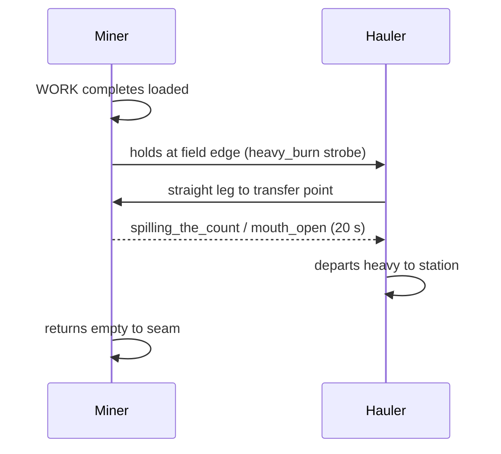
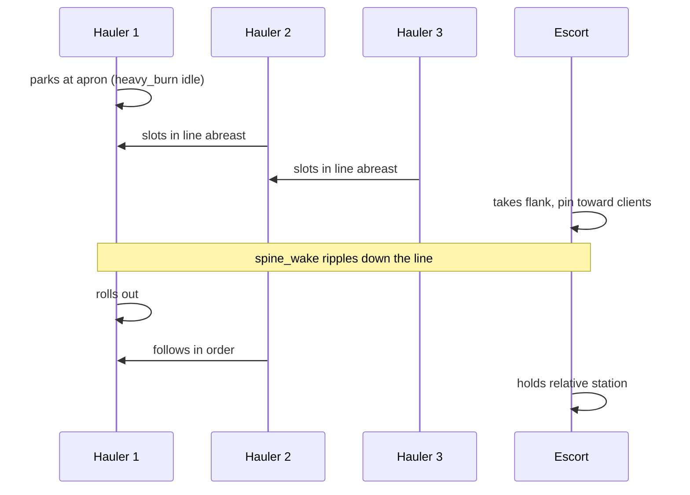
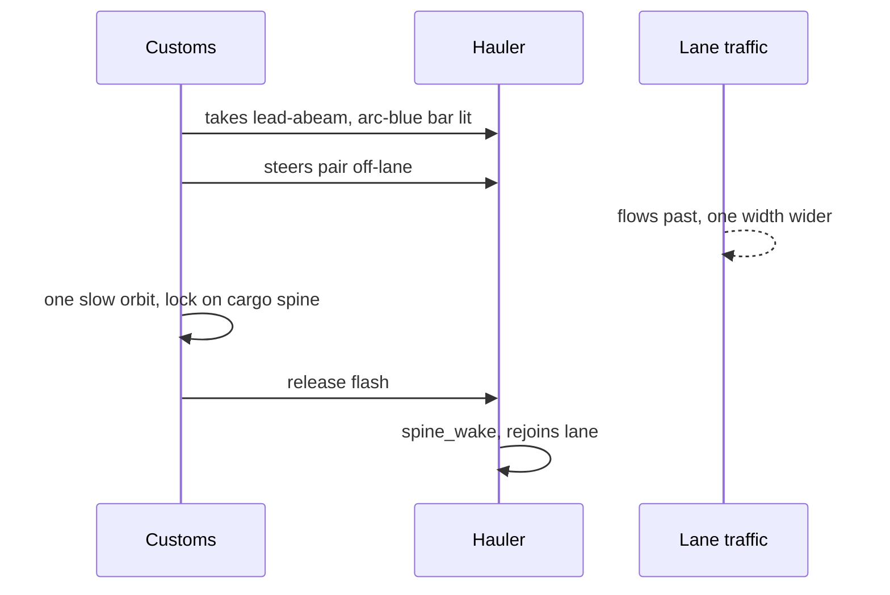
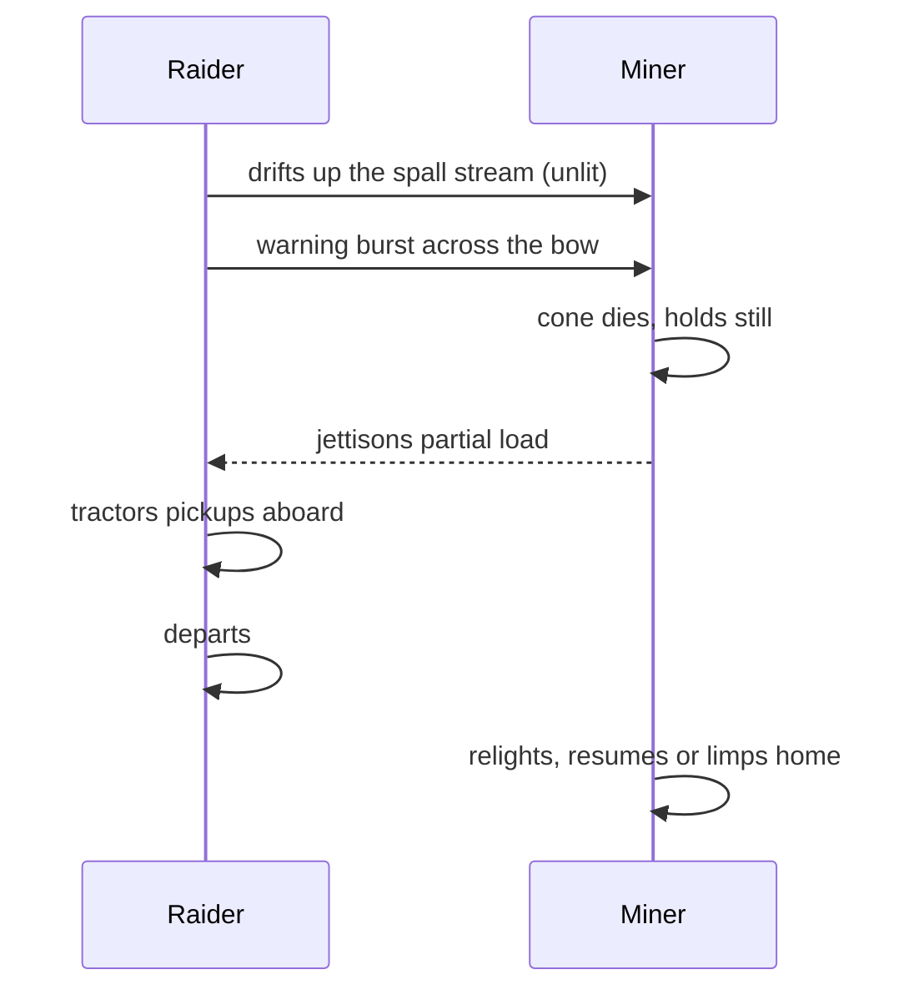
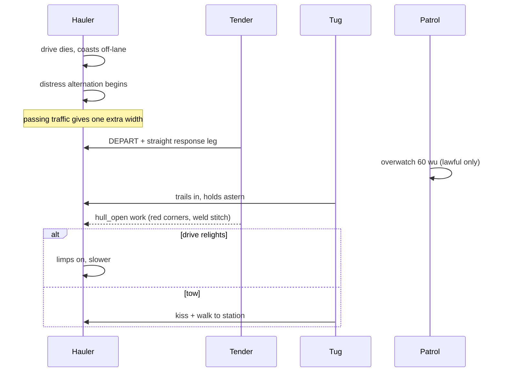
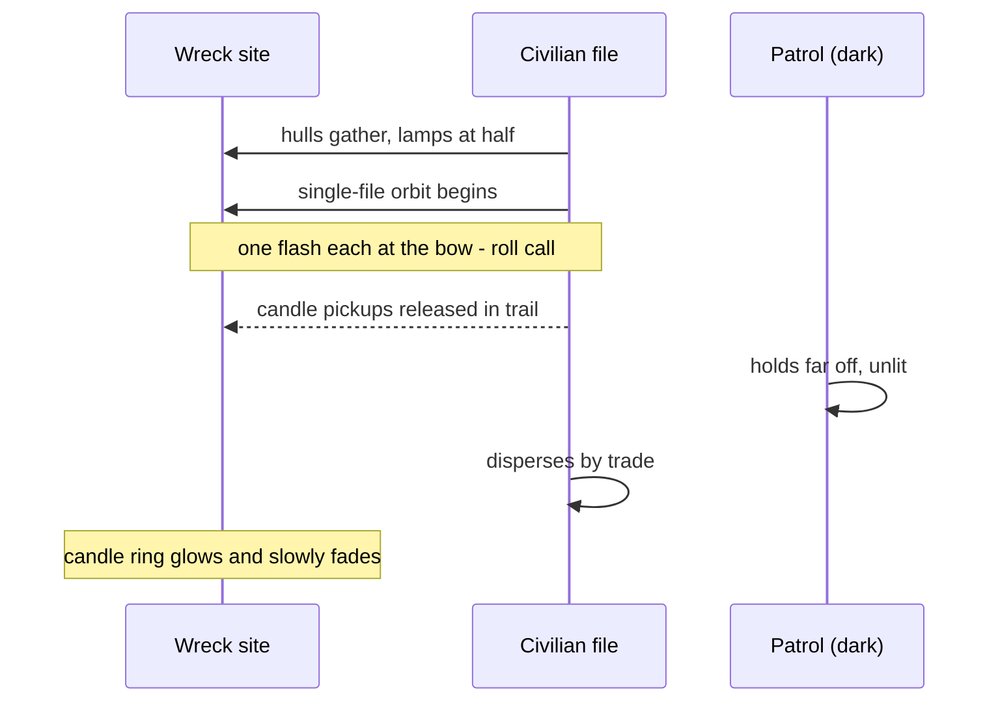

<!-- GENERATED by build-microevent-bible.mjs from catalog/*.json - do not edit by hand -->
<!-- LIFETIME: DURABLE -->
# The Microevent Bible — ambient choreography for a lived-in region

58 short ambient events (10 s – 2 min) expressed as state-machine
choreography over systems that already exist: the six npcJobs kinds, the thirteen
Working Light signals, the five encounter scripts, the four station-side VFX
profiles, wrecks, pickups and passive avoidance. No NPC AI rewrite; no dialogue.
Every event obeys the design rule: **a player who never opens a mission log can
WATCH it and roughly understand what happened.** Each entry names its tell, its
visible phases, and what is left behind.

Machine source of truth: `catalog/*.json` (validated against
`microevent.schema.json`). This file is generated; edit the catalog instead.

**Census:** work 8 · logistics 8 · law 7 · crime 8 · accident 8 · construction 6 · civilian 7 · environmental 6 — first15 15 / next20 20 / standard 18 / blocked 5

## WORK

### `ev_cutter_strips_wreck` — Salvage cutter strips a wreck, piece by piece

*60–120 s · tier: first15*

**Participants:** 1x salvor
**Environment:** wreck (class fresh or battlefield)
**Arrangement:** Salvor holds 10-14 wu off the wreck's long axis, working side toward it
**Starts when:** Existing salvor job (yard<->hulk) reaches WORK at a wreck inside a traveled pocket
**The tell:** Three hooded amber umbrellas swing out and light the wreck's flank from above - salvage light is confession light

| # | phase | ~s | what you see |
|---|---|---:|---|
| 1 | survey_cut | 15 | picking_the_bones: cutter arc walks the seam line _[picking_the_bones]_ |
| 2 | sever | 20 | Arc holds one point; a plate-sized fragment separates from the wreck (pickup spawn with the wreck's drift) _[picking_the_bones]_ |
| 3 | wrangle | 20 | The LOAD act that makes a salvor a salvor: tether streak from the hip reel to the fragment, fragment reels in _[picking_the_bones]_ |
| 4 | stack | 12 | Fragment vanishes into the cradle; drum stack lamp ticks the tally _[spilling_the_count]_ |

**Completes:** Repeats until the wreck's salvage budget empties (existing salvage.strip), then home_under_rock back to the yard
**Interrupts:** Player tethers the same fragment → Salvor's WATCH reaction; it yields the piece and cuts the next one - no combat over one plate · Salvor destroyed → Fragment pickups remain; the wreck keeps its remaining budget
**Player can:** Steal cut fragments before the wrangle · Cut the far side yourself - two crews stripping one hulk reads instantly · Kill the salvor for its loaded cradle
**Criminal read:** Fragments mid-wrangle are free-floating cargo with a witness who will not fight for them
**Aftermath:** Wreck visually diminishes (existing wreck stages if present; else fragment count is the read); scrap pickups persist
**Runs on:** npcJobs.phaseGraph, salvage.strip, pickups.spawn, signatureVfx, signatureVfx.reaction, wrecks.spawn
**If an actor vanishes:** Wreck despawns mid-cut: salvor plays one confused sweep (existing sweep lamp) and departs for the yard empty
**Notes:** The salvor kernel cycle IS this event; the addition is spawning the severed fragment as a pickup between WORK and LOAD so the wrangle has a visible object.

### `ev_miner_calls_hauler` — Full miner calls a hauler out

*60–120 s · tier: first15*

**Participants:** 1x miner; 1x hauler
**Environment:** asteroid field slot; shared transfer point 30 wu off the field edge
**Arrangement:** Miner holds at the transfer point; hauler arrives from the nearest station lane; both inside one camera pocket
**Starts when:** Miner completes WORK loaded while a hauler with no manifest is in-sector
**The tell:** The miner does NOT turn for home - it holds at the field edge flashing the load strobe, nose out

| # | phase | ~s | what you see |
|---|---|---:|---|
| 1 | call | 12 | Miner station-keeps, heavy_burn strobe running while parked - a loaded hull holding still is itself the signal _[heavy_burn, on_the_pin]_ |
| 2 | answer | 25 | Hauler breaks its ambient loiter, flies a visible straight leg to the field edge _[clean_burn, stacking]_ |
| 3 | transfer | 20 | Both hulls parallel, 8 wu apart; miner runs spilling_the_count, hauler runs mouth_open; dust drifts between them _[spilling_the_count, mouth_open]_ |
| 4 | split | 15 | Hauler leaves heavy toward the station; miner turns back to the seam empty _[heavy_burn, clean_burn]_ |

**Completes:** Two ships leave in opposite directions, one visibly loaded, one visibly empty - readable as a handoff by anyone
**Interrupts:** Hauler destroyed en route → Miner waits out a 20 s timer then hauls home itself (existing return leg) · Threat enters 520 wu → Both flee per existing logic; the load stays with the miner
**Player can:** Dock-adjacent players can undercut: destroy the hauler and the miner becomes a slow loaded target · Escort the transfer for ambient rep · Sit between them and both GO_DARK/BRIGHTEN react per role
**Criminal read:** The transfer window is the softest moment - two parked hulls, one already unloading
**Aftermath:** Hauler carries a real manifest (existing traffic.manifest) that a scan reads as ore
**Runs on:** npcJobs.phaseGraph, npcJobsRuntime.assign, traffic.manifest, signatureVfx, scanner.roleReadout
**If an actor vanishes:** Either actor despawning reverts the other to its ordinary cycle at the next phase edge
**Notes:** Both cycles already exist; the new piece is one shared waypoint and a wait-with-timeout, which the kernel's timed phases already express.

### `ev_prospector_stakes_claim` — Prospector fires a claim stake

*30–60 s · tier: next20*

**Participants:** 1x miner — prospector variant; donor hull prospector_skiff when promoted
**Environment:** unworked asteroid; claim stake object (lane_furniture claim mark is the existing prop class)
**Arrangement:** Small hull hunting across a field at reading pace, then one rock at close range
**Starts when:** Prospector-variant miner finishes a reading_the_dark hunt with a positive roll
**The tell:** A tiny hull that hunts like a surveyor but is dressed like a miner - and then it SHOOTS the rock

| # | phase | ~s | what you see |
|---|---|---:|---|
| 1 | hunt | 20 | Slow pass with green pulse ring - wrong signal for a mining hull, which is the tell it is prospecting _[reading_the_dark]_ |
| 2 | stake | 5 | One projectile arc to the rock face; a lit claim mark appears where it hits (amber tick) |
| 3 | circle | 15 | One tight possession orbit of the rock - animals and prospectors do this identically _[clean_burn]_ |
| 4 | leave_or_cut | 15 | Either departs (registering the claim) or unfolds arms and starts cutting immediately _[blind_cone]_ |

**Completes:** Rock carries a persistent lit claim mark; a miner (this one or another) works THAT rock preferentially later
**Interrupts:** Another ship approaches during circle → Prospector holds the orbit between intruder and stake - the movement-only argument from the brief
**Player can:** Shoot the stake off the rock (claim erased - witnessed vandalism) · Mine the claimed rock and the owner reacts (PAINT + hold-off orbit) · Stake an adjacent rock with the existing claim beacon verb (U)
**Criminal read:** Claim jumping is the founding crime of the belt - the stake tells everyone exactly what is worth stealing
**Aftermath:** Claim mark persists on the rock; field slot records an owner id
**Runs on:** npcJobs.phaseGraph, signatureVfx, pickups.spawn, donor.laneFurnitureProp, sectorZones.slot
**If an actor vanishes:** Prospector dies after staking: the mark persists unowned - free real estate with a story attached
**Notes:** The player already has a claim-beacon verb (U); this mirrors it for NPCs. Stake projectile = existing projectile VFX with a spawn-on-impact prop.

### `ev_rich_seam_strike` — Miner strikes a rich seam

*40–90 s · tier: first15*

**Participants:** 1x miner
**Environment:** asteroid with a workable seam (the miner's existing field: route target)
**Arrangement:** Miner at cut range (<26 wu) off the rock face, inside a pocket the player can fly through
**Starts when:** Miner in WORK phase; seeded 'rich' roll on the field slot
**The tell:** The steady amber cut-beam suddenly doubles its spall - face-spall streaks fly at twice cadence

| # | phase | ~s | what you see |
|---|---|---:|---|
| 1 | cutting | 15 | Ordinary blind_cone work against the seam _[blind_cone]_ |
| 2 | strike | 8 | Beam holds one spot; dense spall; the flank lamp arc widens to full deploy _[blind_cone]_ |
| 3 | greed | 30 | Miner repositions twice along the same face, short hops, cutting each time - a hull working FAST reads different from a hull working steady _[blind_cone, stacking]_ |
| 4 | haul_out | 20 | Loaded chevrons walk the stack; miner departs for home heavier than usual _[home_under_rock, heavy_burn]_ |

**Completes:** Miner leaves for its refinery with the loaded return read; the seam keeps a brighter scar decal-of-light (lamp) for a while
**Interrupts:** Miner takes damage → Drops to breaking_the_pattern and flees per existing FLEE_RADIUS logic; seam stays rich · Player parks inside the cut cone → Existing GO_DARK reaction: the miner shutters and waits
**Player can:** Mine the same seam alongside (rich yield while the window lasts) · Follow the loaded miner home to find its refinery · Destroy the miner and take the spill
**Criminal read:** A pirate or claim-jumper who reads the doubled spall knows the load is worth taking on the return leg
**Aftermath:** Field slot keeps a +yield flag for a few cycles; two extra ore pickups if the miner dies loaded
**Runs on:** npcJobs.phaseGraph, signatureVfx, signatureVfx.reaction, pickups.spawn, vfx.substrate
**If an actor vanishes:** If the rock resolves invalid (restore id-shift), the existing type-guard already falls back to the short fixed cut-beam and the event quietly ends at haul_out
**Notes:** Pure re-parameterization of the existing miner cycle: cadence, hop waypoints, and a yield flag. No new choreography runner needed.

### `ev_surveyor_probe_line` — Surveyor lays a probe line

*60–120 s · tier: next20*

**Participants:** 1x surveyor
**Environment:** empty quarter of a pocket (no station within 200 wu); 3 probe objects (pickup-class, lane_furniture lane-pin as dressing)
**Arrangement:** Three drop points 40 wu apart on a line crossing the pocket; surveyor flies them in order
**Starts when:** Existing surveyor 4-mark lattice job; probe-drop variant selected
**The tell:** The sideways-flying hull: a surveyor on the line crabs with its boom out, motion no other trade uses

| # | phase | ~s | what you see |
|---|---|---:|---|
| 1 | mark_run | 25 | reading_the_dark pulse rings while crabbing to the first drop point _[reading_the_dark]_ |
| 2 | drop_1 | 8 | A small lit object separates and stays - green pin lamp at rest _[reading_the_dark]_ |
| 3 | drop_2 | 20 | Same at point two; the line becomes visible as two green dots behind the mover _[reading_the_dark]_ |
| 4 | drop_3_close | 25 | Third drop; surveyor holds at the far end and the three probes pulse ONCE in sequence - a wave down the line _[reading_the_dark, on_the_pin]_ |

**Completes:** Probe line persists, pulsing lazily; surveyor departs to its next mark
**Interrupts:** Probe destroyed → Surveyor returns and re-drops ONE replacement, once; twice and it abandons the line
**Player can:** Shoot probes (they are objects) · Steal a probe (pickup) and the survey line goes dark behind you · Follow the line - it points at the surveyor's find
**Criminal read:** A probe line is a treasure map drawn in public: prospectors and pirates can both read where it is pointing
**Aftermath:** Probes persist for the session as sector objects; a later rich-seam or anomaly event can seed AT the line's far end (composability hook)
**Runs on:** npcJobs.phaseGraph, pickups.spawn, signatureVfx, donor.laneFurnitureProp, sectorZones.slot
**If an actor vanishes:** Surveyor lost mid-line: placed probes stay; the wave-pulse close never fires (an unfinished line reads as exactly that)
**Notes:** Drop = pickup spawn at self position; the sequence pulse is three timed lamp calls. The surveyor mark-lattice job already flies the geometry.

### `ev_tanker_loads_at_harvester` — Tanker loads at an ice harvester

*50–100 s · tier: next20*

**Participants:** 1x tanker — runs on ship_mule + volatile manifest until the donor hull is promoted; 1x miner — ice-cutting variant of the ordinary cycle
**Environment:** ice asteroid (cmdty_ice_water source); optional everyday_space_kit formed-vessel prop as the harvester's standpipe
**Arrangement:** Miner works the ice face; tanker noses to a standpipe point 15 wu off, BOW toward it - couplings before cranes
**Starts when:** Ice field slot active with a miner in WORK; tanker role spawn available
**The tell:** A hull approaching a work site nose-first and slowing to a crawl - nothing else in the fleet leads with its bow

| # | phase | ~s | what you see |
|---|---|---:|---|
| 1 | approach | 20 | Tanker's long flat stacking approach, far wider than a fighter would fly _[stacking]_ |
| 2 | couple | 10 | Bow-hold 6 wu off the standpipe; white flood lights the coupling point _[mouth_open]_ |
| 3 | load | 35 | mouth_open cadence at the BOW; miner's spall keeps falling behind it - two trades working one rock _[mouth_open, blind_cone]_ |
| 4 | depart_heavy | 15 | Tanker leaves with the mass strobe; wide turn, no hurry _[heavy_burn]_ |

**Completes:** Tanker departs visibly heavy toward the station; miner keeps cutting
**Interrupts:** Combat within 520 wu → Tanker breaks off FIRST (volatile doctrine), miner follows existing flee
**Player can:** Scan the departing tanker: volatile manifest · A hit on a loaded tanker produces the existing big secondary (wreck class fresh + burn VFX)
**Criminal read:** Loaded volatiles are the highest value-per-shot target in the region - and everyone can read the strobe
**Aftermath:** Station fuel market blips down on delivery (market news system exists)
**Runs on:** npcJobs.phaseGraph, traffic.manifest, signatureVfx, donor.activityPackHull, donor.everydaySpaceProp, wrecks.spawn
**If an actor vanishes:** No tanker available: miner's cycle continues alone; the standpipe prop just sits there (props never depend on actors)
**Notes:** Needs a 'tanker' TRAFFIC_ROLES entry (hauler clone + manifest filter). Everything else is the hauler graph with the transfer at route index 1 instead of 0.

### `ev_tender_services_miner` — Repair tender services a miner at the seam

*60–120 s · tier: first15*

**Participants:** 1x tender; 1x miner
**Environment:** asteroid field with an active miner
**Arrangement:** Miner holds at its rock, cone dark; tender parks 6 wu abeam, working side inward
**Starts when:** Existing tender job (berth<->client) with the client resolved to a working miner whose wear timer fired
**The tell:** A miner's cut-beam dies mid-shift and the hull just SITS there - wrong for the trade, and the first responder is not a rescue ship

| # | phase | ~s | what you see |
|---|---|---:|---|
| 1 | callout | 20 | Tender's DEPART wake and a clean fast leg to the field _[spine_wake, clean_burn]_ |
| 2 | hard_stand | 10 | Tender station-keeps abeam; four red corners come on; white bar deploys _[hull_open]_ |
| 3 | work | 45 | Weld stitch walks the miner's drill housing; miner stays dark and still - crew outside, do not push _[hull_open]_ |
| 4 | first_light | 10 | Miner's cone relights and takes a test cut; tender strikes the bar and departs _[blind_cone, spine_wake]_ |

**Completes:** Miner resumes its ordinary cycle; tender returns to berth - the whole story is one light dying and coming back
**Interrupts:** Player noses inside the red corners → Existing FLINCH reaction: corners brighten, weld star suppressed until you leave · Tender killed mid-work → Miner stays dark, then limps home at half speed - a visible consequence trail
**Player can:** Guard the repair · Kill the DARK miner (it cannot flee well mid-service) · Scan both: tender manifest reads parts
**Criminal read:** Two parked hulls, one disabled, one crewed-outside: the softest double target the working world produces
**Aftermath:** Miner's wear timer resets; if the repair failed, the miner's next three cycles run at reduced speed (visible limp)
**Runs on:** npcJobs.phaseGraph, signatureVfx, signatureVfx.reaction, traffic.manifest
**If an actor vanishes:** Client miner despawns: tender flies the leg, sweeps once, returns (the existing no-client path)
**Notes:** The tender cycle exists end-to-end; the addition is pausing the CLIENT's cycle during service - one flag read by the miner's stepper.

### `ev_tug_repositions_cargo` — Tug walks a drifting pod back to the stack

*45–90 s · tier: next20*

**Participants:** 1x tug — runs on ship_mule until donor hull promoted
**Environment:** free-floating cargo pod (pickup or everyday_space_kit berth pod as dressing); station or platform with a marked stack point
**Arrangement:** Pod adrift 40-80 wu off a station; tug approaches from the dock side; stack point in the pocket
**Starts when:** A pod exists off-stack (seeded, or aftermath of ev_pod_breaks_clamp)
**The tell:** A hull flying NOSE-FIRST at a dead object, decelerating to a crawl nobody else uses

| # | phase | ~s | what you see |
|---|---|---:|---|
| 1 | line_up | 15 | stacking flown for the POD - the tug's whole grammar is approaches on behalf of things _[stacking]_ |
| 2 | kiss | 8 | Contact hold at 2 wu; cradle floods on; pod picks up the tug's exact drift |
| 3 | walk | 30 | Pair moves as one at walking pace toward the stack, thruster ticks in count - seven, eight, nine, kiss _[heavy_burn]_ |
| 4 | set | 10 | Pod released at the stack point with matched velocity; tug backs off two lengths _[clean_burn]_ |

**Completes:** Pod sits in the stack; tug loiters at the apron or answers the next stray
**Interrupts:** Pod destroyed → Tug aborts to apron loiter; debris pickups spawn · Player tethers the pod first → Tug station-keeps and WATCHes; yields the job
**Player can:** Steal the pod (it is real cargo) · Nudge the pod away and watch the tug patiently re-approach · Do the job first with your own tether
**Criminal read:** A pod mid-walk is claimed property in the open - taking it in front of the tug is a witnessed theft
**Aftermath:** Stack gains one pod (persists in sector state)
**Runs on:** traffic.spawnRole, pickups.spawn, signatureVfx, donor.activityPackHull, donor.everydaySpaceProp, vfx.substrate
**If an actor vanishes:** Tug despawns: pod stays adrift; the event re-arms for the next tug spawn
**Notes:** The 'carry' is parented drift (pod copies tug velocity while linked) - no tow physics needed; the Massline tether system already proves object-carrying reads fine.

## LOGISTICS

### `ev_barge_tops_off` — Ore barge tops off from two miners

*80–150 s · tier: standard*

**Participants:** 1x ore_barge — ship_mule heavy variant until donor promoted; 2x miner
**Environment:** asteroid field with two active miner slots
**Arrangement:** Barge parks central to both rocks; miners shuttle to it alternately instead of flying home
**Starts when:** Two miners working the same field while a barge-class hauler is unassigned
**The tell:** A big hull parking in the MIDDLE of a field, doing nothing - a mother ship pose, and the miners' return legs suddenly shorten

| # | phase | ~s | what you see |
|---|---|---:|---|
| 1 | anchor | 15 | Barge takes station central, floods on over its baskets _[on_the_pin]_ |
| 2 | shuttle_1 | 35 | Miner A runs its loaded leg to the barge instead of home; count-spill between them _[home_under_rock, spilling_the_count]_ |
| 3 | shuttle_2 | 35 | Miner B does the same from the other side - the barge becomes the field's visible center of gravity _[home_under_rock, spilling_the_count]_ |
| 4 | haul_home | 30 | Barge departs very heavy, very slow; miners keep cutting with their commutes halved _[heavy_burn]_ |

**Completes:** Barge delivers a double load to the refinery; the field keeps producing without pause
**Interrupts:** Barge killed at anchor → Miners revert to their own home legs; huge spill field at the wreck
**Player can:** The anchored barge is a fixed fat target - guarding it or robbing it are both obvious · Sell your own ore to it (it is a mobile buyer)
**Criminal read:** One hull now carries two crews' shifts - the raid math improves every minute it sits
**Aftermath:** Refinery inventory jump on delivery; miners' cycle continues
**Runs on:** npcJobs.phaseGraph, npcJobsRuntime.assign, traffic.manifest, signatureVfx, donor.activityPackHull
**If an actor vanishes:** One miner lost: the barge waits one extra window then hauls half-full
**Notes:** Retargets the miners' home waypoint to the barge's position while anchored - the same route-retarget trick the miner-calls-hauler event uses, doubled.

### `ev_cargo_capsule_launch` — Station launches a cargo capsule

*30–60 s · tier: next20*

**Participants:** 1x station; 1x hauler (optional)
**Environment:** station with a launch face; capsule object (pickup class, everyday_space_kit pod as dressing)
**Arrangement:** Capsule emerges from the station's cargo face and boosts down-lane on a fixed ballistic leg
**Starts when:** Station economy tick emits an outbound batch; existing cargo_tractor station-side profile available
**The tell:** The station's cargo face runs the tractor-tether pod profile (existing station-side VFX) - then something actually LEAVES

| # | phase | ~s | what you see |
|---|---|---:|---|
| 1 | stage | 12 | cargo_tractor profile: pod rails + tether, capsule sliding to the launch point |
| 2 | launch | 8 | Capsule boosts away on a straight leg with a small clean plume - unmanned, unlit cabin, one strobe |
| 3 | coast | 25 | Capsule coasts down-lane, strobing; optionally a hauler alters to parallel it (informal escort) _[clean_burn]_ |
| 4 | exit | 10 | Capsule leaves the pocket toward the neighbor sector (despawn at boundary) |

**Completes:** Capsule exits; the station face goes quiet
**Interrupts:** Capsule destroyed → Cargo pickups scatter on its vector; station launches no replacement this cycle
**Player can:** Chase and crack the capsule (it is cargo with a strobe) · Follow it to the sector boundary · Tether-catch it - it is just mass
**Criminal read:** An unmanned launcher on a schedule is the belt's ATM: the crime writes itself, the response (patrol launch profile) already exists
**Aftermath:** Cracked capsules leave a pickup field mid-lane that sweeper events can later clean
**Runs on:** stationSideEvents.cargo_tractor, stationSideEvents.patrol_launch, pickups.spawn, signatureVfx, vfx.substrate
**If an actor vanishes:** No launch face resolvable: the tractor profile plays without a capsule (today's behavior, unchanged)
**Notes:** Extends the existing station-side profile with one real spawned object flying one straight line. The capsule is a pickup with velocity.

### `ev_construction_delivery` — Truss delivery arrives at the build site

*60–110 s · tier: next20*

**Participants:** 1x hauler; 1x construction_rig — runs as a static site prop until donor hull promoted
**Environment:** construction site (world site or everyday_space_kit truss composition)
**Arrangement:** Rig holds over the frame; hauler approaches the marked delivery point 20 wu off the rig's crane side
**Starts when:** Construction site active in-sector; hauler job with the site as destination
**The tell:** A loaded hauler heading somewhere that is NOT a station - freight off the lanes means a site is eating materials

| # | phase | ~s | what you see |
|---|---|---:|---|
| 1 | inbound | 30 | Hauler's loaded leg to the site, wide stacking approach _[heavy_burn, stacking]_ |
| 2 | handoff | 25 | Hauler holds; rig's crane traverses toward it; spilling_the_count on one side, hoist line paying out on the other _[spilling_the_count]_ |
| 3 | hoist | 20 | A truss segment (prop) rides the hook from hauler to frame - the one object visibly changing hands |
| 4 | outbound | 15 | Hauler departs empty; rig swings back over the frame _[clean_burn]_ |

**Completes:** Site inventory ticks up; the frame gains one visible segment (prop instanced at the next frame slot)
**Interrupts:** Hauler killed inbound → Truss pickups spawn at the kill; the site's next delivery window doubles - visible starvation
**Player can:** Deliver salvaged truss yourself (sell at the site) · Rob the inbound leg · Watch the frame actually grow - the reward for paying attention
**Criminal read:** Site deliveries run on a visible schedule with a fixed route - the textbook interdiction setup
**Aftermath:** PERSISTENT: the frame keeps its added segments across the session - construction that visibly progresses
**Runs on:** npcJobs.phaseGraph, traffic.manifest, signatureVfx, donor.everydaySpaceProp, donor.activityPackHull, sectorZones.slot
**If an actor vanishes:** Site absent/complete: hauler reroutes to the nearest station (ordinary run)

### `ev_convoy_forms_up` — Convoy forms before departure

*60–120 s · tier: first15*

**Participants:** 3x hauler; 1x escort
**Environment:** station approach apron
**Arrangement:** Haulers arrive singly and park in a visible line abreast 10 wu apart off the apron; escort takes the flank slot last
**Starts when:** Existing convoy encounter script scheduled; departure T minus ~90 s
**The tell:** Parked heavy hulls ACCUMULATING in a line - one is a wait, two is a queue, three is a convoy forming

| # | phase | ~s | what you see |
|---|---|---:|---|
| 1 | gather | 45 | Haulers arrive at intervals and slot into line, each with the parked load strobe _[heavy_burn, on_the_pin]_ |
| 2 | escort_arrives | 15 | Escort takes position ahead-flank, pin facing the CLIENTS (borrowed-shadow geometry: guns out, pin in) _[on_the_pin]_ |
| 3 | spine_up | 10 | All hulls light spine_wake in sequence down the line - the visible ignition ripple _[spine_wake]_ |
| 4 | depart | 20 | Line rolls out in order, escort holding relative station _[heavy_burn]_ |

**Completes:** Convoy leaves as the existing convoy encounter; the formation event is its visible prologue
**Interrupts:** Escort never arrives → Convoy departs unescorted after timeout - visibly more vulnerable, and pirate events key on exactly this
**Player can:** Join the line (the game already tracks convoy adjacency) · Note the cargo and sell the tip (future contraband/rumor) · Attack during spine_up - the one moment all engines are lit but nobody is moving
**Criminal read:** Formation broadcasts the convoy's size, wealth and escort count to everyone watching for free
**Aftermath:** The departing convoy is the existing convoy encounter - this event chains into it
**Runs on:** encounterDirector.convoy, encounterDirector.squad, traffic.escort, signatureVfx
**If an actor vanishes:** A hauler despawns in line: gap closes, convoy departs smaller

### `ev_courier_overtakes` — Courier threads past bulk traffic

*15–30 s · tier: first15*

**Participants:** 1x courier; 1x hauler
**Environment:** shared lane segment
**Arrangement:** Hauler plodding the lane; courier approaching from astern at 2x speed, offset one hull-width
**Starts when:** Courier and loaded hauler on the same lane heading with closing speed
**The tell:** A fast dim-bar hull closing on a slow amber-heartbeat one - empty overtakes heavy, always

| # | phase | ~s | what you see |
|---|---|---:|---|
| 1 | close | 10 | Courier holds lane offset, closing fast _[clean_burn]_ |
| 2 | pass | 6 | Overtake one hull-width abeam; hauler holds course exactly - right of way by mass _[clean_burn, heavy_burn]_ |
| 3 | pull_away | 8 | Courier rejoins the lane centre ahead and shrinks toward the speed-revealed band _[clean_burn]_ |

**Completes:** Courier gone up-lane; hauler unchanged - a five-second story about who hurries and who cannot
**Interrupts:** Player blocks the offset side → Courier swaps to the other side - one lateral step, no drama
**Player can:** Draft the courier · Interdict it (couriers are the classic toll target) · Nothing - this event exists to be scenery
**Criminal read:** A courier that ALWAYS overtakes on the same side is a courier a pirate can plan around
**Runs on:** traffic.spawnRole, signatureVfx
**If an actor vanishes:** Either despawns: the other just continues its lane
**Notes:** Pure traffic steering - an overtake offset when closing on same-heading slower traffic. The cheapest event in the library and among the most world-selling.

### `ev_haulers_rendezvous` — Two haulers swap loads mid-lane

*50–100 s · tier: next20*

**Participants:** 2x hauler
**Environment:** lane midpoint marker (lane_furniture lane pin as dressing, optional)
**Arrangement:** Two haulers converge on a point between stations, park bow-to-stern 8 wu apart, offset like trucks in a layby
**Starts when:** Two hauler jobs whose origin/destination pairs cross; midpoint within a traveled pocket
**The tell:** Two heavy hulls leaving their lanes for the same empty spot - freight does not sightsee

| # | phase | ~s | what you see |
|---|---|---:|---|
| 1 | converge | 25 | Both fly visible straight legs to the same point, one loaded (amber heartbeat) one empty (dim bar) _[heavy_burn, clean_burn]_ |
| 2 | park | 10 | Nose-to-tail hold; running lights only _[on_the_pin]_ |
| 3 | swap | 25 | Loaded one runs spilling_the_count, empty one mouth_open; the strobes visibly TRADE - one dims as the other warms _[spilling_the_count, mouth_open]_ |
| 4 | split | 15 | They depart on each other's original headings - the load changed trucks _[heavy_burn, clean_burn]_ |

**Completes:** Both reach their (swapped) destinations; manifests transferred
**Interrupts:** One hauler lost pre-swap → Survivor completes its original run - no swap, no stall
**Player can:** Scan mid-swap: two manifests in motion · Rob the layby - both hulls parked · Park in the layby spot first and they hold off, waiting visibly
**Criminal read:** A scheduled layby is a pattern: watch it twice and you know where freight parks
**Aftermath:** None beyond the swapped manifests
**Runs on:** npcJobs.phaseGraph, traffic.manifest, signatureVfx
**If an actor vanishes:** Rendezvous point unreachable: both keep original runs (the swap is opportunistic, never load-bearing)
**Notes:** Demoted from first15: the manifest handover between two live jobs needs a small ownership-transfer helper the kernel does not have yet.

### `ev_liner_schedule_pass` — Express liner passes through on schedule

*25–45 s · tier: first15*

**Participants:** 1x express — liner_shuttle donor hull when promoted; window-row is the read
**Environment:** lane crossing the pocket end to end
**Arrangement:** High-speed straight transit at lane center, never deviating, entering and leaving at the speed-revealed band
**Starts when:** Express spawn timer (the role exists with speed 247 and a boost-lane path already)
**The tell:** Every other hull gives way a lane-width - the wake of deference arrives before the liner does

| # | phase | ~s | what you see |
|---|---|---:|---|
| 1 | herald | 8 | Traffic ahead side-steps in sequence; the empty corridor forms |
| 2 | pass | 12 | The liner crosses the whole pocket at V3 boost speed, cabin rows lit, dead straight _[clean_burn]_ |
| 3 | wake | 15 | Traffic drifts back to lane center behind it; the corridor heals |

**Completes:** Gone. The event is the punctuation mark of a working day
**Interrupts:** Anything blocks the lane center → The liner shifts one width and does NOT slow - schedule beats courtesy
**Player can:** Race it (you will need physics-earned overspeed) · Interdict it - the highest-profile crime the region offers (patrol response is immediate)
**Criminal read:** Its schedule is exact; that is the entire vulnerability
**Runs on:** traffic.spawnRole, signatureVfx, ai.passive
**If an actor vanishes:** No liner spawn available: the event simply does not fire (it is pure texture)
**Notes:** The express role, its 247 speed and boost-lane pathing already exist; the give-way ripple is the passive-avoidance radius briefly enlarged for the liner.

### `ev_tanker_holds_for_berth` — Tanker waits out a red berth

*45–120 s · tier: next20*

**Participants:** 1x tanker — ship_mule + manifest until donor promoted; 1x hauler (optional)
**Environment:** station with one marked hazmat berth (everyday_space_kit berth props as dressing)
**Arrangement:** Tanker parks at a marked hold point 60 wu off the dock face, nose at the berth, NOT approaching
**Starts when:** Tanker arrives while another ship occupies the berth window
**The tell:** A heavy hull parked in the open pointing at a station and refusing to close - the pose IS the queue

| # | phase | ~s | what you see |
|---|---|---:|---|
| 1 | arrive_hold | 20 | Tanker takes the hold point and station-keeps, mass strobe idling _[heavy_burn, on_the_pin]_ |
| 2 | queue_visible | 40 | The occupying ship finishes its dock cycle (existing hauler_dock profile) and departs past the waiting tanker |
| 3 | cleared | 10 | Tanker lights spine_wake the moment the departing hull crosses its bow - the courtesy nobody wrote down _[spine_wake]_ |
| 4 | approach | 25 | The long careful volatile approach, wide and slow _[stacking]_ |

**Completes:** Tanker docks (existing dock verb); the hold point empties
**Interrupts:** Berth stays blocked past timeout → Tanker gives up and departs for the alternate station - fuel goes elsewhere, visibly
**Player can:** Take the berth first and the tanker WAITS on you - the world queues behind the player · Scan the parked tanker: full volatile manifest, zero escort
**Criminal read:** A queue point is a schedule: the same hold spot fills at the same times
**Aftermath:** If the tanker diverts, station fuel price ticks up (market news blip)
**Runs on:** traffic.spawnRole, stationSideEvents.hauler_dock, signatureVfx, donor.everydaySpaceProp, comms.ambientToast
**If an actor vanishes:** Occupier never departs (stuck): tanker's timeout diverts it - the queue never deadlocks
**Notes:** Berth occupancy is one boolean on the station slot, not a full berth-queue system; the FULL queue (multiple waiters, priorities) is the future.berthQueue mechanic and stays out of scope here.

## LAW

### `ev_customs_pullover` — Customs pulls a hauler aside

*60–120 s · tier: next20*

**Participants:** 1x customs — wasp hull + authority accent until customs_cutter promoted; 1x hauler
**Environment:** lane with an off-lane inspection point 60 wu abeam
**Arrangement:** Customs ahead-left of the hauler; both decelerate and translate to the inspection point; hauler holds nose-out
**Starts when:** Lawful-jurisdiction sector; hauler with manifest crosses the customs beat
**The tell:** Two hulls leaving the lane TOGETHER at matched speed, the front one steering the pair - unmistakably an escort-to-the-side, not a convoy

| # | phase | ~s | what you see |
|---|---|---:|---|
| 1 | flag_down | 15 | Customs takes the lead-abeam slot with the steady arc-blue bar lit (no honest trade carries that light) _[on_the_pin]_ |
| 2 | pull_aside | 20 | Pair translates off-lane in formation; lane traffic flows past them _[stacking]_ |
| 3 | inspect | 40 | Hauler holds; customs flies ONE slow orbit around it, lock-lamp on the cargo spine the whole way - the walkaround made spatial _[on_the_pin]_ |
| 4 | wave_on | 10 | Customs breaks orbit and flashes the release; hauler spines up and rejoins the lane _[spine_wake]_ |

**Completes:** Hauler resumes with a session 'inspected' flag; customs returns to its beat
**Interrupts:** Hauler refuses the pull (smuggler-flagged manifest) → Chains into ev_smuggler_breaks with customs as pursuer · Combat in the pocket → Inspection aborts; hauler is waved on unexamined - a crime window the player can watch open
**Player can:** Get scanned yourself if you cross the orbit line · Rob the PARKED hauler while the law circles it (audacity has a market) · Kill the customs mid-orbit and the hauler flees - grateful or guilty, you never learn which
**Criminal read:** The inspection point is fixed per beat: contraband movers learn to cross elsewhere - and so can the player
**Aftermath:** Inspected flag; if inspection aborted, the hauler keeps a visible unexamined marker (scanner readout nuance)
**Runs on:** traffic.spawnRole, signatureVfx, scanner.roleReadout, donor.activityPackHull, ai.passive
**If an actor vanishes:** Customs despawns mid-orbit: hauler waits one beat, then leaves - slightly too fast

### `ev_hazmat_escort` — Patrol escorts a hazardous tanker

*60–120 s · tier: next20*

**Participants:** 1x patrol; 1x tanker — mule + volatile manifest until donor promoted
**Environment:** lane transit across the pocket
**Arrangement:** Tanker on lane center; patrol holds the borrowed-shadow slot ahead-flank, pin toward the CLIENT, guns toward the world
**Starts when:** Loaded tanker transits a lawful sector (escort flag on the traffic role pairing)
**The tell:** An escort formation around a hull that is visibly CARGO, not a VIP - mass with a bodyguard means the mass is dangerous

| # | phase | ~s | what you see |
|---|---|---:|---|
| 1 | join | 15 | Patrol slides into the flank slot; its pin lamp faces the tanker (the one Working-Light signal with no profile yet - drawn with the existing sweep lamp held steady) _[on_the_pin]_ |
| 2 | transit | 60 | Pair crosses the pocket; other traffic yields TWO widths instead of one - the deference measures the danger _[heavy_burn, on_the_pin]_ |
| 3 | handoff | 15 | At the boundary the patrol breaks in a wide arc and returns to its ring; the tanker continues alone _[clean_burn]_ |

**Completes:** Tanker leaves the sector; patrol resumes its 4-beat ring
**Interrupts:** Pirate contact within 520 wu → Patrol interposes between threat and tanker (existing squad escort behavior); tanker holds course - it cannot maneuver anyway
**Player can:** Fly the second flank yourself and the patrol accepts the geometry (adjacency) · Bait the escort off with a distress flash, leaving the tanker naked (the classic two-crew job)
**Criminal read:** The escort ADVERTISES the cargo's value; splitting the pair is the whole game
**Aftermath:** Delivered volatiles blip the destination market
**Runs on:** traffic.escort, encounterDirector.squad, signatureVfx, traffic.manifest, ai.passive
**If an actor vanishes:** Patrol lost: tanker continues alone at reduced speed - visibly more careful
**Notes:** Escort slotting exists (escorts:true) but is convoy-anchored - pairing an escort to a single cargo hull plus the doubled passive-avoid radius is a small addition, so this sits at the top of next20 rather than first15.

### `ev_lane_closure_full` — Sector lane closed and traffic rerouted

*120–180 s · tier: blocked · blocked on: future.laneClosure - traffic spawn/routing has no lane-graph concept to close; spot closures (ev_lane_spot_closure) cover the readable version until then*

**Participants:** 3x patrol; 3x hauler (optional)
**Environment:** a full lane between two stations; barrier props
**Arrangement:** Closure spans the whole lane; ALL traffic re-routes onto the secondary lane, doubling its density
**Starts when:** Major incident aftermath (tanker burn, battlefield wreck) on the primary lane
**The tell:** The busy lane goes EMPTY while the quiet one doubles - the region's traffic map visibly redrawn

| # | phase | ~s | what you see |
|---|---|---:|---|
| 1 | close | 40 | Patrols sweep the lane clear, escorting stragglers off it _[on_the_pin]_ |
| 2 | reroute | 100 | Secondary lane runs at double density with visible congestion spacing |
| 3 | reopen | 40 | Barriers lift; traffic redistributes over a minute |

**Completes:** Normal flow restored
**Interrupts:** Incident worsens → Closure extends
**Player can:** Run the empty closed lane (fastest path in the region, if you dare) · Work the congested secondary - targets every 20 wu
**Criminal read:** Doubled density on the secondary is a toll operator's dream shift
**Aftermath:** Traffic pattern memory for the session
**Runs on:** future.laneClosure, traffic.spawnRole, encounterDirector.toll
**If an actor vanishes:** Patrols lost: closure dissolves organically
**Notes:** Kept in the catalog because the SPOT closure event chains toward it and the incident aftermath hooks already name it.

### `ev_lane_spot_closure` — Authorities cone off a lane segment

*90–180 s · tier: standard*

**Participants:** 2x patrol
**Environment:** lane segment; 4 temporary marker props (lane_furniture ash pins / everyday_space_kit strobes as dressing)
**Arrangement:** Two patrols hold at the segment's ends; markers drop in a rectangle around the closed span; traffic diverts one lane-width around it
**Starts when:** Aftermath hook from a debris/accident event on the lane, or scheduled sweep
**The tell:** A patrol PLACING objects - authority that stops to build something is rarer than authority that chases

| # | phase | ~s | what you see |
|---|---|---:|---|
| 1 | cone_off | 25 | Lead patrol drops four strobing markers in sequence, flying the rectangle _[on_the_pin]_ |
| 2 | divert | 90 | Through-traffic bends around the marked box in a visible bypass bulge; second patrol holds at the choke like a crossing guard _[on_the_pin]_ |
| 3 | clear | 25 | Markers collected in reverse order; traffic snaps back to lane center |

**Completes:** Lane restored; markers gone; whatever was inside the box (debris, wreck work) finished its business unbothered
**Interrupts:** A patrol pulled away by combat → Markers stay but the choke goes unmanned - traffic starts cutting the corner within seconds, visibly
**Player can:** Fly through the box (nothing physically stops you - one patrol paints you disapprovingly) · Steal a marker (it is a prop-pickup; petty crime at its pettiest)
**Criminal read:** The diverted route squeezes all traffic through one predictable bend for two minutes - toll and ambush events can key on an active closure
**Aftermath:** None (markers recovered) - unless a marker was stolen, which the patrol notes
**Runs on:** traffic.spawnRole, pickups.spawn, donor.laneFurnitureProp, signatureVfx, ai.passive
**If an actor vanishes:** Both patrols lost: markers persist unmanned until the session ends - an abandoned closure that keeps bending traffic is its own story
**Notes:** The divert is the passive-avoidance radius applied to four static markers - no traffic-law system needed for the SPOT closure. A true sector-wide lane closure with rerouted spawns is future.laneClosure and lives in the blocked list (ev_lane_closure_full).

### `ev_patrol_scans_suspect` — Patrol scans a suspicious ship

*30–60 s · tier: first15*

**Participants:** 1x patrol; 1x smuggler — any trader-archetype hull works; smuggler makes the best story
**Arrangement:** Patrol closes to 30 wu abeam of the subject on a matched-velocity parallel
**Starts when:** Existing patrol_scan encounter trigger; subject selected by role weight (smuggler > courier > hauler)
**The tell:** The patrol's metronome sweep STOPS - a lamp that has swept all day locking onto one hull is the loudest quiet signal in the code

| # | phase | ~s | what you see |
|---|---|---:|---|
| 1 | shadow | 12 | Patrol matches course one lane-width off, sweep still running _[on_the_pin]_ |
| 2 | lock | 10 | Sweep stops ON the subject (PAINT reaction geometry, blue); subject holds course too perfectly _[on_the_pin]_ |
| 3 | read | 15 | Both fly straight and parallel - the pause where paperwork happens; nearby traffic gives the pair one extra width |
| 4 | release | 8 | Sweep resumes; patrol peels off in a visible quarter-turn - the all-clear everyone can read _[on_the_pin]_ |

**Completes:** Both resume routes; the region watched the law work and nothing burned
**Interrupts:** Subject bolts during lock → Chains into ev_smuggler_breaks (patrol pursues per existing intent-steering) · Subject is clean courier and patrol is needed elsewhere (threat event) → Lock aborts; patrol diverts - law has priorities
**Player can:** Fly between them and the lock transfers to YOU (you asked for it) · Attack the patrol mid-read - the subject bolts free regardless of guilt
**Criminal read:** Every second the patrol spends reading one hull is a second the rest of the lane is unwatched - other events may key on scan-in-progress
**Aftermath:** Scanned-clean subjects are exempt from re-scan for the session (the law remembers)
**Runs on:** encounterDirector.whisper, traffic.spawnRole, signatureVfx, signatureVfx.reaction, ai.passive
**If an actor vanishes:** Subject despawns mid-lock: patrol sweeps once through empty space and resumes - unbothered
**Notes:** The patrol_scan encounter trigger and PAINT reaction both exist; this formalizes the four-beat visible choreography around them.

### `ev_patrol_shift_change` — Patrol shift change at the beat corner

*30–60 s · tier: first15*

**Participants:** 2x patrol
**Environment:** patrol ring corner point (beat0..beat3 already exist)
**Arrangement:** Off-going patrol holds at the corner; relief arrives from the station on a straight leg; 5 wu abeam pass
**Starts when:** Patrol job cycle timer expires while a relief spawn is available
**The tell:** TWO identical authority hulls in one place, neither hostile - the rarest formation in a quiet sector

| # | phase | ~s | what you see |
|---|---|---:|---|
| 1 | hold_short | 15 | Off-going patrol parks at its beat corner, sweep still running - the watch is never unmanned _[on_the_pin]_ |
| 2 | relief_inbound | 20 | Relief launches from the station (existing patrol_launch profile) and flies the leg out _[spine_wake, clean_burn]_ |
| 3 | pass_the_pin | 8 | Slow abeam pass; the off-going sweep STOPS as the relief's STARTS - one continuous watch, two hulls _[on_the_pin]_ |
| 4 | stand_down | 15 | Old patrol flies home dark and fast - off duty reads different from on _[clean_burn]_ |

**Completes:** Relief walks the same 4-beat ring; the old hull docks
**Interrupts:** Relief never launches → Off-going patrol extends its shift - and its ring visibly widens with impatience (speed +10%)
**Player can:** Time crimes to the pass-the-pin moment: both sweeps are pointed at each other for eight seconds · Follow the off-duty hull home to find the barracks berth
**Criminal read:** Shift change is the oldest hole in every guard schedule - this event TEACHES the player the beat's clock by showing it
**Aftermath:** None; the ring continues under new management
**Runs on:** npcJobs.phaseGraph, stationSideEvents.patrol_launch, signatureVfx, traffic.spawnRole
**If an actor vanishes:** Relief killed en route: off-going patrol re-arms its own cycle (double shift; the widened-ring tell persists)
**Notes:** The patrol HOLD phase, the ring, and the station patrol_launch profile all exist - this is scheduling plus one lamp handshake.

### `ev_smuggler_breaks` — Smuggler breaks from inspection

*30–75 s · tier: first15*

**Participants:** 1x smuggler; 1x patrol
**Environment:** open pocket with at least one asteroid cluster for the break line
**Arrangement:** Starts from ev_patrol_scans_suspect lock geometry; break vector through the nearest clutter
**Starts when:** Scan lock on a smuggler-flagged subject
**The tell:** The subject's too-perfect course wobbles once - the tell before the bolt - then the drive lights FULL

| # | phase | ~s | what you see |
|---|---|---:|---|
| 1 | bolt | 8 | Smuggler breaks 90 degrees through the clutter, burning hard; a clean_burn bar on a hull that motion says is HEAVY - the forgery visible in real time _[clean_burn, breaking_the_pattern]_ |
| 2 | pursuit | 30 | Patrol pursues per existing intent-steering; the pair carves visible arcs through the rocks _[on_the_pin]_ |
| 3 | jettison | 8 | Smuggler dumps three cargo pickups in a spray to shed mass - and evidence |
| 4 | resolve | 20 | Either the patrol breaks off to secure the jettison (cargo beats collar), or it runs the smuggler down (existing combat) |

**Completes:** Most runs end with the patrol loitering over the dumped cargo and the smuggler gone - the law got SOMETHING, the runner kept the hull
**Interrupts:** Smuggler cornered (speed matched) → Existing combat resolution; wreck + full cargo spill
**Player can:** Grab the jettisoned cargo before the patrol secures it (visible theft under a badge) · Body-block the smuggler's line for the patrol · Screen the smuggler from the patrol - you are now interesting to the law
**Criminal read:** The jettison spray is free contraband IF you beat the patrol to it - a 15-second window with a witness
**Aftermath:** Dumped pickups persist if unclaimed; the escaped smuggler role re-weights toward this sector's edges for the session
**Runs on:** encounterDirector.whisper, traffic.spawnRole, pickups.spawn, signatureVfx, ai.passive
**If an actor vanishes:** Patrol lost mid-chase: smuggler keeps the cargo and vanishes at the boundary - crime pays sometimes, visibly
**Notes:** Jettison = pickups.spawn with inherited velocity; the chase is existing pursuit steering. The heavy-motion/clean-lamp contradiction needs no new tech - the signal layer already reads loaded from the phase graph, and a forged flag is one boolean.

## CRIME

### `ev_claim_jump` — Claim jumper works a staked rock

*60–120 s · tier: standard*

**Participants:** 2x miner — one owner, one jumper
**Environment:** rock carrying a claim mark (aftermath of ev_prospector_stakes_claim)
**Arrangement:** Jumper cuts the STAKED rock; owner returns mid-theft; the argument is flown, not spoken
**Starts when:** A claimed rock exists with its owner absent (mid-cycle elsewhere)
**The tell:** A cut cone lighting a rock that carries someone else's lit stake - the two lights disagree and any pilot can read it

| # | phase | ~s | what you see |
|---|---|---:|---|
| 1 | poach | 30 | Jumper works the seam fast, positioned to keep the stake OUT of its own floodlight - even machines look guilty _[blind_cone]_ |
| 2 | owner_returns | 15 | Owner arrives hot, then hard-stops 30 wu off and PAINTS the jumper - accusation by lamp _[stacking]_ |
| 3 | push | 25 | Owner flies tightening orbits between jumper and rock, herding without firing; jumper's cone stutters - working under pressure _[blind_cone]_ |
| 4 | yield_or_fight | 20 | Usually the jumper breaks off with a part load; sometimes it stands and the existing combat resolves it _[breaking_the_pattern]_ |

**Completes:** Owner resumes its rock, cutting closer to the stake than before - possession re-performed
**Interrupts:** Player fires on either → Both flee; the rock keeps its stake and its scar
**Player can:** Back the owner (herd alongside) · Back the jumper · Poach the rock YOURSELF while they argue - three-body crime
**Criminal read:** Demonstrates that claims are enforced by presence, not law - absent owners lose ore, and the player owns a stake verb too
**Aftermath:** Jumped claims lose yield; owners that win re-stake with a second mark (a double-marked rock is a story artifact)
**Runs on:** npcJobs.phaseGraph, signatureVfx, signatureVfx.reaction, sectorZones.slot, ai.passive
**If an actor vanishes:** Owner never returns: the jumper strips the rock and leaves; the orphaned stake stays as archaeology
**Notes:** The brief's 'prospectors arguing through movement' - herding orbits are steering, the accusation is the existing PAINT reaction, and nobody speaks.

### `ev_criminal_handoff` — Two criminals trade cargo far from witnesses

*45–90 s · tier: next20*

**Participants:** 1x smuggler; 1x pirate
**Environment:** empty quarter, ideally near a cold landmark; 200+ wu from stations and beats
**Arrangement:** Both arrive from different bearings, park tail-to-tail 6 wu apart (guns facing OUT - the geometry of mutual distrust)
**Starts when:** A smuggler with cargo and a pirate with none in-sector; low patrol presence
**The tell:** Two hulls parked tail-to-tail in nowhere - honest transfers park parallel; only distrust parks back-to-back

| # | phase | ~s | what you see |
|---|---|---:|---|
| 1 | converge | 20 | Separate quiet approaches from opposite bearings, both dark _[clean_burn]_ |
| 2 | standoff | 10 | Tail-to-tail hold; ten still seconds - the negotiation you cannot hear |
| 3 | swap | 20 | Three pickups cross the gap one at a time, each fully landed before the next leaves - nobody extends credit out here _[mouth_open]_ |
| 4 | part | 15 | Both depart on their arrival bearings reversed, never showing each other a stern _[clean_burn]_ |

**Completes:** Cargo changed hands off the books; both vanish into ordinary traffic
**Interrupts:** ANY third contact within 150 wu → Instant split, swap incomplete; remaining pickups drift at the site · Patrol contact → Both bolt on diverging vectors; the pickups stay - evidence
**Player can:** Interrupt at pickup two of three and take the stranded piece · Destroy either party mid-swap for both loads · Just watch: you now know two hulls and one habit
**Criminal read:** This is the fence mechanic performed in the open - the player learns handoffs exist, then finds them
**Aftermath:** The receiving hull carries the cargo for the rest of its session run (scannable)
**Runs on:** traffic.spawnRole, pickups.spawn, traffic.manifest, signatureVfx, ai.passive
**If an actor vanishes:** One party never arrives: the other waits 20 s, drops NOTHING, and leaves - a stood-up meet reads exactly like one

### `ev_pirate_scouts_convoy` — Pirate scouts shadow a convoy

*60–120 s · tier: first15*

**Participants:** 2x pirate; 2x hauler; 1x escort (optional)
**Environment:** convoy in transit (existing convoy encounter)
**Arrangement:** Two small hulls pace the convoy from 140-160 wu, at the speed-revealed band edge - visible only to a player who is moving
**Starts when:** Convoy transits while pirate weight is nonzero; ambush encounter pre-stage
**The tell:** Two contacts holding EXACT convoy speed without joining it - honest traffic overtakes or falls behind; only a shadow paces

| # | phase | ~s | what you see |
|---|---|---:|---|
| 1 | pace | 45 | Shadows hold formation off the convoy's quarter, dark hulls, no strobes - the ABSENCE of signals is the signal |
| 2 | probe | 15 | One shadow closes to 80 wu, counts the escort, drifts back out - a visible headcount |
| 3 | decide | 20 | Either both break away (escort too strong - the convoy never knows how close it came) or they light drives and the existing ambush encounter fires _[breaking_the_pattern]_ |

**Completes:** Most runs end in the break-away: the player who noticed the shadows watched a robbery be priced and declined
**Interrupts:** Escort paints a shadow → Immediate break-away; the convoy's escort visibly worked · Player engages a shadow → Both flee or fight per existing pirate archetype
**Player can:** Warn the convoy by flying to it (proximity is the message) · Join the ambush when it fires · Hunt the scouts before they decide
**Criminal read:** This IS the criminal opportunity, dramatized - and a player can do the same scouting arithmetic on any convoy
**Aftermath:** If the ambush fires it runs the existing encounter with its loot/wreck outcomes
**Runs on:** encounterDirector.convoy, encounterDirector.ambush, traffic.spawnRole, ai.passive
**If an actor vanishes:** Convoy despawns: shadows break to sector edge and despawn
**Notes:** Pre-stages the EXISTING ambush encounter with a visible reconnaissance act; the decline branch costs nothing and sells the world hardest.

### `ev_raider_hits_lone_miner` — Raider hits an isolated miner

*45–90 s · tier: next20*

**Participants:** 1x pirate; 1x miner
**Environment:** field slot 250+ wu from the nearest patrol beat
**Arrangement:** Raider approaches down the miner's blind cone (the working side - the one direction a cutting miner cannot watch)
**Starts when:** Miner in WORK at an isolated slot; pirate weight nonzero; existing ambush logic targeting a worker instead of a lane
**The tell:** A dark hull sliding into the dust plume behind a working miner - the cone that protects the work blinds the worker

| # | phase | ~s | what you see |
|---|---|---:|---|
| 1 | stalk | 20 | Raider drifts up the spall stream, closing unlit |
| 2 | strike | 10 | One warning burst across the bow; miner's cone dies; both hold still - the stick-up frame _[breaking_the_pattern]_ |
| 3 | toll | 20 | Miner jettisons part of its load (pickups); raider tractors them in while the miner sits dark _[mouth_open]_ |
| 4 | leave | 15 | Raider departs; miner relights and either resumes or limps home short _[blind_cone, home_under_rock]_ |

**Completes:** A robbery, not a murder: the region's ecology keeps its miner and the raider keeps its schedule - most runs end bloodless
**Interrupts:** Miner refuses (brave roll) → Existing combat; usually a wreck and a full spill · Patrol or player closes during toll → Raider bolts with whatever is already aboard
**Player can:** Intervene during stalk (the raider breaks off - hunts hate witnesses) · Take the jettisoned toll yourself mid-tractor - robbing the robber at his own stick-up · Escort miners you see working alone
**Criminal read:** The toll pattern is reusable BY the player against any loaded worker - the event demonstrates the verb
**Aftermath:** Tolled miner's next cycles run closer to the patrol ring (visible learned caution); the raider re-arms elsewhere
**Runs on:** encounterDirector.ambush, npcJobs.phaseGraph, pickups.spawn, signatureVfx, ai.passive
**If an actor vanishes:** Miner despawns mid-toll: raider takes the drifting pickups and leaves - the scene still resolves

### `ev_scavengers_at_fresh_wreck` — Scavengers strip a fresh wreck before the law arrives

*45–90 s · tier: first15*

**Participants:** 2x smuggler — scavenger dress: rust accents; 1x patrol (optional)
**Environment:** wreck (class fresh - a recent kill, not an old field)
**Arrangement:** Two small hulls at the wreck, working FAST, nose-in / nose-out alternating so one always faces the lane
**Starts when:** A fresh wreck exists (combat aftermath) with unclaimed salvage budget; no salvor assigned
**The tell:** Hulls at a wreck with NO salvage umbrellas - cutting light without confession light means the work is not licensed

| # | phase | ~s | what you see |
|---|---|---:|---|
| 1 | swoop | 12 | Both arrive fast and hard-stop at the wreck - salvors approach, scavengers pounce _[stacking]_ |
| 2 | strip | 40 | Bare cut arcs, no hoods; pickups yanked aboard at double cadence; the lookout's nose never leaves the lane _[picking_the_bones]_ |
| 3 | scatter | 15 | At a timer or a patrol contact both bolt in DIFFERENT directions - guilt has a geometry _[breaking_the_pattern, clean_burn]_ |

**Completes:** Wreck's easy salvage gone; scavengers vanish separately with partial loads
**Interrupts:** Patrol arrives early → Immediate scatter; dropped pickups spray behind the runners · Player approaches → Lookout paints you; if you keep closing they scatter (you might be law, and they never check)
**Player can:** Beat them to the wreck · Rob the robbers - their cradles are full and their guns are poor · Call it in by leading a patrol over (proximity chaining)
**Criminal read:** The event is a tutorial: fresh wrecks pay best in the first two minutes, before anyone official arrives
**Aftermath:** Wreck salvage budget visibly reduced; scattered pickups persist briefly
**Runs on:** wrecks.spawn, salvage.strip, pickups.spawn, signatureVfx, traffic.spawnRole
**If an actor vanishes:** Wreck despawns: scavengers scatter immediately (their reason left)

### `ev_smuggler_dumps_cache` — Smuggler dead-drops a cache

*30–60 s · tier: next20*

**Participants:** 1x smuggler
**Environment:** distinctive rock or lane-furniture marker away from lanes (the drop point wants a LANDMARK)
**Arrangement:** Smuggler leaves the lane on a wide arc, passes the landmark at low speed WITHOUT stopping, and rejoins traffic elsewhere
**Starts when:** Smuggler-flagged trader with a hot manifest and patrol pressure in-sector
**The tell:** A trader flying a lane exit that serves no destination - the arc is smooth, unhurried and completely pointless unless you saw what fell

| # | phase | ~s | what you see |
|---|---|---:|---|
| 1 | drift_out | 15 | Casual lane exit, dim bar, nothing to see _[clean_burn]_ |
| 2 | drop | 6 | One unlit pickup separates at the landmark - no strobe, no plume; you catch it by silhouette occlusion or not at all |
| 3 | rejoin | 20 | Long arc back into traffic at a different bearing; the hull now flies honestly lighter _[clean_burn]_ |

**Completes:** Cache sits dark at the landmark; someone (ev_criminal_handoff, or a returning smuggler, or the player) collects it later
**Interrupts:** Scanned during drift_out → No drop this pass; the smuggler orbits the sector and retries once
**Player can:** Take the cache (it is real contraband-class cargo) · Stake out the landmark for the pickup party · Sell the location by leading someone there
**Criminal read:** The drop TEACHES the mechanic: quiet objects near landmarks are worth checking - and the player can run dead drops in reverse
**Aftermath:** PERSISTENT cache pickup until claimed; a claimed cache spawns the collection visit within the session (chaining hook)
**Runs on:** traffic.spawnRole, pickups.spawn, donor.laneFurnitureProp, signatureVfx
**If an actor vanishes:** Smuggler killed before the drop: cargo spills at the kill site instead - the cache becomes a spill, same loot different story

### `ev_toll_gate_popup` — Pirates run a pop-up toll on a bend

*90–180 s · tier: first15*

**Participants:** 2x pirate; 1x hauler
**Environment:** lane bend or diversion choke (composes with ev_lane_spot_closure's bulge)
**Arrangement:** Two pirates flank the choke at 40 wu; traffic is stopped one hull at a time; a 'paid' hull passes while the next is held
**Starts when:** Existing toll encounter script; sited at a choke instead of open lane
**The tell:** Traffic STACKING at a bend - honest space never queues in the open, so a queue in nowhere means a hand is out

| # | phase | ~s | what you see |
|---|---|---:|---|
| 1 | setup | 20 | Pirates take flanking stations, running lights OFF then suddenly ON together - the gate declaring itself _[on_the_pin]_ |
| 2 | collect | 90 | Each held hull jettisons a token pickup and is waved past; the pile between the pirates grows - a visible till _[mouth_open]_ |
| 3 | fold | 20 | At a patrol contact or quota both scoop the till and bolt on diverging vectors _[breaking_the_pattern]_ |

**Completes:** Gate folds before the law arrives; traffic unknots; the bend remembers nothing
**Interrupts:** A held hull refuses → Existing toll-script violence branch; the queue scatters · Patrol arrives mid-collect → Fold immediately; till pickups left drifting - free money with a story
**Player can:** Pay the toll (cheapest outcome) · Break the gate (two targets holding still) · Rob the TILL mid-collect - the pile is just pickups
**Criminal read:** The till pile is the single richest unattended object in the region for ninety seconds
**Aftermath:** Folded tolls re-site at a different choke next session window; the campaign pressure deck ticks
**Runs on:** encounterDirector.toll, pickups.spawn, signatureVfx, traffic.spawnRole, encounterDirector.pressure
**If an actor vanishes:** Both pirates lost: queue dissolves; till pickups persist
**Notes:** The toll script exists; this stages it at a choke with the queue and the till made visible - the encounter's economy externalized into objects.

### `ev_wreck_tow_theft` — Pirate tug steals a disabled hull

*90–180 s · tier: next20*

**Participants:** 1x tug — pirate-flagged; 1x hauler — the disabled victim
**Environment:** disabled hull (aftermath of ev_disabled_distress or combat)
**Arrangement:** Tug arrives at a drifting disabled hull BEFORE the lawful responders, kisses on, and walks it toward the sector edge
**Starts when:** A disabled-ship state exists with the lawful recovery delayed (response timer lost the race)
**The tell:** A tug whose approach is right but whose HEADING is wrong - recovery walks hulls toward stations; theft walks them away

| # | phase | ~s | what you see |
|---|---|---:|---|
| 1 | claim_jump | 20 | Tug hard-docks the disabled hull, no floods, no apron courtesy _[stacking]_ |
| 2 | walk_away | 90 | Pair moves at walking pace toward the boundary - the slowest getaway in crime, in full view _[heavy_burn]_ |
| 3 | vanish | 20 | Pair exits at the sector edge; the disabled crew's distress keeps flashing all the way out - the detail that makes it ugly _[breaking_the_pattern]_ |

**Completes:** Hull and cargo gone; the lawful tender arrives at empty space and sweeps it - a visible failure of the response system
**Interrupts:** Rescue/patrol intercepts the walk → Tug drops the hull and bolts; recovery proceeds late but succeeds · Player destroys the tug → Hull drifts free again, re-arming the lawful recovery event
**Player can:** Break the tow by killing the tug (the walk is 90 slow seconds of vulnerability) · Escort the theft for a cut (you are now a pirate) · Race to disabled hulls before EITHER side arrives
**Criminal read:** The whole event IS one - and it prices the disabled-hull economy: whoever arrives first owns the outcome
**Aftermath:** Stolen hulls seed the pirate nest's salvage stock (campaign pressure blip); saved hulls owe the region a story
**Runs on:** traffic.spawnRole, encounterDirector.distress, signatureVfx, donor.activityPackHull, encounterDirector.pressure
**If an actor vanishes:** Disabled hull despawns mid-walk: tug diverts to scavenge mode at the nearest wreck
**Notes:** The 'tow' is the same parented-drift link as ev_tug_repositions_cargo - one link flag, two moralities.

## ACCIDENT

### `ev_debris_on_route` — Debris field drifts across the route

*120–180 s · tier: next20*

**Participants:** 1x sweeper — mule + scoop dressing until donor promoted; 1x patrol (optional)
**Environment:** cluster of 8-12 debris pickups with a shared slow drift vector crossing a lane
**Arrangement:** Debris enters at the pocket edge and crosses the lane over ~2 minutes; traffic threads or bulges around it
**Starts when:** Wreck-field aftermath upwind, or scheduled environmental spawn
**The tell:** Sparkles where nothing should sparkle - a constellation moving as one against the parallax

| # | phase | ~s | what you see |
|---|---|---:|---|
| 1 | ingress | 40 | Debris crosses the pocket edge; the first hauler swerves and the lane's whole file inherits the bend |
| 2 | thread | 60 | Traffic threads the gaps; near-misses read as small side-steps; optionally a patrol cones the worst of it (composes with ev_lane_spot_closure) _[on_the_pin]_ |
| 3 | sweep | 60 | Sweeper arrives and eats the field piece by piece, cage visibly filling - municipal heroism at 12 wu/min _[blind_cone, spilling_the_count]_ |

**Completes:** Lane straightens as the field thins; the sweeper hauls its full cage to the scrap yard
**Interrupts:** No sweeper role available → The field crosses and exits the pocket naturally - the event still reads without the janitor
**Player can:** Collect the debris yourself (it is all pickups) · Tow the biggest piece off-lane and the bend relaxes early · Shoot the debris - fragments thin faster but scatter wider (visible tradeoff)
**Criminal read:** Bent traffic at a known point for two minutes - the pop-up toll's site-selection event
**Aftermath:** Swept debris ticks the scrap market; unswept pieces persist at the pocket edge
**Runs on:** pickups.spawn, traffic.spawnRole, signatureVfx, donor.activityPackHull, ai.passive
**If an actor vanishes:** Sweeper lost: remaining debris keeps drifting; re-arms next window

### `ev_disabled_distress` — Disabled ship broadcasts distress

*60–150 s · tier: first15*

**Participants:** 1x courier — any small hull works; courier reads most sympathetic; 1x rescue
**Environment:** open pocket, off-lane
**Arrangement:** Casualty adrift with a slow tumble; rescue approaches on the textbook wide arc, floods on early
**Starts when:** Existing distress encounter script fires with a civilian casualty
**The tell:** The red/white whole-hull alternation - the one signal every player learns first because everything else in the code defers to it

| # | phase | ~s | what you see |
|---|---|---:|---|
| 1 | alone | 30 | Casualty tumbles and flashes; traffic gives it space but nobody stops - the worst part, and it is authored _[breaking_the_pattern]_ |
| 2 | answer | 30 | Rescue arrives floods-first (we-see-you doctrine), red-white STEADY against the casualty's alternation _[stacking]_ |
| 3 | alongside | 40 | Rescue matches tumble, takes the casualty into its bay shadow; the alternation SLOWS as power transfers - recovery you can read at 150 wu _[hull_open]_ |
| 4 | away | 25 | Pair departs for the station together, casualty dark now, rescue's steady bars lit _[heavy_burn]_ |

**Completes:** Both reach the station; the pocket's traffic re-centers
**Interrupts:** Rescue intercepted or killed → Casualty keeps flashing; scavenger and tow-theft events key on the extended window · Player reaches the casualty first and holds station 20 s → Counts as the response; the rescue diverts back - the world credits the player by proximity
**Player can:** Answer the distress yourself · Loot the casualty WHILE it flashes (the region's darkest legible act) · Escort the recovery pair home
**Criminal read:** A flashing hull is a beacon for everyone - the same signal that summons rescue prices the victim for wolves
**Aftermath:** Saved couriers re-run their route next window (the same hull, a continuity detail); looted ones become wrecks
**Runs on:** encounterDirector.distress, traffic.spawnRole, signatureVfx, wrecks.spawn, ai.passive
**If an actor vanishes:** Rescue role unavailable: the existing distress script's default resolution runs (timeout despawn) - the event only ADDS the visible response when one exists

### `ev_disabled_hauler_recovery` — Disabled hauler recovery

*120–180 s · tier: first15*

**Participants:** 1x hauler — the casualty; 1x tender; 1x tug (optional); 1x patrol (optional) — lawful jurisdiction only
**Environment:** lane segment
**Arrangement:** Hauler drifts off lane-center shedding speed; responders stack around it - tender abeam, tug astern, patrol standing 60 wu off
**Starts when:** Hauler wear/damage roll mid-transit (or combat aftermath with a survivor)
**The tell:** A loaded hull decelerating where no destination exists, drive glow dying stutter by stutter

| # | phase | ~s | what you see |
|---|---|---:|---|
| 1 | failure | 15 | Drive dies; hauler coasts off-lane in a slow visible yaw nobody is correcting |
| 2 | distress | 20 | Whole-hull red/white alternation begins (the existing distress code); passing traffic bulges one extra width around it _[breaking_the_pattern]_ |
| 3 | response | 30 | Tender DEPARTs its berth and runs the leg; patrol takes overwatch if lawful; tug trails _[spine_wake, clean_burn, on_the_pin]_ |
| 4 | work | 45 | Tender abeam: red corners, weld stitch, white bar - hull_open at a casualty instead of a client _[hull_open]_ |
| 5 | resolve | 30 | Either the hauler's drive relights and it limps on, or the tug kisses on and walks it home _[spine_wake, heavy_burn]_ |

**Completes:** Lane traffic re-centers; the casualty either resumes (repaired) or is walked to the station (towed)
**Interrupts:** Responders beaten to the site by a pirate tug → Chains into ev_wreck_tow_theft · Tender killed on approach → Distress continues; second response window opens; scavenger events key on the delay · Everyone dies (player massacre) → The hauler becomes an honest wreck with full cargo - the player's to salvage
**Player can:** Help: kill nothing, park between the casualty and trouble · Steal cargo DURING the response delay · Attack the tug mid-tow · Protect the recovery for ambient rep · Salvage everything if it all goes wrong
**Criminal read:** The response delay is a countdown everyone can see - the freshest cargo in space belongs to whoever disrespects it first
**Aftermath:** Repaired hauler runs visibly slower for the session; towed hulls park at the station apron as persistent set dressing
**Runs on:** encounterDirector.distress, npcJobs.phaseGraph, signatureVfx, traffic.spawnRole, wrecks.spawn, ai.passive
**If an actor vanishes:** Casualty despawns: responders converge, sweep the empty point, disperse - a false alarm that still reads as a system working
**Notes:** The brief's worked example. Every beat maps to an existing system; the only new state is 'disabled' (a speed-zero + distress flag the kernel can already hold via FLEE-style override).

### `ev_miner_collision` — Two miners clip at a crowded seam

*40–80 s · tier: next20*

**Participants:** 2x miner
**Environment:** one rich rock with two assigned slots (the crowding IS the cause)
**Arrangement:** Both work the same face 20 wu apart; one repositioning hop crosses the other's line
**Starts when:** Two miners share a field slot radius (the rich-seam event's greed phase makes this likely - deliberate chaining)
**The tell:** Two cut cones converging on one face - anyone who has watched miners knows the spacing is wrong

| # | phase | ~s | what you see |
|---|---|---:|---|
| 1 | crowd | 15 | Cones drift closer; spall streams begin to cross _[blind_cone]_ |
| 2 | clip | 5 | A repositioning hop grazes the neighbor - visible lurch, both cones die, a spray of hull-fragment pickups |
| 3 | back_off | 20 | Both hulls drift apart tumbling slightly; one flashes distress briefly; dust hangs where they hit _[breaking_the_pattern]_ |
| 4 | sort_out | 25 | The less-damaged one re-approaches the rock; the other limps home early with a wobble in its line _[blind_cone, home_under_rock]_ |

**Completes:** One miner works on; one limps home; the seam keeps a debris sparkle - the cheapest possible accident with a full story arc
**Interrupts:** The limper's damage roll worsens → It goes fully disabled - chains into the recovery event with a miner casualty
**Player can:** Grab the collision fragments · Escort the limper home · Take the vacated slot and mine it
**Criminal read:** A limping loaded miner alone on a home leg is the raider event's ideal prey - the chain is obvious and legible
**Aftermath:** Field slot marks single-occupancy for the session (the world learns); fragment pickups persist
**Runs on:** npcJobs.phaseGraph, pickups.spawn, signatureVfx, sectorZones.slot
**If an actor vanishes:** Either miner despawns mid-scene: the other resumes; fragments persist
**Notes:** No physics collision needed - the clip is choreographed (timed lurch + fragment spawn), which also keeps it deterministic.

### `ev_pod_breaks_clamp` — Cargo pod escapes a station clamp

*45–90 s · tier: next20*

**Participants:** 1x station; 1x tug (optional)
**Environment:** station cargo face with a pod stack; 1 pod object (pickup class)
**Arrangement:** Pod separates from the stack on a slow tumbling vector toward the lane; tug launches after it
**Starts when:** Station cargo face active (hauler_dock or cargo_tractor profile running); failure roll
**The tell:** One pod in the stack starts BLINKING its clamp strobe out of rhythm with the rest - wrongness in a pattern the player has seen right a hundred times

| # | phase | ~s | what you see |
|---|---|---:|---|
| 1 | shear | 10 | Pod separates, tumbling slowly, clamp strobe still blinking wrong |
| 2 | drift | 30 | Pod crosses toward the lane; near traffic bulges around its projected line - everyone can do the math |
| 3 | chase | 25 | Tug launches (patrol_launch profile geometry, tug dressing) and runs the pod down _[spine_wake, stacking]_ |
| 4 | recover | 20 | Kiss, drift-match, walk back to the stack - ev_tug_repositions_cargo's second half, caused instead of scheduled _[heavy_burn]_ |

**Completes:** Pod re-stacked; the stack's strobes all blink in rhythm again - closure you can SEE
**Interrupts:** Pod crosses the lane before the tug arrives → Near-miss bulge in traffic; pod exits the pocket and becomes a drifting prize · No tug available → Pod drifts free; re-arms ev_tug_repositions_cargo for the next tug spawn
**Player can:** Catch the pod first (finders keepers, with a witness) · Nudge it INTO the lane for chaos · Return it to the stack yourself - the station notices (ambient rep)
**Criminal read:** A pod off the clamp is legally ambiguous cargo for exactly as long as the chase lasts
**Aftermath:** Recovered or not, the stack runs one pod short or whole - visible either way
**Runs on:** stationSideEvents.cargo_tractor, stationSideEvents.patrol_launch, pickups.spawn, signatureVfx, ai.passive
**If an actor vanishes:** Tug lost mid-chase: pod keeps drifting; the event degrades into free salvage

### `ev_repair_tug_response` — Repair tug answers a drive-out call

*60–120 s · tier: standard*

**Participants:** 1x tender; 1x tug; 1x surveyor — the casualty - deep-field worker far from lanes
**Environment:** far pocket edge, 150+ wu from lanes
**Arrangement:** Dead surveyor at the far edge; tender and tug fly out TOGETHER in loose column - the pairing itself says the job is uncertain
**Starts when:** Surveyor job fails its cycle (drive-out roll) beyond the tender's usual client range
**The tell:** Two service hulls leaving TOGETHER on one bearing with no client visible - a formation that only means somebody far away is in trouble

| # | phase | ~s | what you see |
|---|---|---:|---|
| 1 | column_out | 30 | Tender leads, tug trails 20 wu; both clean-burn on a dead-straight rescue bearing _[spine_wake, clean_burn]_ |
| 2 | triage | 25 | Tender works the casualty first - hull_open, weld stitch on the drive housing _[hull_open]_ |
| 3 | verdict | 30 | Either the surveyor's pin relights (fixed - tender's gamble won) or the tug moves in and takes the tow (the pairing existed for this) _[reading_the_dark, heavy_burn]_ |
| 4 | column_home | 30 | All hulls return in column, casualty under tow or under power - the shape of the column tells the ending at any range _[clean_burn, heavy_burn]_ |

**Completes:** The far edge is empty again; the story was legible entirely from formation shapes
**Interrupts:** Ambush on the column (isolated, predictable route) → Tug bolts with the tender covering; casualty left - re-arms as a scavenger/tow-theft target
**Player can:** Shadow the column out (they lead you to the deep-field find the surveyor died near) · Hit the column (three soft targets, far from help) · Fix the surveyor first with your own repair verb if you carry one
**Criminal read:** The column's outbound bearing is a straight line to something worth a surveyor's life - free intel
**Aftermath:** Saved surveyors resume the probe line; failed ones leave the line dark and a wreck at its end
**Runs on:** npcJobs.phaseGraph, traffic.spawnRole, signatureVfx, encounterDirector.distress, donor.activityPackHull
**If an actor vanishes:** Casualty despawns: the column arrives, sweeps once, returns empty - a body never found

### `ev_rescue_arrival_muster` — Rescue lifter musters at a multi-casualty scene

*90–180 s · tier: standard*

**Participants:** 1x rescue; 1x tender; 1x patrol; 2x wreck
**Environment:** fresh battlefield (post-combat pocket with 2+ wrecks and survivors flag)
**Arrangement:** Rescue takes scene command at the centroid; tender and patrol orbit assigned quadrants; floods light the field like a work yard
**Starts when:** A combat event ends with multiple wrecks inside one pocket (the big-fight aftermath)
**The tell:** Mast floods rising over a dark battlefield - the region's brightest object appearing exactly where its darkest hour just ended

| # | phase | ~s | what you see |
|---|---|---:|---|
| 1 | arrive | 25 | Rescue arrives floods-first, bars steady; parks at the centroid _[stacking]_ |
| 2 | grid_search | 60 | Rescue walks a visible expanding square; tender trails it welding what can be welded; patrol holds the perimeter _[hull_open, on_the_pin]_ |
| 3 | recover | 45 | Survivor pods (pickups) tractor into the bay one by one - each one a small visible save _[mouth_open]_ |
| 4 | stand_down | 30 | Floods die one mast at a time; the column leaves; the field is just wrecks now - ready for the salvage economy _[clean_burn]_ |

**Completes:** Survivors recovered; the battlefield transitions from emergency scene to salvage field - a visible change of legal state
**Interrupts:** Scavengers hit during grid_search → Patrol engages; rescue NEVER stops searching - doctrine visible under fire
**Player can:** Recover pods yourself into your hold (the rescue accepts the help - and the region notes it) · Loot wrecks DURING the search under the patrol's nose · Kill the rescue and the region remembers that hardest of all (campaign pressure)
**Criminal read:** The wrecks are off-limits only as long as the floods burn - the stand-down moment starts the gold rush, and everyone watching knows the clock
**Aftermath:** Field becomes ordinary salvage; saved-pod count feeds campaign pressure valence
**Runs on:** encounterDirector.distress, wrecks.spawn, pickups.spawn, signatureVfx, encounterDirector.pressure, donor.activityPackHull
**If an actor vanishes:** Rescue lost: tender continues a reduced search alone - smaller lights, same shape; the doctrine survives its flagship

### `ev_tanker_leak_evac` — Tanker leak forces a work-site evacuation

*90–180 s · tier: standard*

**Participants:** 1x tanker — mule + manifest until donor promoted; 2x miner; 1x patrol (optional)
**Environment:** work pocket with active miners
**Arrangement:** Leaking tanker at the pocket's heart; a visible venting plume; everything else moving AWAY in order of sense
**Starts when:** Loaded tanker takes damage or fails a transfer (composes with ev_tanker_loads_at_harvester interruptions)
**The tell:** A continuous white venting jet from a tank seam - the one plume in the game that means RUN, and it points sideways not aft

| # | phase | ~s | what you see |
|---|---|---:|---|
| 1 | vent | 20 | Jet starts; tanker's own crew code goes to distress alternation; it turns AWAY from the workers - doctrine even in failure _[breaking_the_pattern]_ |
| 2 | scatter | 30 | Miners stow gear (deploy scalar reversing - visible arms folding) and clear out in different directions; the pocket empties inside a minute _[clean_burn]_ |
| 3 | stand_off | 60 | Tanker drifts alone venting; patrol cones the approach at 150 wu if lawful; the emptiness IS the event _[on_the_pin]_ |
| 4 | resolve | 40 | Vent exhausts: either the tanker limps off half-empty, or the seam fails and the existing big secondary fires - wreck, flash, and a debris ring _[heavy_burn]_ |

**Completes:** Pocket repopulates over the next windows; either a surviving tanker or a rich, dangerous wreck field
**Interrupts:** Anything ignites the plume (weapons fire through it) → Immediate secondary - and the shooter is visibly the cause
**Player can:** Fly the plume (damage tick, bravado) · Shoot the tank and own the consequence · Wait out the stand-off and salvage first
**Criminal read:** An evacuated pocket is an unlocked room: every claim, stake and cache in it sits unwatched for two minutes
**Aftermath:** Detonation leaves a persistent wreck field (class battlefield) that seeds salvage/scavenge events for the session
**Runs on:** traffic.manifest, signatureVfx, signatureVfx.deploy, wrecks.spawn, pickups.spawn, ai.passive, vfx.substrate
**If an actor vanishes:** Miners despawn instead of scattering: the stand-off still reads (one hull venting alone)

## CONSTRUCTION

### `ev_construction_night_shift` — Temporary construction lights come on

*30–60 s · tier: standard*

**Participants:** 1x construction_rig (optional)
**Environment:** active site; 4 temporary mast-flood props (everyday_space_kit yard masts)
**Arrangement:** Four masts at the site corners light in sequence, turning the frame into the pocket's brightest object
**Starts when:** Site enters a work window (economy tick)
**The tell:** A dark corner of the pocket becoming a lit yard in four steps - shift change made architectural

| # | phase | ~s | what you see |
|---|---|---:|---|
| 1 | masts_up | 20 | Corner floods light one at a time, each with a warm-up flicker |
| 2 | work_under_light | 30 | Weld stars and crane moves under the floods (composes with ev_frame_module_hoist) _[hull_open]_ |
| 3 | masts_down | 10 | Reverse sequence at window end; the site keeps only its safety strobes |

**Completes:** The site's work window is legible from across the pocket by light alone
**Interrupts:** Mast destroyed → Three-mast shifts thereafter - a permanent visible scar of the vandalism
**Player can:** Use the lit yard as a navigation landmark · Shoot a mast (cheap, cruel, remembered)
**Criminal read:** Lights-out moments bracket the shift: the yard's valuables are darkest right after masts_down
**Aftermath:** None beyond mast state
**Runs on:** sectorZones.slot, donor.everydaySpaceProp, vfx.substrate, signatureVfx
**If an actor vanishes:** No rig actor: masts cycle on schedule anyway (they are site fixtures, not crew)

### `ev_defense_platform_test` — Defense platform test firing

*45–90 s · tier: blocked · blocked on: future.structureWeapons - structures cannot fire; weapons exist only on ships*

**Participants:** 1x patrol; 1x station
**Environment:** completed defense platform; target drone/prop at 120 wu
**Arrangement:** Range axis marked by two strobes; traffic held clear by the patrol; platform fires down the marked line
**Starts when:** Platform completes; scheduled proof-of-function
**The tell:** Two strobes appearing in an empty line, and a patrol shepherding everyone off it

| # | phase | ~s | what you see |
|---|---|---:|---|
| 1 | range_clear | 25 | Patrol sweeps the line; strobes mark it _[on_the_pin]_ |
| 2 | proof | 20 | Three timed shots down the lane into the target; flash, spall, silence between |
| 3 | safe | 20 | Strobes collected; the platform's status lamps settle to armed-idle |

**Completes:** The region now visibly has teeth; pirates weight away from the pocket
**Interrupts:** Anything crosses the line → Hold fire; patrol escorts it off; test resumes
**Player can:** Cross the range (the whole event pauses for you - power) · Watch the teeth being proven
**Criminal read:** The armed-idle lamp pattern is now knowable - and so is its blind arc
**Aftermath:** Sector pirate weight drops near the platform (persistent)
**Runs on:** future.structureWeapons, traffic.spawnRole, signatureVfx, encounterDirector.pressure
**If an actor vanishes:** Patrol lost: test scrubs to next window

### `ev_drone_assembly_swarm` — Work drones assemble a section

*90–180 s · tier: blocked · blocked on: future.droneSwarm - no small-agent flocking/carry system exists; the traffic stepper is per-ship and too heavy for six shuttling drones*

**Participants:** 6x drone; 1x construction_rig
**Environment:** construction frame
**Arrangement:** Six drones shuttle between the rack and the frame in overlapping loops, each carrying a strut
**Starts when:** Site reaches a drone-phase milestone
**The tell:** A cloud of small movers around the frame where yesterday there was one crane

| # | phase | ~s | what you see |
|---|---|---:|---|
| 1 | launch | 20 | Drones deploy from the rig in sequence |
| 2 | weave | 120 | Continuous carry loops; weld stars ripple along the new section _[hull_open]_ |
| 3 | recover | 25 | Drones dock back aboard; the section is visibly skinned |

**Completes:** A frame section gains its skin in one sitting
**Interrupts:** Drone destroyed → Others continue; the loop visibly thins
**Player can:** Fly through the weave (they part around you) · Shoot drones (petty, visible, remembered)
**Criminal read:** Downed drones are salvageable tech pickups
**Aftermath:** Persistent skinned section
**Runs on:** future.droneSwarm, donor.everydaySpaceProp, signatureVfx
**If an actor vanishes:** Rig lost: drones freeze in place then despawn

### `ev_frame_module_hoist` — Crane sets a module into the frame

*60–120 s · tier: standard*

**Participants:** 1x construction_rig — static site actor until donor hull promoted
**Environment:** construction frame (everyday_space_kit truss composition); 1 module prop staged at the rack
**Arrangement:** Rig over the frame; module rides the hoist line from rack to the next empty frame slot
**Starts when:** Site has delivered inventory (aftermath of ev_construction_delivery) and an empty slot
**The tell:** The crane traverses - on a hull that has held still all day, rotation IS the event

| # | phase | ~s | what you see |
|---|---|---:|---|
| 1 | pick | 20 | Hook drops to the rack; module rises slowly on the line |
| 2 | traverse | 25 | Crane swings the load over the frame; red end-lamps on; everything else on site holds clear _[on_the_pin]_ |
| 3 | set | 25 | Module lowers into the slot; three weld stars stitch the corners; the frame is visibly one piece bigger _[hull_open]_ |
| 4 | release | 15 | Hook returns empty; site floods sweep to the NEXT slot - the world announcing its plan |

**Completes:** Frame grows by one persistent module; inventory ticks down
**Interrupts:** Load struck mid-traverse → Module drops as a heavy pickup; site pauses one window - visible setback
**Player can:** Watch the structure actually grow · Steal the STAGED module before the pick · Bump the hanging load (it swings - and the site remembers you)
**Criminal read:** Staged modules are the site's cash sitting in the open between deliveries
**Aftermath:** PERSISTENT frame growth across the session - the region's clearest proof that time passes
**Runs on:** sectorZones.slot, pickups.spawn, signatureVfx, donor.everydaySpaceProp, donor.activityPackHull, vfx.substrate
**If an actor vanishes:** Rig actor lost: staged modules remain; the frame simply stops growing - an abandoned site is its own story

### `ev_structure_first_light` — New structure powers up for the first time

*45–90 s · tier: standard*

**Participants:** 1x construction_rig (optional); 1x hauler (optional)
**Environment:** completed structure (frame that reached its final module)
**Arrangement:** Workers stand off in a loose arc facing the dark structure - an audience shape
**Starts when:** Frame completes its module count
**The tell:** Everything near the site STOPS and faces the same way - the world holding its breath is visible at any range

| # | phase | ~s | what you see |
|---|---|---:|---|
| 1 | stand_off | 15 | Work lights die one by one; the site goes fully dark on purpose |
| 2 | first_light | 10 | The structure's own lamps come up section by section - nav strobes last, like a signature |
| 3 | salute | 15 | Every hull in the arc flashes its floods ONCE, together - the belt's applause |
| 4 | disperse | 30 | The audience breaks up to ordinary business; the structure starts its idle loop (strobes, windows) _[clean_burn]_ |

**Completes:** The region has a new permanent lit landmark - and the player watched it be born
**Interrupts:** Power-up fails (authored rare roll) → Lamps flicker and die; the arc holds a beat of visible disappointment; retry next window
**Player can:** Join the arc and flash your floods with them (the game credits proximity) · Attack during the dark minute - the one moment a finished structure is blind
**Criminal read:** The stand-off minute is the only unlit, unwatched gap the structure will ever have
**Aftermath:** Structure joins the sector's persistent lit set; its idle lamps run thereafter
**Runs on:** sectorZones.slot, donor.everydaySpaceProp, signatureVfx, vfx.substrate, comms.ambientToast
**If an actor vanishes:** No audience hulls available: first_light still fires alone - quieter, still a birth

### `ev_survey_before_build` — Surveyor marks out the next build volume

*60–120 s · tier: standard*

**Participants:** 1x surveyor
**Environment:** planned site (empty volume adjacent to a station or frame); 4 corner marker props
**Arrangement:** Surveyor flies the eight edges of a box, dropping corner markers - literally drawing the future building in space
**Starts when:** Site expansion scheduled (economy milestone)
**The tell:** A surveyor flying PERFECT right angles - nothing natural or lazy flies a wireframe box

| # | phase | ~s | what you see |
|---|---|---:|---|
| 1 | baseline | 25 | First edge flown slowly, pin crabbed, two corners dropped _[reading_the_dark]_ |
| 2 | box_out | 45 | Remaining edges and corners; the volume becomes visible as four lit points _[reading_the_dark]_ |
| 3 | certify | 15 | One diagonal pass through the box's heart, then the corners pulse in sequence - signed off _[on_the_pin]_ |

**Completes:** Four persistent markers outline where the next frame will rise - the future, staked
**Interrupts:** Marker destroyed → One re-drop; twice and the survey rebooks next window
**Player can:** Read the region's future from the marked volumes · Steal markers (petty vandalism with consequences when the frame arrives anyway)
**Criminal read:** A marked volume near a station announces years of future traffic - land speculation, belt style
**Aftermath:** Markers persist; a later session's frame event can seed inside them (long-arc chaining)
**Runs on:** npcJobs.phaseGraph, pickups.spawn, signatureVfx, sectorZones.slot, donor.laneFurnitureProp
**If an actor vanishes:** Surveyor lost mid-box: partial markers persist - an unfinished plan, readable as one

## CIVILIAN

### `ev_courier_sprint_club` — Off-shift couriers race the lane markers

*45–90 s · tier: standard*

**Participants:** 3x courier
**Environment:** two lane pins ~200 wu apart (lane furniture, exist)
**Arrangement:** Three couriers line abreast at a pin, sprint to the far pin, hairpin, return - an informal drag strip on public furniture
**Starts when:** Low-traffic window; 3 courier-role hulls unassigned
**The tell:** Small hulls forming a LINE ABREAST - freight files, patrols ring, only racers line up

| # | phase | ~s | what you see |
|---|---|---:|---|
| 1 | form_up | 15 | Three abreast at the pin, holding station badly - twitchy with intent _[on_the_pin]_ |
| 2 | sprint | 25 | Simultaneous full burn to the far pin; the formation shears as skill differs _[clean_burn]_ |
| 3 | hairpin | 10 | Three different turn styles at the pin - wide, tight, and one who brakes too late every time |
| 4 | run_home | 25 | Return leg; the winner crosses and flashes its floods twice - bragging in the public code _[clean_burn]_ |

**Completes:** They disperse to ordinary courier work as if nothing happened - because officially, nothing did
**Interrupts:** Patrol enters the pocket → Instant innocent dispersal to random headings - the universal guilty scatter, for the pettiest possible guilt
**Player can:** Join the line (adjacency at form_up enrolls you; beat them and the flood-flash is yours) · Bet with yourself - the wide-turner never wins
**Criminal read:** Racing lines teach the fastest paths through the pocket's clutter - free routing intel from watching
**Aftermath:** None. That is what makes it civilian
**Runs on:** traffic.spawnRole, signatureVfx, donor.laneFurnitureProp, ai.passive
**If an actor vanishes:** A racer despawns: the remaining two race anyway - two-boat clubs are still clubs

### `ev_dock_rush_hour` — Dock rush hour at shift change

*90–180 s · tier: next20*

**Participants:** 2x hauler; 1x miner; 1x courier; 1x station
**Environment:** station dock face
**Arrangement:** Four hulls converge on one dock window; a visible holding stack forms - two out, one circling, one waved in
**Starts when:** Economy tick aligns multiple job cycles' dock phases (deliberately schedulable)
**The tell:** The approach lane filling from empty to four contacts in a minute - the region keeps office hours and this is five o'clock

| # | phase | ~s | what you see |
|---|---|---:|---|
| 1 | converge | 40 | Arrivals from three bearings; the first takes the dock, others peel into a visible holding ellipse _[stacking, heavy_burn]_ |
| 2 | cycle | 90 | Dock face runs continuous hauler_dock profiles; each departure crosses an arrival - the two-way door _[spilling_the_count, mouth_open]_ |
| 3 | thin_out | 40 | Ellipse empties one hull at a time until the face idles again _[clean_burn]_ |

**Completes:** All docked or departed; the pocket's population visibly redistributed station-ward and back
**Interrupts:** Dock blocked (player parks in the window) → The ellipse GROWS - the world queues behind you, patiently and visibly
**Player can:** Dock mid-rush and take your place in the cycle · Watch the ellipse to count the region's working hulls - a census, free · Rob the holding pattern: parked, loaded, and predictable
**Criminal read:** Rush hour concentrates every loaded hull at one point twice per window - the richest schedule the region publishes
**Aftermath:** Station inventory jumps; the next work window starts staggered (the cycle breathes)
**Runs on:** npcJobs.phaseGraph, stationSideEvents.hauler_dock, signatureVfx, traffic.spawnRole
**If an actor vanishes:** Station slot unresolvable: hulls disperse to secondary destinations - rush hour cancelled by the venue

### `ev_memorial_convoy` — Memorial convoy circles the great wreck

*120–180 s · tier: next20*

**Participants:** 2x hauler; 2x courier; 1x patrol (optional)
**Environment:** major wreck site (dead hulk / cathedral class); candle-fleet lamp props (billboard-buoy family's 24-light memorial exists as donor)
**Arrangement:** Mixed civilian hulls form a slow single-file ring around the wreck at 60 wu, lights at half; patrol holds far off, dark, out of respect
**Starts when:** Anniversary tick on the wreck site's record (seeded date), or aftermath of a large multi-wreck event
**The tell:** Working hulls arriving in ones and twos and NOT working - trades that never share a pocket falling into one slow file

| # | phase | ~s | what you see |
|---|---|---:|---|
| 1 | gather | 40 | Arrivals take ring stations in silence; every trade's lamps at half-trim - the working light dimmed is the working world's black armband _[on_the_pin]_ |
| 2 | orbit | 80 | One slow full circuit in single file; at the wreck's bow each hull flashes ONCE - roll call for the dead |
| 3 | candle_drop | 30 | Each hull releases one small lamp pickup into a trailing constellation - the candle fleet, laid fresh |
| 4 | disperse | 30 | File breaks up by trade, each hull returning to work - grief with a shift to finish _[clean_burn]_ |

**Completes:** A ring of lamp pickups glows around the wreck until they fade - the region visibly remembers
**Interrupts:** ANY weapons fire in the pocket → Instant dispersal; the patrol - dark until now - lights everything at once; desecration has the fastest response in the region
**Player can:** Join the file and drop a candle (proximity + jettison; the game credits it) · Steal candles (the single most despised legible act available) · Guard the perimeter unasked
**Criminal read:** Every working hull in the region is HERE, which means everywhere else is empty - the memorial empties the map for exactly its duration
**Aftermath:** Candle lamps persist and fade over the session; the site's record notes attendance (campaign valence)
**Runs on:** sectorZones.slot, pickups.spawn, signatureVfx, traffic.spawnRole, encounterDirector.pressure, donor.everydaySpaceProp
**If an actor vanishes:** Attendance below three hulls: the few that came fly the circuit anyway - smaller grief, same shape

### `ev_observation_stop` — Small craft stops at the overlook

*45–90 s · tier: standard*

**Participants:** 1x courier — off-shift dress; any small hull
**Environment:** scenic point: hero planet sightline, wreck cathedral, or landmark rock
**Arrangement:** Small hull leaves the lane, parks at the overlook facing the VIEW (not the lane, not a rock face - the view)
**Starts when:** Low-traffic window; ambient civilian roll
**The tell:** A parked hull aimed at nothing minable, dockable or scannable - the only explanation left is that it is LOOKING

| # | phase | ~s | what you see |
|---|---|---:|---|
| 1 | drift_in | 15 | Casual approach, running lights dimming to parking trim _[clean_burn]_ |
| 2 | linger | 50 | Station-keeping aimed at the view; tiny attitude corrections track the sight-line - the hull is watching, visibly _[on_the_pin]_ |
| 3 | move_on | 15 | One slow pass ALONG the view before rejoining the lane - the last look _[clean_burn]_ |

**Completes:** Rejoins traffic; nothing gained but the view - which is the entire message about this universe
**Interrupts:** Anything hostile in the pocket → Leaves immediately - sightseers are the region's canary
**Player can:** Park alongside and share the view (the game's cheapest co-presence moment) · Rob a sightseer and learn how little they carry
**Criminal read:** Sightseers mark SAFE pockets by existing - their absence marks the opposite; both reads are free intel
**Runs on:** traffic.spawnRole, signatureVfx, ai.passive
**If an actor vanishes:** Overlook unresolvable: the roll fizzles silently
**Notes:** The cheapest pure-texture event in the library: one parked hull aimed at scenery converts the region's landmarks into destinations.

### `ev_passenger_shuttle_run` — Passenger shuttle runs its route

*60–120 s · tier: next20*

**Participants:** 1x liner — short-hop dress of the express role; window row is the read
**Environment:** two stations (or station + platform)
**Arrangement:** Fixed two-stop route flown identically each window: dock, board, transit, dock
**Starts when:** Schedule tick; express-role spawn with the short-hop flag
**The tell:** The same lit-window hull at the same times on the same line - the region acquires a bus, and with it a clock

| # | phase | ~s | what you see |
|---|---|---:|---|
| 1 | board | 25 | Docked at the passenger face; cabin rows lit; the hauler_dock profile runs pax-flavored |
| 2 | transit | 40 | Level, unhurried lane transit - never overtakes, never yields more than it must _[clean_burn]_ |
| 3 | arrive | 25 | The long flat buttered stacking approach that is the brand _[stacking]_ |

**Completes:** Docks at the far stop; reverses next window - the route IS the aftermath
**Interrupts:** Route blocked (closure/debris events) → Shuttle waits at the last safe point, windows lit - passengers visibly delayed, the region's problems given a face
**Player can:** Set your watch by it · Escort it through a bad pocket unasked · Interdict it and meet the fastest patrol response in the game
**Criminal read:** A schedule is a promise, and promises can be ambushed - but the response doctrine prices it accordingly
**Aftermath:** Persistent schedule; other events can reference 'after the shuttle passes' as a natural clock
**Runs on:** traffic.spawnRole, stationSideEvents.hauler_dock, signatureVfx, donor.activityPackHull
**If an actor vanishes:** Hull lost: route pauses one window then a replacement runs it - the ROUTE outlives the vehicle, which is the point

### `ev_prospectors_posture` — Two prospectors argue over a site in movement

*60–120 s · tier: standard*

**Participants:** 2x miner — prospector variants
**Environment:** unstaked rich rock
**Arrangement:** Both arrive within seconds; the argument is flown - orbits, cut-offs, feints - and settled without a shot
**Starts when:** Two prospector-variant miners resolve the same unstaked target
**The tell:** Two small hulls circling one rock in OPPOSITE directions - the geometry of disagreement

| # | phase | ~s | what you see |
|---|---|---:|---|
| 1 | simultaneous_claim | 15 | Both hard-stop at the rock, nose to nose across it _[stacking]_ |
| 2 | posture | 40 | Counter-rotating possession orbits, each cutting inside the other's line, closer and closer - chicken at two metres per second _[clean_burn]_ |
| 3 | break | 20 | One blinks: peels off in a flat, sulky departure line. The winner immediately fires its stake - punctuation _[breaking_the_pattern]_ |
| 4 | settle | 20 | Winner begins the ordinary claim ritual (circle + cut); loser hunts elsewhere, visibly faster than before _[blind_cone, reading_the_dark]_ |

**Completes:** One stake, one grudge, zero shots - the belt's civil justice at work
**Interrupts:** Third party (player) approaches mid-posture → Both freeze their orbits and PAINT you in turn - united against the outsider, instantly
**Player can:** Stake the rock yourself while they posture (the ultimate third-party move - both then posture at YOU) · Back one side by mirroring its orbit
**Criminal read:** The loser leaves knowing exactly where a rich rock is and who owns it thinly - tomorrow's claim-jump event, seeded today
**Aftermath:** Winner's stake persists; loser's next hunt weights toward the same field edge (the grudge has a heading); chains toward ev_claim_jump
**Runs on:** npcJobs.phaseGraph, signatureVfx, signatureVfx.reaction, sectorZones.slot, ai.passive
**If an actor vanishes:** Either despawns mid-posture: walkover claim for the survivor
**Notes:** The brief's movement-only argument, in full: every beat is steering and lamps; no dialogue system is touched.

### `ev_yard_break` — Work crews cluster at the cold locker

*45–90 s · tier: standard*

**Participants:** 1x miner; 1x tender (optional); 1x tug (optional)
**Environment:** cold locker prop (lane furniture class, exists)
**Arrangement:** Working hulls converge on the locker mid-shift and park in a loose huddle, work lights OFF, nav trim only
**Starts when:** Shared work window midpoint (economy tick) with 2+ workers in the pocket
**The tell:** Every work light in the pocket dying within a minute of each other - lunch, legible from orbit

| # | phase | ~s | what you see |
|---|---|---:|---|
| 1 | down_tools | 15 | Cones, welds and floods die in near-sync across the pocket |
| 2 | huddle | 45 | Hulls drift to the locker and park nose-in like boots around a fire; small attitude wobbles read as conversation _[on_the_pin]_ |
| 3 | back_to_it | 20 | One hull relights first and the rest follow inside twenty seconds - somebody is always the foreman _[spine_wake, blind_cone]_ |

**Completes:** Every trade back at its work; the locker sits alone again until next window
**Interrupts:** Threat contact → Break ends instantly; workers scatter to their sites - a huddle is also a headcount of who can flee
**Player can:** Park in the huddle (nobody stops you; the wobbles continue around you) · Raid the pocket DURING break - every worksite is momentarily unattended
**Criminal read:** Break time is the pocket's scheduled blind spot, and the locker's clock is public
**Runs on:** npcJobs.phaseGraph, signatureVfx, donor.laneFurnitureProp, ai.passive
**If an actor vanishes:** Locker prop absent: the huddle forms around the largest worker instead - the ritual outranks the furniture

## ENVIRONMENTAL

### `ev_anomaly_diversion` — Anomaly forces a traffic diversion

*120–180 s · tier: standard*

**Participants:** 1x surveyor; 1x patrol (optional)
**Environment:** anomaly point (existing whisper-encounter class phenomenon)
**Arrangement:** Anomaly manifests near the lane; traffic bends away; ONE hull - the surveyor - flies toward what everything else flees
**Starts when:** Existing anomaly_whisper encounter fires within 100 wu of a lane
**The tell:** The lane bending away from a point with nothing visibly there - absence with authority; then one small hull turning IN

| # | phase | ~s | what you see |
|---|---|---:|---|
| 1 | manifest | 30 | Whisper phenomenon plays (existing encounter VFX); nearest hulls side-step first, the bend propagating up-lane |
| 2 | divert | 90 | Traffic runs the bent line; patrol cones the near edge if present (composes with ev_lane_spot_closure) _[on_the_pin]_ |
| 3 | approach_of_one | 40 | The surveyor closes to reading range and holds, pin crabbed, green rings slow and deliberate - courage as choreography _[reading_the_dark]_ |
| 4 | fade | 30 | Phenomenon subsides; the surveyor drops one marker at the site; traffic straightens over a minute |

**Completes:** Lane restored; one lit marker where it happened - the map gains a haunted spot
**Interrupts:** Surveyor flees (bad roll) → Unread anomaly; marker never placed; the whisper's mystery survives intact
**Player can:** Fly into the anomaly yourself (existing whisper interaction) · Follow the surveyor in - the only hull that knows what it is doing · Loot the marker later
**Criminal read:** The bent lane is a scheduled choke while it lasts; and whatever the surveyor learned is worth shadowing
**Aftermath:** Marker persists; the site's slot records the visit (later whisper events weight toward marked sites - the world builds its own mythology)
**Runs on:** encounterDirector.whisper, npcJobs.phaseGraph, signatureVfx, pickups.spawn, ai.passive
**If an actor vanishes:** Surveyor unavailable: the diversion runs without the approach-of-one - nature unexamined

### `ev_debris_stream_crossing` — Fast debris stream rakes the corridor

*60–120 s · tier: standard*

**Participants:** 1x patrol (optional); 1x sweeper (optional)
**Environment:** 8-10 small fast debris objects on parallel vectors
**Arrangement:** A ribbon of fast small debris crosses the corridor diagonally over a minute - the accident event's dangerous cousin (fast and linear where that one is slow and cloudy)
**Starts when:** Environmental scheduler; upstream battle or calving seeds the stream vector
**The tell:** The first strike: one lane pin sparks and tumbles - furniture takes the hit before anyone else, and everyone sees it

| # | phase | ~s | what you see |
|---|---|---:|---|
| 1 | first_strike | 15 | A pin or marker takes a visible hit; its strobe dies mid-blink |
| 2 | rake | 60 | The ribbon crosses; traffic holds at BOTH edges in visible clumps rather than threading - fast debris changes the etiquette from thread to wait _[on_the_pin]_ |
| 3 | pass_and_count | 30 | Stream exits; traffic re-flows; the sweeper starts on the strike damage; the dead pin stays dark _[blind_cone]_ |

**Completes:** Corridor restored, minus one lamp - the region keeps a scar
**Interrupts:** A hull caught mid-corridor → Visible strikes; chains into the disabled/distress family
**Player can:** Thread the stream (skill expression; the etiquette exists to be defied) · Guard the waiting clumps - they are toll-vulnerable · Repair or salvage the dead pin
**Criminal read:** The waiting clumps at either edge are pre-gathered, stationary and impatient - a toll or ambush wired by weather
**Aftermath:** Dead furniture persists (repairable by later tender events); strike scars on struck hulls
**Runs on:** pickups.spawn, traffic.spawnRole, signatureVfx, donor.laneFurnitureProp, ai.passive
**If an actor vanishes:** No furniture in the pocket: first_strike falls on a rock instead - less legible, still legible

### `ev_gravity_snag` — Gravity eddy captures a wreck fragment

*90–180 s · tier: blocked · blocked on: future.gravityField - no local gravity/force-field affects entity motion; the flat drift model cannot orbit*

**Participants:** 1x wreck; 1x salvor (optional)
**Environment:** gravity eddy point; wreck fragment
**Arrangement:** A fragment drifts into the eddy and settles into a visible slow orbit around empty space - a one-piece ring system
**Starts when:** Eddy field active near a wreck field
**The tell:** Debris ORBITING nothing - motion that violates the pocket's flat physics announces the exception

| # | phase | ~s | what you see |
|---|---|---:|---|
| 1 | capture | 40 | Fragment's line bends into a closing spiral |
| 2 | ring | 90 | Stable slow orbit; dust tail spreads along the path |
| 3 | visit | 50 | A salvor arrives, matches the orbit - the strangest station-keeping job in the belt - and cuts the fragment free _[picking_the_bones]_ |

**Completes:** Fragment recovered or orbit decays; the eddy stays, invisibly waiting
**Interrupts:** Player enters the eddy → Your own line bends - the field teaches itself
**Player can:** Harvest the orbiting fragment · Throw cargo INTO the eddy and watch it ring (physics as a toy)
**Criminal read:** An eddy is a natural cache: things thrown in stay findable - the dead-drop that nature runs
**Aftermath:** Eddy site persists as a known hazard/utility
**Runs on:** future.gravityField, pickups.spawn, signatureVfx
**If an actor vanishes:** Salvor never comes: the orbit decays over the session

### `ev_meteor_passage` — Meteor crosses the system

*20–45 s · tier: standard*

**Participants:** 1x asteroid — fast mover, not a field member
**Arrangement:** One large rock crosses the whole pocket on a straight line at 3-4x traffic speed, entering and exiting at the speed-revealed band
**Starts when:** Environmental spawn roll (rare enough to stay an event: 1-2 per hour class)
**The tell:** A contact moving too fast on too straight a line with NO drive glow - mass without intent reads instantly as nature

| # | phase | ~s | what you see |
|---|---|---:|---|
| 1 | inbound | 10 | The rock crests the pocket edge trailing a thin dust line |
| 2 | passage | 15 | Crosses the lane band; every hull's passive avoidance bulges in sequence as it passes - a wave through traffic, nature parting the sea |
| 3 | gone | 10 | Exits; the dust line hangs a moment longer than the rock |

**Completes:** Nothing changed - and everyone briefly shared the same sky. That is the event
**Interrupts:** Player destroys it mid-passage → Fragment spray on the original vector; ore pickups for the quick
**Player can:** Chase it (physics-earned overspeed territory) · Crack it for the ore spray · Just watch it go - with everyone else
**Criminal read:** Every eye in the pocket tracks the rock for fifteen seconds - the region's best natural distraction
**Aftermath:** None, unless cracked (fragments persist briefly)
**Runs on:** pickups.spawn, traffic.spawnRole, ai.passive, vfx.substrate
**If an actor vanishes:** None needed - a rock cannot despawn wrongly; it only leaves

### `ev_rock_calving` — Asteroid calves under its own stress

*45–90 s · tier: standard*

**Participants:** 1x asteroid; 1x miner (optional)
**Environment:** large field asteroid (worked or natural)
**Arrangement:** A big rock splits into two bodies plus a fragment spray; the halves drift apart at reading speed
**Starts when:** Heavily-worked rock passes a stress threshold (mining events accelerate it - consequence chaining), or natural roll
**The tell:** A dust jet from a rock nobody is cutting - the rock announcing its own event

| # | phase | ~s | what you see |
|---|---|---:|---|
| 1 | groan | 15 | Dust jets from a spreading seam line across the face |
| 2 | calve | 10 | The rock separates; two bodies, one bright fresh face each, fragment spray between |
| 3 | drift | 40 | Halves part slowly; any working miner backs off during calve then re-approaches the RICHER face - the professionals judge instantly _[stacking, blind_cone]_ |

**Completes:** The field permanently gains a body; fresh faces are visibly brighter ore
**Interrupts:** Player inside the seam line at calve → Fragment damage; your own fault, and legible in advance
**Player can:** Mine the fresh face (yield bonus window) · Grab the spray pickups · Crack the calf further
**Criminal read:** Fresh faces draw every miner in range within minutes - a predictable gathering of loaded targets follows each calving
**Aftermath:** PERSISTENT: the field's body count changes; fresh-face yield flag for the session; the pocket map is different now
**Runs on:** pickups.spawn, sectorZones.slot, npcJobs.phaseGraph, signatureVfx, vfx.substrate
**If an actor vanishes:** No miner present: the calving happens for nobody - and a player who stumbles on the doubled rock later reads the fresh faces anyway
**Notes:** Split = swap one asteroid entity for two smaller + pickup spray; the visualFactory's seeded rock variants already make the halves look related.

### `ev_static_squall` — Static squall closes the worksite

*120–180 s · tier: blocked · blocked on: future environmental volume (shares the field-volume mechanic with gravity): no damaging/occluding weather volume exists; the stow-and-shelter choreography is ready the day one does*

**Participants:** 2x miner; 1x tender (optional)
**Environment:** work pocket; squall volume (charged dust bank)
**Arrangement:** A charged dust bank rolls across the field; work stops ahead of it; hulls shelter leeward of the biggest rocks
**Starts when:** Environmental scheduler; squall vector crosses an active field
**The tell:** Miners stowing gear while the sky is still clear - the workers always know before you do

| # | phase | ~s | what you see |
|---|---|---:|---|
| 1 | warning | 30 | Deploy scalars reverse across the pocket (arms fold, umbrellas close); hulls reposition leeward |
| 2 | squall | 90 | Dust bank crosses; lamps arc and flicker inside it; every hull dark and still in rock shadow |
| 3 | all_clear | 30 | Cones relight one by one as the bank clears - the pocket rebooting trade by trade _[blind_cone, hull_open]_ |

**Completes:** Work resumes; the squall exits the pocket edge
**Interrupts:** A hull caught in the open → Takes visible arc damage, may chain into the disabled/distress events
**Player can:** Shelter with the miners (they made room for you at the rock) · Fly the squall for bravado (damage ticks) · Loot unattended sites mid-squall
**Criminal read:** The squall is a scheduled blackout: everything unattended, everyone blind, for ninety seconds
**Aftermath:** None; the ritual is the content
**Runs on:** future.gravityField, signatureVfx.deploy, npcJobs.phaseGraph, ai.passive
**If an actor vanishes:** No shelter rocks in the pocket: hulls run for the edge instead - a visible evacuation rather than a shelter
