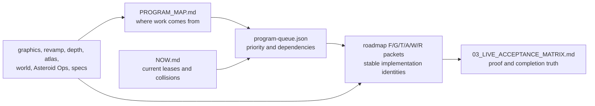
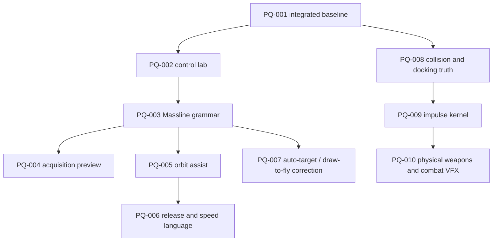

# SpaceFace Program Map

**Purpose:** expanded routing map for plan families and the "next N" controller procedure.  
**Agent entry:** start at repo-root [`../../CANONICAL_BUILD_MAP.md`](../../CANONICAL_BUILD_MAP.md)
first — that file is the single program front door. This document remains the detailed family map
inside `design/program/`; it is not a competing plan.

If the user says **"do the next 10"**, the controller starts at `CANONICAL_BUILD_MAP.md`, reads
[`roadmap/program-queue.json`](./roadmap/program-queue.json), and follows the execution procedure below.
The controller must not guess which recent plan the user meant.

## The four control surfaces

| Question | Authoritative starting point |
|---|---|
| What plans exist and what are they for? | This map and [`../PLAN_REGISTRY.md`](../PLAN_REGISTRY.md) |
| What should be worked on next? | [`roadmap/program-queue.json`](./roadmap/program-queue.json) |
| What stable task identity should implementation use? | [`roadmap/README.md`](./roadmap/README.md) and its `F/G/T/A/W/R` packet tables |
| What is occupied right now? | [`NOW.md`](./NOW.md) plus live Git/worktree/process inspection |
| Is work actually finished? | [`03_LIVE_ACCEPTANCE_MATRIX.md`](./03_LIVE_ACCEPTANCE_MATRIX.md), current checks, route evidence, and the integrated commit |
| Where does an unmapped idea go? | [`06_RETAINED_FUTURE_BACKLOG.md`](./06_RETAINED_FUTURE_BACKLOG.md) until admitted and assigned a stable packet identity |

The queue's `PQ-*` labels are ordering handles only. They group overlapping outcomes from several plans;
they do not replace the 113 stable roadmap packet IDs.

## Plan-family map

| Family | Role now | Use it for | Do not use it for |
|---|---|---|---|
| [`roadmap/`](./roadmap/README.md) | Canonical implementation identity and dependency spine | Packet IDs, prerequisites, terminal class, receipts | Assuming a packet is complete because its prose exists |
| [`../vision/ALPHA_PROGRAM.md`](../vision/ALPHA_PROGRAM.md) | Product scope and milestone acceptance | Required Alpha outcomes and M0-M6 framing | Day-to-day task status |
| [`../depth-program/`](../depth-program/README.md) | Detailed world/depth scope and future reservoir | Living-world, site, faction, story, and progression detail | A second global queue |
| [`../graphics-sprints/`](../graphics-sprints/README.md) and [`08_GRAPHICS_OVERHAUL_CHECKPOINT.md`](./08_GRAPHICS_OVERHAUL_CHECKPOINT.md) | Active visual implementation detail and checkpoint truth | PBR assets, background, VFX, visual-family pipeline, remaining visual defects | Claiming visual acceptance from source checks alone |
| [`../revamp/`](../revamp/README.md) | Activated outcome/design detail | System-specific player-experience requirements | Competing global status |
| [`../spec2/`](../spec2/INDEX.md) | Polish and feel reference | Existing system feel, camera, Massline, world-life requirements | Independent dispatch order |
| [`../spec3/`](../spec3/INDEX.md) | Ambition and expansion reference | Higher-order flight, combat, world, and progression direction | Automatic commitment of every idea |
| [`atlas/`](./atlas/00_COMMON_CONTEXT.md), [`../MAP_UX_PLAN.md`](../MAP_UX_PLAN.md), and [`../world-identity/`](../world-identity/README.md) | Active spatial, travel, place, and content detail | Atlas truth, map experience, routes, sectors, landmarks, asset identity | Bypassing place registration or Atlas integrity |
| [`../../needed-assets.md`](../../needed-assets.md), [`../../assets/QUEUE.md`](../../assets/QUEUE.md), manifests, and asset classifications | Active asset-production coverage | Exact missing assets, runtime candidates, provenance, and production order | Claiming an asset is live without manifest and player-route proof |
| [`../../docs/worldbuilding/`](../../docs/worldbuilding/) | Narrative canon and story detail | Canon, discoveries, history, and later story branches | Runtime implementation or completion truth |
| [`../ASTEROID_OPS_VISION.md`](../ASTEROID_OPS_VISION.md) and companion briefs | Active signature-system detail | Mining, sites, geology, heat, operators, settlement progression | A separate completion ledger |
| [`../production/`](../production/README.md) | Optional execution/evidence procedure | Clean-wave and campaign mechanics when explicitly adopted | Product scope or proof that features exist |
| `../sequential-build-plan/REVIEW/BUILD_PLAN_CORRECTED.md` | New cross-plan synthesis awaiting normalization | Candidate ordering, collisions, and newly proposed outcomes | Replacing live code, roadmap IDs, or acceptance truth |
| [`06_RETAINED_FUTURE_BACKLOG.md`](./06_RETAINED_FUTURE_BACKLOG.md) | Unscheduled research and ideas | Preservation without accidental commitment | Pulling work automatically into the next batch |
| [`../_ARCHIVE/`](../_ARCHIVE/README.md), old makeovers, transcripts, and duplicated prompt packs | History/provenance | Archaeology when a current task cites them | Default implementation instructions |

## Default program order

This is the coarse order. The queue records the exact cross-plan ordering and dependencies within it.

1. **Restore one trustworthy integrated baseline.** Close continuity, loading, graphics wiring,
   browser/Electron parity, and measured performance blockers before widening the game.
2. **Finish reusable control and physics roots.** Deterministic control lab, Massline input/acquisition,
   orbit/release assistance, direct auto-target/draw-to-fly control, collision truth, and impulse authority.
3. **Prove physical combat and interaction verticals.** Weapon mechanics plus distinct VFX, component
   targeting, and contextual industrial tools.
4. **Build one living corridor vertically.** Planet activity, NPC jobs, a persistent World Site, Wreck
   Cathedral, Ceres activity pockets, heist/heat, and the Ship's Ledger.
5. **Raise the visual family bar while those routes become real.** Representative PBR families,
   authored asset wiring, VFX/HUD/camera/accessibility language, and normal-route acceptance.
6. **Complete Asteroid Ops and the Gold Corridor.** Integrate the signature loop into the same world,
   save, economy, navigation, and presentation contracts.
7. **Admit later expansion deliberately.** Automation, manufacturing, specialized Masslines, broader
   world recomposition, story ownership, endings, and final release closure.

Do not interpret this as seven monolithic branches. Each queue item must leave `master` playable and
integrated before dependent work advances.

## "Do the next 10" controller procedure

When assigned a batch, the lead agent must:

1. Read `AGENTS.md`, this map, `NOW.md`, `roadmap/00_EXECUTION_PROTOCOL.md`, the queue, and the current
   acceptance matrix. Inspect live branch, dirty paths, worktrees, and processes before trusting leases.
2. Freeze the first requested number of queue items that are not checked off. Include unfinished
   prerequisites; never silently skip a blocked prerequisite to reach a more attractive feature.
3. Reconcile every selected item with live code before dispatch. Existing partial implementation must
   be characterized and preserved; source-plan prose never outranks current behavior.
4. Map each item to its stable `F/G/T/A/W/R` packet IDs. For a `PROPOSED-*` outcome, first assign a
   real roadmap identity and acceptance row; do not ship a permanent feature under a `PQ-*` label.
5. Split the frozen batch into dependency waves. Use at most three concurrent workers, no overlapping
   write sets, and only one owner for each mutex (`git-index`, `browser-gpu`, `blender`, `renderer`,
   `asset-manifest`, `registry`, `save-schema`, `input`, `physics-authority`, `hud-styles`, `package`).
6. Give workers bounded implementation packets with exact files, required behavior, focused checks,
   evidence, and a receipt. Workers return candidates; the controller reviews and integrates serially.
7. Keep the game bootable after every integrated item. Visual work requires current normal-route
   browser/Electron evidence; simulation work requires determinism and owning focused checks.
8. Check an item off only when it is integrated on the target branch and its required acceptance row,
   evidence reference, and receipt are recorded. `implemented` or `focused_green` is not checked off.
9. Update the detailed source ledger and `01_VERIFIED_DONE.md`, `02_REMAINING_WORK.md`,
   `03_LIVE_ACCEPTANCE_MATRIX.md`, and recoverability docs together when state changes.
10. End with an exact report: integrated items and commits, partial items, blocked items and owners,
    checks/evidence, current clean/dirty state, and the next queue position.

## Safe parallelism for the first batch

The first ten queue outcomes are deliberately foundation-heavy. Their implementation order is:

`PQ-002` and `PQ-008` may begin in parallel after `PQ-001`. `PQ-004` can usually run beside `PQ-009`
because their implementation mutexes differ. The physics-authority tasks must otherwise serialize.
Read-only surveys and adversarial reviews may run beside implementation, but browser/GPU and Blender
acceptance remain exclusive resources.

## Pasteable controller prompt

> Act as the SpaceFace program controller. Start at repo-root `CANONICAL_BUILD_MAP.md`. Validate the live
> repository and current leases, then freeze the next 10 unchecked outcomes from
> `design/program/roadmap/program-queue.json`, including prerequisites. Reconcile each against live code
> and map it to stable roadmap packet IDs. Orchestrate bounded subagents in dependency waves with at most
> three workers and no shared mutex/write set; integrate serially. A worker return is only a candidate.
> Check off work only after integration plus the required acceptance row, evidence, and receipt. Preserve
> unrelated dirty work. At the end, update the existing program ledgers and report exact commits, tests,
> route evidence, blockers, dirty state, and the next queue position. Do not create a new competing plan.

For a smaller batch, replace `10` with the requested count. The queue can be reordered only by editing
its explicit priorities and documenting why; a controller may not invent a different sequence silently.
