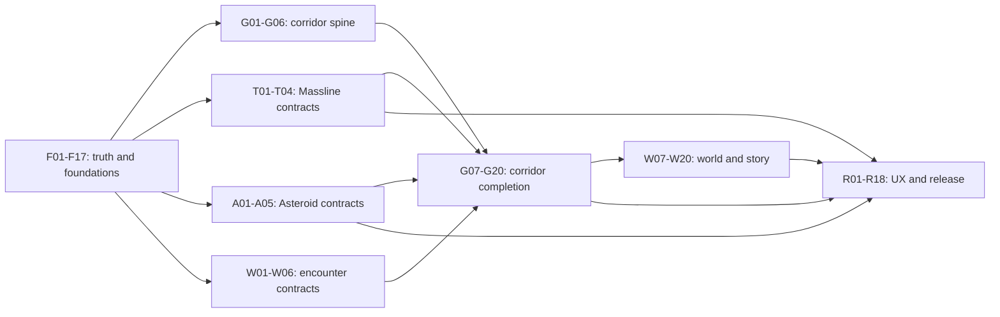

# SpaceFace 2026 Execution Roadmap

**Status:** active execution decomposition, 2026-07-18.

For work spanning several plan families, start at [`../PROGRAM_MAP.md`](../PROGRAM_MAP.md). Its
[`program-queue.json`](./program-queue.json) supplies explicit cross-plan priority and dependencies;
this roadmap remains the authority for stable `F/G/T/A/W/R` implementation identities.

## Goal

Turn the existing broad but uneven game into a coherent commercial solo space game by proving truth and
stability first, then completing the Helios Prime → Ceres Belt → Tethys Junction gold corridor, deepening
the Massline and Asteroid Ops signature systems, embodying world/story content, and closing release
quality without hiding integration debt behind more disconnected features.

## Source reconciliation

The supplied attachment was read in full. It is a detailed roadmap summary, but the separate Markdown
file it names as the full 113-packet plan was not included in the attachment directory or repository.
This folder is therefore the canonical **live-tree reconstruction** of those outcomes:

- it preserves the attachment's three rails, gold corridor, priority foundations, and signature-system
  direction;
- it reconciles them against current code, checks, recent commits, dirty paths, and existing Alpha/Depth
  scope;
- it assigns 113 stable packet IDs so progress has an unambiguous denominator;
- it does not import unverified completion claims from the summary.

If the missing source file arrives, compare outcomes here, append aliases where useful, and keep these
stable IDs. Never silently replace active packet identity.

## Program shape

| Family | IDs | Count | Terminal outcome | Detailed plan |
|---|---:|---:|---|---|
| Truth and foundation | `F01–F17` | 17 | trustworthy diagnostics, census, fixtures, authority audits, and execution control | [`01_FOUNDATION_SPRINT.md`](./01_FOUNDATION_SPRINT.md) |
| Gold corridor | `G01–G20` | 20 | a legible, recoverable first ninety minutes across Helios, Ceres, and Tethys | [`02_GOLD_CORRIDOR.md`](./02_GOLD_CORRIDOR.md) |
| Massline/tether signature | `T01–T18` | 18 | orbit, reel, release, counterplay, noncombat utility, and semantic telemetry | [`03_SIGNATURE_SYSTEMS.md`](./03_SIGNATURE_SYSTEMS.md) |
| Asteroid Ops signature | `A01–A20` | 20 | formations, heat/signature, geology, logistics, and settlement-scale sites | [`03_SIGNATURE_SYSTEMS.md`](./03_SIGNATURE_SYSTEMS.md) |
| World/content/story embodiment | `W01–W20` | 20 | naturally encountered content, sector postcards, missions, factions, wrecks, and endings | [`04_WORLD_CONTENT_RELEASE.md`](./04_WORLD_CONTENT_RELEASE.md) |
| UX/accessibility/release | `R01–R18` | 18 | clear HUD/map/market/activity, accessible routes, performance, parity, and store readiness | [`04_WORLD_CONTENT_RELEASE.md`](./04_WORLD_CONTENT_RELEASE.md) |
| **Total** |  | **113** |  |  |

The first autonomous sprint completes `F01–F17`: 17/113 packets, or 15.04% of the packet program. Packet
count is a scope denominator, not a claim that every packet has equal engineering hours or that 15% of
all final polish is finished.

## Execution spine

This is the main integration spine, not the complete packet DAG. Cross-family prerequisites such as
“`G10` depends on `W03/W04/W05`” and “`A09` depends on `W05`,” plus corridor/release acceptance, are
authoritative in the packet tables.
Once foundation interfaces land, `G01`, `T01`, `A01`, and `W01` may run in parallel under separate
leases. Shared wiring and player-route probes remain serialized through the integration owner.

## Current research snapshot

- Default flight is Flight V3; default AI is tactical SG-06; default physics is Rapier dynamic through
  the physics authority membrane.
- The 2026-07-17 build added broad map/menu/Asteroid Ops work, but its plan documents were not registered
  and its acceptance was mixed. Historical treatment is in [`../07_HISTORICAL_BUILDS.md`](../07_HISTORICAL_BUILDS.md).
- The content census currently finds 18 categories and no maintained-reference issue. Declaration is
  verified from live imported registries; game-import/runtime chains are explicitly maintained
  references, while fixture, natural-occurrence, and visual-acceptance remain unassessed.
- The deep-state ladder defines thirteen states and currently claims zero captured fixtures.
- Static physics-writer discovery finds a large review queue; it is diagnostic only because source text
  cannot distinguish a Rapier body from a projectile, spawn, or restore operation.
- `precheck` plus the broad `check` chain are recursively expanded into independently runnable leaf
  entries. `check:ci` delegates to the complete diagnostic runner so a nested failure does not suppress
  sibling diagnoses.

Refresh all numbers with the public scripts before quoting them; they are observations, not aesthetic
budgets or permanent count gates.

## Operating order

1. Preserve the integrated `F01–F17` contracts and occupied HUD/visual/map lanes; rerun the owning
   foundation check when changing them.
2. Run `G01` public pilot, `T01` orbit kernel, `A01` formation kernel, and `W01` encounter-dispatch
   contract in parallel.
3. Land the gold-corridor fixture/pilot spine before content-heavy corridor work.
4. Land pure Massline/Asteroid interfaces before runtime/UI consumers.
5. Admit world/story packets only when a natural producer, runtime carrier, and public route are named.
6. Close UX/accessibility/performance alongside each visible wave; reserve final release packets for
   cross-route and platform evidence, not a late cosmetic sweep.

## Terminal accounting

Packet tables are `PLANNED` unless `NOW.md` or a ready brief says otherwise. Before promotion to `READY`,
the lead must add exact expected files, owning instructions/anchors, focused commands, mutex requests, and
the receipt's terminal proof.

Default terminal classes are:

- `F01–F17`: the explicit terminal state in the foundation ledger plus `INTEGRATED`.
- `G01`, `T01–T03`, `A01,A02,A05,A06,A08,A10`, and `W01,W02`: `FOCUSED_GREEN` plus `INTEGRATED`.
- `G02–G19`, `T04–T17`, `A03,A04,A07,A09,A11–A19`, `W03–W20`, and `R01–R17`:
  `ROUTE_ACCEPTED` plus `INTEGRATED`.
- `G20,T18,A20,R18`: the named current-revision gate passes and the result is `INTEGRATED`; these are
  milestone/program exit decisions, not feature-agent self-promotion.

If a packet brief explicitly declares a stricter terminal state, the stricter state wins.

## Definition of program completion

All 113 packets must reach their declared terminal state; all M0–M6 and admitted Depth acceptance rows
must agree; default browser/Electron routes, save continuity, determinism, accessibility, and measured
performance must pass; and no `PLANNED`, `CLAIMED`, or unknown occupied path may be presented as shipped.

Use [`00_EXECUTION_PROTOCOL.md`](./00_EXECUTION_PROTOCOL.md) for every agent handoff and
[`../NOW.md`](../NOW.md) for the live lease board.
