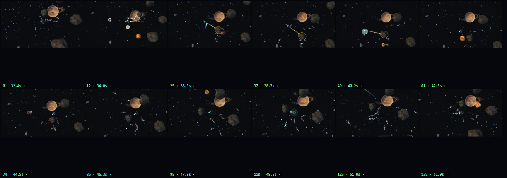
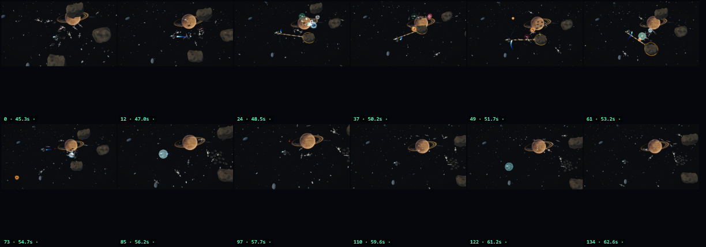

# The rope is a rope

## WHAT I FOUND

The one thing to fix this week: applies reverse counter-thrust when hands off in assisted flight, braking the ship to a dead stop and eating momentum earned from the Massline swing — it breaks the promise "Thrusters have a cap; physics-earned speed does not get eaten by the brakes".

## WHAT I CHANGED

The line now stiffens with the load a swing puts on it, so a hard swing stays inside five percent of the line instead of stretching sixteen, and a line breaks only when its rated load is exceeded. This pass was "The rope is a rope"; one thing we measure moved, and the rest held still.

## WHAT YOU WILL FEEL

When you play, The rope is a rope went from 16.34% to 5.01%. Still not right: Earned speed is kept.

## THE NUMBERS

| What we measured | Before | After | What it should be |
|---|---|---|---|
| The rope is a rope | 16.34% | 5.01% | stretch < 10 %; release keeps ≥ 95 % of tangential speed at 5 seconds |
| Earned speed is kept | 100% of top speed | 100.01% of top speed | ≥ 99 % of exit speed 10 seconds later, hands off and forward held |

## THE FRAMES

The person who looked at the pictures counted 5 of 9 good signs, so they did not think it worked yet; on one of the pictures they wrote: "A glowing Massline tether anchored to the asteroid and the curved blue engine trail clearly show the player latched onto the rock and swung around it.".

| moment | 1 | 2 | 3 | 4 | 5 | 6 |
|---|---|---|---|---|---|---|
| before |  |  |  |  |  |  |
| after |  |  |  |  |  |  |

Before contact sheet: 
After contact sheet: 

## NEXT

Next worst thing: After leaving the cap at 2× cruise by ANY means (rope release, shove, well fling, bounce), speed 10 seconds later is ≥ 99 % of the exit speed with hands off, and ≥ 99 % with forward held. Only the brake spends it.

<!-- Engineering appendix — not part of the owner's page
leaf: PQ-137.07
before: C:/Users/93rob/Documents/GitHub/SpaceFace/design/program/roadmap/receipts/fun-loop/cycles/2026-09-05-rope/before-measure-summary.json
after: C:/Users/93rob/Documents/GitHub/SpaceFace/design/program/roadmap/receipts/fun-loop/cycles/2026-09-05-rope/after-measure-summary.json
diff input: computed from before and after
before critic: C:/Users/93rob/Documents/GitHub/SpaceFace/design/program/roadmap/receipts/fun-loop/critic/rope-before-s4242/agy.json
after critic: C:/Users/93rob/Documents/GitHub/SpaceFace/design/program/roadmap/receipts/fun-loop/critic/rope-after-s4242/agy.json
verdict: KEEP — all 1 changed bar(s) moved toward their target (FUN_CONVERGENCE_LOOP §3.6)
run: verbs feel.rope_swing_release seed 4242
generated: 2026-09-05T04:21:46.769Z
-->
