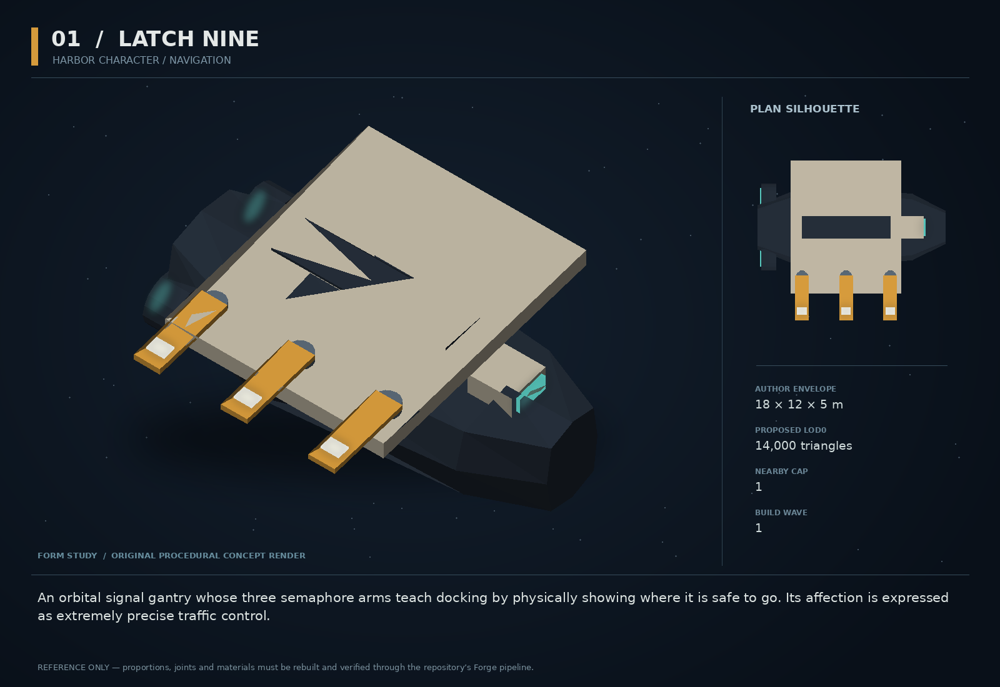

# 01 — Latch Nine

SF20-01 | Harbor character / navigation | Build wave 1 | DESIGN PROPOSAL

## Player-experience purpose

An orbital signal gantry whose three semaphore arms teach docking by physically showing where it is safe to go. Its affection is expressed as extremely precise traffic control.

**Gap / hypothesis:** Docking has a corridor system, but a repeatable, recognizable harbor relationship can turn a permission prompt into a place you understand.

**Existing overlap to preserve:** Extend dockingCorridor and stationBroadcast; do not replace their authority. BRACKET already occupies the funny yard-robot role, so Latch is a working harbor instrument, never a ball-game host. The earlier exploratory gantry image is not a shipping model.

Repository evidence: [R02](https://github.com/coldshalamov/SpaceFace/blob/1e0cf9499613b7c3acad10f34739278136d3d469/design/VISION.md), [R03](https://github.com/coldshalamov/SpaceFace/blob/1e0cf9499613b7c3acad10f34739278136d3d469/AGENTS.md), [R07](https://github.com/coldshalamov/SpaceFace/blob/1e0cf9499613b7c3acad10f34739278136d3d469/src/core/registry.js#L1-L170), [R10](https://github.com/coldshalamov/SpaceFace/blob/1e0cf9499613b7c3acad10f34739278136d3d469/src/data/bracket.js). See the inspection limits in `../production/SOURCES.md`.

## First encounter

On the first voluntary approach to a staffed Tethys dock, a squat signal tender translates into a holding position beside—not inside—the corridor. One arm points toward the open throat. A second closes across a conflicting lane. The third rotates to acknowledge your alignment. The player still flies every metre.

## Where and when

Attach to one existing staffed station in sector_tethys_junction. Resolve its anchor from sectorAnchors; place the tender outside the swept volume of the shipped docking corridor. No new station or sector. Hail becomes available inside 360 WU; guidance presentation inside 600 WU. Only one Latch instance per station.

## Repeat loop

Approach → see clearance → align under your own thrust → dock or leave. Later approaches acknowledge a clean arrival, an earlier collision, or an unpaid tow, using verified local records. No repetitive first-arrival tutorial. Optional assistance can be dismissed for the session.

## Visual and model recipe

Low offset goalpost in plan view; one thick crossbar, three paddles projecting from its starboard side, a single rectangular optical shutter. No face or humanoid legs. Amber bands, dark machinery and restrained ivory armor.

Author envelope: 18 × 12 × 5 m, +X nose / +Y port / +Z up. Proposed gameplay semantic radius: 14 WU (0 means not an independently targeted world body); proposed mass: 140 internal units (0 means static/preview, not a massless dynamic body). These are design targets, not final measured asset bounds. Runtime scale must follow the actual Forge/entity contract.

LOD triangle targets: 14,000 / 5,600 / 2,500; proposed near draw budget 10; nearby concept cap 1. Numbers are budgets to verify, never permission to bypass spawnBudget.

### ROOT_LATCH

Build: Forge loft: sections at X=-8,-3,6,9; half-widths 3,4,3,1.5; top heights 1.2,2,1.5,0.5. Keep its center mass below the crossbar.

Pivot / parent: Origin at center of hull.

Collision: One convex hull; no collision on lamps.

### CROSSBAR

Build: Chamfered plate from (-5,-6) to (5,6), thickness 0.8; recess a dark central channel.

Pivot / parent: Fixed to ROOT at Z=2.

Collision: One box only if materially outside hull proxy.

### PADDLE_A/B/C

Build: Three rectangular plates, each 4.0 by 1.2 by 0.22 m; each has one amber inset at its tip. Offset pivots along X=-4,0,4.

Pivot / parent: Hinge axes +Z at Y=-4.5; travel -60 to +75 degrees.

Collision: Render-only; clearance never depends on a cosmetic paddle.

### SENSOR_SHUTTER

Build: One dark 1.5 m rectangular aperture with sliding ceramic shutter, no eye dots.

Pivot / parent: X=6,Y=0,Z=1.8; slide 0.5 m along Y.

Collision: None.

### DRIVES

Build: Two supported nozzles at X=-7,Y=±2.8; broad dark throats and small luminous cores.

Pivot / parent: Fixed sockets HOOK_DRIVE_PORT/STBD.

Collision: Included in hull proxy.

## Animation recipe

| Clip / phase | Initial duration | Action |
|---|---:|---|
| Idle duty | 6 s | Sensor sweeps ±12 degrees; paddles remain in the exact clearance state. Cosmetic beacon breathes, never strobes. |
| Clearance | 0.65 s | Open paddle turns from transverse to longitudinal using smoothstep. Start from last pose when interrupted. |
| Hold | 0.35 s | Close the relevant paddle; establish HOLD text immediately, before visual interpolation. |
| Acknowledgment | 0.8 s | One spare paddle dips once after confirmed docking. Never repeat while the event receipt is duplicated. |

Critical read: At the 60-degree gameplay camera, the three paddles must be distinguishable at 100 px body width. Put no meaningful cue solely beneath the hull.

## AI / behavior

Deterministic service state machine: OFF_DUTY → HOLD → GUIDE → ACKNOWLEDGE. Read the existing corridor owner’s clearance and target identity. A request is not a clearance. HOLD wins whenever the actual service refuses. Reevaluate at 10 Hz; urgent corridor revocation is event-driven on the next sim tick. A kinematic tender follows a bounded service path with a swept clearance test; it never steers the player, teleports a vessel, or invents traffic permissions.

## Physical truth

The body is a slow service vehicle, not an immovable barrier. Do not use a giant invisible collider around the crossbar. If pushed outside its service box, enter RECOVER and let the existing traffic/physics owners return it by forces; guidance can continue through the ordinary HUD. A destroyed tender removes its model and personal barks, but never disables ordinary docking.

## Choices and counterplay

Follow the visual lane, request ordinary text guidance, or ignore the character and dock normally. Clean approaches earn recognition only; no precision penalty, unavoidable tutorial, or new currency.

## Failure and alternative outcomes

Collision produces a factual harbor warning through the normal law/incident owner. If the player causes damage, a repair/restitution job can appear; an unrelated NPC collision must not be attributed to the player. Save during GUIDE restores the authoritative clearance rather than replaying the acknowledgment.

## Personality and sound

Dry, unhurried, lightly resonant machine speech with a soft electromechanical click before sentences. Keep consonants clear; no vocoder on critical instructions. This character is courteous, not another wisecracking mascot.

**first_clearance:** “Latch Nine. Follow the open arm. The closed one is not a suggestion.”

**hold:** “Hold outside the throat. Something larger has right of way.”

**clean_repeat:** “Same ship. Better angle. Welcome back.”

**player_collision:** “That was the station. It has filed no intention to move.”

**repair_paid:** “Repairs recorded. Your next approach begins without a grudge.”

Dialogue defaults: once-only first reveal; persistent dedupe for milestone lines; repeat flavor no more than once per 90 sim seconds per character, and only when the shared voice arbiter grants the slot. Threat cues are governed by attack state, not that flavor cooldown. Stop stale lines when their target/phase disappears. Captions retain speaker and factual meaning.

## Rewards / economy boundary

No credits for routine docking. Any restitution payment uses the existing economy/law path and an incident idempotency key.

## Save-state contract

met:boolean, cleanArrivals:uint<=100000, incidentIds:last 16, destroyed:boolean. Do not persist transient clearance, Three objects, or animation handles.

## Existing integration seams

- `src/systems/dockingCorridor.js`
- `src/systems/stationBroadcast.js`
- `src/ui/voiceArbiter.js`
- `src/data/sectorAnchors.js`

These paths are starting points, not invented callable APIs. Read the live owners and current schemas before implementation. New concept helpers should emit to the owner rather than write its resource directly.

## Dependencies and packet sequence

No other new concept required.

Audit → behavior proof and model in parallel → presentation → normal-route integration → acceptance. Packet ids `SF20-01-A` through `-F` are in the task graph.

## Specific acceptance cases

1. Deny docking while an animation is opening: the UI and corridor still deny it.
2. Disable the character: every original docking route remains usable.
3. Ram from three bearings: the visible body and collision proxy agree.
4. Load after a completed arrival: no duplicate bark or reward.
5. Recognize HOLD and CLEAR with grayscale, sound muted, and reduced motion enabled.

## Player test

In a five-person formative test, ask players to locate the valid approach within five seconds without reading a help page; target four of five. Compare wrong-throat approaches against a baseline. This is a proposed acceptance threshold, not measured evidence.

## Completion boundary

Require all shared gates in `../production/TEST_PLAN.md`, the specific cases above, a normal-route encounter capture, top/chase/close model review, save/load evidence and matched performance measurements. This packet is not implemented or playtested merely because its plan and art exist. The art GLB is a non-shipping blockout; build the real asset through `../production/ASSET_PIPELINE.md`.
