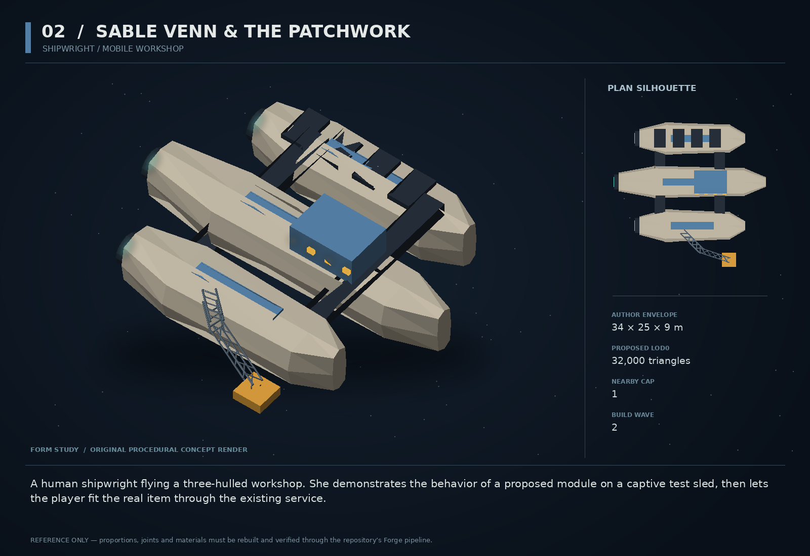

# 02 — Sable Venn & the Patchwork

SF20-02 | Shipwright / mobile workshop | Build wave 2 | DESIGN PROPOSAL

## Player-experience purpose

A human shipwright flying a three-hulled workshop. She demonstrates the behavior of a proposed module on a captive test sled, then lets the player fit the real item through the existing service.

**Gap / hypothesis:** Ship fitting can have meaningful numbers without making the new capability perceptually obvious. A visible demonstration bridges loadout selection and field behavior.

**Existing overlap to preserve:** Reuse ships, buildIdentity, crafting and ORRERY. Sable offers diagnoses and demonstrations, not another fitting database or independent stat writer. Her workshop is not MORROW’s rescue automaton.

Repository evidence: [R02](https://github.com/coldshalamov/SpaceFace/blob/1e0cf9499613b7c3acad10f34739278136d3d469/design/VISION.md), [R03](https://github.com/coldshalamov/SpaceFace/blob/1e0cf9499613b7c3acad10f34739278136d3d469/AGENTS.md), [R04](https://github.com/coldshalamov/SpaceFace/blob/1e0cf9499613b7c3acad10f34739278136d3d469/tools/blender/forge/FORGE.md), [R07](https://github.com/coldshalamov/SpaceFace/blob/1e0cf9499613b7c3acad10f34739278136d3d469/src/core/registry.js#L1-L170). See the inspection limits in `../production/SOURCES.md`.

## First encounter

After the first purchased module, a contract introduces Sable in a Ceres service pocket. The Patchwork unfolds one work arm and pushes a low-mass test sled against a visible damper. Selecting an impulse module changes the next demonstration; selecting a shield module exposes a supported shield projector. The receipt names exactly what changed.

## Where and when

One workshop traffic slot in sector_ceres_belt, near a service anchor but outside mining paths. Station service opens the familiar existing fit screen; a small adjacent preview pane is optional and pausable. Do not require in-flight UI manipulation.

## Repeat loop

Inspect an actual installed item → see one specific effect → compare a compatible alternative → confirm through the shipped transaction → test in flight. The demo is a truthful read-only forecast, never an extra source of stats.

## Visual and model recipe

Three parallel hulls joined by two visible crossbeams. Central office has warm windows, port pontoon stores dark tool wells, starboard pontoon carries a folded orange arm. One cobalt identity stripe; workshop orange appears only as standardized hazard paint.

Author envelope: 34 × 25 × 9 m, +X nose / +Y port / +Z up. Proposed gameplay semantic radius: 27 WU (0 means not an independently targeted world body); proposed mass: 260 internal units (0 means static/preview, not a massless dynamic body). These are design targets, not final measured asset bounds. Runtime scale must follow the actual Forge/entity contract.

LOD triangle targets: 32,000 / 12,800 / 5,800; proposed near draw budget 12; nearby concept cap 1. Numbers are budgets to verify, never permission to bypass spawnBudget.

### ROOT_PATCHWORK

Build: Three lofts along X, center length 32 m and outboard lengths 23 m at Y=±9.5. Cut obvious 3 m negative spaces between bodies.

Pivot / parent: Center of central hull; +X nose.

Collision: Three convex lobes, not one box spanning all gaps.

### BRIDGES

Build: Two 2.2 m wide plate crossbeams at X=-7,+6 with dark undersides and supported cable trunks.

Pivot / parent: Fixed.

Collision: Two simple beams only where collidable.

### ARM_BASE/ELBOW/CLAMP

Build: Upper link 5 m, forearm 4 m, jaws 1.3 m. Build pivots before connecting panels; all links remain visibly attached.

Pivot / parent: Base at (-2,-11,2), elbow local (5,0,0), Z-axis hinges.

Collision: Preview arm non-colliding; field-service arm only via existing interaction owner.

### TEST_SLED

Build: A 4×3×1 m replaceable test plate with two orange end caps and a recessed socket.

Pivot / parent: Independent root for lab scene.

Collision: One box, mass 12 in isolated demo only.

### WINDOWS/TOOLS

Build: Instance window boxes; 6 unique large tool shapes, not hundreds of micro-greebles.

Pivot / parent: All fixed outside the arm articulation.

Collision: None.

## Animation recipe

| Clip / phase | Initial duration | Action |
|---|---:|---|
| Unfold | 1.8 s | Upper arm swings 60 degrees and forearm opens 85 degrees in sequence; arm final location clears the selected item. |
| Demo impulse | 2.4 s | Use the actual preview simulation’s force result; do not animate an invented trajectory. |
| Fit receipt | 0.6 s | Clamp closes around the display item after the real transaction succeeds; on denial remain open. |
| Park | 1.6 s | Return from current pose, not from a presumed fully extended state. |

Critical read: A single item model receives focus. Background workshop motion stops during reading under reduced motion. Do not duplicate the full shipworks frontend.

## AI / behavior

Service FSM: TRANSIT, AVAILABLE, PREVIEW, AWAIT_COMMIT, DEMONSTRATE, DEPART. The human personality is expressed through authored conditional lines, not online model inference. Itinerary belongs to traffic; quotes are immutable snapshots of the current catalog revision and inventory. Recheck price, compatibility and stock on commit. Preview data is derived from a temporary isolated fit copy, never the live player state.

## Physical truth

The workshop moves only while no service is active. The demonstration should use a separate small scene or existing lab state with its own entity namespace, never live world entities hidden off camera. Close/reopen must destroy that state. A replay should not advance campaign RNG. In the world the hull is heavy but pushable; docking assistance is owned by dockingCorridor.

## Choices and counterplay

Buy, retain current equipment, request a demo, or leave. Show one benefit and one cost, such as impulse versus cargo mass. Never imply every purchase is an upgrade.

## Failure and alternative outcomes

No funds or incompatible slots leave the current fit unchanged and explain the exact denial at the action. Workshop destruction cannot delete player-owned gear or a pending paid purchase. A service interrupted before commit costs nothing.

## Personality and sound

Warm contralto or low mezzo, close-mic conversational delivery; practical and exact, with amusement reserved for preventable mistakes. No celebrity imitation. Human portrait may be a later separately scoped asset; the shipped character can live through her ship, comms and hands-on demonstrations.

**intro:** “Sable Venn. I fix the part between what a ship promises and what it does.”

**impulse_demo:** “More shove. More mass. Nothing in that sentence was free.”

**incompatible:** “That mount cannot carry it. The catalog does not get a vote.”

**keep_old:** “Then keep the old one. Knowing your tools is also an upgrade.”

**return_after_test:** “Tell me what it did. Not what the label said.”

Dialogue defaults: once-only first reveal; persistent dedupe for milestone lines; repeat flavor no more than once per 90 sim seconds per character, and only when the shared voice arbiter grants the slot. Threat cues are governed by attack state, not that flavor cooldown. Stop stale lines when their target/phase disappears. Captions retain speaker and factual meaning.

## Rewards / economy boundary

Normal catalog prices; no free upgrades from repeat demonstrations. The first tutorial can use an already-budgeted mission coupon, never a new unconditional grant.

## Save-state contract

met:boolean, demonstratedItemIds:bounded set of catalog ids, lastReceiptId:string|null. Actual inventory, fit and money remain under their existing owners.

## Existing integration seams

- `src/systems/ships.js`
- `src/systems/buildIdentity.js`
- `src/systems/crafting.js`
- `src/ui/orrery/`

These paths are starting points, not invented callable APIs. Read the live owners and current schemas before implementation. New concept helpers should emit to the owner rather than write its resource directly.

## Dependencies and packet sequence

SF20-19

Audit → behavior proof and model in parallel → presentation → normal-route integration → acceptance. Packet ids `SF20-02-A` through `-F` are in the task graph.

## Specific acceptance cases

1. Preview ten modules and cancel: live fit, credits and RNG state remain byte-equivalent.
2. Commit after inventory changes: revalidation refuses the stale quote.
3. Compare displayed impulse and heat with measured values in the same preview configuration.
4. Open/close preview fifty times: no retained meshes, listeners or physics worlds.
5. Keyboard and controller can select, compare, confirm and return without a hover-only action.

## Player test

Ask players to explain one tradeoff of the chosen module and then demonstrate it in flight. Target correct explanation by four of five first-time testers; record rather than infer improvement.

## Completion boundary

Require all shared gates in `../production/TEST_PLAN.md`, the specific cases above, a normal-route encounter capture, top/chase/close model review, save/load evidence and matched performance measurements. This packet is not implemented or playtested merely because its plan and art exist. The art GLB is a non-shipping blockout; build the real asset through `../production/ASSET_PIPELINE.md`.
