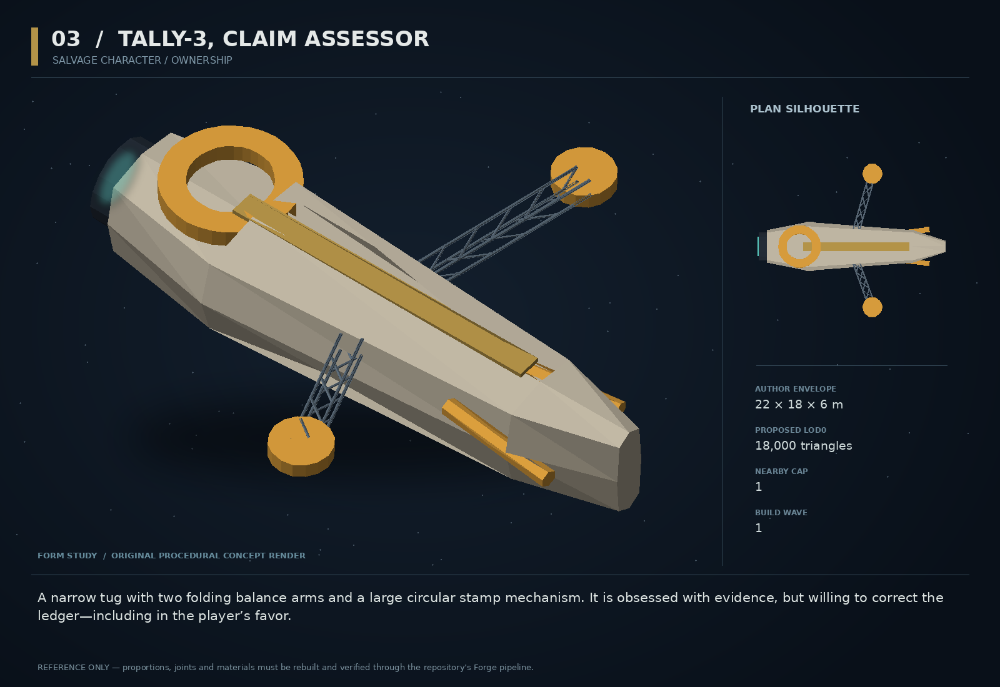

# 03 — Tally-3, Claim Assessor

SF20-03 | Salvage character / ownership | Build wave 1 | DESIGN PROPOSAL

## Player-experience purpose

A narrow tug with two folding balance arms and a large circular stamp mechanism. It is obsessed with evidence, but willing to correct the ledger—including in the player’s favor.

**Gap / hypothesis:** Physical salvage needs legible ownership and provenance at the instant a player is deciding to tow it. Existing consequence systems should be understandable before a theft, not only afterward.

**Existing overlap to preserve:** Extend salvage, claims and provenanceLedger. BRACKET sorts scrap into a sport; Tally examines legal claim evidence. Its weighing gesture is presentation, not a second economy algorithm.

Repository evidence: [R03](https://github.com/coldshalamov/SpaceFace/blob/1e0cf9499613b7c3acad10f34739278136d3d469/AGENTS.md), [R07](https://github.com/coldshalamov/SpaceFace/blob/1e0cf9499613b7c3acad10f34739278136d3d469/src/core/registry.js#L1-L170), [R10](https://github.com/coldshalamov/SpaceFace/blob/1e0cf9499613b7c3acad10f34739278136d3d469/src/data/bracket.js). See the inspection limits in `../production/SOURCES.md`.

## First encounter

At the first qualifying wreck in Ceres, Tally extends a scanner arm toward a crate. Its projector displays three plain states: owned, disputed, unclaimed. A selected object reveals the cited incident that produced the status. A player can recover the owner’s crate, dispute a stale claim with real evidence, or openly steal.

## Where and when

Use an existing derelict-field or salvage-yard anchor in sector_ceres_belt. One assessor may be assigned to a site, not one per wreck. Approach disclosure inside 420 WU; no ambient UI for every shard.

## Repeat loop

Select wreck → inspect claim and value basis → tow to matching receiver → obtain a causal receipt. Subsequent visits acknowledge recoveries or unresolved incidents. No requirement to sit through paperwork for ordinary unclaimed scrap.

## Visual and model recipe

Long dark spine and two unequal perpendicular balance beams; amber circular stamp at the stern. Distinct T shape seen overhead. Pale slate panels with a single ochre band, unlike Latch’s three-paddle signal gantry.

Author envelope: 22 × 18 × 6 m, +X nose / +Y port / +Z up. Proposed gameplay semantic radius: 20 WU (0 means not an independently targeted world body); proposed mass: 180 internal units (0 means static/preview, not a massless dynamic body). These are design targets, not final measured asset bounds. Runtime scale must follow the actual Forge/entity contract.

LOD triangle targets: 18,000 / 7,200 / 3,200; proposed near draw budget 10; nearby concept cap 1. Numbers are budgets to verify, never permission to bypass spawnBudget.

### ROOT_TALLY

Build: Loft 22 m long, half-width 2.6 m; taper nose to 1.1 m and thicken rear to carry stamp.

Pivot / parent: Center.

Collision: One convex spine.

### ARM_LEFT/RIGHT

Build: Two 7 m trusses, right 1.5 m shorter; attached scan heads 1.3 m diameter.

Pivot / parent: Z hinges at X=0,Y=±2.5.

Collision: Non-colliding peripheral instruments.

### STAMP

Build: Annulus outer radius 2.6 m, inner 1.6 m, carried on solid U bracket; face has three large raised bars, no tiny text.

Pivot / parent: Rear at X=-7,Z=2.5; spindle +Z.

Collision: No extra collider.

### CLAIM_CRADLE

Build: Two gold triangular pads in a V, 3.5 m apart, with clearly open middle.

Pivot / parent: X=5; fixed.

Collision: Sensor volume only; no invisible suction.

### SCAN_SOCKET

Build: Dark aperture inset beneath forward plate.

Pivot / parent: HOOK_SCAN at X=8,Z=1.5.

Collision: None.

## Animation recipe

| Clip / phase | Initial duration | Action |
|---|---:|---|
| Assess | 1.4 s | Arms unfold from 20 to 75 degrees; one slow scan passes over selected object. |
| Disputed | 2 s | Stamp remains suspended; arms hold asymmetrically. Pair the pose with a textual status. |
| Receipt | 0.45 s | Stamp travels 0.35 m once, after the owner emits the accepted transaction receipt. |
| Withdraw | 1.1 s | Fold arms before itinerary resumes; incomplete claims remain incomplete. |

Critical read: The three claim states need distinct icons and words; never rely on green/yellow/red alone. Do not place a giant status banner over the wreck.

## AI / behavior

PATROL_SITE → INSPECT_SELECTED → OFFER → WAIT_DELIVERY → RECEIPT. Selection and hail are player intents. The assessor reads the existing owner/provenance records and returns reason codes, not a generated legal opinion. Recalculate on relevant ledger revision, not every frame. Do not classify every object by scanning the whole entity map; use the site/selection indices. No automatic confiscation from proximity.

## Physical truth

A claim cradle requires the real cargo body to enter the receiver with relative speed below a proposed 8 WU/s and an explicit delivery intent. This does not transfer ownership until cargo/economy validates it. Keep tether joints intact until that accepted transfer. Duplicate collision events never pay twice.

## Choices and counterplay

Deliver honestly, contest a claim using already-discovered evidence, or steal with the consequence visible beforehand. A disputed object stays physically manipulable; the UI must not confuse disputed with untouchable.

## Failure and alternative outcomes

If Tally is damaged, use the ordinary station receiver for delivery. Missing evidence can be found later; no fabricated witness appears to force the preferred ending. Save a receipt-id set bounded to the active site plus the existing durable ownership ledger.

## Personality and sound

An almost musical monotone that pauses before important nouns. Its humor comes from literal classification. Warmth appears when somebody returns an object that nobody expected to see again.

**unclaimed:** “No living claim. That is a status, not a blessing.”

**owned:** “Owner identified. You may still move it. Moving is not owning.”

**evidence:** “The record is wrong. How inconvenient for the record.”

**return:** “Returned intact. I will round nothing down.”

**theft:** “Transfer observed. Consent remains conspicuously absent.”

Dialogue defaults: once-only first reveal; persistent dedupe for milestone lines; repeat flavor no more than once per 90 sim seconds per character, and only when the shared voice arbiter grants the slot. Threat cues are governed by attack state, not that flavor cooldown. Stop stale lines when their target/phase disappears. Captions retain speaker and factual meaning.

## Rewards / economy boundary

Standard salvage value, with any contract premium applied once through the normal owner; no passive income or repeated appraisal reward.

## Save-state contract

met:boolean, activeWreckId:string|null, lastEvidenceRevision:uint, localReceiptIds:last 32. Ownership and claims are references, not duplicated snapshots.

## Existing integration seams

- `src/systems/salvage.js`
- `src/systems/claims.js`
- `src/systems/provenanceLedger.js`
- `src/data/contactHail.js`

These paths are starting points, not invented callable APIs. Read the live owners and current schemas before implementation. New concept helpers should emit to the owner rather than write its resource directly.

## Dependencies and packet sequence

No other new concept required.

Audit → behavior proof and model in parallel → presentation → normal-route integration → acceptance. Packet ids `SF20-03-A` through `-F` are in the task graph.

## Specific acceptance cases

1. Tow an owned crate without confirming: no sale occurs.
2. Replay the delivery collision ten times: one transfer and one payment.
3. Change claimant before confirming: the old offer invalidates.
4. Load with a tethered crate: body, owner and receiver still agree.
5. Destroy assessor: station fallback still resolves the contract.

## Player test

Before confirming a haul, testers correctly predict whether the action is recovery, salvage or theft. Log prediction versus actual consequence.

## Completion boundary

Require all shared gates in `../production/TEST_PLAN.md`, the specific cases above, a normal-route encounter capture, top/chase/close model review, save/load evidence and matched performance measurements. This packet is not implemented or playtested merely because its plan and art exist. The art GLB is a non-shipping blockout; build the real asset through `../production/ASSET_PIPELINE.md`.
