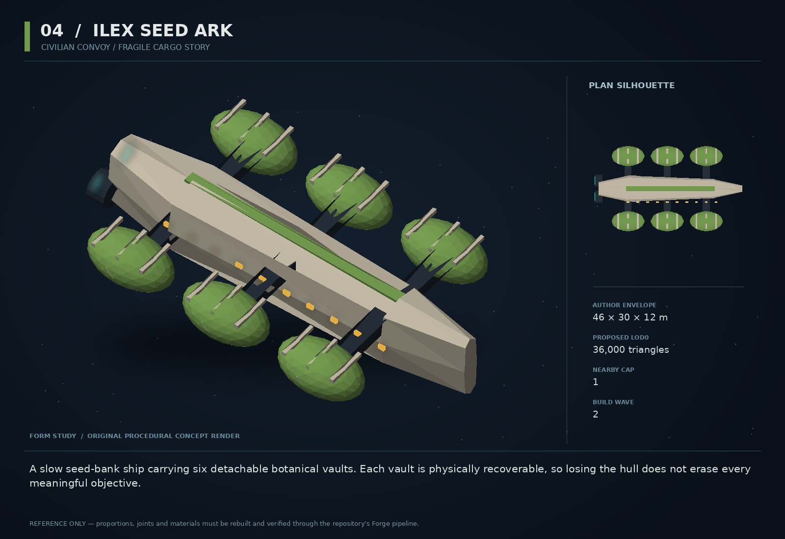

# 04 — Ilex Seed Ark

SF20-04 | Civilian convoy / fragile cargo story | Build wave 2 | DESIGN PROPOSAL

## Player-experience purpose

A slow seed-bank ship carrying six detachable botanical vaults. Each vault is physically recoverable, so losing the hull does not erase every meaningful objective.

**Gap / hypothesis:** An escort target can feel like a health bar on rails. Visible, separable cargo gives protecting a ship several recoverable outcomes instead of one binary failure.

**Existing overlap to preserve:** Reuse escort missions, fragileCargo, traffic and cargo ownership. This is cultivated human seed stock, not a second alien infection, and not an extension of the Vethari mythology.

Repository evidence: [R01](https://github.com/coldshalamov/SpaceFace/blob/1e0cf9499613b7c3acad10f34739278136d3d469/README.md), [R03](https://github.com/coldshalamov/SpaceFace/blob/1e0cf9499613b7c3acad10f34739278136d3d469/AGENTS.md), [R07](https://github.com/coldshalamov/SpaceFace/blob/1e0cf9499613b7c3acad10f34739278136d3d469/src/core/registry.js#L1-L170). See the inspection limits in `../production/SOURCES.md`.

## First encounter

A convoy crosses Tethys with six green glasshouse lobes supported around a blunt central hull. A pirate attack damages the rear coupling. The captain asks the player to choose: cover the remaining convoy, tow the drifting vault, or call a responder while following the main ship.

## Where and when

Add one authored mission convoy to an existing Tethys-to-Ceres route after one successful delivery. Use actual route nodes; no invented adjacent sector. The first incident happens in a broad pocket with at least two escape lines, never while docking.

## Repeat loop

Accept a contract with explicit cargo stakes → read attack or coupling damage → choose which objects to protect → deliver remaining vaults → see a local greenhouse react later. Repeat variants change which vault fails and where pirates approach, not the rules.

## Visual and model recipe

Six oval conservatory pods around a blunt seed-shaped central hull, in two rows of three. Broad dark connecting struts and lime identity bands. Warm speckled windows suggest cultivation without rendering thousands of plants.

Author envelope: 46 × 30 × 12 m, +X nose / +Y port / +Z up. Proposed gameplay semantic radius: 34 WU (0 means not an independently targeted world body); proposed mass: 420 internal units (0 means static/preview, not a massless dynamic body). These are design targets, not final measured asset bounds. Runtime scale must follow the actual Forge/entity contract.

LOD triangle targets: 36,000 / 14,400 / 6,500; proposed near draw budget 12; nearby concept cap 1. Numbers are budgets to verify, never permission to bypass spawnBudget.

### ROOT_ILEX

Build: Central loft 42 m long, width 8 m, stepped dorsal greenhouse spine.

Pivot / parent: Center.

Collision: One central convex proxy.

### VAULT_01..06

Build: Six identical 9×5×4 m rounded capsules; green glazing is opaque tinted geometry with plant silhouettes inside a shallow recess.

Pivot / parent: At X=-12,0,12; Y=±10; independent release roots.

Collision: One convex per pod while attached; independent dynamic body only on actual severance.

### COUPLINGS

Build: Two supported beams per pod with large break collars; each collar is targetable as an authored subsystem.

Pivot / parent: Root-local socket at each pod center.

Collision: At most one enabled damage trigger per coupling.

### CANOPY_PANELS

Build: Baked dark foliage shapes beneath 12 broad roof ribs. No real transparent inner jungle.

Pivot / parent: Fixed to pod.

Collision: None.

### DRIVE_BANK

Build: Four recessed rear engines on the central hull; pod utility thrusters remain small.

Pivot / parent: Named nozzle sockets.

Collision: Central proxy only.

## Animation recipe

| Clip / phase | Initial duration | Action |
|---|---:|---|
| Cruise | 5 s | Very slow ventilation louver movement; pods are rigidly attached, not jelly. |
| Coupling fail | 0.7 s | Crack collar, vent two short puffs, then release only after authoritative subsystem loss. |
| Vault safe | 1.1 s | Warm window band returns steadily when a delivered vault has power. |
| Damaged | 2 s | One louver jams, window segment dims; no full-body strobe. |

Critical read: Six pods read as six large shapes at gameplay zoom. A selected pod has one integrity readout; avoid six competing bars over the ship.

## AI / behavior

Convoy phases: ASSEMBLE, DEPART, TRANSIT, INCIDENT, SPLIT_RESPONSE, ARRIVE. Traffic owns navigation. Mission owner tracks six stable vault ids and distinguishes attached, drifting, delivered, destroyed and lost. A captain chooses the safe gate based on observed threats; it never waits forever for one remote pod. Reinforcements, responders and pirates all request spawn budget. Narrative lines use actual vault status.

## Physical truth

Start each pod as part of the parent compound body; on severance calculate its initial linear velocity as parent linear velocity plus angular velocity cross socket offset. Remove the matching parent collider before enabling the pod body, preserving total mass and avoiding double collisions. A pod supports Massline towing and fragileCargo shock/heat receipts. Never fake breakage by hiding a mesh while keeping its collision.

## Choices and counterplay

Protect the ship, recover a pod, or delegate a rescue when a legitimate responder is present. No secret best route: the consequences and timing are visible. The captain can refuse a dangerous shortcut without blocking all alternatives.

## Failure and alternative outcomes

Losing some pods reduces deliveries, not the whole campaign. If all are destroyed, retain an investigation and restitution branch. Offscreen simulation resolves the same ownership outcomes conservatively; it does not quietly regenerate missing pods.

## Personality and sound

Captain Ilex speaks gently and clinically under pressure. The cargo is precious, but she never berates the player for choosing a rescue over a bonus. Use short counting phrases during the incident.

**depart:** “Six vaults. Most of what they carry has never seen a sky.”

**severed:** “Vault four is free. The ship can continue. The choice is yours.”

**tow:** “Slowly. The roots will forgive distance before they forgive shock.”

**partial:** “Four arrived. Four is a future.”

**total_loss:** “Bring back the recorder. We still owe them an explanation.”

Dialogue defaults: once-only first reveal; persistent dedupe for milestone lines; repeat flavor no more than once per 90 sim seconds per character, and only when the shared voice arbiter grants the slot. Threat cues are governed by attack state, not that flavor cooldown. Stop stale lines when their target/phase disappears. Captions retain speaker and factual meaning.

## Rewards / economy boundary

Base escort pay plus per-vault accepted delivery value. Total offered compensation stays within the comparable existing escort budget; no reward for repeatedly detaching and reattaching pods.

## Save-state contract

missionId, vaultIds[6], per-vault outcome enum, captainAlive, deliveryReceiptIds. Use mission and cargo owners for persistence; no parallel inventory.

## Existing integration seams

- `src/systems/missions.js`
- `src/systems/traffic.js`
- `src/systems/fragileCargo.js`
- `src/systems/cargo.js`

These paths are starting points, not invented callable APIs. Read the live owners and current schemas before implementation. New concept helpers should emit to the owner rather than write its resource directly.

## Dependencies and packet sequence

SF20-03

Audit → behavior proof and model in parallel → presentation → normal-route integration → acceptance. Packet ids `SF20-04-A` through `-F` are in the task graph.

## Specific acceptance cases

1. Sever a rotating pod: velocity matches the rigid-body point velocity.
2. Save during severance and reload: no duplicate capsule or lost mass.
3. Deliver 0,1,5,6 pods: all outcomes lead somewhere coherent.
4. Escort exits sector while player tows: route and destination remain resolvable.
5. One NPC damages a pod: provenance does not blame the player.

## Player test

Measure how often partial loss leads to continued play rather than reload. Interview players about the choice they believed they made; do not equate any particular choice with success.

## Completion boundary

Require all shared gates in `../production/TEST_PLAN.md`, the specific cases above, a normal-route encounter capture, top/chase/close model review, save/load evidence and matched performance measurements. This packet is not implemented or playtested merely because its plan and art exist. The art GLB is a non-shipping blockout; build the real asset through `../production/ASSET_PIPELINE.md`.
