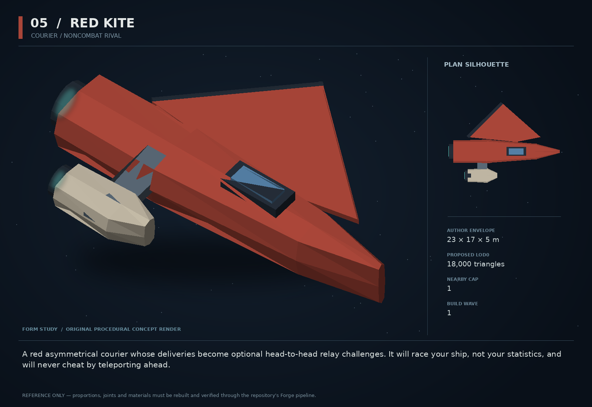

# 05 — Red Kite

SF20-05 | Courier / noncombat rival | Build wave 1 | DESIGN PROPOSAL

## Player-experience purpose

A red asymmetrical courier whose deliveries become optional head-to-head relay challenges. It will race your ship, not your statistics, and will never cheat by teleporting ahead.

**Gap / hypothesis:** Physics mastery deserves a recurring social witness outside combat. A courier who respects a clean run creates motivation without becoming another adaptive boss.

**Existing overlap to preserve:** The repo already has nemesis, aceMemory and Orra. Red Kite does not learn a counter-build or occupy that arc. Reuse route following and stunt evidence; no new racing control scheme.

Repository evidence: [R02](https://github.com/coldshalamov/SpaceFace/blob/1e0cf9499613b7c3acad10f34739278136d3d469/design/VISION.md), [R03](https://github.com/coldshalamov/SpaceFace/blob/1e0cf9499613b7c3acad10f34739278136d3d469/AGENTS.md), [R07](https://github.com/coldshalamov/SpaceFace/blob/1e0cf9499613b7c3acad10f34739278136d3d469/src/core/registry.js#L1-L170), [R11](https://github.com/coldshalamov/SpaceFace/blob/1e0cf9499613b7c3acad10f34739278136d3d469/src/systems/nemesis.js#L1-L100). See the inspection limits in `../production/SOURCES.md`.

## First encounter

A narrow red courier makes a clean slingshot around a Ceres work anchor, then offers a short delivery relay. Three buoys mark the ordered handoff points. The player can win by choosing a better physical route, not by entering a menu minigame.

## Where and when

One optional contact on a surveyed Ceres route outside dense traffic. Challenges unlock after the player has voluntarily used the Massline. Course gates are ordinary map-visible anchors and never obstruct essential transport.

## Repeat loop

Hail → inspect the 60–90 second course and collision policy → accept → cross ordered gates with the real ship → receive a grounded reaction. Alternate cargo-mass classes use the same course. Ghost records are optional presentation, never targetable enemies.

## Visual and model recipe

Thin red dart with one large triangular sail-fin to port and a short counterbalancing engine pod to starboard. A sharply visible dark fork at the stern distinguishes it from ordinary wasps. No feather motif.

Author envelope: 23 × 17 × 5 m, +X nose / +Y port / +Z up. Proposed gameplay semantic radius: 17 WU (0 means not an independently targeted world body); proposed mass: 32 internal units (0 means static/preview, not a massless dynamic body). These are design targets, not final measured asset bounds. Runtime scale must follow the actual Forge/entity contract.

LOD triangle targets: 18,000 / 7,200 / 3,200; proposed near draw budget 9; nearby concept cap 1. Numbers are budgets to verify, never permission to bypass spawnBudget.

### ROOT_KITE

Build: Loft from X=-10 to +12, width 2.4 m at cockpit, 1 m at nose; split the stern into two prongs.

Pivot / parent: Center; +X forward.

Collision: One narrow convex hull.

### SAIL

Build: CCW plate with points (-7,3),(0,10),(8,3),(3,2), thickness 0.28 m and dark raised leading edge.

Pivot / parent: Supported at port spar.

Collision: One slim convex prism only where reachable.

### OUTRIGGER

Build: 5 m engine pod at Y=-5, carried by a 1.2 m thick spar.

Pivot / parent: Root socket X=-4.

Collision: One small hull proxy merged where possible.

### CONTROL_FLAP

Build: Separate 4×1.2 m panel cut from trailing sail edge.

Pivot / parent: Hinge parallel X.

Collision: Render-only.

### COURIER_CANISTER

Build: One 2×1 m canister under a visible dorsal clamp.

Pivot / parent: X=2,Z=1.6.

Collision: No separate body except authored handoff.

## Animation recipe

| Clip / phase | Initial duration | Action |
|---|---:|---|
| Coast | 3 s | Flap settles to 4 degrees; engine intensity follows true throttle. |
| Hard turn | 0.3 s | Flap deflects up to 18 degrees proportional to actual angular acceleration, clamped. |
| Challenge | 0.8 s | Two alternated navigation-light pulses with modest contrast; text carries the offer. |
| Handoff | 0.7 s | Clamp opens after gate/receiver confirmation, never at a guessed distance. |

Critical read: Ghosts must be thin, labeled and non-colliding, and can be disabled. Use real gate order on the map; do not draw an autopilot ribbon that claims to know the optimal physics path.

## AI / behavior

AWAIT, COUNTDOWN, RACE, ABORT, FINISH. Courier uses the shipped force/steering stack with a preauthored route corridor and known thrust limits. Do not directly set position or introduce rubber-banding. Start consumes a mission-local deterministic seed for optional course variants only. Gate crossing uses swept segment tests, ordered indices and a minimum forward crossing; circles around the same gate do not score. Abort on combat escalation or course obstruction that invalidates safe play.

## Physical truth

Use the same mass, thrust and collision rules as other ships. A demonstration may be a recorded verified trajectory, clearly labeled replay, but a live opponent must physically fly it. Challenge gates are sensors, not solid hoops placed as accidental traps. Gate radius is set from a safe multiple of the selected hull radius, then locked for that challenge class.

## Choices and counterplay

Take the direct turn, use an anchor to conserve momentum, accept a heavier cargo class, or decline. A novice can lose without losing inventory; expert prestige comes from a clean, faster route.

## Failure and alternative outcomes

Collision remains ordinary physics; no artificial crash penalty layered over damage. A third-party attack cancels the clock and returns any escrow through the owner. A courier destroyed in the campaign stays gone; a public timing buoy can keep courses accessible without pretending the person survived.

## Personality and sound

Fast but intelligible, playful rather than taunting; a pilot who loves the shape of a good trajectory. Avoid constant chatter during turns.

**offer:** “Three handoffs. One clean run. I will try not to look impressed.”

**sling:** “That was not the short route. It was the clever one.”

**loss:** “I got there first. You got there interestingly.”

**win:** “Fine. I am stealing that corner.”

**attack_abort:** “Clock is dead. People first. Get clear.”

Dialogue defaults: once-only first reveal; persistent dedupe for milestone lines; repeat flavor no more than once per 90 sim seconds per character, and only when the shared voice arbiter grants the slot. Threat cues are governed by attack state, not that flavor cooldown. Stop stale lines when their target/phase disappears. Captions retain speaker and factual meaning.

## Rewards / economy boundary

One first-completion mission reward, then best-time recognition and cosmetic courier decals only. No repeatable high-yield cash race that replaces the economy.

## Save-state contract

met, courierDestroyed, bestTimesByCourseAndHullClass:bounded 12, cleanCompletions, courseVersion. Store times in sim ticks; reject replay records with a different course version.

## Existing integration seams

- `src/systems/routeFollower.js`
- `src/systems/stuntGrammar.js`
- `src/systems/missions.js`
- `src/systems/traffic.js`

These paths are starting points, not invented callable APIs. Read the live owners and current schemas before implementation. New concept helpers should emit to the owner rather than write its resource directly.

## Dependencies and packet sequence

No other new concept required.

Audit → behavior proof and model in parallel → presentation → normal-route integration → acceptance. Packet ids `SF20-05-A` through `-F` are in the task graph.

## Specific acceptance cases

1. Run identical inputs at 30/60/144 render FPS: finish tick is equal.
2. Cross gate backward or twice: no illegitimate advancement.
3. Block a course with a heavy wreck: race aborts cleanly rather than teleporting.
4. Trigger combat on the last gate: no simultaneous win and refund.
5. Inspect a losing opponent: its thrust and speed stay within the same authored definition.

## Player test

Players can describe how their chosen route affected the time. Repeat participation without cash grinding is the retention signal; target one voluntary retry in a formative session.

## Completion boundary

Require all shared gates in `../production/TEST_PLAN.md`, the specific cases above, a normal-route encounter capture, top/chase/close model review, save/load evidence and matched performance measurements. This packet is not implemented or playtested merely because its plan and art exist. The art GLB is a non-shipping blockout; build the real asset through `../production/ASSET_PIPELINE.md`.
