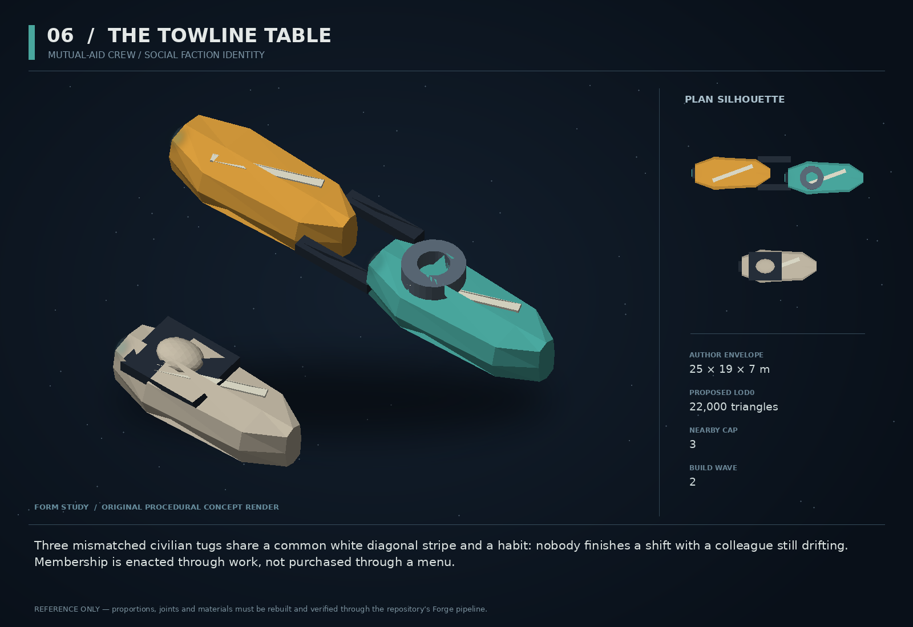

# 06 — The Towline Table

SF20-06 | Mutual-aid crew / social faction identity | Build wave 2 | DESIGN PROPOSAL

## Player-experience purpose

Three mismatched civilian tugs share a common white diagonal stripe and a habit: nobody finishes a shift with a colleague still drifting. Membership is enacted through work, not purchased through a menu.

**Gap / hypothesis:** Faction numbers and rescue traffic do not by themselves create a community that feels accountable to individual people. A small recurring work crew can connect help, collateral and repayment.

**Existing overlap to preserve:** A named occupational circle inside faction_free, not a new ninth political faction or separate reputation scale. Existing Morrow handles a singular rescue encounter; this crew coordinates several ordinary working ships and records reciprocal obligations.

Repository evidence: [R02](https://github.com/coldshalamov/SpaceFace/blob/1e0cf9499613b7c3acad10f34739278136d3d469/design/VISION.md), [R03](https://github.com/coldshalamov/SpaceFace/blob/1e0cf9499613b7c3acad10f34739278136d3d469/AGENTS.md), [R07](https://github.com/coldshalamov/SpaceFace/blob/1e0cf9499613b7c3acad10f34739278136d3d469/src/core/registry.js#L1-L170), [R09](https://github.com/coldshalamov/SpaceFace/blob/1e0cf9499613b7c3acad10f34739278136d3d469/src/data/contactHail.js#L1-L110). See the inspection limits in `../production/SOURCES.md`.

## First encounter

After the player resolves a real stuck-tow or salvage recovery, one tug returns to thank them while the others complete the route. At the next shared service stop, the crew offers a bounded cleanup job: help clear a lane that the player or another witnessed incident obstructed.

## Where and when

Use existing rescue/tug traffic roles at Ceres and Tethys. At most three named hull identities in persistent records, with only nearby authorized work slots instantiated. Their rendezvous is an existing yard, not a new station.

## Repeat loop

Observe actual trouble → help or decline → retain a named receipt → see a later tangible return such as an available escort or waived service labor. Favor can be exhausted; it is not a magical rescue button or currency farm.

## Visual and model recipe

Three compact work-hull variations: a broad clamp tug, a narrow winch tug, and a flat rescue skiff. Shared white slash cut into orange/teal working paint; otherwise deliberately different silhouettes. The crew’s emblem is a three-ended knot, not a human organization’s logo.

Author envelope: 25 × 19 × 7 m, +X nose / +Y port / +Z up. Proposed gameplay semantic radius: 21 WU (0 means not an independently targeted world body); proposed mass: 180 internal units (0 means static/preview, not a massless dynamic body). These are design targets, not final measured asset bounds. Runtime scale must follow the actual Forge/entity contract.

LOD triangle targets: 22,000 / 8,800 / 4,000; proposed near draw budget 10; nearby concept cap 3. Numbers are budgets to verify, never permission to bypass spawnBudget.

### TUG_BASE

Build: Use Forge work-fleet finishes; center loft length 24 m, width 8 m, blunt nose. Build one source kit with three distinct outlines, not three recolors.

Pivot / parent: Hull center.

Collision: Two to three convex hulls per variant.

### CLAMP_VARIANT

Build: Two 8 m forward jaws at Y=±5 with open throat 8 m wide.

Pivot / parent: Z hinges at X=4,Y=±5.

Collision: Jaws cosmetic when not in a sanctioned tow interaction.

### WINCH_VARIANT

Build: Vertical cable drum diameter 5 m on stern; two supported fairlead rollers at nose.

Pivot / parent: Drum axis +Y.

Collision: Hull proxy only; actual cable is Massline.

### SKIFF_VARIANT

Build: Broad stern deck 10×8 m with two patient-pod mounts, no visible humans required.

Pivot / parent: Fixed.

Collision: One deck box.

### COMMON_MARK

Build: One diagonal stripe geometry per upper hull; three small lit windows and a beacon.

Pivot / parent: Conformal to skin using the shared finish.

Collision: None.

## Animation recipe

| Clip / phase | Initial duration | Action |
|---|---:|---|
| Working | 4 s | Drum rotation is proportional to actual line payout. Idle rotation is forbidden. |
| Acknowledge | 0.6 s | Each vessel dips an existing crane or lamp once; avoid synchronized robot dancing. |
| Tow prepared | 1.2 s | Clamp opens before a real attach; receiver waits for actual proximity and consent. |
| Memorial | 8 s | If a member died, an empty berth stays empty and a single beacon holds steady. |

Critical read: Never instantiate all three merely for scenic busyness. A visible ship must have a real job, route or berth.

## AI / behavior

Dispatch is event-driven: IDLE, CLAIM_JOB, APPROACH, ASSIST, DELIVER, RETURN. Claim a job with a stable id so two tugs do not both decide they own the same casualty. Use traffic/navigation owners for movement and the existing helper for tether intent. The named-person layer stores obligations and known incidents; it does not scan unseen sectors for convenient suffering or spawn a friend inside a dangerous collision.

## Physical truth

Assistance uses an actual tow joint or existing recovery path with validated range and relative speed. The player can help by moving the obstruction first, changing the job state. When out of sector, reconcile job completion from the existing offscreen model; never simulate three full physics ships across the galaxy.

## Choices and counterplay

Join a cleanup, ask for bounded help, repay a recorded favor, or decline without losing the campaign. The crew can remember deliberate harm, but a failed rescue is not automatically betrayal.

## Failure and alternative outcomes

If a tug dies, remaining crew adapt their available roles and dialogue. A missing member is not silently respawned with a different name. A corrupted favor record falls back to no extra benefit, not a negative credit balance.

## Personality and sound

Three identifiable voices: Mara is concise and matter-of-fact; Odo narrates the practical next step; Kit uses humor after danger has passed. One speaker at a time, routed through the same arbiter. No overlapping radio sitcom during combat.

**help_offered:** “Mara: We have a line free. Tell us what you need moved.”

**help_declined:** “Odo: Understood. We will keep the approach clear.”

**favor_return:** “Kit: Your terrible afternoon has qualified for our terrible-afternoon program.”

**cleanup:** “Mara: The lane is blocked. The cause can wait until the ships are safe.”

**member_lost:** “Odo: That berth stays empty tonight.”

Dialogue defaults: once-only first reveal; persistent dedupe for milestone lines; repeat flavor no more than once per 90 sim seconds per character, and only when the shared voice arbiter grants the slot. Threat cues are governed by attack state, not that flavor cooldown. Stop stale lines when their target/phase disappears. Captions retain speaker and factual meaning.

## Rewards / economy boundary

One bounded service waiver or mission escort supported by current resource availability. Expenses still flow through existing economy and service owners.

## Save-state contract

memberIds[3], memberOutcomes, activeJobIds<=3, favorReceipts<=16. Persist durable incidents through the current ledger rather than an independent crew economy.

## Existing integration seams

- `src/systems/traffic.js`
- `src/systems/npcJobsRuntime.js`
- `src/systems/provenanceLedger.js`
- `src/ui/stuckTowPrompt.js`

These paths are starting points, not invented callable APIs. Read the live owners and current schemas before implementation. New concept helpers should emit to the owner rather than write its resource directly.

## Dependencies and packet sequence

SF20-01, SF20-03

Audit → behavior proof and model in parallel → presentation → normal-route integration → acceptance. Packet ids `SF20-06-A` through `-F` are in the task graph.

## Specific acceptance cases

1. Two helpers claim one job in the same tick: exactly one tow owner.
2. A job resolves before approach: tug releases the reservation and returns.
3. Kill a crew member and reload: identity remains absent and dialogue changes.
4. Request help without a free slot: explanation is truthful, with no phantom ship.
5. Repeat the same favor receipt: no accumulating free service.

## Player test

On a later visit, players identify at least one member by role or silhouette and can explain a concrete consequence of their earlier action. This measures recognition, not sentiment mining.

## Completion boundary

Require all shared gates in `../production/TEST_PLAN.md`, the specific cases above, a normal-route encounter capture, top/chase/close model review, save/load evidence and matched performance measurements. This packet is not implemented or playtested merely because its plan and art exist. The art GLB is a non-shipping blockout; build the real asset through `../production/ASSET_PIPELINE.md`.
