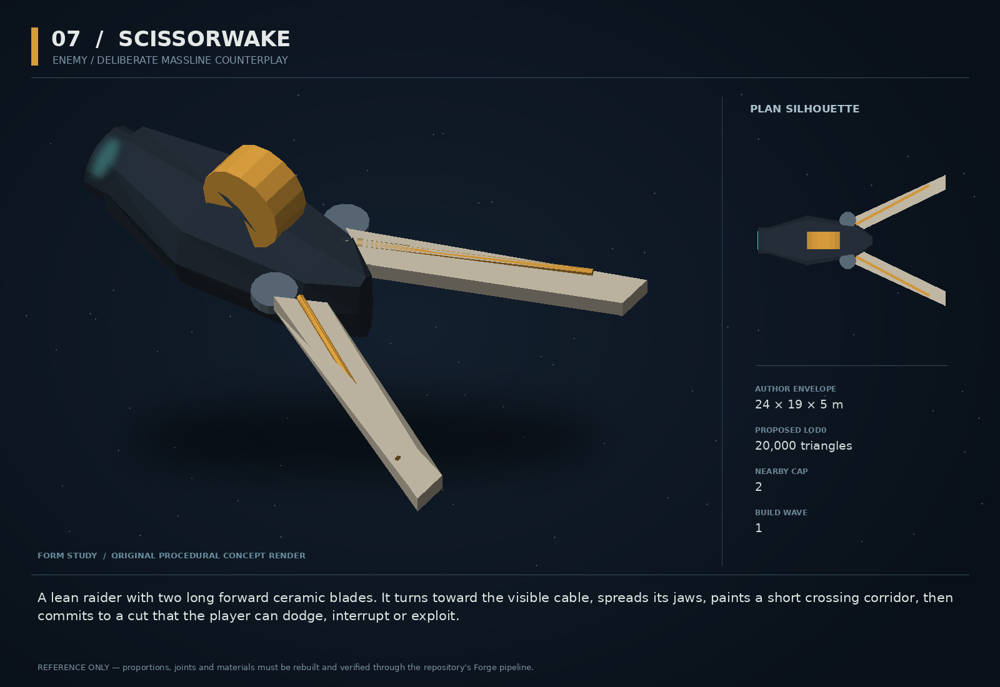

# 07 — Scissorwake

SF20-07 | Enemy / deliberate Massline counterplay | Build wave 1 | DESIGN PROPOSAL

## Player-experience purpose

A lean raider with two long forward ceramic blades. It turns toward the visible cable, spreads its jaws, paints a short crossing corridor, then commits to a cut that the player can dodge, interrupt or exploit.

**Gap / hypothesis:** Existing tether specialists contest attachment and field control. A visibly committed, interruptible line-cutter can make cable awareness tactical without restoring frustrating ambient breakage.

**Existing overlap to preserve:** Not a replacement for tether_control_raider. The GDD explicitly protects ordinary Massline strength: a cut is a named engineered attack, never a silent tension nerf. First reuse any shipped cutter attack discovered during rebase; add its distinctive model and encounter before inventing a second kernel.

Repository evidence: [R02](https://github.com/coldshalamov/SpaceFace/blob/1e0cf9499613b7c3acad10f34739278136d3d469/design/VISION.md), [R03](https://github.com/coldshalamov/SpaceFace/blob/1e0cf9499613b7c3acad10f34739278136d3d469/AGENTS.md), [R05](https://github.com/coldshalamov/SpaceFace/blob/1e0cf9499613b7c3acad10f34739278136d3d469/src/data/enemies.js), [R06](https://github.com/coldshalamov/SpaceFace/blob/1e0cf9499613b7c3acad10f34739278136d3d469/src/data/enemies.js#L405-L560), [R07](https://github.com/coldshalamov/SpaceFace/blob/1e0cf9499613b7c3acad10f34739278136d3d469/src/core/registry.js#L1-L170). See the inspection limits in `../production/SOURCES.md`.

## First encounter

Introduce a single cutter with two familiar light enemies in a spacious early Crucible room. It waits until the player is attached, exposes the blades for 54 ticks, then takes a fixed-bearing pass through the cable. A missed pass leaves its side open. The first cut is instructional pressure, not a lethal combo.

## Where and when

Crucible after a Massline tutorial or equivalent observed use. Campaign deployment only on a later pirate encounter through spawnBudget. Maximum one cutter per introductory encounter and two in advanced mixes; never spawn a fresh cutter already in attack range.

## Repeat loop

See the jaw opening → decide to cut/reposition/throw the cutter → survive the committed pass → punish the recovery. Mastery can turn the specialist into ammunition before its own attack resolves.

## Visual and model recipe

Long open V from two cream ceramic cutting spars, small dark fuselage behind them, a single sodium-orange dorsal spool. The V must remain identifiable when the unit is 40–60 px wide.

Author envelope: 24 × 19 × 5 m, +X nose / +Y port / +Z up. Proposed gameplay semantic radius: 17 WU (0 means not an independently targeted world body); proposed mass: 28 internal units (0 means static/preview, not a massless dynamic body). These are design targets, not final measured asset bounds. Runtime scale must follow the actual Forge/entity contract.

LOD triangle targets: 20,000 / 8,000 / 3,600; proposed near draw budget 10; nearby concept cap 2. Numbers are budgets to verify, never permission to bypass spawnBudget.

### ROOT_SCISSOR

Build: Compact aft loft from X=-10 to +2, width 5 m; leave the forward 12 m mostly negative space.

Pivot / parent: Center aft of the blade pivots.

Collision: One main convex hull.

### BLADE_L/R

Build: Two tapered 13×2×0.8 m chamfered plates with visible dark hinges and no unsupported floating edge.

Pivot / parent: Z hinges at X=0,Y=±2.5; ±8 degrees idle to ±32 degrees armed.

Collision: Damage hit proxies on blades; cutting sweep computed from attack phase, never render mesh raycast.

### SPOOL

Build: A 2 m diameter copper drum at X=-3,Z=2.5; supported on two ribs.

Pivot / parent: Axis +Y.

Collision: None.

### DRIVES

Build: Two recessed engines at X=-9,Y=±2.

Pivot / parent: Named drive hooks.

Collision: Included in hull.

### CUT_APERTURE

Build: Thin solid emissive strips on inner blade edges; bloom limited to the blade area.

Pivot / parent: Child of each blade.

Collision: None.

## Animation recipe

| Clip / phase | Initial duration | Action |
|---|---:|---|
| Acquire | 0.3 s | Sensor points toward an observed cable; no damage. |
| Windup | 0.9 s | Jaws open over 54 sim ticks. Cutting corridor is visible from the first tick. |
| Commit | 0.45 s | Blade pose locks; unit attempts a fixed-bearing force-driven pass. No mid-pass homing. |
| Recover | 1.5 s | Jaws fold slowly; attack unavailable for 90 ticks. |

Critical read: Do not weaken global breakTension. The blades communicate attack intent; they do not need complex skinned animation.

## AI / behavior

States: PATROL, ACQUIRE_LINE, WINDUP, COMMIT, RECOVER, FLEE. Sensors must have current visibility of both relevant cable segment and target neighborhood. Choose the closest reachable segment within 300 WU and a feasible approach cone. Lock the attack bearing on entry to COMMIT. At most one cut receipt per attackId. Losing the line during WINDUP cancels without damage and still consumes a short cooldown. A stunned or displaced cutter cannot complete the cut merely because the animation timer expired.

## Physical truth

The cutter is mass 28, intentionally throwable compared with heavier specialists. Attack resolution uses a swept segment/capsule against the actual attachment segment in the sim plane; separate visual height has no effect. Only the attachment owner can remove a joint. Emit a documented proposed cut intent with source id, target attachment id, attack id and observed tick, then accept or reject in that owner. Cutting deals no extra automatic hull damage.

## Choices and counterplay

Release your line before the pass, change its geometry, displace the attacker, use another object as cover, or kill it. These are independent answers; do not require a particular purchased module.

## Failure and alternative outcomes

A cut releases momentum exactly as a manual cut does. No reset-to-zero velocity, punitive explosion, or temporary inability to reattach. A simultaneous player manual release and enemy cut produces one removal with deterministic ordering.

## Personality and sound

Enemy has no conversational personality. A sharp ratcheting spool announces arming; one rising ceramic scrape ends when the attack commits. Optional hostile barks are short and subordinate to warning audio.

**first_scan:** “Scissorwake — cuts exposed lines on a committed pass.”

**windup:** “Cutter opening. Move the line or move the ship.”

**miss:** “Cut missed. Jaws resetting.”

**disable:** “Blade drive disabled.”

**salvage:** “A cutter without a cutting edge. Finally, an honest ship.”

Dialogue defaults: once-only first reveal; persistent dedupe for milestone lines; repeat flavor no more than once per 90 sim seconds per character, and only when the shared voice arbiter grants the slot. Threat cues are governed by attack state, not that flavor cooldown. Stop stale lines when their target/phase disappears. Captions retain speaker and factual meaning.

## Rewards / economy boundary

Use the existing specialist payout band after campaign tuning. Crucible copy has zero campaign bounty and no campaign loot.

## Save-state contract

attackPhase, phaseStartTick, lockedBearing, targetAttachmentId, attackId, lastResolvedAttackId. Store through existing entity AI state; no render-owned attack clock.

## Existing integration seams

- `src/data/enemies.js`
- `src/systems/tacticalAI.js`
- `src/systems/masslineThreats.js`
- `src/combat/attachments.js`

These paths are starting points, not invented callable APIs. Read the live owners and current schemas before implementation. New concept helpers should emit to the owner rather than write its resource directly.

## Dependencies and packet sequence

No other new concept required.

Audit → behavior proof and model in parallel → presentation → normal-route integration → acceptance. Packet ids `SF20-07-A` through `-F` are in the task graph.

## Specific acceptance cases

1. Move the line outside the swept corridor during windup: no cut.
2. Render at 15 FPS: damage/cut still occurs on the identical fixed tick.
3. Throw the cutter backward: it cannot cut a line it never intersects.
4. Release manually on the impact tick: exactly one detach, no exception.
5. Turn off effects/audio: shape and textual threat still expose the counterplay.

## Player test

After one demonstration, four of five testers can name an available counter and detect the next windup before contact. Track cheap-feeling unavoidable cut complaints as a failure, not a difficulty achievement.

## Completion boundary

Require all shared gates in `../production/TEST_PLAN.md`, the specific cases above, a normal-route encounter capture, top/chase/close model review, save/load evidence and matched performance measurements. This packet is not implemented or playtested merely because its plan and art exist. The art GLB is a non-shipping blockout; build the real asset through `../production/ASSET_PIPELINE.md`.
