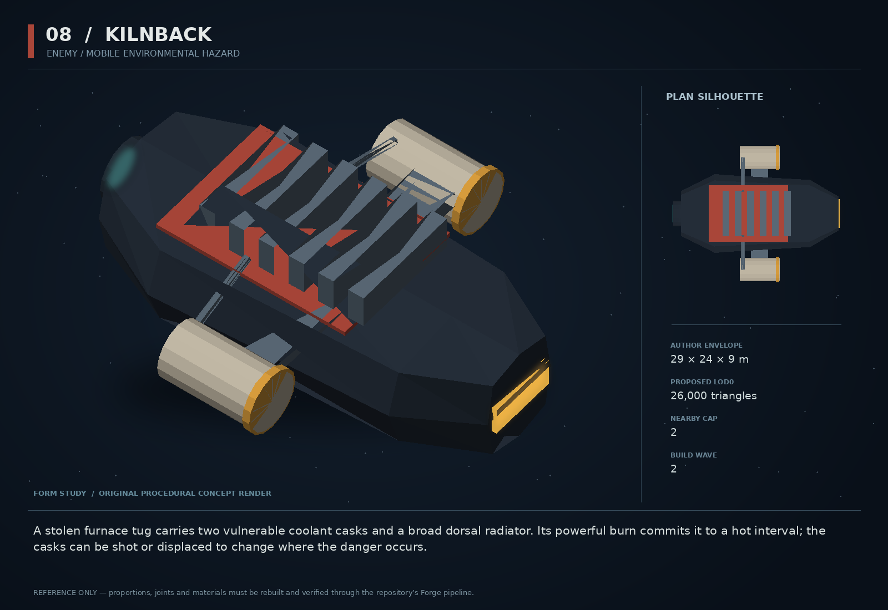

# 08 — Kilnback

SF20-08 | Enemy / mobile environmental hazard | Build wave 2 | DESIGN PROPOSAL

## Player-experience purpose

A stolen furnace tug carries two vulnerable coolant casks and a broad dorsal radiator. Its powerful burn commits it to a hot interval; the casks can be shot or displaced to change where the danger occurs.

**Gap / hypothesis:** The arsenal can feel abstract when heat and area damage are only meters. A venting industrial hull turns a readable thermal state into a manipulable physical opportunity.

**Existing overlap to preserve:** Not the Mirrorjaw Foreman or Forge Regent: no reflective prow, no enlarged boss health bar. Reuse volatileExposure, fields and damage owners for a coolant/heat interaction, with a data-defined new recipe only where existing primitives cannot express it.

Repository evidence: [R03](https://github.com/coldshalamov/SpaceFace/blob/1e0cf9499613b7c3acad10f34739278136d3d469/AGENTS.md), [R05](https://github.com/coldshalamov/SpaceFace/blob/1e0cf9499613b7c3acad10f34739278136d3d469/src/data/enemies.js), [R06](https://github.com/coldshalamov/SpaceFace/blob/1e0cf9499613b7c3acad10f34739278136d3d469/src/data/enemies.js#L405-L560), [R07](https://github.com/coldshalamov/SpaceFace/blob/1e0cf9499613b7c3acad10f34739278136d3d469/src/core/registry.js#L1-L170). See the inspection limits in `../production/SOURCES.md`.

## First encounter

A Kilnback warms up behind ordinary cover. Its radiator shutters open, the casks visibly frost, and a short forward thermal jet paints a narrow lane. A broken cask leaves a cooling patch that suppresses the next jet locally, letting the player reposition rather than simply out-DPS the ship.

## Where and when

First in a small Ceres industrial encounter or middle Crucible room after basic area hazards are understood. Cap one near the player until the counter is learned; avoid pairing with Scissorwake during its first introduction.

## Repeat loop

Read shutters and frost → bait a burn → displace a cask or move around the jet → use the brief cool interval. Environmental placement is more important than total health.

## Visual and model recipe

Short, wide furnace body with a rectangular dorsal radiator comb and two pale cylindrical casks on external brackets. Dark red lacquer identity stripe; hot machinery remains localized amber-white.

Author envelope: 29 × 24 × 9 m, +X nose / +Y port / +Z up. Proposed gameplay semantic radius: 23 WU (0 means not an independently targeted world body); proposed mass: 180 internal units (0 means static/preview, not a massless dynamic body). These are design targets, not final measured asset bounds. Runtime scale must follow the actual Forge/entity contract.

LOD triangle targets: 26,000 / 10,400 / 4,700; proposed near draw budget 11; nearby concept cap 2. Numbers are budgets to verify, never permission to bypass spawnBudget.

### ROOT_KILN

Build: Chunky loft 28×14×7 m with blunt insulated front and a deep rear engine well.

Pivot / parent: Central root.

Collision: One compound hull, mass 150 plus two 15-unit casks.

### RADIATOR_SLATS

Build: Six large parallel plates, 8×0.8×0.25 m, spaced 0.8 m apart; slats form a comb overhead.

Pivot / parent: Each local X hinge, travel 0–55 degrees.

Collision: Render-only.

### CASK_L/R

Build: Two 7×3 m cylinders with protective end rings and break collars.

Pivot / parent: X=-1,Y=±10; child roots until severed.

Collision: One capsule each; dynamic mass 15 after release.

### JET_MOUTH

Build: Deep rectangular 5×1.8 m opening in prow with thick ceramic lip.

Pivot / parent: HOOK_JET at X=14.

Collision: Damage originates in sim field, not glowing plane.

### COOLANT_LINES

Build: Four thick supported pipes modeled as low-segment sweeps.

Pivot / parent: Between casks and radiator.

Collision: None.

## Animation recipe

| Clip / phase | Initial duration | Action |
|---|---:|---|
| Preheat | 1.2 s | Slats rise, jet aperture brightens with no damage until 72 ticks complete. |
| Burn | 1.8 s | Forward jet follows a bounded cone fixed to current hull heading, with deliberately slow turning. |
| Vent | 2.5 s | Shutters stay open; brightness falls; casks visibly shed condensation. |
| Cask rupture | 0.45 s | Detach ring and emit a brief radial puff; no full-screen white flash. |

Critical read: Cooling vapor is an authored thin ribbon cluster near the ground plane, not a camera-facing opaque square or a screen-filling fog wall.

## AI / behavior

APPROACH_COVER, PREHEAT, BURN, VENT, RETREAT. Choose a lane only from observed target motion and line of sight. At PREHEAT entry record an aim heading; turning authority during BURN is capped so strafing is real counterplay. Coolant cancellation is a fact from the field/volatile owner, not a cosmetic particle overlap. The unit will prefer safety when both casks are gone rather than becoming mysteriously stronger.

## Physical truth

A released cask inherits the parent point velocity and can be towed. Cooling patch is a bounded field with radius 90 WU and proposed lifetime 4 s; it reduces this attack’s thermal output, not arbitrary global weapon heat. The jet uses a 160 WU range, 25-degree half-angle proposal, with occlusion through the existing damage-query owner. Do not perform per-particle collision or create infinite coolant from fragments.

## Choices and counterplay

Break a cask early for a safe but less dramatic window; tow it to shape the upcoming fight; bait the jet into cover; or circle to the exposed rear. Hull destruction is valid but not the only satisfying answer.

## Failure and alternative outcomes

Destroying a cask while next to civilians can create an ordinary hazard incident only if the implemented effect actually harms them. Avoid showing harmless vapor as a damaging cloud. Save during BURN resumes the remaining phase once, not a fresh full-duration jet.

## Personality and sound

Mostly industrial sound: a compressor inhalation, radiator clacks and a pressured roar. Pilot is impatient, self-preserving and more interested in keeping the stolen machine intact than dying theatrically.

**preheat:** “Stand clear. This rig does not turn cold quickly.”

**cask_lost:** “Coolant gone. Pulling back.”

**scan:** “Kilnback — external coolant casks; slow turn during a burn.”

**vent:** “Burn exhausted. Radiator exposed.”

**flee:** “Keep the scrap. I am keeping the engine.”

Dialogue defaults: once-only first reveal; persistent dedupe for milestone lines; repeat flavor no more than once per 90 sim seconds per character, and only when the shared voice arbiter grants the slot. Threat cues are governed by attack state, not that flavor cooldown. Stop stale lines when their target/phase disappears. Captions retain speaker and factual meaning.

## Rewards / economy boundary

Normal medium-specialist budget; one salvageable coolant component at most, attributed to the actual cask. No stacked drop from parent plus detached item.

## Save-state contract

phase, phaseStartTick, caskIds[2], caskReleased[2], currentAttackId. Cooling fields persist only through their existing field owner.

## Existing integration seams

- `src/data/enemies.js`
- `src/systems/tacticalAI.js`
- `src/systems/volatileExposure.js`
- `src/systems/fields.js`

These paths are starting points, not invented callable APIs. Read the live owners and current schemas before implementation. New concept helpers should emit to the owner rather than write its resource directly.

## Dependencies and packet sequence

SF20-07

Audit → behavior proof and model in parallel → presentation → normal-route integration → acceptance. Packet ids `SF20-08-A` through `-F` are in the task graph.

## Specific acceptance cases

1. Disable VFX: the same field tests produce the same damage and cancellation.
2. Break cask during save/load boundary: only one field appears.
3. Hide behind authored cover: the jet respects the chosen occlusion contract.
4. Move cask after detachment: no remaining parent collider blocks it.
5. Provoke the first burn from every approach: warning always precedes damage.

## Player test

Players discover at least two counters in open testing. Record whether casks are perceived as interactive before explaining them.

## Completion boundary

Require all shared gates in `../production/TEST_PLAN.md`, the specific cases above, a normal-route encounter capture, top/chase/close model review, save/load evidence and matched performance measurements. This packet is not implemented or playtested merely because its plan and art exist. The art GLB is a non-shipping blockout; build the real asset through `../production/ASSET_PIPELINE.md`.
