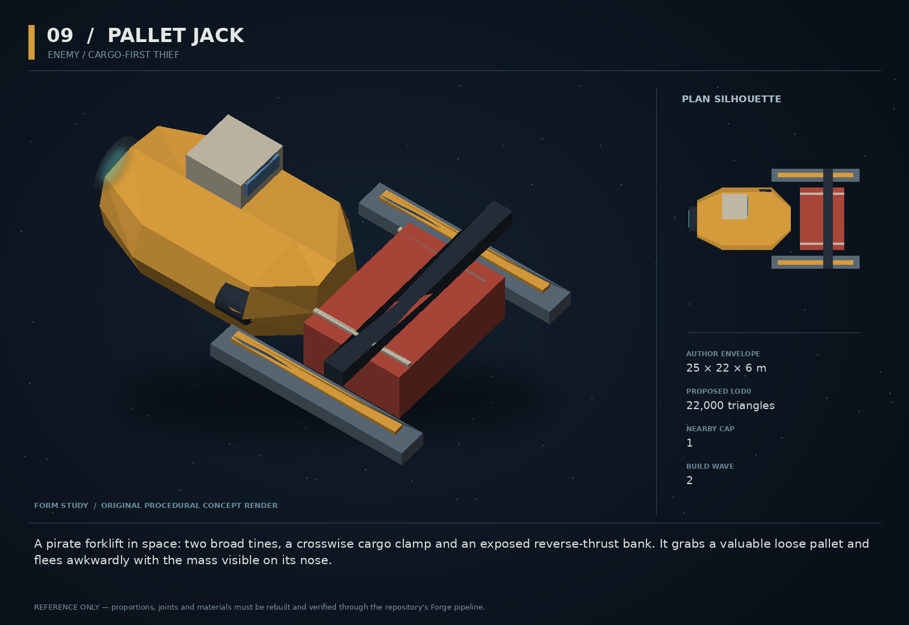

# 09 — Pallet Jack

SF20-09 | Enemy / cargo-first thief | Build wave 2 | DESIGN PROPOSAL

## Player-experience purpose

A pirate forklift in space: two broad tines, a crosswise cargo clamp and an exposed reverse-thrust bank. It grabs a valuable loose pallet and flees awkwardly with the mass visible on its nose.

**Gap / hypothesis:** A hostile encounter can threaten something other than the player’s life. A visibly cargo-motivated thief lets a player win by recovering a thing, not exterminating every enemy.

**Existing overlap to preserve:** Mine-Layer Jackal already prefers cargo/wreck claims. Pallet Jack must add the actual staged lift-and-escape interaction and broad physical fork silhouette; do not merely duplicate that preference in a new stats row.

Repository evidence: [R03](https://github.com/coldshalamov/SpaceFace/blob/1e0cf9499613b7c3acad10f34739278136d3d469/AGENTS.md), [R05](https://github.com/coldshalamov/SpaceFace/blob/1e0cf9499613b7c3acad10f34739278136d3d469/src/data/enemies.js), [R06](https://github.com/coldshalamov/SpaceFace/blob/1e0cf9499613b7c3acad10f34739278136d3d469/src/data/enemies.js#L405-L560), [R07](https://github.com/coldshalamov/SpaceFace/blob/1e0cf9499613b7c3acad10f34739278136d3d469/src/core/registry.js#L1-L170), [R09](https://github.com/coldshalamov/SpaceFace/blob/1e0cf9499613b7c3acad10f34739278136d3d469/src/data/contactHail.js#L1-L110). See the inspection limits in `../production/SOURCES.md`.

## First encounter

After a fight near a real cargo transfer, the thief approaches a loose valuable pallet with its clamp open. The victim hails. The player can interrupt before clamping, pull the pallet away, disable the clamp, or let the theft happen and follow the marked load to a fence.

## Where and when

Ceres or Tethys cargo activity pocket. Only spawn when an eligible real cargo body exists and spawnBudget permits. One active thief per incident. Never create free cargo simply to give the thief something to do.

## Repeat loop

See the target pallet → contest the physical approach → recover or pursue → deliver or steal for yourself. A lost immediate fight can become an investigation using the cargo provenance trail.

## Visual and model recipe

Squat forklift H-shape with two thick forward tines separated by a large rectangular gap; cargo clamp bridges them. The silhouette visibly changes when loaded. Mustard stripe with dark steel and a small asymmetric cockpit.

Author envelope: 25 × 22 × 6 m, +X nose / +Y port / +Z up. Proposed gameplay semantic radius: 20 WU (0 means not an independently targeted world body); proposed mass: 100 internal units (0 means static/preview, not a massless dynamic body). These are design targets, not final measured asset bounds. Runtime scale must follow the actual Forge/entity contract.

LOD triangle targets: 22,000 / 8,800 / 4,000; proposed near draw budget 10; nearby concept cap 1. Numbers are budgets to verify, never permission to bypass spawnBudget.

### ROOT_JACK

Build: Rear block loft 14×10×5 m; two 12×2 m forward plate tines starting at X=0,Y=±7.

Pivot / parent: Center at X=-3.

Collision: Three convex pieces preserving the open fork gap.

### CLAMP

Build: Crossbeam 14×1.4×1.2 m with two downward padded jaw shapes.

Pivot / parent: Slides along +X from 2 to 10 m.

Collision: Sensor trigger during grab; physical load constraint owned by sim.

### LIFT_CARRIAGE

Build: Two visible telescoping rails connecting clamp to body.

Pivot / parent: Fixed to hull and clamp.

Collision: No moving concave collision.

### REVERSE_BANK

Build: Four supported side nozzles pointing forward, visibly larger than aft thrusters.

Pivot / parent: HOOK_REVERSE_1..4.

Collision: Hull proxy only.

### CARGO_SOCKET

Build: Open receiving center between tines, visibly sized for one pallet class.

Pivot / parent: X=7,Y=0,Z=0.

Collision: No invented item mesh: draw the actual captured object.

## Animation recipe

| Clip / phase | Initial duration | Action |
|---|---:|---|
| Target | 0.6 s | Clamp lifts slightly and points to the selected pallet, accompanied by a target bracket only on inspection. |
| Grab | 0.8 s | Clamp closes over 48 ticks; acquisition can fail until the owner accepts actual proximity. |
| Loaded | 1 s | Nose pitches cosmetically up to 3 degrees while real acceleration changes from actual mass. |
| Drop | 0.35 s | Open clamp only after joint release; emit one mechanical clunk. |

Critical read: Actual cargo must remain visible between the forks. This loaded-versus-empty silhouette is the design’s central communication channel.

## AI / behavior

SEARCH_CARGO, CLAIM_APPROACH, GRAB, ESCAPE, NEGOTIATE, DISABLED. Search uses nearby cargo index and visible value classes, not the player’s hidden inventory. Reserve the target locally; if another actor moves it, recompute the approach. Escape direction is a real exit route. On low hull, offer to release the item through a simple existing parley choice, never force a cinematic. The clamp cannot steal an item from an open UI inventory slot.

## Physical truth

Capture only a body within 12 WU of the cradle and below 15 WU/s relative speed after the windup. Cargo mass adds through the actual attachment/compound mechanism; never lower the cargo’s mass invisibly. A player Massline can contest the object under the existing attachment rules; do not silently delete the player’s line. Release transfers neither legal ownership nor credits.

## Choices and counterplay

Save the cargo, save the trader, chase the thief, negotiate a drop, or exploit the situation. The fence trail is optional; it must not let theft create an unlimited sequence of loot and new enemies.

## Failure and alternative outcomes

If the thief crosses the sector boundary with the object, persist its cargo id and route endpoint. A later recovery returns that same provenance, not a cloned replacement. When no safe escape path exists, choose DROP_AND_FLEE rather than clipping through a station.

## Personality and sound

A hustler who believes every crime is a logistics problem. Short, evasive, amusing without glamorizing a random massacre. Cargo loss—not damage—is the primary trigger for panic.

**approach:** “Unsecured freight. Tragic oversight.”

**grab:** “I have a delivery to make. It has recently changed owners.”

**contested:** “That is not a handle for two ships.”

**surrender:** “Clamp is open. We can all become less involved.”

**escape:** “Follow the paperwork. I will follow the exit.”

Dialogue defaults: once-only first reveal; persistent dedupe for milestone lines; repeat flavor no more than once per 90 sim seconds per character, and only when the shared voice arbiter grants the slot. Threat cues are governed by attack state, not that flavor cooldown. Stop stale lines when their target/phase disappears. Captions retain speaker and factual meaning.

## Rewards / economy boundary

Recovery contract reward keyed to the victim’s cargo id; thief bounty follows normal law only. Do not award both a salvage sale and a recovery payment for the same transfer.

## Save-state contract

targetCargoId, grabbedCargoId, grabAttackId, routeEndpointId, incidentId. Cargo owner persists ownership and the body; do not copy cargo data into enemy loot.

## Existing integration seams

- `src/data/enemies.js`
- `src/systems/tacticalAI.js`
- `src/systems/cargo.js`
- `src/systems/pirateParley.js`

These paths are starting points, not invented callable APIs. Read the live owners and current schemas before implementation. New concept helpers should emit to the owner rather than write its resource directly.

## Dependencies and packet sequence

SF20-03

Audit → behavior proof and model in parallel → presentation → normal-route integration → acceptance. Packet ids `SF20-09-A` through `-F` are in the task graph.

## Specific acceptance cases

1. Move the pallet during grab: clamp misses honestly.
2. Destroy thief carrying cargo: one surviving pallet, no duplicate loot item.
3. Contest with Massline: established attachment arbitration stays deterministic.
4. Cross-sector escape and reload: exactly the same cargo provenance returns.
5. No eligible cargo: no useless thief spawn.

## Player test

At least one test encounter ends with recovered cargo and a living thief. Verify players understand that this counts as an effective intervention.

## Completion boundary

Require all shared gates in `../production/TEST_PLAN.md`, the specific cases above, a normal-route encounter capture, top/chase/close model review, save/load evidence and matched performance measurements. This packet is not implemented or playtested merely because its plan and art exist. The art GLB is a non-shipping blockout; build the real asset through `../production/ASSET_PIPELINE.md`.
