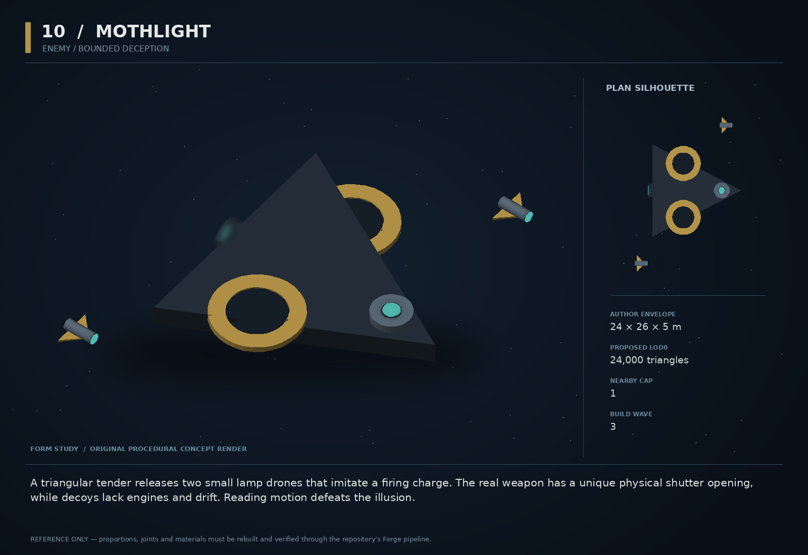

# 10 — Mothlight

SF20-10 | Enemy / bounded deception | Build wave 3 | DESIGN PROPOSAL

## Player-experience purpose

A triangular tender releases two small lamp drones that imitate a firing charge. The real weapon has a unique physical shutter opening, while decoys lack engines and drift. Reading motion defeats the illusion.

**Gap / hypothesis:** A target-priority puzzle can create combat variety without more damage types. It must reward observation rather than hide the true enemy behind arbitrary invisibility.

**Existing overlap to preserve:** Quiet Ghost already supplies stealthy ranged repositioning. Mothlight is a visible decoy-deploying tender, never cloaked and never an omniscient sniper. Its decoys are real destructible entities with cheap behavior.

Repository evidence: [R03](https://github.com/coldshalamov/SpaceFace/blob/1e0cf9499613b7c3acad10f34739278136d3d469/AGENTS.md), [R05](https://github.com/coldshalamov/SpaceFace/blob/1e0cf9499613b7c3acad10f34739278136d3d469/src/data/enemies.js), [R07](https://github.com/coldshalamov/SpaceFace/blob/1e0cf9499613b7c3acad10f34739278136d3d469/src/core/registry.js#L1-L170). See the inspection limits in `../production/SOURCES.md`.

## First encounter

Introduce one tender at medium distance with only one decoy on its first encounter. A lamp imitates the weapon glow but not the real shutter silhouette. A scan labels verified decoys, and a single hit extinguishes one. The tender’s eventual shot is always separately telegraphed.

## Where and when

Later Crucible mixed-role rooms or a surveyed hostile frontier pocket after ranged enemies are familiar. Maximum one tender and two decoys nearby. No decoy may occlude objective markers or imitate accessibility-critical UI.

## Repeat loop

Compare shutter/motion → identify or scan → disable a decoy or close on the tender → use its resupply interval. Novices can brute-force two cheap decoys; experts read the real threat immediately.

## Visual and model recipe

A shallow triangular black-copper hull with two large dish-wing recesses and a clearly visible central iris. Lamp drones are small four-fin needles without engine bells. The real hull is always physically larger.

Author envelope: 24 × 26 × 5 m, +X nose / +Y port / +Z up. Proposed gameplay semantic radius: 21 WU (0 means not an independently targeted world body); proposed mass: 60 internal units (0 means static/preview, not a massless dynamic body). These are design targets, not final measured asset bounds. Runtime scale must follow the actual Forge/entity contract.

LOD triangle targets: 24,000 / 9,600 / 4,300; proposed near draw budget 11; nearby concept cap 1. Numbers are budgets to verify, never permission to bypass spawnBudget.

### ROOT_MOTH

Build: Triangular plate outline (-10,-12),(-10,12),(13,0), thickness 2.2 m, with raised center ridge.

Pivot / parent: Center.

Collision: One convex triangular hull.

### DISH_L/R

Build: Two shallow concave visual bowls radius 4.5 m inset into supported wings, with dark rims.

Pivot / parent: X=-2,Y=±7,Z=1.2.

Collision: No concave physics; hull is enough.

### REAL_IRIS

Build: Six wedge plates forming a 3 m aperture at the nose; open by rotating each petal 24 degrees.

Pivot / parent: Pivots around X=8,Y=0,Z=1.5.

Collision: Targetable subsystem proxy if existing system supports it.

### LAMP_A/B

Build: 2.8 m needles with four 0.6 m fins and a luminous cap; no thruster geometry.

Pivot / parent: Independent roots on release sockets.

Collision: One small spherical collider each, one hit to extinguish.

### SUPPLY_HATCHES

Build: Two dorsal sliding doors exposing drone sockets.

Pivot / parent: Slide along Y.

Collision: None.

## Animation recipe

| Clip / phase | Initial duration | Action |
|---|---:|---|
| Release | 0.8 s | One hatch opens and one lamp physically leaves its socket. No sudden duplicate glows. |
| False charge | 1.1 s | Lamp cap brightens with the same envelope but has no shutter motion or recoil. |
| True charge | 1.1 s | Central iris visibly opens; small recoil linkage braces. Damage follows a fixed tick gate. |
| Reload | 3 s | Iris closes and hatches remain dark; resupply cannot create more than the cap. |

Critical read: No full-screen postprocessing, fake damage indicators, copied player reticles, or misleading screen-reader labels. Deception happens in the fiction, not in the interface contract.

## AI / behavior

DEPLOY, OBSERVE, TRUE_CHARGE, FIRE, REPOSITION, RELOAD. Decoys follow ballistic drift plus tiny bounded damping, not the tactical AI stack. Real shots use normal visibility and aim constraints. Choose which lamp flashes using a local seeded sequence; never key deception to the player’s unobserved cursor. Destroyed decoys consume stock for that encounter: maximum four launches total, two concurrent.

## Physical truth

Decoys have real positions, mass 2 and hull 1. A pulse hit produces an ordinary collision and extinguishes the source. They can be shoved, revealing passive drift; they must not teleport to remain in formation. Cap the false glow’s screen coverage. No fake projectile ever deals damage; real weapon shots come only from the tender’s weapon owner.

## Choices and counterplay

Scan, inspect physical shutter motion, shove a suspected lamp, clear the decoys cheaply, or close under cover. Provide an accessibility option to add a learned decoy badge after the first confirmed identification without removing normal challenge for everyone.

## Failure and alternative outcomes

An occluded real shutter must not permit an unseen unavoidable shot; retain directional warning when a live attack can reach the player. Saving after a lamp is destroyed cannot restore its stock. If scan tools are unavailable, silhouettes and motion are sufficient.

## Personality and sound

Sparse synthetic radio mimicry restricted to authored combat tones, never copies named allies or critical navigation messages. The pilot is a cautious showman who retreats when its apparatus is stripped.

**scan:** “Mothlight — two lamps, one weapon. Watch the shutter.”

**identified:** “Decoy confirmed. No drive signature.”

**true_charge:** “Central shutter opening.”

**stripped:** “The performance appears to be over.”

**retreat:** “No audience worth dying for.”

Dialogue defaults: once-only first reveal; persistent dedupe for milestone lines; repeat flavor no more than once per 90 sim seconds per character, and only when the shared voice arbiter grants the slot. Threat cues are governed by attack state, not that flavor cooldown. Stop stale lines when their target/phase disappears. Captions retain speaker and factual meaning.

## Rewards / economy boundary

Tender pays one normal specialist bounty. Lamps pay nothing and drop nothing; otherwise deception becomes a farming exploit.

## Save-state contract

phase, stockRemaining<=4, activeDecoyIds<=2, localRngState, nextAttackTick. Decoy entities persist through the normal entity owner.

## Existing integration seams

- `src/data/enemies.js`
- `src/systems/tacticalAI.js`
- `src/systems/scanner.js`
- `src/systems/weapons.js`

These paths are starting points, not invented callable APIs. Read the live owners and current schemas before implementation. New concept helpers should emit to the owner rather than write its resource directly.

## Dependencies and packet sequence

SF20-07

Audit → behavior proof and model in parallel → presentation → normal-route integration → acceptance. Packet ids `SF20-10-A` through `-F` are in the task graph.

## Specific acceptance cases

1. No scanner or audio: player can still distinguish real shutter geometry.
2. Kill all lamps and reload: stock does not replenish.
3. Change render FPS: local sequence and attack tick stay equal.
4. Push a lamp: it drifts physically rather than snapping back.
5. Hide the actual weapon behind cover: its shot respects occlusion.

## Player test

Measure identification accuracy after one successful observation; do not demand first-sighting clairvoyance. Reject a design where players call it random even after the rule is explained.

## Completion boundary

Require all shared gates in `../production/TEST_PLAN.md`, the specific cases above, a normal-route encounter capture, top/chase/close model review, save/load evidence and matched performance measurements. This packet is not implemented or playtested merely because its plan and art exist. The art GLB is a non-shipping blockout; build the real asset through `../production/ASSET_PIPELINE.md`.
