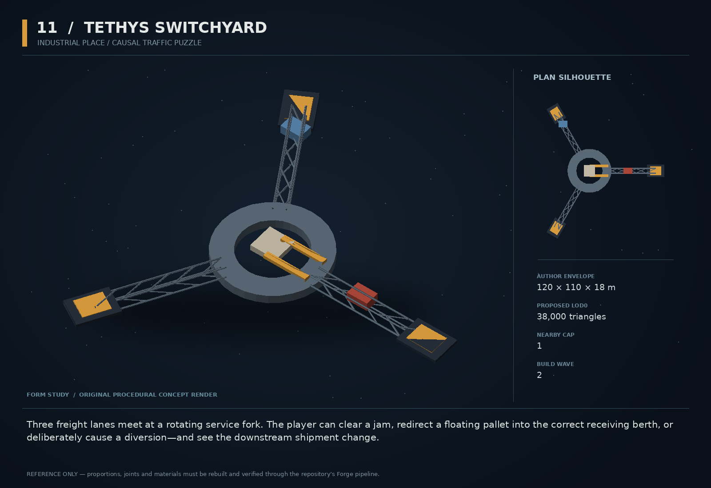

# 11 — Tethys Switchyard

SF20-11 | Industrial place / causal traffic puzzle | Build wave 2 | DESIGN PROPOSAL

## Player-experience purpose

Three freight lanes meet at a rotating service fork. The player can clear a jam, redirect a floating pallet into the correct receiving berth, or deliberately cause a diversion—and see the downstream shipment change.

**Gap / hypothesis:** The living economy is richest when its cargo chain is visible and physically interruptible. A small authored transfer junction makes causality readable without adding a whole new economy.

**Existing overlap to preserve:** Reuse npcJobsRuntime, environmentalMachinery and actual cargo transfers. No decorative orbiting traffic, no substitute route engine, and no new magnetic force law when the existing field machinery suffices.

Repository evidence: [R02](https://github.com/coldshalamov/SpaceFace/blob/1e0cf9499613b7c3acad10f34739278136d3d469/design/VISION.md), [R03](https://github.com/coldshalamov/SpaceFace/blob/1e0cf9499613b7c3acad10f34739278136d3d469/AGENTS.md), [R07](https://github.com/coldshalamov/SpaceFace/blob/1e0cf9499613b7c3acad10f34739278136d3d469/src/core/registry.js#L1-L170), [R08](https://github.com/coldshalamov/SpaceFace/blob/1e0cf9499613b7c3acad10f34739278136d3d469/src/data/authoredPlaces.js#L1-L155), [R09](https://github.com/coldshalamov/SpaceFace/blob/1e0cf9499613b7c3acad10f34739278136d3d469/src/data/contactHail.js#L1-L110). See the inspection limits in `../production/SOURCES.md`.

## First encounter

On an existing Tethys freight route, one pallet is wedged between a stopped transfer sled and a bent guide. A hauler waits outside the throat rather than phasing through it. The player can tow the pallet clear, push the sled back, or accept a job to route the displaced cargo to the right berth.

## Where and when

Author a candidate zone in sector_tethys_junction, then choose coordinates only after checking existing zones, anchors and worldRadius. Use a nonzero sector origin for all atlas tests. Keep the yard optional and preserve an open bypass route.

## Repeat loop

Observe the jam → identify whose load is waiting → manipulate real bodies → allow the shipment to continue → inspect one factual price/supply consequence later. Repeat incidents draw from actual traffic tasks, not arbitrary continuous chaos.

## Visual and model recipe

A Y-shaped lattice yard with three blunt receiving mouths, a central triangular transfer platform and a single off-axis rotating gantry. Clear negative space between arms; amber lane lights mark direction.

Author envelope: 120 × 110 × 18 m, +X nose / +Y port / +Z up. Proposed gameplay semantic radius: 90 WU (0 means not an independently targeted world body); proposed mass: 0 internal units (0 means static/preview, not a massless dynamic body). These are design targets, not final measured asset bounds. Runtime scale must follow the actual Forge/entity contract.

LOD triangle targets: 38,000 / 15,000 / 6,800; proposed near draw budget 14; nearby concept cap 1. Numbers are budgets to verify, never permission to bypass spawnBudget.

### YARD_ROOT

Build: Three Forge truss arms at 0,120,240 degrees, length 45 m from a central 18 m annulus. Use repeated beam geometry.

Pivot / parent: Sector-local anchor.

Collision: Fixed compound boxes per arm; never one encompassing convex collider.

### TRANSFER_FORK

Build: Two 12 m tines on a 9 m rotating base plate, with all gears under a dark cover.

Pivot / parent: Z pivot at yard center.

Collision: Kinematic proxy only if motion is physically enabled.

### RECEIVERS_A/B/C

Build: Three 14×10 m open berths with contrasting solid floor ribs.

Pivot / parent: At each arm end.

Collision: Separate sensor volumes with stable receiver ids.

### SLED

Build: One 7×5×2 m cartlike cargo base; oversized guide bumpers.

Pivot / parent: Independent dynamic root.

Collision: One box, proposed mass 40.

### GUIDE_BENT

Build: A visibly deformed 9 m guide rail and a large handgrip/tow lug.

Pivot / parent: Bolted at incident berth.

Collision: Two convex segments that match the bend.

## Animation recipe

| Clip / phase | Initial duration | Action |
|---|---:|---|
| Normal cycle | 8 s | Gantry rotates only after the task owner reserves a receiver and clearance is valid. |
| Jam | 0.4 s | Drive stops; one work lamp holds amber. No seizure-like pulsing. |
| Freed | 1 s | Actual clearance receipt starts a slow restart before normal speed. |
| Transfer | 2 s | Cradle lowers the real cargo object into a receiving volume; visual pose follows owner progress. |

Critical read: The transfer mouths need to read at the default camera. Limit moving geometry to one mechanism and reuse meshes across all three arms.

## AI / behavior

The place has a job FSM, not an enemy brain: WAIT_TASK, RESERVE_BERTH, VERIFY_CLEAR, TRANSFER, RELEASE, JAM. Each job references a real cargo id, hauler id and destination. Scan or broadphase the small work volume at 5 Hz, with immediate invalidation on object changes. A traffic ship with a reserved berth holds outside until clearance. A watchdog changes deadlocked jobs into a visible repair request, never deletes the obstruction silently.

## Physical truth

Use static collision for the structure and only one active kinematic gantry. For moving solid parts, advance through the authoritative physics owner with swept clearance; a cosmetic rotation must never shove ships. Pallets retain their real masses. Clamp impulses and transfer speeds to existing industrial handling limits; do not weld the player to machinery because a sensor overlapped.

## Choices and counterplay

Clear the cargo, move the sled, tow the bent guide if the authored joint allows it, take an alternate delivery, or leave. Smuggling can use an actual vacant berth, but cannot become a UI exploit that teleports inventory.

## Failure and alternative outcomes

Wrong receiver refuses before destroying cargo and names the mismatch. Player-caused obstruction can create a restitution job. If the entire mechanism is destroyed, routes use the visible bypass and the yard becomes salvage, not a global economic deadlock.

## Personality and sound

Human dispatcher with clipped logistics phrases, noticeably relieved when a jam clears. Machinery itself communicates through clutches and relay clicks, not a sentient station personality.

**jam:** “Berth two is waiting on that pallet. The rest of the shift is waiting on berth two.”

**wrong_berth:** “Wrong receiver. Keep the load; take the outside lane.”

**restart:** “Clearance confirmed. Gantry moving in three.”

**diversion:** “That shipment is no longer on its original route.”

**complete:** “Line moving. Everyone downstream just got their afternoon back.”

Dialogue defaults: once-only first reveal; persistent dedupe for milestone lines; repeat flavor no more than once per 90 sim seconds per character, and only when the shared voice arbiter grants the slot. Threat cues are governed by attack state, not that flavor cooldown. Stop stale lines when their target/phase disappears. Captions retain speaker and factual meaning.

## Rewards / economy boundary

Repair or delivery contract pay only. World stock changes solely from a validated delivered shipment; no price buff attached to a decorative completion animation.

## Save-state contract

yardId, mechanismHealth, activeJobId, jamCauseIds<=4, receiverReservations[3]. Actual goods, prices and routes remain in existing owners.

## Existing integration seams

- `src/data/authoredPlaces.js`
- `src/systems/environmentalMachinery.js`
- `src/systems/npcJobsRuntime.js`
- `src/systems/cargo.js`

These paths are starting points, not invented callable APIs. Read the live owners and current schemas before implementation. New concept helpers should emit to the owner rather than write its resource directly.

## Dependencies and packet sequence

SF20-03, SF20-09

Audit → behavior proof and model in parallel → presentation → normal-route integration → acceptance. Packet ids `SF20-11-A` through `-F` are in the task graph.

## Specific acceptance cases

1. Add zone in nonzero-origin sector: atlas position round-trips exactly.
2. Jam gantry with a player ship: machinery stops, never tunnels.
3. Resolve cargo by another route: waiting job updates instead of hanging.
4. Save a reserved berth: one reservation and one cargo survive.
5. Destroy yard: bypass is usable and no credits/stock are fabricated.

## Player test

A tester can trace one pallet from origin to receiver and explain why a hauler is waiting. Reward visible causal comprehension, not a high decorative ship count.

## Completion boundary

Require all shared gates in `../production/TEST_PLAN.md`, the specific cases above, a normal-route encounter capture, top/chase/close model review, save/load evidence and matched performance measurements. This packet is not implemented or playtested merely because its plan and art exist. The art GLB is a non-shipping blockout; build the real asset through `../production/ASSET_PIPELINE.md`.
