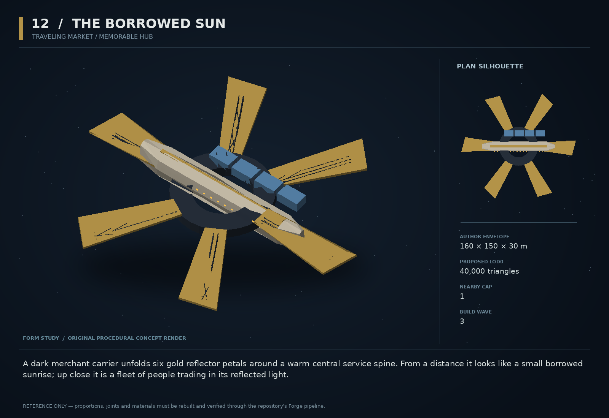

# 12 — The Borrowed Sun

SF20-12 | Traveling market / memorable hub | Build wave 3 | DESIGN PROPOSAL

## Player-experience purpose

A dark merchant carrier unfolds six gold reflector petals around a warm central service spine. From a distance it looks like a small borrowed sunrise; up close it is a fleet of people trading in its reflected light.

**Gap / hypothesis:** A market screen can be useful yet placeless. A periodically visiting physical market creates anticipation and a recognizable social destination without requiring another permanent star system.

**Existing overlap to preserve:** Use existing market, traffic, station services and ORRERY. Not a replacement station shell or a new pricing algorithm. Visit schedule is simulated and inspectable, never real-world FOMO or a daily-login timer.

Repository evidence: [R01](https://github.com/coldshalamov/SpaceFace/blob/1e0cf9499613b7c3acad10f34739278136d3d469/README.md), [R02](https://github.com/coldshalamov/SpaceFace/blob/1e0cf9499613b7c3acad10f34739278136d3d469/design/VISION.md), [R03](https://github.com/coldshalamov/SpaceFace/blob/1e0cf9499613b7c3acad10f34739278136d3d469/AGENTS.md), [R04](https://github.com/coldshalamov/SpaceFace/blob/1e0cf9499613b7c3acad10f34739278136d3d469/tools/blender/forge/FORGE.md), [R07](https://github.com/coldshalamov/SpaceFace/blob/1e0cf9499613b7c3acad10f34739278136d3d469/src/core/registry.js#L1-L170), [R08](https://github.com/coldshalamov/SpaceFace/blob/1e0cf9499613b7c3acad10f34739278136d3d469/src/data/authoredPlaces.js#L1-L155). See the inspection limits in `../production/SOURCES.md`.

## First encounter

A chart notice announces the carrier’s next visit in sim-time terms and allows routing to its current berth. On arrival, it unfolds away from traffic and offers existing services with a small curated inventory tied to real stock. Leaving it does not punish the player or force a countdown purchase.

## Where and when

Alternate between existing safe Tethys and Ceres berths. First deploy only one fixed visit while proving services and geometry; add travel after that slice passes. Never jump the entire moving market while the player is docked.

## Repeat loop

Notice arrival → visit → inspect distinctive stock and a short local story → trade normally → see the carrier later with believable inventory changes. An expired visit leaves a next-destination record, not a vanished quest giver.

## Visual and model recipe

Six broad gold reflector petals attached around a dark hexagonal hub, one long warm-lit service spine crossing the center. Asymmetric cargo pods beneath one quadrant keep it from resembling a magic flower.

Author envelope: 160 × 150 × 30 m, +X nose / +Y port / +Z up. Proposed gameplay semantic radius: 110 WU (0 means not an independently targeted world body); proposed mass: 0 internal units (0 means static/preview, not a massless dynamic body). These are design targets, not final measured asset bounds. Runtime scale must follow the actual Forge/entity contract.

LOD triangle targets: 40,000 / 16,000 / 7,200; proposed near draw budget 14; nearby concept cap 1. Numbers are budgets to verify, never permission to bypass spawnBudget.

### HUB

Build: Forge annulus outer radius 24 m and inner radius 14 m; six structural spokes.

Pivot / parent: Center at berth anchor.

Collision: Six convex wedges preserve central void.

### PETAL_01..06

Build: Each petal a chamfered quadrilateral 45 m long, broadening to 22 m. Gold stripe/bare-metal material with structural ribs beneath.

Pivot / parent: Z hinges at radius 22; hinges visibly supported.

Collision: Non-colliding while decorative; docking approach avoids their swept bounds.

### SPINE

Build: 90×12×12 m central loft with warm windows and two distinct service mouths.

Pivot / parent: Fixed along X.

Collision: Two to four convex proxies; explicit docking corridor openings.

### CARGO_BANK

Build: Eight repeated 12 m containers on supported brackets in one quadrant.

Pivot / parent: Fixed roots, shared geometry.

Collision: Combine into two conservative proxies.

### BEACON

Build: A broad amber lens at the hub, not a point light illuminating the entire sector.

Pivot / parent: Central light socket.

Collision: None.

## Animation recipe

| Clip / phase | Initial duration | Action |
|---|---:|---|
| Unfold | 12 s | Petals open one opposing pair at a time; block dock clearance until the physical access path is safe. |
| Market open | 8 s | Very slow reflected-light travel; windows stay stable and readable. |
| Departure prepare | 10 s | Close service only after all legitimate transfers finish; route docked players to an ordinary undock choice. |
| Transit | 0 s | Folded pose, same carrier identity; do not stream full distant detail. |

Critical read: A warm visual landmark must not saturate bloom or wash out combat threats. Petal glints are material response, not six huge dynamic spotlights.

## AI / behavior

Itinerary FSM: ARRIVE, DEPLOY, OPEN, CLOSE_PENDING, FOLD, DEPART. Service availability is a truth from this state and the existing station-service owner. All transactions revalidate stock and credits. Arrival notices are deduped by visit id. Do not advance the schedule off wall clock or penalize an inactive save. A visit can extend safely when the player is docked.

## Physical truth

Initial production version is a fixed-berth carrier with noninteractive reflectors outside the corridor. Its collision model is only the solid hub/spine. A later mobile version must demonstrate swept docking clearance and transfer authority before enabling movement. No per-petal rigid bodies are necessary; do not spend physics budget to animate a lamp shade.

## Choices and counterplay

Trade, browse, listen to a local rumor grounded in actual events, or leave. Curated stock highlights tradeoffs rather than presenting “buy now or miss forever.” All necessary progression items remain obtainable elsewhere.

## Failure and alternative outcomes

Departure cannot strand an active purchase. Interrupted deployment leaves the ordinary market screen unavailable with a clear reason. A missing asset presents a chart glyph and service fallback; it must not freeze boot at 90 percent.

## Personality and sound

Market operator Nemi speaks like a host who remembers the work of feeding a crowd. Background chatter is abstract and low-volume; only the selected speaker has semantic lines.

**arrival:** “Borrowed Sun taking berth. Bring something worth a conversation.”

**open:** “The light is free. The spare parts are regrettably not.”

**repeat:** “Same ship, different cargo. That is usually a good story.”

**closing:** “We are packing slowly. Finish your business; no one is racing the door.”

**next_stop:** “Next berth is on the chart. We prefer being found.”

Dialogue defaults: once-only first reveal; persistent dedupe for milestone lines; repeat flavor no more than once per 90 sim seconds per character, and only when the shared voice arbiter grants the slot. Threat cues are governed by attack state, not that flavor cooldown. Stop stale lines when their target/phase disappears. Captions retain speaker and factual meaning.

## Rewards / economy boundary

Existing trade margins and authored mission offers. No artificial sale timer, premium currency, or new passive income source.

## Save-state contract

carrierId, visitId, itineraryLeg, phase, phaseStartTick, serviceAnchorId. Store market stock only under the existing economy owner.

## Existing integration seams

- `src/data/sectorAnchors.js`
- `src/systems/traffic.js`
- `src/systems/economy.js`
- `src/ui/orrery/`

These paths are starting points, not invented callable APIs. Read the live owners and current schemas before implementation. New concept helpers should emit to the owner rather than write its resource directly.

## Dependencies and packet sequence

SF20-01, SF20-02

Audit → behavior proof and model in parallel → presentation → normal-route integration → acceptance. Packet ids `SF20-12-A` through `-F` are in the task graph.

## Specific acceptance cases

1. Buy on closing tick: exactly one accepted transaction or one clear denial.
2. Remain docked past planned departure: no forced teleport or lost ship.
3. Restart app after a long wall-clock gap: visit changes only under intended sim/offline rules.
4. Remove GLB from test server: chart and fallback service remain usable.
5. Inspect folded and open colliders: no invisible petal walls.

## Player test

Players recognize the hub from a 2-second silhouette exposure and can find one service without searching all tabs. Confirm anticipation comes from content, not countdown pressure.

## Completion boundary

Require all shared gates in `../production/TEST_PLAN.md`, the specific cases above, a normal-route encounter capture, top/chase/close model review, save/load evidence and matched performance measurements. This packet is not implemented or playtested merely because its plan and art exist. The art GLB is a non-shipping blockout; build the real asset through `../production/ASSET_PIPELINE.md`.
