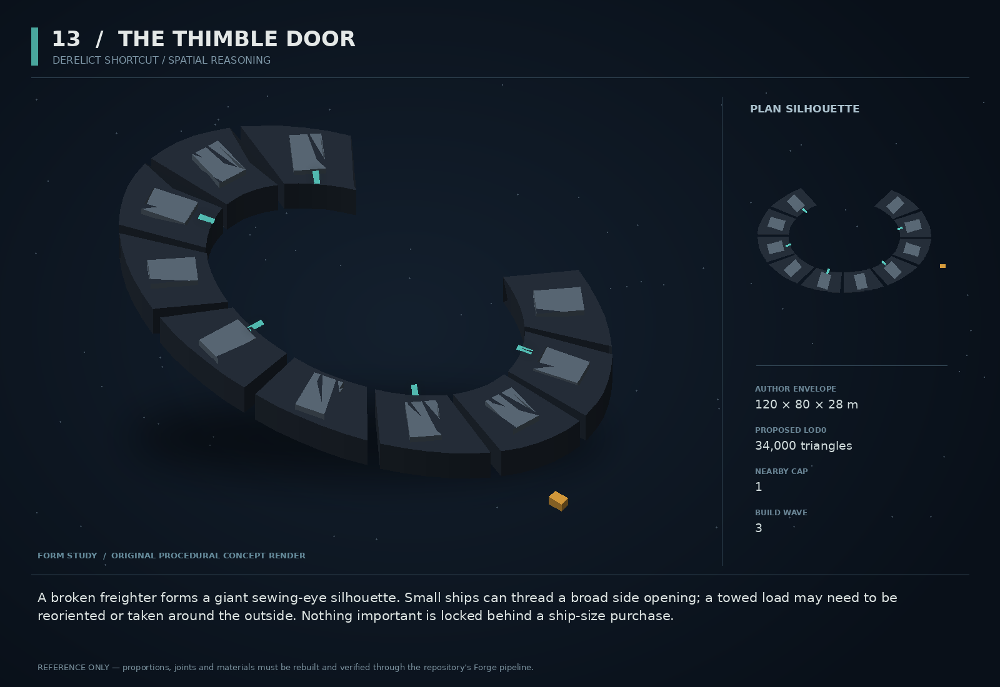

# 13 — The Thimble Door

SF20-13 | Derelict shortcut / spatial reasoning | Build wave 3 | DESIGN PROPOSAL

## Player-experience purpose

A broken freighter forms a giant sewing-eye silhouette. Small ships can thread a broad side opening; a towed load may need to be reoriented or taken around the outside. Nothing important is locked behind a ship-size purchase.

**Gap / hypothesis:** Ship size and attached cargo should sometimes matter spatially, not just numerically. A readable optional passage makes clearance, towing and momentum meaningful while exposing camera quality as a shipping gate.

**Existing overlap to preserve:** Existing places and physics already support obstacles. This is a deliberately authored alternate route, not a new traversal system. Do not release it until camera clipping and corridor collision tests pass.

Repository evidence: [R02](https://github.com/coldshalamov/SpaceFace/blob/1e0cf9499613b7c3acad10f34739278136d3d469/design/VISION.md), [R03](https://github.com/coldshalamov/SpaceFace/blob/1e0cf9499613b7c3acad10f34739278136d3d469/AGENTS.md), [R04](https://github.com/coldshalamov/SpaceFace/blob/1e0cf9499613b7c3acad10f34739278136d3d469/tools/blender/forge/FORGE.md), [R08](https://github.com/coldshalamov/SpaceFace/blob/1e0cf9499613b7c3acad10f34739278136d3d469/src/data/authoredPlaces.js#L1-L155). See the inspection limits in `../production/SOURCES.md`.

## First encounter

A survey contract points out a lost recorder beyond a wreck. The long route is plainly visible. The short route passes through a tapered, lit opening with a charted clearance envelope. A cargo pallet behind the player changes the answer to “will this fit?”

## Where and when

A new optional derelict-field subsite in sector_ceres_belt, outside existing critical lanes. Candidate position must be chosen after map collision/zone checks. An outside bypass must remain valid for the largest supported player hull and tow.

## Repeat loop

Inspect opening → compare body/load → align and coast through, reposition the load, or take the bypass → collect a record or complete a delivery. Repeat value comes from movement experimentation, not a hidden precision requirement.

## Visual and model recipe

An enormous oblong broken hull around a clear oval hole. Two missing panels expose ribs; a single cyan survey lamp illuminates the opening rim. The void is the central shape, not a dark tunnel with invisible hazards.

Author envelope: 120 × 80 × 28 m, +X nose / +Y port / +Z up. Proposed gameplay semantic radius: 85 WU (0 means not an independently targeted world body); proposed mass: 0 internal units (0 means static/preview, not a massless dynamic body). These are design targets, not final measured asset bounds. Runtime scale must follow the actual Forge/entity contract.

LOD triangle targets: 34,000 / 13,600 / 6,100; proposed near draw budget 11; nearby concept cap 1. Numbers are budgets to verify, never permission to bypass spawnBudget.

### RIM_SEGMENTS

Build: Build twelve separate chamfered rib wedges around an ellipse 60×34 m; exterior expands to 115×76 m.

Pivot / parent: Shared root.

Collision: Compound convex wedges preserving the open hole exactly.

### HULL_SKIN

Build: Raised plates span only adjacent ribs; omit two large damaged panels. Deep darkmetal recesses.

Pivot / parent: Fixed to ribs.

Collision: Reuse rib proxies; no giant convex hull.

### SHEARED_EDGE

Build: Three visibly bent plate strips at one end, with a generous safe interior margin.

Pivot / parent: Fixed.

Collision: Only large protrusions get proxies.

### SURVEY_LIGHTS

Build: Six short solid cyan edge markers, with a directional arrow shape modeled near the broad entrance.

Pivot / parent: Rim surface.

Collision: None.

### RECORDER

Build: 2 m dark box with a visible tow eye on a small platform beyond the opening.

Pivot / parent: Independent stable site object.

Collision: One small dynamic box if recovery uses towing.

## Animation recipe

| Clip / phase | Initial duration | Action |
|---|---:|---|
| Derelict idle | 18 s | One loose outer cable sways minimally; passage geometry never changes cosmetically. |
| Survey | 1 s | A rim light sweep confirms observed clearance once; text gives units or “too wide” based on actual bounds. |
| Contact | 0.25 s | Local spark at contact point, not whole-wreck flash. |
| Recovered | 0.7 s | Recorder status light dims on accepted pickup; no duplicate prop remains. |

Critical read: Camera and collision reliability are dependencies, not aesthetic polish to do afterward. This concept stays unshipped until both pass.

## AI / behavior

No creature AI. An encounter state machine tracks DISCOVERED, SURVEYED, ENTERED, RECOVERED and ABANDONED. Clearance guidance is a conservative geometric query against current player and attached-body swept bounds; present UNKNOWN when a reliable answer is unavailable. Never advertise a guaranteed trajectory through dynamic collisions. Existing pathfinding chooses the bypass unless a route is valid for the current convoy envelope.

## Physical truth

Use a genuine compound collider, not a concave moving mesh. Static wreck collision must agree with the hole. Tow length and object orientation are real constraints. Do not auto-shrink the player or disable collision to help the shortcut. At design time give the intended small-hull route at least 1.5 times that hull’s measured envelope; the final number follows actual asset bounds.

## Choices and counterplay

Thread the opening, shorten/reorient a load under existing Massline controls, detach and retrieve separately, or go around. Each option remains reversible; the recorder cannot be permanently wedged behind an unreachable collider.

## Failure and alternative outcomes

If a player gets stuck, a visible reverse path and ordinary recovery service remain possible. No lethal crush trap on the only objective path. A camera behind geometry must use the established occlusion response; adding bespoke transparent skins per object is not a substitute for fixing the owner.

## Personality and sound

Mostly quiet. A recorded surveyor voice is concise and slightly amused, never a mystical whisper. The structure itself has no personhood.

**discover:** “The Thimble Door. An optimistic name for a hole in a ship.”

**clearance:** “Hull clear. Attached load still needs room.”

**uncertain:** “Clearance uncertain. The outside route is open.”

**recorder:** “Recorder recovered. Survey complete.”

**bypass:** “Long way around. Still a perfectly good way around.”

Dialogue defaults: once-only first reveal; persistent dedupe for milestone lines; repeat flavor no more than once per 90 sim seconds per character, and only when the shared voice arbiter grants the slot. Threat cues are governed by attack state, not that flavor cooldown. Stop stale lines when their target/phase disappears. Captions retain speaker and factual meaning.

## Rewards / economy boundary

Ordinary survey/recovery pay, regardless of shortcut or bypass. Faster traversal is its own benefit; no punishment for accessibility-minded route choice.

## Save-state contract

siteDiscovered, surveyed, recorderOutcome, collisionRevision. Keep current clearance transient; recompute after ship or tow changes.

## Existing integration seams

- `src/data/authoredPlaces.js`
- `src/data/collisionProxyManifests.js`
- `src/render/camera.js`
- `src/systems/salvage.js`

These paths are starting points, not invented callable APIs. Read the live owners and current schemas before implementation. New concept helpers should emit to the owner rather than write its resource directly.

## Dependencies and packet sequence

SF20-01, SF20-03

Audit → behavior proof and model in parallel → presentation → normal-route integration → acceptance. Packet ids `SF20-13-A` through `-F` are in the task graph.

## Specific acceptance cases

1. Sweep smallest and largest hulls across all rim directions: contacts match visible ribs.
2. Tow a wide crate through and around: no false CLEAR result.
3. Place camera inside every rim quadrant: player and exit remain legible.
4. Save while partly inside: reload never ejects or duplicates bodies.
5. Recover recorder after an interrupted attempt: objective remains reachable.

## Player test

Ask players to predict fit before entry; compare with actual outcome. Any confident false-clearance prediction caused by the UI blocks release.

## Completion boundary

Require all shared gates in `../production/TEST_PLAN.md`, the specific cases above, a normal-route encounter capture, top/chase/close model review, save/load evidence and matched performance measurements. This packet is not implemented or playtested merely because its plan and art exist. The art GLB is a non-shipping blockout; build the real asset through `../production/ASSET_PIPELINE.md`.
