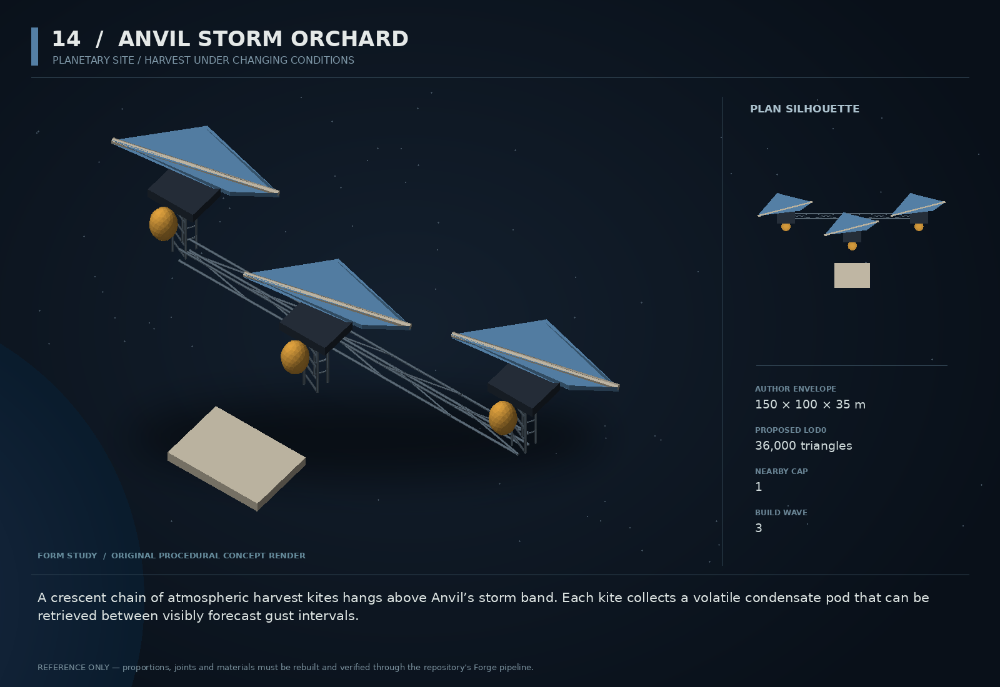

# 14 — Anvil Storm Orchard

SF20-14 | Planetary site / harvest under changing conditions | Build wave 3 | DESIGN PROPOSAL

## Player-experience purpose

A crescent chain of atmospheric harvest kites hangs above Anvil’s storm band. Each kite collects a volatile condensate pod that can be retrieved between visibly forecast gust intervals.

**Gap / hypothesis:** The Anvil already exists as a physical planet. It needs a memorable, repeatable local livelihood that teaches its hazards and makes returning worthwhile, rather than another decorative planet.

**Existing overlap to preserve:** Extend zone_tethys_anvil, planets and planetRuntime. Do not add a second planet with identical sling/skim behavior, and never change the canonical planet field just to fit this content.

Repository evidence: [R02](https://github.com/coldshalamov/SpaceFace/blob/1e0cf9499613b7c3acad10f34739278136d3d469/design/VISION.md), [R03](https://github.com/coldshalamov/SpaceFace/blob/1e0cf9499613b7c3acad10f34739278136d3d469/AGENTS.md), [R07](https://github.com/coldshalamov/SpaceFace/blob/1e0cf9499613b7c3acad10f34739278136d3d469/src/core/registry.js#L1-L170), [R08](https://github.com/coldshalamov/SpaceFace/blob/1e0cf9499613b7c3acad10f34739278136d3d469/src/data/authoredPlaces.js#L1-L155). See the inspection limits in `../production/SOURCES.md`.

## First encounter

A skimmer foreman calls from a safe service platform outside the hot band. Three huge fins lean with the current; one harvest pod is ready. The player can wait for a calm interval or attempt a skilled timed tow while watching both cargo shock and planetary heat.

## Where and when

Within the existing Anvil site in sector_tethys_junction, at a validated band-relative offset derived from planetRuntime. Do not hardcode a second global center. Keep a safe holding pocket beyond the dangerous band and an unconditional escape direction.

## Repeat loop

Observe forecast → choose one harvest pod → skim/tow under real forces → exit before accumulated heat becomes critical → deliver to an existing receiver. Later storms vary timing and available harvest, not hidden force magnitude.

## Visual and model recipe

Three enormous crescent fins on sparse dark trusses, each with a bright amber condensate pod at its base. The planet fills part of the background but never becomes a second solid shell clipping through the camera.

Author envelope: 150 × 100 × 35 m, +X nose / +Y port / +Z up. Proposed gameplay semantic radius: 100 WU (0 means not an independently targeted world body); proposed mass: 0 internal units (0 means static/preview, not a massless dynamic body). These are design targets, not final measured asset bounds. Runtime scale must follow the actual Forge/entity contract.

LOD triangle targets: 36,000 / 14,400 / 6,500; proposed near draw budget 13; nearby concept cap 1. Numbers are budgets to verify, never permission to bypass spawnBudget.

### ANCHOR_TRUSS

Build: Three fixed service posts on a shallow arc, 40 m apart; built from shared truss sections.

Pivot / parent: Local relative to planet site anchor.

Collision: Three small static proxy clusters, not one solid arc.

### HARVEST_FIN_1..3

Build: Each 30×14 m curved plate approximated by five low-curvature segments, with a thick leading rib.

Pivot / parent: Pitch hinge along Y; ±18 degrees cosmetic flex within fixed safe envelope.

Collision: No collider on cosmetic flex; solid frame uses simple segments.

### POD_1..3

Build: 4 m capsule with dark collar and amber core indicator.

Pivot / parent: Independent release roots at each service post.

Collision: Mass 10, dynamic capsule after accepted release.

### SAFE_PLATFORM

Build: 20×14 m service slab with unmistakable open holding mouth.

Pivot / parent: Outside heat band.

Collision: Simple convex deck boundaries.

### WINDSOCK_MARKERS

Build: Three articulated solid fins, not cloth simulation.

Pivot / parent: Frame-mounted Z hinges.

Collision: None.

## Animation recipe

| Clip / phase | Initial duration | Action |
|---|---:|---|
| Calm | 10 s | Fins align toward the current; pod readiness indicator steady. |
| Forecast gust | 2 s | Windsock vanes deflect before actual gust onset; warning is shared with text. |
| Gust | 5 s | Fin lean follows actual field strength and direction, clamped to designed range. |
| Harvest release | 0.5 s | Collar opens after accepted interaction, leaving the pod’s real body available to tow. |

Critical read: Use existing planetary rendering. No new full-screen storm shader, extra atmosphere sphere, or heavy transparent layers in the first version.

## AI / behavior

Site scheduler uses sim ticks and the existing environmental machinery owner: CALM, FORECAST, GUST, RECOVERY. Planet forces remain authoritative. Harvest readiness accumulates only at the intended cadence and consumes a finite local resource budget. NPC skimmers read the same forecast and wait or retreat accordingly. New weather data may modulate an authored local effect only through the current field owner; no competing gravitational acceleration.

## Physical truth

A harvested pod is fragileCargo with explicit shock/heat rules. Wind direction and strength must be disclosed by the same state that applies forces. Set proposed gust lead time to 120 ticks; after tests, tune with real stopping distances. A long tether does not extend heat immunity. Coupling release inherits point velocity and does not spawn a new copy on every hail.

## Choices and counterplay

Wait, make a single conservative harvest, combine a skilled slingshot with collection, or accept an NPC-assisted retrieval at a lower net return. Time pressure is voluntary; no main story item requires dangerous skimming.

## Failure and alternative outcomes

Overheated or shattered pods reduce that run’s yield. Losing a ship follows normal recovery; do not permanently lock the planet. A forecast after reload must preserve its remaining lead time, not jump directly to a damaging gust.

## Personality and sound

Foreman Alin sounds relaxed because they have learned not to argue with weather. Critical lines are clear, short and directional; ambient poetry waits until the player is safe.

**intro:** “The orchard is ready. The weather has not agreed to help.”

**forecast:** “Gust in two. Hold outside the band.”

**safe:** “You are clear. Let the pod settle before the next burn.”

**loss:** “Lost the harvest, not the lesson. Come back cold.”

**repeat:** “Same sky. Different bad idea. Show me.”

Dialogue defaults: once-only first reveal; persistent dedupe for milestone lines; repeat flavor no more than once per 90 sim seconds per character, and only when the shared voice arbiter grants the slot. Threat cues are governed by attack state, not that flavor cooldown. Stop stale lines when their target/phase disappears. Captions retain speaker and factual meaning.

## Rewards / economy boundary

Finite harvested commodity through current cargo/economy; tune expected earnings near comparable active mining, not an infinite premium loop.

## Save-state contract

sitePhase, phaseStartTick, podCycleIds[3], harvestOutcomes, localYieldBudget. Planet state and fields remain with existing owners.

## Existing integration seams

- `src/data/authoredPlaces.js`
- `src/systems/planetRuntime.js`
- `src/systems/environmentalMachinery.js`
- `src/systems/fragileCargo.js`

These paths are starting points, not invented callable APIs. Read the live owners and current schemas before implementation. New concept helpers should emit to the owner rather than write its resource directly.

## Dependencies and packet sequence

SF20-04, SF20-11

Audit → behavior proof and model in parallel → presentation → normal-route integration → acceptance. Packet ids `SF20-14-A` through `-F` are in the task graph.

## Specific acceptance cases

1. Compare forecast direction with applied force at multiple points.
2. Load one tick before gust: full remaining warning is truthful.
3. Harvest the same pod twice: second request refuses.
4. Leave and return midcycle: resource and phase do not reset for profit.
5. Maximal tow length and large hull: safe pocket actually remains safe.

## Player test

Players can predict a gust and choose to wait without feeling punished. Measure failed exits against visible warnings and real stopping distance.

## Completion boundary

Require all shared gates in `../production/TEST_PLAN.md`, the specific cases above, a normal-route encounter capture, top/chase/close model review, save/load evidence and matched performance measurements. This packet is not implemented or playtested merely because its plan and art exist. The art GLB is a non-shipping blockout; build the real asset through `../production/ASSET_PIPELINE.md`.
