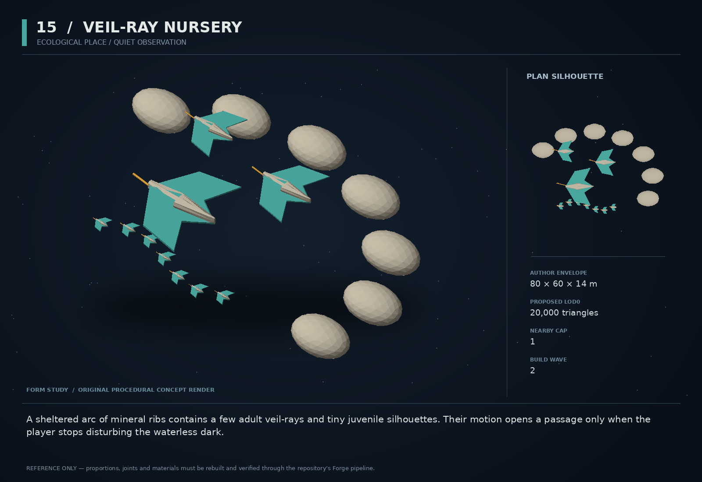

# 15 — Veil-Ray Nursery

SF20-15 | Ecological place / quiet observation | Build wave 2 | DESIGN PROPOSAL

## Player-experience purpose

A sheltered arc of mineral ribs contains a few adult veil-rays and tiny juvenile silhouettes. Their motion opens a passage only when the player stops disturbing the waterless dark.

**Gap / hypothesis:** An ecology catalog can be extensive yet emotionally flat. An authored nursery lets a known nonhostile species demonstrate behavior that rewards restraint and observation.

**Existing overlap to preserve:** Use existing veil_ray species and its sensitivity to scans/weapons. Do not invent another parasite, retcon Vethari canon, or turn these fauna into tactical enemies. Cinder Nursery already exists; this is a small satellite encounter, not a replacement biome.

Repository evidence: [R03](https://github.com/coldshalamov/SpaceFace/blob/1e0cf9499613b7c3acad10f34739278136d3d469/AGENTS.md), [R08](https://github.com/coldshalamov/SpaceFace/blob/1e0cf9499613b7c3acad10f34739278136d3d469/src/data/authoredPlaces.js#L1-L155), [R12](https://github.com/coldshalamov/SpaceFace/blob/1e0cf9499613b7c3acad10f34739278136d3d469/src/data/alienFauna.js#L1-L145). See the inspection limits in `../production/SOURCES.md`.

## First encounter

Near an existing ecology site in Charon, a scan briefly scatters the rays. Passive observation reveals their preferred quiet corridor; cutting thrust and waiting allows them to re-form around a mineral arch. A survey can complete from a respectful distance without touching or capturing anything.

## Where and when

An additive, optional subsite near an existing Charon ecology anchor, after the scanner has identified veil_ray. Maintain the established revelation gates and at least-half-nonhostile sighting rule. Do not add a dense new spawn table.

## Repeat loop

Notice motion → observe how thrust/scan changes behavior → choose a quieter approach → document a route or return later. The reward is knowledge and a changed relationship to space, not biological loot grinding.

## Visual and model recipe

A pale mineral crescent cradling three translucent-looking but mostly opaque kite-shaped rays. Broad membrane wings, dark center keels and small warm filaments. Juveniles read as sparse smaller silhouettes rather than particle fog.

Author envelope: 80 × 60 × 14 m, +X nose / +Y port / +Z up. Proposed gameplay semantic radius: 60 WU (0 means not an independently targeted world body); proposed mass: 0 internal units (0 means static/preview, not a massless dynamic body). These are design targets, not final measured asset bounds. Runtime scale must follow the actual Forge/entity contract.

LOD triangle targets: 20,000 / 8,000 / 3,600; proposed near draw budget 10; nearby concept cap 1. Numbers are budgets to verify, never permission to bypass spawnBudget.

### NURSERY_RIBS

Build: Seven static irregular rock ribs on a 60 m crescent; use deterministic rock seeds and broad fractured facets.

Pivot / parent: Site root.

Collision: At most seven simple convex proxies; preserve the passage.

### RAY_ADULT

Build: Reuse/remaster existing veil-ray asset: central keel plus two broad membrane surfaces, no humanoid face.

Pivot / parent: Root along +X.

Collision: Keep existing fauna collision contract; do not add lethal solid wings.

### MEMBRANE_L/R

Build: Each wing uses three broad strips with a small rig or vertex deformation; total adult mesh target 1800 triangles.

Pivot / parent: Root/wingtip controls, no more than 8 bones if skinned.

Collision: Render-only deformation.

### JUVENILES

Build: 6–9 small instanced copies represented by one aggregate visual group.

Pivot / parent: Seeded offsets from site root.

Collision: No individual physics bodies.

### FILAMENTS

Build: Two short curved solid ribbons per adult, tapering to a point.

Pivot / parent: Keel sockets.

Collision: None.

## Animation recipe

| Clip / phase | Initial duration | Action |
|---|---:|---|
| Forage | 4.5 s | Wing tips travel a slow phase-shifted wave; forward speed comes from fauna simulation, not root motion. |
| Notice | 0.8 s | Wings narrow and keel turns toward stimulus without charging. |
| Scatter | 1.2 s | Fold silhouette and accelerate using existing flee drive; animation follows actual drive. |
| Settle | 6 s | Adults return to formation gradually after stimulus decay, with no instant synchronized reset. |

Critical read: Alien softness must be carried by broad membranes and motion, not multiple transparent shell layers or dense CPU particles.

## AI / behavior

Read FAUNA_SPECIES.veil_ray and extend site-specific goals rather than adding a second drive engine. Nursery state: QUIET, DISTURBED, RECOVERING. Weapon and scan stimuli use existing weights; sustained close thrust may map to the existing heat/vibration stimulus only if its semantics match. At most three adult simulation entities; juveniles are an aggregate. No omniscient detection of the player opening a menu.

## Physical truth

The observed species uses collision-free semantic radius in current data. Preserve that. Rocks are the actual collision geometry; rays do not suddenly become high-mass blockers. A nursery route is behavioral guidance, not a locked physical gate. The player can always leave through the open outer arc.

## Choices and counterplay

Passively observe, take a quick disruptive scan, return after settling, or leave. A short scientific survey does not require perfect behavior or an unadvertised sequence. Violence remains possible under existing fauna rules but is not an efficient farming path.

## Failure and alternative outcomes

Disturbance changes the encounter without permanent softlock. Settle timer freezes or advances according to the existing offscreen ecology model, not local render time. A killed adult stays represented in the site’s persistent population outcome; juveniles are not endlessly reissued as loot.

## Personality and sound

No speaking animals and no sentimental child voices. Use gentle resonant membrane tones and distant radio from a surveyor, only after the observation window. Captions identify the stimulus/response for players unable to hear it.

**survey:** “Veil-rays. They noticed the scanner before we noticed them.”

**disturbance:** “The formation broke when the drive flared.”

**settle:** “Engines quiet. Give them room.”

**observed:** “The route is there. They are using it, not guarding it.”

**return:** “Same shelter. Fewer disturbances in the log.”

Dialogue defaults: once-only first reveal; persistent dedupe for milestone lines; repeat flavor no more than once per 90 sim seconds per character, and only when the shared voice arbiter grants the slot. Threat cues are governed by attack state, not that flavor cooldown. Stop stale lines when their target/phase disappears. Captions retain speaker and factual meaning.

## Rewards / economy boundary

One survey reward and a codex observation. No loot from juvenile visuals and no repeatable money for disturbing then calming the group.

## Save-state contract

siteId, nurseryObservationFlags, populationOutcome, disturbanceTimestamp or tick through existing ecology owner. Do not create an independent fauna population registry.

## Existing integration seams

- `src/data/alienFauna.js`
- `src/data/alienEcology.js`
- `src/data/authoredPlaces.js`
- `src/systems/scanner.js`

These paths are starting points, not invented callable APIs. Read the live owners and current schemas before implementation. New concept helpers should emit to the owner rather than write its resource directly.

## Dependencies and packet sequence

No other new concept required.

Audit → behavior proof and model in parallel → presentation → normal-route integration → acceptance. Packet ids `SF20-15-A` through `-F` are in the task graph.

## Specific acceptance cases

1. Active scan disperses formation through existing stimulus rules.
2. Passive observation succeeds without hidden input sequence.
3. Mute sound and reduce motion: behavior and survey cues still understandable.
4. Exit/reenter repeatedly: no population or survey-reward duplication.
5. Use maximum graphics quality: juvenile aggregation does not create dozens of AI updates.

## Player test

Observe whether players voluntarily reduce thrust after seeing a response. Ask what caused the change; a correct causal explanation matters more than whether they chose to comply.

## Completion boundary

Require all shared gates in `../production/TEST_PLAN.md`, the specific cases above, a normal-route encounter capture, top/chase/close model review, save/load evidence and matched performance measurements. This packet is not implemented or playtested merely because its plan and art exist. The art GLB is a non-shipping blockout; build the real asset through `../production/ASSET_PIPELINE.md`.
