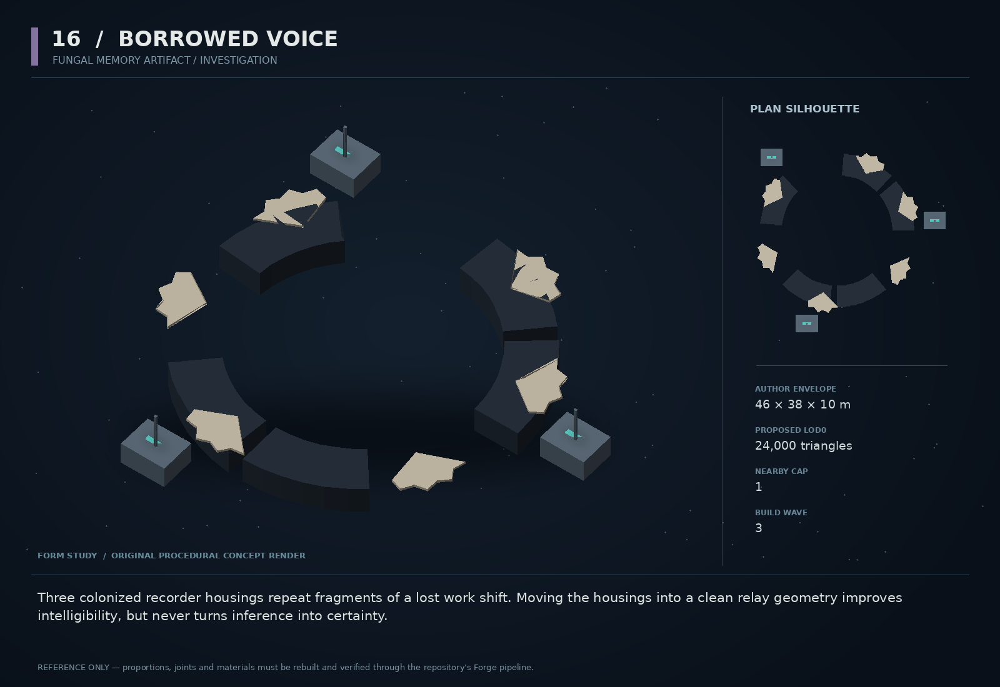

# 16 — Borrowed Voice

SF20-16 | Fungal memory artifact / investigation | Build wave 3 | DESIGN PROPOSAL

## Player-experience purpose

Three colonized recorder housings repeat fragments of a lost work shift. Moving the housings into a clean relay geometry improves intelligibility, but never turns inference into certainty.

**Gap / hypothesis:** Alien lore becomes stronger when evidence can be manipulated and its uncertainty stays visible. A physical signal-recovery encounter can reveal memory without replacing mystery with a talking exposition machine.

**Existing overlap to preserve:** Keep the Vethari → fungus → host/ecology → shared-memory chain. Understory remains the technical namespace. This is damaged retained signal, not proof the hive has a human personality, not a new species and not the off-frame creators appearing as an NPC.

Repository evidence: [R03](https://github.com/coldshalamov/SpaceFace/blob/1e0cf9499613b7c3acad10f34739278136d3d469/AGENTS.md), [R08](https://github.com/coldshalamov/SpaceFace/blob/1e0cf9499613b7c3acad10f34739278136d3d469/src/data/authoredPlaces.js#L1-L155), [R12](https://github.com/coldshalamov/SpaceFace/blob/1e0cf9499613b7c3acad10f34739278136d3d469/src/data/alienFauna.js#L1-L145), [R13](https://github.com/coldshalamov/SpaceFace/blob/1e0cf9499613b7c3acad10f34739278136d3d469/src/data/precursorMachines.js#L1-L125). See the inspection limits in `../production/SOURCES.md`.

## First encounter

After the existing second-stage ecology revelation, the player discovers a derelict with a corrupted maintenance phrase. A scanner shows three signal sources. Towing one clear of shielding debris exposes a date fragment; orienting another reveals a warning. The reconstructed record still has a missing segment clearly marked unknown.

## Where and when

At a verified existing Vethari-linked Charon site, not a new parasitic biome. Use the current revelation level as the gate; no readable story subtitles leak the secret before that gate.

## Repeat loop

Locate physical sources → reduce interference through towing/positioning → inspect recovered fragments → choose whether to quarantine, archive or leave the artifact. The interpretation remains a journal hypothesis tied to evidence ids.

## Visual and model recipe

A broken industrial recorder ring stitched by pale fungal fans. Three hard-edged memory boxes sit at unequal points around it, each with a distinct damaged antenna shape. Cyan device traces contrast with muted ivory growth; no giant glowing face.

Author envelope: 46 × 38 × 10 m, +X nose / +Y port / +Z up. Proposed gameplay semantic radius: 34 WU (0 means not an independently targeted world body); proposed mass: 0 internal units (0 means static/preview, not a massless dynamic body). These are design targets, not final measured asset bounds. Runtime scale must follow the actual Forge/entity contract.

LOD triangle targets: 24,000 / 9,600 / 4,300; proposed near draw budget 11; nearby concept cap 1. Numbers are budgets to verify, never permission to bypass spawnBudget.

### BROKEN_RING

Build: Five of eight ring segments, 18 m outer radius and 13 m inner radius, with exposed dark cable raceway.

Pivot / parent: Site root.

Collision: Five convex static segments.

### RECORDER_A/B/C

Build: Three distinct 4×3×2 m boxes: one dish antenna, one fork antenna, one missing mast. Large physical handles.

Pivot / parent: Independent roots at unequal ring positions.

Collision: Mass 8 each; box colliders.

### FUNGAL_FANS

Build: Six broad scalloped plates anchored to damaged metal, 2–5 m wide, with modeled connection necks.

Pivot / parent: Child of host segment; never float.

Collision: Use existing ecology collision policy; usually none.

### RELAY_ORGAN

Build: One folded fan surrounding a recorder socket, with a dark central seam.

Pivot / parent: No humanoid facial arrangement.

Collision: Existing scan anatomy only.

### SIGNAL_POINTS

Build: One small stable emissive notch per recorder; intensity shows real signal quality.

Pivot / parent: Fixed to each recorder.

Collision: None.

## Animation recipe

| Clip / phase | Initial duration | Action |
|---|---:|---|
| Dormant | 9 s | Very slight fan flex; signal notch holds low brightness. |
| Signal improves | 1.2 s | Physical indicator brightens proportionally to the real quality score; do not pulse words into existence randomly. |
| Memory fragment | 3 s | No speaker-mouth motion. A faint sequential illumination traverses the host wiring once. |
| Quarantine | 1.5 s | Existing containment state suppresses growth motion and signal presentation only after its confirmed transition. |

Critical read: Maintain the off-frame catastrophe. This is a small piece of a broken civilization’s residue, not the moment the game explains the entire universe.

## AI / behavior

No tactical AI. A deterministic evidence FSM tracks UNREADABLE, SOURCE_LOCATED, FRAGMENT_RECOVERED, INTERPRETED, DISPOSITION. Signal quality is an explicit function of receiver distance, observed occlusion and recorder orientation, sampled at 5 Hz. Each recovered fragment has a fixed evidence id and canonical text. Do not use runtime LLM generation or invent facts from a variable seed. Offer competing interpretations as authored hypotheses where evidence is incomplete.

## Physical truth

Three recorder bodies are genuine low-mass objects. Their signal orientation derives from sim rotation, not decorative fan pose. Occlusion checks operate against the existing spatial query representation, with a bounded ray count. Solving does not require matching a sub-degree angle: use broad acceptance bands with hysteresis, so a jittering physics object does not chatter between clear and unclear.

## Choices and counterplay

Recover enough to understand the immediate incident, pursue optional details, archive the artifact, quarantine it, or leave it in place. Disposition affects an actual later record or ecology state; it never awards omniscient truth.

## Failure and alternative outcomes

Destroying a source permanently marks that fragment missing, but alternative earlier logs can support a partial conclusion. The main story never requires a fragile object that can be lost forever without a fallback. Recovered text remains in the journal after the physical source is gone.

## Personality and sound

Fragmented maintenance radio from the fictional lost crew: dry, intimate, imperfectly stitched. No imitation of the player or a real person. Distortion sits around intelligible words, not on top of captions; unrecovered text remains literally unknown.

**fragment_a:** “—third shift. Receiver two is answering before we call—”

**fragment_b:** “—not a second crew. Same words. Wrong order—”

**fragment_c:** “—leave the recorder attached. We need to know what it remembers—”

**interpretation:** “Recovered record. Source continuity remains unconfirmed.”

**quarantine:** “Signal isolated. The missing segment is still missing.”

Dialogue defaults: once-only first reveal; persistent dedupe for milestone lines; repeat flavor no more than once per 90 sim seconds per character, and only when the shared voice arbiter grants the slot. Threat cues are governed by attack state, not that flavor cooldown. Stop stale lines when their target/phase disappears. Captions retain speaker and factual meaning.

## Rewards / economy boundary

One archive/recovery contract payout and evidence-based codex content. Do not price harvesting signal fragments as a renewable commodity.

## Save-state contract

recoveredFragmentIds<=3, disposition enum, recorderOutcomeIds[3], evidenceRevision. Hypothesis references evidence; never duplicate global revelation progress.

## Existing integration seams

- `src/data/alienEcology.js`
- `src/data/alienEcologyState.js`
- `src/systems/scanner.js`
- `src/systems/story.js`

These paths are starting points, not invented callable APIs. Read the live owners and current schemas before implementation. New concept helpers should emit to the owner rather than write its resource directly.

## Dependencies and packet sequence

SF20-15, SF20-18

Audit → behavior proof and model in parallel → presentation → normal-route integration → acceptance. Packet ids `SF20-16-A` through `-F` are in the task graph.

## Specific acceptance cases

1. Before revelation gate: no captions or journal titles spoil readable content.
2. Move recorder through the threshold repeatedly: one fragment and one reward.
3. Destroy one source: partial conclusion and journal remain valid.
4. Render-only animation changes: signal score is unchanged.
5. Reload after quarantine: no restored emission or new biology spawn.

## Player test

Players distinguish what the record demonstrates from what it merely suggests. Interview for causal clarity and sustained curiosity, not perfect lore recall.

## Completion boundary

Require all shared gates in `../production/TEST_PLAN.md`, the specific cases above, a normal-route encounter capture, top/chase/close model review, save/load evidence and matched performance measurements. This packet is not implemented or playtested merely because its plan and art exist. The art GLB is a non-shipping blockout; build the real asset through `../production/ASSET_PIPELINE.md`.
