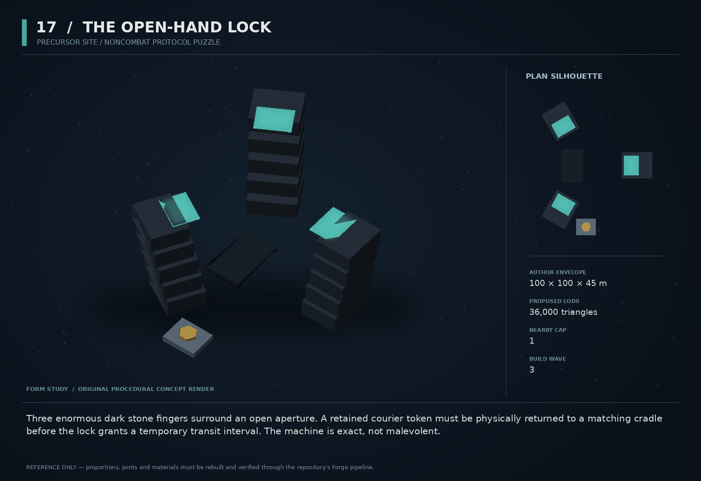

# 17 — The Open-Hand Lock

SF20-17 | Precursor site / noncombat protocol puzzle | Build wave 3 | DESIGN PROPOSAL

## Player-experience purpose

Three enormous dark stone fingers surround an open aperture. A retained courier token must be physically returned to a matching cradle before the lock grants a temporary transit interval. The machine is exact, not malevolent.

**Gap / hypothesis:** Precursor machines already have strong protocol identity. A physical negotiation with one local institution can let players learn those rules through action instead of reading an exposition panel.

**Existing overlap to preserve:** Use existing auditor, courier and conservator roles, and protocol states—not faction reputation. No mystical riddle machine, no new precursor race, no revelation of the creators.

Repository evidence: [R03](https://github.com/coldshalamov/SpaceFace/blob/1e0cf9499613b7c3acad10f34739278136d3d469/AGENTS.md), [R08](https://github.com/coldshalamov/SpaceFace/blob/1e0cf9499613b7c3acad10f34739278136d3d469/src/data/authoredPlaces.js#L1-L155), [R13](https://github.com/coldshalamov/SpaceFace/blob/1e0cf9499613b7c3acad10f34739278136d3d469/src/data/precursorMachines.js#L1-L125). See the inspection limits in `../production/SOURCES.md`.

## First encounter

A player encounters an existing courier frame carrying a damaged token. At the nearby lock, the auditor issues a plain instruction: present the token in the visible cradle. The token can be returned, inspected at the cost of delaying transit, or left alone while the player takes the outside route.

## Where and when

Attach to a surveyed Verge machine site that already supports auditor/courier presence. Final sector/anchor id must be resolved from precursorMachines at implementation; this packet intentionally does not invent a canonical site id. An outer bypass must exist.

## Repeat loop

Read directive → inspect physical affordance → move the token into the correct receiver → see protocol state change → use or ignore the opened route. Later visits can reflect the token’s disposition without a new reputation meter.

## Visual and model recipe

Three tall but broad radial fingers, each built from dark stacked prismatic slabs, with a central empty passage. One clean cyan seam per finger. A small asymmetrical receiving cradle makes the action legible from above.

Author envelope: 100 × 100 × 45 m, +X nose / +Y port / +Z up. Proposed gameplay semantic radius: 80 WU (0 means not an independently targeted world body); proposed mass: 0 internal units (0 means static/preview, not a massless dynamic body). These are design targets, not final measured asset bounds. Runtime scale must follow the actual Forge/entity contract.

LOD triangle targets: 36,000 / 14,400 / 6,500; proposed near draw budget 10; nearby concept cap 1. Numbers are budgets to verify, never permission to bypass spawnBudget.

### FINGER_A/B/C

Build: Three 35 m stacked prisms around a radius-28 m circle, each leaning outward by 12 degrees; large bevels, no runic wallpaper.

Pivot / parent: Fixed root; +Z author-up.

Collision: Three compound static proxies with a true open middle.

### CRADLE

Build: A 10×8 m wedge platform outside the aperture with one unmistakable shaped recess.

Pivot / parent: Site-local asymmetric X/Y offset.

Collision: Sensor volume plus simple solid lip.

### TOKEN

Build: 4×3×1 m hexagonal prism with one clipped corner matching the cradle.

Pivot / parent: Independent courier cargo root.

Collision: Mass 6, one convex prism.

### IRIS_LEAVES

Build: Three broad plates retract radially 12 m.

Pivot / parent: One linear pivot per finger.

Collision: Kinematic colliders only during a tested physical gate operation.

### PROTOCOL_SEAMS

Build: Three short cyan inset bands that change state together without flashing.

Pivot / parent: Finger surfaces.

Collision: None.

## Animation recipe

| Clip / phase | Initial duration | Action |
|---|---:|---|
| Interrogate | 1.5 s | A narrow light line traverses each finger toward the cradle; pair with exact directive text. |
| Accept | 2 s | Token seats only after validated position/orientation, then iris retracts. |
| Transit open | 8 s | Steady seam light, no rotation that hides the aperture. |
| Close pending | 2 s | Mechanism signals closure but waits until swept passage is clear; no crush trap. |

Critical read: One institution, one procedure. The monumental silhouette carries age; arbitrary glowing runes do not.

## AI / behavior

Existing machine protocol adapters own standing and directives. Site states: IDLE, REQUEST_TOKEN, VERIFY, OPEN, CLOSE_PENDING, REJECT. Verify token identity, actual cradle occupancy, and permitted protocol state; do not accept an arbitrary item with similar geometry. The auditor does not chase or retaliate merely because the player declines. If revocation triggers existing enforcement, show the documented consequence before a player choice that can cause it.

## Physical truth

The token must be moved with current cargo/tether verbs. Broad angular tolerance, proposed ±25 degrees, and relative speed under 6 WU/s make the cradle deliberate but not finicky. Gate motion is a kinematic physics action with swept clearance and a fail-open state while occupied. The gate cannot set a moving ship’s position or crush an entity because a UI timer expired.

## Choices and counterplay

Return the token, inspect it first, retain it and forgo the shortcut, or take the outside route. The interesting choice is between access and custody, not a disguised binary good/evil score.

## Failure and alternative outcomes

Damaged or missing token produces an explicit denial and preserves the bypass. A gate interrupted during closing remains physically safe and visibly unavailable until reconciled. Protocol state survives save/load independently of whether the giant model is streamed in.

## Personality and sound

Procedural, exact, almost ordinary. Short phrases with no theatrical omniscience or mystical riddles. Mechanical audio is sparse sub-bass with a dry upper click; captions repeat the exact directive.

**request:** “RETURN TRANSIT TOKEN TO EXTERNAL CRADLE.”

**wrong_object:** “OBJECT IDENTITY DOES NOT SATISFY REQUEST.”

**accept:** “CUSTODY ACCEPTED. TRANSIT INTERVAL OPEN.”

**occupied:** “CLOSURE DEFERRED. PASSAGE OCCUPIED.”

**retain:** “CUSTODY UNRESOLVED. OUTER ROUTE AVAILABLE.”

Dialogue defaults: once-only first reveal; persistent dedupe for milestone lines; repeat flavor no more than once per 90 sim seconds per character, and only when the shared voice arbiter grants the slot. Threat cues are governed by attack state, not that flavor cooldown. Stop stale lines when their target/phase disappears. Captions retain speaker and factual meaning.

## Rewards / economy boundary

Access and optional evidence, with only an existing survey contract payout. Do not make returned tokens a renewable cash faucet.

## Save-state contract

siteProtocolReference, tokenId, tokenCustodyOutcome, gatePhase, remainingOpenTicks. Never store machine standing in ordinary faction reputation.

## Existing integration seams

- `src/data/precursorMachines.js`
- `src/data/authoredPlaces.js`
- `src/data/contactHail.js`
- `src/systems/scanner.js`

These paths are starting points, not invented callable APIs. Read the live owners and current schemas before implementation. New concept helpers should emit to the owner rather than write its resource directly.

## Dependencies and packet sequence

SF20-13, SF20-16

Audit → behavior proof and model in parallel → presentation → normal-route integration → acceptance. Packet ids `SF20-17-A` through `-F` are in the task graph.

## Specific acceptance cases

1. Present wrong token-shaped object: no access.
2. Occupy gate at closure: collider waits safely.
3. Retain token: outside route and main story remain valid.
4. Load mid-open: same protocol and safe gate state return.
5. Before the applicable revelation: machine behavior stays within current canon gates.

## Player test

A player can state the rule, carry it out, and explain the consequence without interpreting lore metaphors. The machine should feel strange because it is consistent.

## Completion boundary

Require all shared gates in `../production/TEST_PLAN.md`, the specific cases above, a normal-route encounter capture, top/chase/close model review, save/load evidence and matched performance measurements. This packet is not implemented or playtested merely because its plan and art exist. The art GLB is a non-shipping blockout; build the real asset through `../production/ASSET_PIPELINE.md`.
