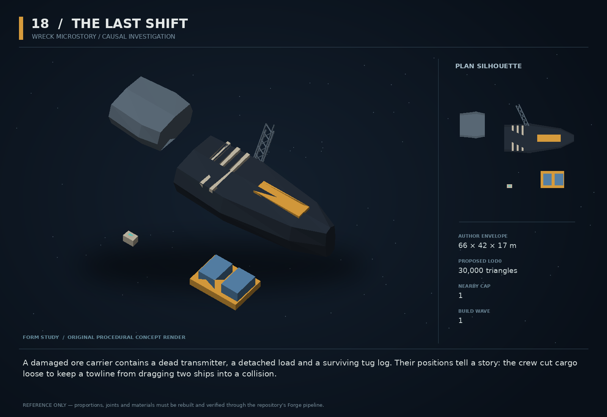

# 18 — The Last Shift

SF20-18 | Wreck microstory / causal investigation | Build wave 1 | DESIGN PROPOSAL

## Player-experience purpose

A damaged ore carrier contains a dead transmitter, a detached load and a surviving tug log. Their positions tell a story: the crew cut cargo loose to keep a towline from dragging two ships into a collision.

**Gap / hypothesis:** A wreck should be more than a loot piñata. A small recoverable chain of physical evidence can teach provenance, restraint and partial success while making the world feel inhabited.

**Existing overlap to preserve:** Reuse aftermathWrecks, uniqueWrecks, salvage and the chronicler/provenance ledger. This is authored evidence for those owners, not a new universal story engine or omniscient replay system.

Repository evidence: [R02](https://github.com/coldshalamov/SpaceFace/blob/1e0cf9499613b7c3acad10f34739278136d3d469/design/VISION.md), [R03](https://github.com/coldshalamov/SpaceFace/blob/1e0cf9499613b7c3acad10f34739278136d3d469/AGENTS.md), [R07](https://github.com/coldshalamov/SpaceFace/blob/1e0cf9499613b7c3acad10f34739278136d3d469/src/core/registry.js#L1-L170), [R09](https://github.com/coldshalamov/SpaceFace/blob/1e0cf9499613b7c3acad10f34739278136d3d469/src/data/contactHail.js#L1-L110). See the inspection limits in `../production/SOURCES.md`.

## First encounter

The player enters a small wreck field where a long towline fairlead is visibly torn sideways. A cargo pallet sits beyond the impact scar, not conveniently inside the wreck. Recovering three objects in any order reveals a risky rescue attempt rather than the pirate attack assumed by the first rumor.

## Where and when

One authored Ceres wreck pocket along a normal mining route. First clue is visible on ordinary approach; no pixel hunting. Use an existing survey/salvage contract to introduce it, with a large marked search volume and broad scanner detection.

## Repeat loop

Observe damage → select and recover evidence → revise an initial hypothesis → decide what to salvage and what to return → see a later local report cite only recovered facts. The order of discovery changes the reveal, not the underlying truth.

## Visual and model recipe

A split industrial carrier with a missing stern drive and a dramatically bent lateral tow fairlead. A detached orange cargo rack and a small black recorder form two distinct nearby points. Composition is readable as a three-object problem.

Author envelope: 66 × 42 × 17 m, +X nose / +Y port / +Z up. Proposed gameplay semantic radius: 50 WU (0 means not an independently targeted world body); proposed mass: 0 internal units (0 means static/preview, not a massless dynamic body). These are design targets, not final measured asset bounds. Runtime scale must follow the actual Forge/entity contract.

LOD triangle targets: 30,000 / 12,000 / 5,400; proposed near draw budget 11; nearby concept cap 1. Numbers are budgets to verify, never permission to bypass spawnBudget.

### WRECK_FORE

Build: Half of a 58 m work-carrier loft; jagged break modeled as 6 broad layered plates, not noise.

Pivot / parent: Site-root forward half.

Collision: Three static convex pieces.

### WRECK_AFT

Build: Separate 15 m stern section offset and rotated 23 degrees; engine bells clearly torn away.

Pivot / parent: Own stable site transform.

Collision: Two static convex pieces.

### FAIRLEAD

Build: 9 m truss bent 35 degrees toward the impact side, with a large empty roller throat.

Pivot / parent: Attached to forebody.

Collision: Two simple beam proxies.

### CARGO_RACK

Build: 12×8 m orange frame holding two legitimate commodity pallets.

Pivot / parent: Dynamic root outside wreck bounds.

Collision: Compound frame plus cargo bodies only if the existing cargo owner supports them.

### RECORDER

Build: 3 m rectangular box with severed antenna and one low-power lamp.

Pivot / parent: Independent root 30–50 WU from wreck.

Collision: Mass 5, one box.

## Animation recipe

| Clip / phase | Initial duration | Action |
|---|---:|---|
| Quiet wreck | 14 s | One intermittent non-flashing vent and slow cosmetic cable relaxation. No unnecessary rotation of a static collider. |
| Clue scan | 1.2 s | Local highlight follows the selected object boundary and points to a specific damage feature. |
| Recovered | 0.5 s | Accepted object transfer removes that body/mesh once. |
| Evidence reconstruction | 4 s | Optional abstract path overlay made only from recovered timestamps, clearly labeled reconstruction; never a photoreal omniscient cutscene. |

Critical read: No long cutscene. Three physical objects, one wrong first impression, one meaningful correction.

## AI / behavior

Evidence controller has three independent clue flags and an interpretation state. Each clue unlocks a fixed fact and one explicitly provisional hypothesis. Journal summaries are deterministic templates. The initial rumor is attributed and corrected when contradictory evidence arrives. Chronicle publication is triggered only by an explicit archive/report action and references the delivered evidence ids.

## Physical truth

The large wreck is static; small recoverable objects are dynamic. Clue locations are authored to support the story but not require precision jumping. A held/towed recorder can still be scanned. Do not rerun the historical accident with unstable physics and pretend the result is evidence; a reconstruction visualizes recorded positions only.

## Choices and counterplay

Return personal/log records, salvage unclaimed hardware, publish a partial report, investigate all clues, or leave. Recovering valuable cargo and preserving evidence can conflict locally, but one mistake never destroys every path to understanding.

## Failure and alternative outcomes

A destroyed clue remains destroyed and its journal fact remains unknown. A previously read clue remains known. The report can truthfully say insufficient evidence; no hidden marker supplies the missing answer. No penalty simply for failing to solve the mystery.

## Personality and sound

Recorded crew dialogue, short and practical, with life implied by work rather than a long final speech. The survivor is not present to explain the whole plot. Keep silence around important discoveries.

**rumor:** “Yard report: probable pirate strike. No witnesses interviewed.”

**record_a:** “We have the tug on the line. Do not burn yet.”

**record_b:** “Cut the load. Keep the ship. I said keep the ship.”

**evidence:** “The damage pattern supports a lateral tow failure, not incoming fire.”

**partial_report:** “Two records recovered. Final sequence remains incomplete.”

Dialogue defaults: once-only first reveal; persistent dedupe for milestone lines; repeat flavor no more than once per 90 sim seconds per character, and only when the shared voice arbiter grants the slot. Threat cues are governed by attack state, not that flavor cooldown. Stop stale lines when their target/phase disappears. Captions retain speaker and factual meaning.

## Rewards / economy boundary

One salvage/survey budget split between actual cargo and returned evidence. Do not triple-pay the same object as salvage, recovery and story completion.

## Save-state contract

siteId, recoveredClueIds<=3, destroyedClueIds<=3, publishedEvidenceRevision, cargoOutcomeIds. Chronicle output cites this state rather than minting new facts.

## Existing integration seams

- `src/systems/aftermathWrecks.js`
- `src/systems/uniqueWrecks.js`
- `src/systems/salvage.js`
- `src/systems/provenanceLedger.js`

These paths are starting points, not invented callable APIs. Read the live owners and current schemas before implementation. New concept helpers should emit to the owner rather than write its resource directly.

## Dependencies and packet sequence

SF20-03

Audit → behavior proof and model in parallel → presentation → normal-route integration → acceptance. Packet ids `SF20-18-A` through `-F` are in the task graph.

## Specific acceptance cases

1. Recover clues in all six orders: final evidence set agrees.
2. Destroy each clue separately: partial report remains truthful and accessible.
3. Publish twice: only one archive receipt per evidence revision.
4. Scan a towed recorder: no identity loss or duplicate object.
5. Turn off reconstruction: all essential information remains in accessible journal text.

## Player test

Before and after the second clue, ask players what they think happened and why. A changed, evidence-grounded interpretation is the success signal.

## Completion boundary

Require all shared gates in `../production/TEST_PLAN.md`, the specific cases above, a normal-route encounter capture, top/chase/close model review, save/load evidence and matched performance measurements. This packet is not implemented or playtested merely because its plan and art exist. The art GLB is a non-shipping blockout; build the real asset through `../production/ASSET_PIPELINE.md`.
