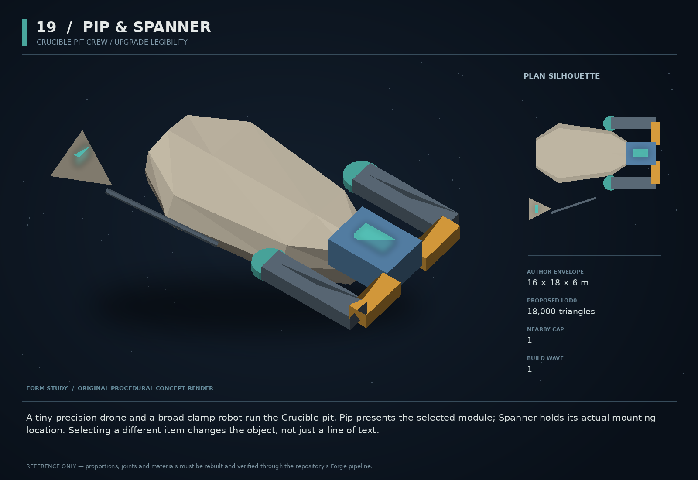

# 19 — Pip & Spanner

SF20-19 | Crucible pit crew / upgrade legibility | Build wave 1 | DESIGN PROPOSAL

## Player-experience purpose

A tiny precision drone and a broad clamp robot run the Crucible pit. Pip presents the selected module; Spanner holds its actual mounting location. Selecting a different item changes the object, not just a line of text.

**Gap / hypothesis:** The user reports that pre-run purchases and milestone upgrades are difficult to read. Two object-handling crew machines can make the chosen item and its consequence visible without replacing the existing run economy.

**Existing overlap to preserve:** Compose the existing ORRERY UI, survivalDraft, swarmSupply and runSession. No second inventory, no campaign leakage, no independent frontend redesign. Crew choreography decorates a truthful transaction; it never decides the result.

Repository evidence: [R02](https://github.com/coldshalamov/SpaceFace/blob/1e0cf9499613b7c3acad10f34739278136d3d469/design/VISION.md), [R03](https://github.com/coldshalamov/SpaceFace/blob/1e0cf9499613b7c3acad10f34739278136d3d469/AGENTS.md), [R07](https://github.com/coldshalamov/SpaceFace/blob/1e0cf9499613b7c3acad10f34739278136d3d469/src/core/registry.js#L1-L170). See the inspection limits in `../production/SOURCES.md`.

## First encounter

Before the first run, the player sees their actual ship silhouette and three distinct equipment objects. Focusing an option brings its model or authored SVG into one readable inspection position. Pip traces the benefit; Spanner points to the cost or replacement. Confirming makes the real run loadout change first, then the crew installs it.

## Where and when

Pre-run loadout and safe milestone intermission only. No new gameplay planet or station. Keep campaign and Crucible assets/state separate; use a small isolated preview scene or the established shipworks presentation seam.

## Repeat loop

Focus one option → see item and affected mount → read benefit/cost and current resources → confirm/cancel → see truthful receipt → launch. Between waves, the same grammar applies to repairs and upgrades. No mandatory animation before each run.

## Visual and model recipe

Pip is a small tetrahedral optic with one tiny stabilizer fan. Spanner is a wide two-claw service sled with a rectangular central worklight. Cream/dark machinery with one shared teal band; not humanoid mechanics or cartoon faces.

Author envelope: 16 × 18 × 6 m, +X nose / +Y port / +Z up. Proposed gameplay semantic radius: 0 WU (0 means not an independently targeted world body); proposed mass: 0 internal units (0 means static/preview, not a massless dynamic body). These are design targets, not final measured asset bounds. Runtime scale must follow the actual Forge/entity contract.

LOD triangle targets: 18,000 / 7,200 / 3,200; proposed near draw budget 10; nearby concept cap 1. Numbers are budgets to verify, never permission to bypass spawnBudget.

### SPANNER_ROOT

Build: Low 14×8×3 m loft with two 6 m forward jaws and an open center.

Pivot / parent: Preview scene root.

Collision: None: preview-only asset.

### CLAW_L/R

Build: Thick 6×1.5 m articulated plates on visibly supported Z hinges.

Pivot / parent: Root-local X=2,Y=±4.

Collision: None.

### PIP_ROOT

Build: A 3 m beveled tetrahedral body with one square optic and short supported fan.

Pivot / parent: Independent preview root.

Collision: None.

### PIP_POINTER

Build: A thin solid articulated pointer arm, 2 m long; no long screen-space laser crossing text.

Pivot / parent: Local Z hinge.

Collision: None.

### ITEM_CRADLE

Build: Two small padded brackets framing the actual selected module or an explicitly labeled schematic.

Pivot / parent: Preview focus anchor.

Collision: None.

## Animation recipe

| Clip / phase | Initial duration | Action |
|---|---:|---|
| Focus | 0.22 s | Pip glides at most 30 screen pixels and item settles; selection state updates immediately. |
| Compare | 0.3 s | Spanner indicates the affected socket; old/new item are clearly labeled, never indistinguishable overlapping ghosts. |
| Confirm | 0.65 s | After accepted purchase receipt, jaws close and the item seats. Skip/reduced-motion resolves instantly. |
| Denied | 0.15 s | Keep item uninstalled; show exact missing funds, incompatibility or run-state reason at the action. |
| Repair | 0.6 s | A localized worklight traces the repaired hull section only after health change is accepted. |

Critical read: This is the first recommended concept to build. It attacks a reported high-frequency UX weakness while adding a memorable pair at modest world-simulation cost.

## AI / behavior

UI service controller: BROWSE, FOCUSED, QUOTED, PENDING, COMMITTED, DENIED. Read run-owned inventory/resources. Each purchase intent includes runId, offerId and expected offer revision; the existing owner validates and returns a receipt. While PENDING, disable repeat submission without blocking Back. Characters react to receipts, not button clicks. Do not call tacticalAI or create 60-Hz world entities for interface props.

## Physical truth

No physics is needed for the crew. The ship and module preview are read-only. If an effect demo is shown, it uses an isolated deterministic preview state and a clear “demonstration” label, with no route into campaign credits, kills or damage. Do not mount new high-resolution textures on every option card.

## Choices and counterplay

Repair, buy a module, retain the current build, compare, or launch. Every option states the actual cost and affected capability. Choosing nothing must look intentional, not like a missing selection.

## Failure and alternative outcomes

Double click, controller repeat, networkless asset loading failure and closing the screen during pending work must not double-charge or leave half-installed UI. Missing 3D model falls back to an authored SVG silhouette with the same label and stats; not an empty square or an endless spinner.

## Personality and sound

Pip: short bright mechanical chirps with text labels. Spanner: one lower mechanical reply. They do not speak over the run announcer. Optional two-line radio banter appears only while idle, never on every focus change.

**first_visit:** “Pip: Pick the part. Spanner: We will show you what it changes.”

**tradeoff:** “More impulse. Less room for supplies.”

**repair:** “Hull restored. Resources deducted. Both are on the receipt.”

**no_purchase:** “Keeping the build. Ready when you are.”

**denied:** “Not enough run supplies. Nothing has been charged.”

Dialogue defaults: once-only first reveal; persistent dedupe for milestone lines; repeat flavor no more than once per 90 sim seconds per character, and only when the shared voice arbiter grants the slot. Threat cues are governed by attack state, not that flavor cooldown. Stop stale lines when their target/phase disappears. Captions retain speaker and factual meaning.

## Rewards / economy boundary

Only existing run supplies and offer costs. These machines never create campaign rewards, even when a visual repair animation resembles a station service.

## Save-state contract

Transient focusedOfferId and pendingIntentId only. Purchases, health, selected modes and supplies remain in existing run state. Persist no preview scene objects.

## Existing integration seams

- `src/systems/survivalDraft.js`
- `src/systems/swarmSupply.js`
- `src/systems/runSession.js`
- `src/ui/orrery/`

These paths are starting points, not invented callable APIs. Read the live owners and current schemas before implementation. New concept helpers should emit to the owner rather than write its resource directly.

## Dependencies and packet sequence

No other new concept required.

Audit → behavior proof and model in parallel → presentation → normal-route integration → acceptance. Packet ids `SF20-19-A` through `-F` are in the task graph.

## Specific acceptance cases

1. Double-confirm one offer: one debit and one item.
2. Close/reopen at every transaction state: displayed build equals authoritative run build.
3. Fail the GLB load: SVG and text allow full selection and launch.
4. Keyboard/gamepad-only walk reaches every option, compare, back and launch.
5. Finish or abort run: zero unintended change to campaign credits, inventory or kills.

## Player test

Give a player five seconds to identify the selected object, cost and changed ship capability. Then ask them to reverse the choice. Track errors and hesitation versus the original screen; no claimed UX improvement until compared.

## Completion boundary

Require all shared gates in `../production/TEST_PLAN.md`, the specific cases above, a normal-route encounter capture, top/chase/close model review, save/load evidence and matched performance measurements. This packet is not implemented or playtested merely because its plan and art exist. The art GLB is a non-shipping blockout; build the real asset through `../production/ASSET_PIPELINE.md`.
