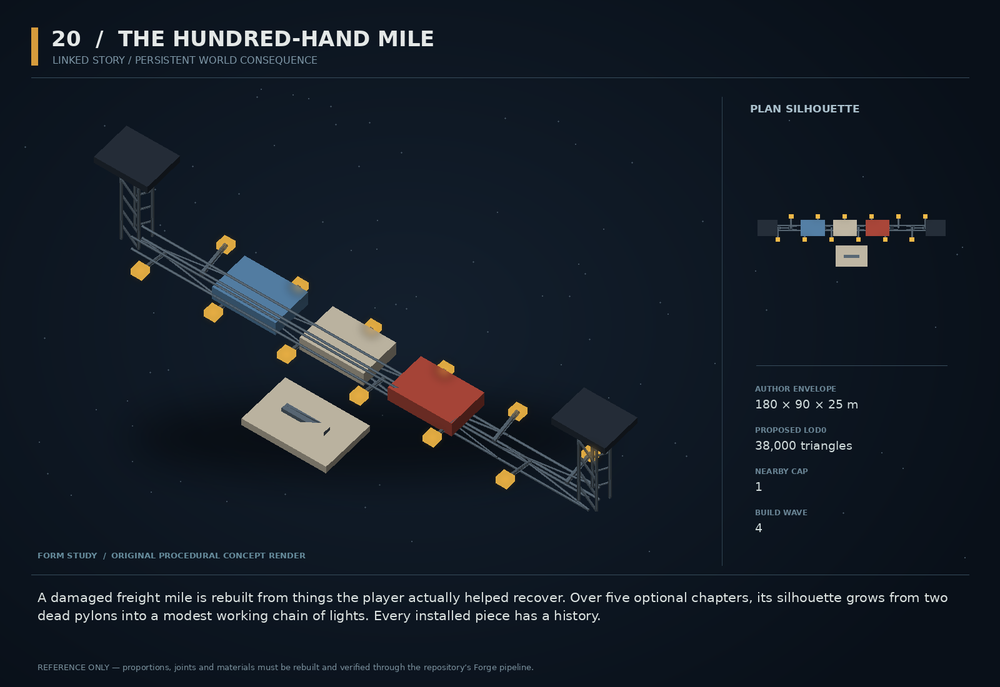

# 20 — The Hundred-Hand Mile

SF20-20 | Linked story / persistent world consequence | Build wave 4 | DESIGN PROPOSAL

## Player-experience purpose

A damaged freight mile is rebuilt from things the player actually helped recover. Over five optional chapters, its silhouette grows from two dead pylons into a modest working chain of lights. Every installed piece has a history.

**Gap / hypothesis:** Persistent numbers need visible consequences worth remembering. A small route-restoration story can connect earlier characters and physical actions into a place that genuinely changes.

**Existing overlap to preserve:** Compose existing mission/story/provenance/chronicler systems and concepts 3,4,6,11,18. This is not a second campaign spine or a universal procedural story generator. Keep the main story intact.

Repository evidence: [R02](https://github.com/coldshalamov/SpaceFace/blob/1e0cf9499613b7c3acad10f34739278136d3d469/design/VISION.md), [R03](https://github.com/coldshalamov/SpaceFace/blob/1e0cf9499613b7c3acad10f34739278136d3d469/AGENTS.md), [R07](https://github.com/coldshalamov/SpaceFace/blob/1e0cf9499613b7c3acad10f34739278136d3d469/src/core/registry.js#L1-L170), [R08](https://github.com/coldshalamov/SpaceFace/blob/1e0cf9499613b7c3acad10f34739278136d3d469/src/data/authoredPlaces.js#L1-L155), [R09](https://github.com/coldshalamov/SpaceFace/blob/1e0cf9499613b7c3acad10f34739278136d3d469/src/data/contactHail.js#L1-L110). See the inspection limits in `../production/SOURCES.md`.

## First encounter

After any two qualifying local interventions, the Towline Table asks for help restoring a bypass freight route. The first milestone needs one recovered power unit; the next needs an actual displaced guide; a later branch depends on whether Ilex’s seed vaults survived. A final convoy uses the route the player made possible.

## Where and when

An optional Tethys route segment with a preserved original bypass. Choose one canonical zone and stable route id after the atlas survey. Do not create a new global navigation layer or silently reroute every faction.

## Repeat loop

Chapter 1: survey the break. Chapter 2: recover one power unit. Chapter 3: clear or replace a guide. Chapter 4: deliver a real cargo contribution. Chapter 5: witness one working convoy. Each can end partially, leading to a smaller but functional result. The player’s role is one contributor, not the only person capable of acting.

## Visual and model recipe

Two dark freight pylons and a staggered chain of modular amber lamps. New sections use recognizable salvaged parts from earlier objects; a central small bridge has conspicuously mismatched but well-fitted panels. Not a triumphal statue of the player.

Author envelope: 180 × 90 × 25 m, +X nose / +Y port / +Z up. Proposed gameplay semantic radius: 125 WU (0 means not an independently targeted world body); proposed mass: 0 internal units (0 means static/preview, not a massless dynamic body). These are design targets, not final measured asset bounds. Runtime scale must follow the actual Forge/entity contract.

LOD triangle targets: 38,000 / 15,200 / 6,800; proposed near draw budget 14; nearby concept cap 1. Numbers are budgets to verify, never permission to bypass spawnBudget.

### PYLON_A/B

Build: Two 30 m work-tower trusses with broad feet and broken upper lamp mounts.

Pivot / parent: Fixed at route ends.

Collision: Compound static boxes with generous lane clearance.

### MODULE_SOCKET_01..05

Build: Five clearly supported receiver brackets along an offset service spine.

Pivot / parent: Fixed transforms and stable ids.

Collision: Sensors while empty; conservative installed proxies only after accepted construction.

### POWER_MODULE

Build: Reuse the actual recovered industrial generator shape, remastered through Forge if needed.

Pivot / parent: Socket 1.

Collision: One static proxy after cargo owner transfers it.

### GUIDE_MODULE

Build: Reused bent/straight freight guide from the switchyard family.

Pivot / parent: Socket 2; construction state determines variant.

Collision: One to two simple proxies.

### LAMP_CHAIN

Build: Up to 12 instanced solid lamps, each with visible support.

Pivot / parent: Deterministic route positions.

Collision: No collider on lamps.

### RECORD_PLAQUE

Build: Three large abstract tally marks and a service terminal. Names/history are accessible text in inspector, not tiny 3D lettering.

Pivot / parent: Near safe service platform.

Collision: None.

## Animation recipe

| Clip / phase | Initial duration | Action |
|---|---:|---|
| Unpowered | 0 s | No fake decorative motion; two lamps are visibly dead. |
| Install | 2 s | Module seats only after construction transfer, with a clear before/after state. |
| First current | 3 s | Lamps illuminate in actual connection order once; reduced-flash uses a steady fade. |
| Working mile | 10 s | Sparse service activity follows real jobs; no continuous celebration or confetti. |

Critical read: Build last. Its emotional value depends on the earlier encounters being enjoyable and its causal receipts being trustworthy, not on writing a longer finale.

## AI / behavior

Story graph consumes verified receipt ids and produces milestone intents through existing owners. It never checks “player has visited concept X” as a substitute for doing the work. Branches: FULL, PARTIAL, ABANDONED and RESTITUTION. A crew can complete a basic safe repair offscreen after an explicitly authored delay, but the ledger credits them, not the player. The final convoy is a real budgeted traffic job with a valid route.

## Physical truth

Contributions are real cargo transfers to construction sockets. During installation, remove the cargo body only after accepted ownership transfer, then enable the installed static proxy on a safe physics tick. Reject construction while a ship occupies the new geometry’s envelope. No spawning a solid wall through the player. Traffic may use the route only after its navigability proof succeeds.

## Choices and counterplay

Help with one chapter, pursue the full restoration, donate recovered goods, investigate why it failed, or leave. Partial contributions remain visible. Deliberate sabotage creates a repairable consequence, not an irreversible global softlock.

## Failure and alternative outcomes

Lost seed vaults change chapter 4 to a smaller dry-goods delivery; missing forensic evidence changes the public account to uncertain. Destroyed modules can be repaired via real resources, but no destroy/rebuild credit loop. One milestone receipt cannot unlock multiple free payments.

## Personality and sound

The final scene uses the established crew voices, not a new narrator. Gratitude is small and specific: a working route, a clear arrival, a lamp someone fixed. Keep the big emotional beat in the physical change.

**offer:** “Mara: We do not need a hero. We need a working power unit.”

**partial:** “Odo: Half a route is not a route. But it is a start we can use.”

**ilex_branch:** “Ilex: There is room for four vaults. Four will do.”

**first_convoy:** “Kit: Look at that. Ordinary traffic. Practically a miracle.”

**final:** “Mara: Your part is on the record. So is everyone else’s.”

Dialogue defaults: once-only first reveal; persistent dedupe for milestone lines; repeat flavor no more than once per 90 sim seconds per character, and only when the shared voice arbiter grants the slot. Threat cues are governed by attack state, not that flavor cooldown. Stop stale lines when their target/phase disappears. Captions retain speaker and factual meaning.

## Rewards / economy boundary

Five bounded contract slices within an explicitly reviewed total budget, plus a functioning optional route. Construction stock is deducted once; no passive royalty stream without an existing designed economy mechanism.

## Save-state contract

storyVersion, completedMilestoneIds<=5, contributionReceiptIds<=16, installedModuleIds, branch, finalConvoyOutcome. Existing cargo/economy/law owners keep material consequences.

## Existing integration seams

- `src/systems/missions.js`
- `src/systems/story.js`
- `src/systems/provenanceLedger.js`
- `src/data/authoredPlaces.js`

These paths are starting points, not invented callable APIs. Read the live owners and current schemas before implementation. New concept helpers should emit to the owner rather than write its resource directly.

## Dependencies and packet sequence

SF20-03, SF20-04, SF20-06, SF20-11, SF20-18

Audit → behavior proof and model in parallel → presentation → normal-route integration → acceptance. Packet ids `SF20-20-A` through `-F` are in the task graph.

## Specific acceptance cases

1. Complete milestones in permitted alternate orders: graph reaches coherent branch.
2. Lose Ilex cargo or a Last Shift clue: partial branch still completes.
3. Install while another ship occupies the volume: action waits or denies safely.
4. Replay all receipts after save/load: no duplicate modules or payments.
5. Destroy and rebuild: costs/rewards conserve the intended resource budget.

## Player test

At the final visit, players can point to at least one physical change and connect it to an actual prior action. The story fails if it is remembered only as a completed checklist.

## Completion boundary

Require all shared gates in `../production/TEST_PLAN.md`, the specific cases above, a normal-route encounter capture, top/chase/close model review, save/load evidence and matched performance measurements. This packet is not implemented or playtested merely because its plan and art exist. The art GLB is a non-shipping blockout; build the real asset through `../production/ASSET_PIPELINE.md`.
