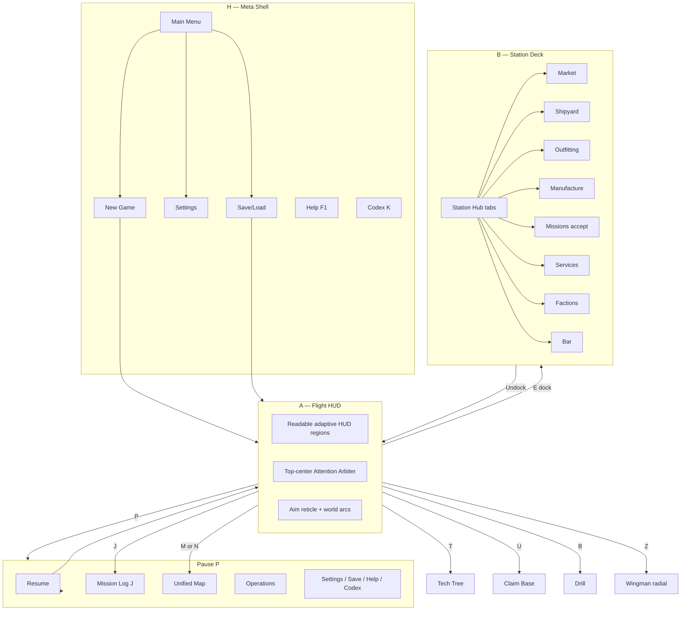

# Frontend Reboot Audit

**Date:** 2026-07-08  
**Type:** Audit only — no gameplay or CSS implementation in this pass.  
**Authority read:** `design/spec2/00_MASTER_TASTE.md`, `design/spec2/06_UI_IDENTITY.md`, `design/spec3/SPEC3-F8-graphics-visuals.md`, `design/spec3/SPEC3-F10-ux-meta-tastemaster.md`, `docs/MODULE_MAP.md` (UI + Render), live `src/ui/*` + `styles/ui.css`.

**Checks run (2026-07-08):**
| Check | Result |
|---|---|
| `npm run check:ui-a11y` | **PASS** (5/5) |
| `npm run check:wcag-contrast` | **PASS** (panel-composited text OK; 11 raw-nebula pairs below threshold — world backgrounds, not panel chrome) |
| `npm run check:ui-identity` | **PASS** (12/12 static source contracts) |

> **Note:** `check:ui-identity` validates source-level reachability and behavior contracts. It does **not** prove runtime hierarchy, overlap, responsive composition, or cognitive load for surfaces such as `commandBar.js` and `comms.js`; those evidence gaps are documented below.

---

## 1. Current Surface Inventory

Each row: **Surface** → **Category** (A–H) → **Primary owner file(s)** → **Reachability**.

### A — Flight HUD (always mounted in `mode==='flight'`, hidden when modal/docked)

| Surface | Owner | Notes |
|---|---|---|
| Ship schematic + micro-bars (hull/shield/energy/heat/fuel) | `src/ui/hud.js`, CSS in `src/ui/uiRoot.js` (`injectHudCss`) | Bottom-left anchor |
| Status cluster (SPD / WPN / TETHER + contextual chips) | `src/ui/hud.js` | Bottom-center anchor |
| Overview strip (contacts list) | `src/ui/hud.js` | Bottom-right, above radar |
| Radar | `src/ui/radar.js` | Bottom-right |
| Target panel + in-world target arcs | `src/ui/targetPanel.js`, arcs in `hud.js` | Bottom-right |
| Action bar (key→ability glyphs) | `src/ui/hud.js` | Bottom-center |
| Lead pip / weak-point reveal overlays | `hud.js` | World-anchored |
| Aim reticle | `uiRoot.js` (`#aim-reticle`) | Follows pointer |
| Control hints bar | `uiRoot.js` (`#control-hints`), copy from `controlPrompts.js` | Bottom, fades |
| **Command bar** (hull/shield/energy/heat/cargo/credits/role/sector) | `src/ui/commandBar.js` | Top-center; duplicates several permanent facts |
| Alert pills (up to 3) | `src/ui/alerts.js` → `#alerts` | Top-center; competes with other transient voice |
| Comms live feed + backlog button | `src/ui/comms.js` | Left edge + top-left button; additional attention region |
| Mission tracker | `hud.js` (`.sf-mission-tracker`) | Top-left; duplicates objective surfaces |
| Objective line + off-screen arrow | `hud.js` (`.sf-objectives`) | Top-right; duplicates mission tracker copy |
| Story HUD meta (STABLE LOAD, tag flicker, SYS readout, manifest ghost) | `src/ui/hudMeta.js` | Scattered in `#hud` |
| Toasts | `src/ui/toasts.js` → `#toasts` | Bottom-right stack |
| Floating combat text (damage, loot) | `src/ui/floatingText.js` | World-space |
| Damage direction indicators | `src/ui/damageIndicators.js` | Edge-clamped |
| Market news ticker DOM | `src/ui/marketNews.js` (`#sf-news-ticker`) | Mounts to `#hud` or `body` |
| Wingman command radial | `src/ui/wingmanRadial.js` | Center on `Z` |
| Death banner / flash | `hud.js` | Full-screen transient |
| Global confirm dialog | `src/ui/confirm.js` | Overlay |
| Dock-deny banner state | `src/ui/dockDenyBanner.js` (registry system) | Voice + `state.ui.dockDeny` |
| Sector arrival postcard | `src/ui/sectorPostcard.js` (registry) | Jump-in card |
| Customs scan prompt | `src/ui/customsPrompt.js` (registry) | Modal-ish overlay |
| Cargo conscience glyph | `src/ui/cargoConscience.js` (registry) | HUD glyph |
| Cause ledger tooltip | `src/ui/causeLedger.js` (registry) | Hover over economy tags |
| Security readout line | `src/ui/securityReadout.js` (registry) | Map/overview line |
| Danger gradient (map nodes) | `src/ui/dangerGradient.js` (registry) | **Still wired to `starmap.js`** |

### B — Station command deck (`screen id: 'station'`)

| Surface | Owner | Notes |
|---|---|---|
| Station hub shell (8-tab left rail + content pane) | `src/ui/screens/stationHub.js` | Dock opens via `uiRoot` / `input.js` |
| Market tab | `src/ui/screens/market.js` | Panel factory |
| Shipyard tab | `src/ui/screens/shipyard.js` | Panel + 3D preview |
| Outfitting tab | `src/ui/screens/outfitting.js` | Panel, stat preview only |
| Manufacture tab | `src/ui/screens/manufacture.js` | Panel |
| Missions tab (inline board) | `stationHub.js` | Duplicates mission log slice |
| Services tab | `src/ui/screens/services.js` | Refuel/repair/ammo |
| Factions tab | `src/ui/screens/factions.js` | Standing + aggro thresholds |
| Bar tab | `src/ui/screens/bar.js` | Rumors, contacts, dialogue |

### C — Galaxy / local / system map

| Surface | Owner | Notes |
|---|---|---|
| **Galaxy map** (unified LOCAL→SYSTEM→GALAXY zoom) | `src/ui/galaxyMap.js` | **Primary:** `N` and `M` keys both open this (`input.js`) |
| Star map (legacy inter-sector graph) | `src/ui/screens/starmap.js` | Still registered; gamepad `View` opens **starmap**, not galaxy |
| Local map (legacy near-field) | `src/ui/screens/localmap.js` | Still registered; pause/missionLog link here |
| Local space map model | `src/ui/navigation/localSpaceMapModel.js` | Shared data helper |
| Price-memory overlay | `starmap.js` | Not yet on galaxy map |
| Danger tier tint | `dangerGradient.js` → `starmap.js` | Not on galaxy map |

### D — Inventory / cargo / ledger

| Surface | Owner | Notes |
|---|---|---|
| Cargo used/cap (pinned) | `commandBar.js` | Always visible in flight |
| Cargo contextual chip | `hud.js` | Fades after events |
| Credits + delta | `commandBar.js` | Always visible |
| Credits contextual chip | `hud.js` | Fades |
| Station hub cargo summary | `stationHub.js` | Dock header |
| Outfitting module inventory | `outfitting.js` | Owned fittings + buy list |
| Automation cargo/drone panels | `automationPanel.js` | Passive income ops |
| Cause ledger (“why price moved”) | `causeLedger.js` | Tooltip over driver tags |
| Cargo conscience moral glyph | `cargoConscience.js` | Hold reputation lean |

### E — Outfitting / shipyard / 3D asset showcase

| Surface | Owner | Notes |
|---|---|---|
| Shipyard 3D turntable + dock interior | `shipyard.js` + `src/ui/shipPreviewMount.js` | **Shipped** |
| New Game starter preview | `newGame.js` + `shipPreviewMount.js` | **Shipped** |
| Outfitting stat-delta preview | `outfitting.js` | Numbers only — **no mesh** |
| Tech tree | `src/ui/screens/techTree.js` | Research unlocks (`T`) |
| Manufacture crafting UI | `manufacture.js` | Station tab |

### F — Market intelligence

| Surface | Owner | Notes |
|---|---|---|
| Market panel (cards, filters, sparkline, forecast) | `market.js` | Station tab |
| Price history recorder | `src/ui/priceHistory.js` | Event-driven, no DOM |
| Sparkline renderer | `src/ui/sparkline.js` | Used by market |
| Price forecast system | `src/ui/priceForecast.js` (registry) | Data layer |
| Market news ticker + dock event cards | `marketNews.js` | Headlines via `voiceArbiter` |
| Bar “market conditions” dialogue | `bar.js` | Diegetic intel |
| Star map price-memory nodes | `starmap.js` | Legacy only |

### G — Missions / operations

| Surface | Owner | Notes |
|---|---|---|
| Mission log screen | `src/ui/screens/missionLog.js` | `J` / pause menu |
| Station missions board | `stationHub.js` | Accept/track at dock |
| HUD mission tracker | `hud.js` | Top-left persistent |
| HUD objective line | `hud.js` | Top-right persistent |
| Pause status lines | `pause.js` | Tracked/untracked contract copy |
| Mission preflight helpers | `src/ui/missionPreflight.js` | Chips/warnings |
| Automation / operations | `automationPanel.js` | Pause → Operations |
| Claim base management | `src/ui/screens/base.js` | `U` when eligible |
| Drill management UI | `src/ui/screens/drill.js` | `B` when eligible |

### H — Meta shell (menus, pause, settings, help)

| Surface | Owner | Notes |
|---|---|---|
| Cinematic intro splash | `uiRoot.js` | Session-first boot |
| Main menu | `mainMenu.js` | `mode==='menu'` |
| New game setup | `newGame.js` | Name + difficulty + preview |
| Pause menu | `pause.js` | `P` / Start |
| Settings | `settings.js` | Audio/Video/Gameplay/Controls/Access |
| Save / load | `saveLoad.js` | Slots + export |
| Help / controls | `help.js` | `F1` / `H` |
| Codex / signal archive | `codex.js` | `K` |
| Game over | `gameOver.js` | Death flow |
| Screen manager chrome | `screenManager.js`, `styles/ui.css` | Modal stack, `ui-modal-open` body class |
| Accessibility applier | `accessibility.js` | Root tokens, `SEMANTIC_PALETTE` |
| Binding registry | `bindings.js` | Live key labels for prompts |

### Render-adjacent (not DOM UI but player-visible staging)

| Surface | Owner | Role |
|---|---|---|
| Live flight scene + ships | `src/render/renderer.js`, `visualFactory.js`, `partsLibrary.js` | Primary 3D |
| VFX / feel / camera | `vfx.js`, `feel.js`, `camera.js` | Juice (sim-adjacent) |
| Ship preview mini-renderer | `shipPreviewMount.js` | Isolated WebGL for UI turntables |

---

## 2. File Ownership Map (by category)

```
A  Flight HUD     hud.js, radar.js, targetPanel.js, commandBar.js, alerts.js, comms.js,
                 toasts.js, floatingText.js, damageIndicators.js, hudMeta.js, marketNews.js,
                 wingmanRadial.js, weaponHeat.js, uiRoot.js (reticle, hints, injectHudCss)

B  Station deck   stationHub.js → market.js, shipyard.js, outfitting.js, manufacture.js,
                 services.js, factions.js, bar.js

C  Maps           galaxyMap.js (primary), starmap.js, localmap.js, navigation/localSpaceMapModel.js,
                 dangerGradient.js (starmap hook)

D  Cargo/ledger   commandBar.js, hud.js chips, stationHub.js header, outfitting.js inv,
                 causeLedger.js, cargoConscience.js, automationPanel.js

E  Fitting/3D    shipPreviewMount.js, shipyard.js, outfitting.js, newGame.js, techTree.js,
                 manufacture.js

F  Market intel   market.js, priceHistory.js, sparkline.js, priceForecast.js, marketNews.js,
                 bar.js, starmap.js price overlay

G  Missions/ops   missionLog.js, stationHub.js (missions tab), hud.js trackers, pause.js,
                 missionPreflight.js, automationPanel.js, base.js, drill.js

H  Meta shell     mainMenu.js, newGame.js, pause.js, settings.js, saveLoad.js, help.js,
                 codex.js, gameOver.js, screenManager.js, confirm.js, accessibility.js,
                 bindings.js, controlPrompts.js, input.js (UI router)
```

**Orchestration hub:** `src/ui/uiRoot.js` mounts HUD, registers all screens (`SCREEN_MODULES`), wires dock/mode events, injects global HUD CSS.

---

## 3. Composition Risks — Hierarchy / One-Voice / No-Idle-Work

### 3.1 Current three-region HUD baseline (`spec2/06` §1)

The shipped composition is organized around (a) bottom-left ship state, (b) bottom-center actions/status,
and (c) bottom-right radar/contacts. This is a useful baseline, not a universal three-anchor-only law.
Additional regions are valid when they improve information hierarchy, remain responsive and non-overlapping,
and survive player-route readability/accessibility review. Top-center should still avoid competing simultaneous
transient messages because the one-voice contract is behavioral, not a layout preference.

| Element | Zone | Verdict |
|---|---|---|
| Schematic + micro-bars | Bottom-left | Core ship-state surface; verify legibility and duplication |
| Status cluster + action bar | Bottom-center | Core action surface; dense at smaller viewports |
| Overview + radar + target panel | Bottom-right | Core tactical surface; verify roster/target overlap |
| `#alerts` pills | Top-center | Competes with one-voice channel |
| `#sf-command-bar` | Top-center | Duplicates permanent vitals/economy; justify or merge by evidence |
| Comms live feed | Left edge | Additional attention region; evaluate simultaneous copy |
| Comms backlog `≡` button | Top-left | Valid utility control if reachable and non-competing |
| Mission tracker | Top-left | Duplicates objective surfaces |
| Objectives + arrow | Top-right | Duplicates mission tracker; arrow itself is spatially useful |
| `#sf-news-ticker` | Top/bottom (mounts to `#hud`) | Risks competing with story/combat copy |
| `#control-hints` | Bottom (full width) | Ephemeral teaching surface; validate timing and obstruction in play |
| `#aim-reticle` | Cursor | Combat instrument; position is functionally owned |
| Toasts | Bottom-right | Can overlap the tactical surface; measure responsive behavior |
| `hudMeta` (STABLE LOAD, phase readout) | Various | Needs explicit story-tier priority and reachability rules |

**Evidence gap:** source checks do not establish runtime hierarchy, responsive overlap, or whether duplicate
facts improve comprehension. Use browser/Electron captures and interaction evidence before removing or relocating a surface.

### 3.2 One-voice (`00_MASTER_TASTE` §2 pillar 3, `SPEC3-F10` §40)

**Spec law:** `danger > tutorial > objective > comms > flavor` — one surface at a time.

| Speaker | Mechanism | Coexists with others? |
|---|---|---|
| `alerts.js` | Up to 3 DOM pills, independent | ❌ Yes — parallel with comms/toasts |
| `comms.js` | Up to 4 live lines + backlog | ❌ Yes |
| `toasts.js` | Up to 5 bottom-right | Partially queued via `voiceArbiter` |
| `voiceArbiter.js` | Queues **toast channel only** | ❌ Does not own alerts/comms DOM |
| `marketNews.js` | Ticker + voice `news` channel | ❌ Yes |
| HUD mission tracker + objective | Persistent text | ❌ Yes |
| `commandBar.js` | Persistent sector/role/credits | ❌ Always on |
| `control-hints` | Onboarding replacement | ❌ Yes during first minutes |
| `sectorPostcard.js` | Jump-in card | ❌ Yes with ticker/comms |
| `dockDenyBanner.js` | Voice `comms` | ⚠️ Debounced but stacks with alerts |

**Missing:** `src/ui/attentionArbiter.js` from `SPEC3-F10` — **not built**. `voiceArbiter` is a partial implementation (toast routing + bark rate limit), not the tiered top-center arbiter.

### 3.3 No animation at rest (`00_MASTER_TASTE` §3)

| Location | Rest animation | Verdict |
|---|---|---|
| `uiRoot.js` injectHudCss | Reticle pulse (autofire), schematic pulse (critical), bar pulse (low/ready/venting/fuel) | ❌ State-coded but runs at rest while condition holds |
| `radar.js` | Objective diamond spin/pulse, beacon pulse, scan `?` pulse | ❌ Decorative rest motion |
| `hudMeta.js` | `sf-stablepulse` on STABLE LOAD line | ❌ |
| `comms.js` | Backlog button `sf-commpulse` | ❌ |
| `settings.js` | Key-capture `sf-bind-pulse` | ⚠️ Active input only — acceptable |
| `styles/ui.css` | `sf-fadein` on screen open | ✅ State change (screen push) |
| Screen manager | 150 ms enter translate | ✅ State change |

**Allowed exceptions in constitution:** 4.2 Hz seam ember, ≤8% engine idle flicker — **not** general UI pulses.

### 3.4 Other taste violations

| Rule | Violation |
|---|---|
| No visor/cockpit motifs | `--visor-*` CSS tokens throughout `injectHudCss`; `wingmanRadial.js` comment references “cockpit” |
| Compositor effects | No universal blur/opaque-panel rule; profile any always-live full-frame effect and preserve the strongest legible result |
| Semantic color | Violet comms pulse differs from the current token baseline; accept by meaning, contrast, accessibility, and player-route coherence rather than an exact allowlist |
| No new modal for HUD-chip facts | Pause/missionLog duplicate objective text that HUD already shows |

---

## 4. Duplicate Facts (same truth, multiple surfaces)

| Fact | Surfaces | Severity |
|---|---|---|
| Hull / shield / energy | Schematic bars + command bar vitals | **High** — two always-on vitals strips |
| Cargo fill | Command bar + HUD chip + station header | **High** |
| Credits | Command bar + HUD chip + market footer | **Medium** |
| Sector identity | Command bar + map + station hub title | **Medium** |
| Ship role / class | Command bar + schematic label + target panel | **Medium** |
| Active mission / objective | HUD tracker (top-left) + HUD objective (top-right) + pause lines + mission log + station board | **High** |
| Contact threat / IFF | Overview strip + radar glyphs + target panel + damage triangle | **Medium** — intentional redundancy per spec, but dense |
| Map / route | `galaxyMap` + `starmap` + `localmap` + pause map buttons | **Critical** — three map UIs |
| Market price / trend | Market panel + starmap price memory + news ticker + bar dialogue | **High** |
| Faction standing | Factions tab + mission preflight chips + combat IFF | **Low** — different verbs |
| Economy “why” | Cause ledger tooltip + market intel panel + news headline | **Medium** |
| Dock prompt | Alert pill (`dock:range`) + control hints + station proximity UI | **Low** |

**Principle from `SPEC3-F10` §42:** *“Every system speaks once, through its surface.”* Current flight layer violates this for **vitals**, **economy**, **missions**, and **navigation**.

---

## 5. Visual Inconsistency Matrix

| Cluster | Chrome pattern | Issue |
|---|---|---|
| Flight HUD | `--visor-*` tokens, glow filters, schematic SVG | Legacy “visor” naming; glow-heavy |
| Command bar | Clip-path RTS console, `--console-*` tokens | **Different design dialect** from the primary flight HUD |
| Modal meta (`pause`, `settings`, `help`, `saveLoad`) | `.sf-menu` shared stylesheet | Coherent among themselves |
| Station hub | Bespoke left rail + wide content pane (`stationHub.js` inline CSS) | **Does not share** `.sf-menu` / `ui.css` screen tokens |
| Market panel | “Industrial control panel” grid + chart canvas | Third dialect (dense data UI) |
| Outfitting panel | Slot grid + stat table | Simpler than market; no visual parity with shipyard |
| Galaxy map | Canvas zoom surface (`galaxyMap.js`) | Fourth dialect |
| Legacy starmap / localmap | Separate canvas implementations | **Fifth/sixth dialects** — typography/legend differ from galaxy |
| Drill / base screens | Own injected styles | Ops screens feel detached from station hub |
| Cinematic splash | Full-bleed photo + mono title | Acceptable for H, but unlike all in-game UI |

**Net:** At least **four competing UI dialects** (visor HUD, RTS command bar, sf-menu modals, station industrial, map canvas).

---

## 6. Screens Needing 3D Asset Staging

| Screen / panel | 3D today | Reboot need |
|---|---|---|
| Shipyard tab | ✅ `shipPreviewMount` + dock interior GLB | Keep — hero staging |
| New Game | ✅ Starter turntable | Keep |
| Outfitting tab | ❌ Stat table only | **Add** hull turntable (fitted modules visible) — `BP-09`, `shipPreviewMount` |
| Station hub header | ❌ Static text | **Optional** — small dock bay thumbnail per archetype |
| Main menu | ❌ JPG cinematic only | **Optional** — looping hero ship (low priority) |
| Market / factions / bar | ❌ | Not needed |
| Mission log / automation | ❌ | Not needed (icons/glyphs suffice) |
| Galaxy map | ❌ 2D canvas | 2D correct — 3D belongs in flight layer |
| Tech tree | ❌ | Icon nodes sufficient |
| Drill / base | ❌ Procedural canvas | **Later** — module GLBs when claims art lands (`BP-06`) |

**Pipeline dependency:** `shipPreviewMount.js` imports Three.js in UI layer (allowed — UI may import render helpers; sim may not). Authored parts gate applies (`assetLoader` contract).

---

## 7. Remove / Merge / Demote Recommendations

### Remove (or retire after parity)

| Item | Rationale |
|---|---|
| `starmap.js` + `localmap.js` screens | `galaxyMap.js` is primary input path; BP-03 cutover |
| `dangerGradient.js` → starmap hook | Rewire to galaxy map or delete with starmap |
| `BINDINGS.starmap` / `localmap` split | Single `map` binding |
| Pause/missionLog links to legacy map IDs | Update to `galaxyMap` |
| Gamepad `View` → `starmap` | Should open `galaxyMap` |
| SYS NOMINAL phase readout (`hudMeta.js`) | Spec2/06: “silence means nominal” |
| `--visor-*` token rename | Cosmetic debt — rename to `--hud-*` / semantic tokens |

### Merge

| From | Into | Rationale |
|---|---|---|
| `commandBar.js` vitals + economy | One coherent vitals/economy surface chosen from player evidence | Reduces duplicate permanent facts without prescribing a fixed region |
| HUD contextual cargo/credits chips | Drop if command bar kept — **pick one** | Duplication |
| Mission tracker (top-left) + objective (top-right) | One dominant tracked-mission surface plus spatial waypoint treatment, or arbiter `objective` tier | One mission voice |
| `alerts.js` + `comms` live feed + toasts + ticker | `attentionArbiter.js` top-center line + optional card | SPEC3-F10 mechanical one-voice |
| Station missions tab + mission log | Shared list component; station = accept, log = track/manage | DRY mission rows |
| Market intel right rail + cause ledger | Single “why this price” inspector | One economy explanation surface |

### Demote (context-only, not persistent)

| Item | Demote to |
|---|---|
| News ticker | Docked-only or map overlay layer — not flight HUD |
| Comms live feed (4 lines) | Backlog-only; surface one line via arbiter |
| Control hints | Arbiter `tutorial` tier, 8 s max |
| Toasts | Lower-right **transient** — OK if arbiter-owned |
| Phase/story hudMeta lines | Story beats only; never in tutorial sector |

---

## 8. Proposed Final Navigation Model



### Key bindings (proposed consolidation)

| Action | Key | Surface |
|---|---|---|
| Unified map | `M` (retire `N` split) | C — `galaxyMap` |
| Mission log | `J` | G |
| Dock / interact | `E` | B |
| Pause | `P` / Start | H |
| Station hub | Auto on dock | B |
| Codex | `K` | H |
| Help | `F1` | H |
| Tech tree | `T` | E |
| Operations | Pause menu only | G |
| Wingman radial | `Z` | A overlay |

### Attention flow (proposed)

1. **Single arbiter node** owns top-center DOM.
2. All tiers register at init; lint forbids direct `#alerts` / `#sf-comms` text writes.
3. **Danger** may pair audio + one visual (existing presentation orchestrator).
4. Flight HUD shows **states** (bars, colors, motion vectors) — numbers for crime/fitting only (`SPEC3-F10` §42).

---

## 9. Do Not Build List

| Forbidden | Reason |
|---|---|
| Unmeasured always-live full-frame compositor effects | Profile the owning route; optimize actual cost without a blanket technique ban |
| Cockpit / visor frames / helmet HUD | Standing user decision |
| Duplicate permanent resource strip with no demonstrated comprehension benefit | Adds clutter and update work regardless of position |
| Second parallel map stack | BP-03 — one zoomable map |
| `SYS NOMINAL` / ambient “all fine” copy | Silence = nominal |
| Rest-state UI pulses (reticle, bars, radar gems) | Motion = state **change** only |
| Semantically ambiguous or inaccessible color | Current tokens are baselines; new hues must preserve meaning and measured contrast |
| Modal screens for facts a chip can show | Constitution forbidden list |
| Duplicate vitals strips | Schematic OR command bar, not both |
| `attentionArbiter` as convention-only docs | Must be code (`check-one-voice.mjs`) |
| UI writes to sim-owned state | Architecture §0.6 |
| Sim imports Three.js | Architecture |
| Inventory as standalone full-screen | Use station tab + HUD cargo state |
| Pilot portrait on HUD | Removed once — do not reintroduce |
| Gamepad map opens legacy starmap | Breaks one-map promise |
| Teaching verbs in menus that belong in space | SPEC3-F10 anti-pattern |

---

## 10. Top 10 Frontend Debts (ranked by player impact)

| Rank | Debt | Player impact | Primary files |
|---|---|---|---|
| 1 | **Three map systems alive** (galaxy + starmap + localmap; pause/gamepad still point at legacy) | Navigation confusion — “which map is truth?” | `galaxyMap.js`, `starmap.js`, `localmap.js`, `pause.js`, `input.js`, `missionLog.js` |
| 2 | **Command bar vs primary HUD** — duplicate vitals/economy | Cluttered frame and competing visual dialects | `commandBar.js`, `hud.js` |
| 3 | **One-voice not mechanical** — alerts + comms + toasts + ticker + mission text simultaneous | Cognitive overload in first 15 minutes | `alerts.js`, `comms.js`, `toasts.js`, `marketNews.js`, `voiceArbiter.js` |
| 4 | **Mission objective in 4+ places** | Same contract text competing for attention | `hud.js`, `pause.js`, `missionLog.js`, `stationHub.js` |
| 5 | **Outfitting without hull preview** | Fitting is abstract — player cannot see ship identity | `outfitting.js` vs `shipyard.js` + `shipPreviewMount.js` |
| 6 | **Station hub visual dialect isolated** | Dock feels like a different game than flight | `stationHub.js` vs `styles/ui.css` / `hud.js` |
| 7 | **Rest animations on HUD/radar** | Violates premium “quiet default” bar | `uiRoot.js` CSS, `radar.js`, `hudMeta.js` |
| 8 | **Economy intel fragmented** | Player cannot connect headline → price → cause | `marketNews.js`, `market.js`, `causeLedger.js`, `starmap.js` |
| 9 | **Legacy `--visor` token layer** | Undermines non-diegetic HUD rule psychologically | `uiRoot.js` `injectHudCss` |
| 10 | **`check:ui-identity` does not catch runtime stragglers** | False confidence — static pass while DOM zones wrong | `scripts/check-ui-identity.mjs` |

---

## 11. Reboot Sequencing (recommended, audit-only)

1. **BP-03 map cutover** — galaxy parity checklist, retire legacy screens, fix pause/gamepad/missionLog links.
2. **Information-hierarchy reconciliation** — resolve duplicate command-bar/schematic facts and establish one dominant mission/objective surface from responsive player-route evidence.
3. **Build `attentionArbiter.js`** — wire alerts/comms/toasts/news; add `check-one-voice.mjs`.
4. **Station chrome unification** — station hub adopts `ui.css` screen tokens (`spec2/06` §6).
5. **Outfitting 3D preview** — reuse `shipPreviewMount`.
6. **Rest-animation lint** — fail CI on `@keyframes` pulses outside death/VFX exceptions.
7. **Extend `check:ui-identity`** — runtime hierarchy, overlap, reachability, and responsive-state probe in flight mode.

---

## 12. Evidence Paths

| Artifact | Path |
|---|---|
| This audit | `design/revamp/FRONTEND_REBOOT_AUDIT.md` |
| Revamp navigation authority | `design/revamp/BP-03_ONE_MAP.md` |
| UX polish backlog | `design/revamp/BP-10_POLISH_UX.md` |
| Screenshot ritual (future) | `.devshots/spec2/ui-*` per `00_MASTER_TASTE` §7 |

*No gameplay code or CSS was modified in this audit pass.*
