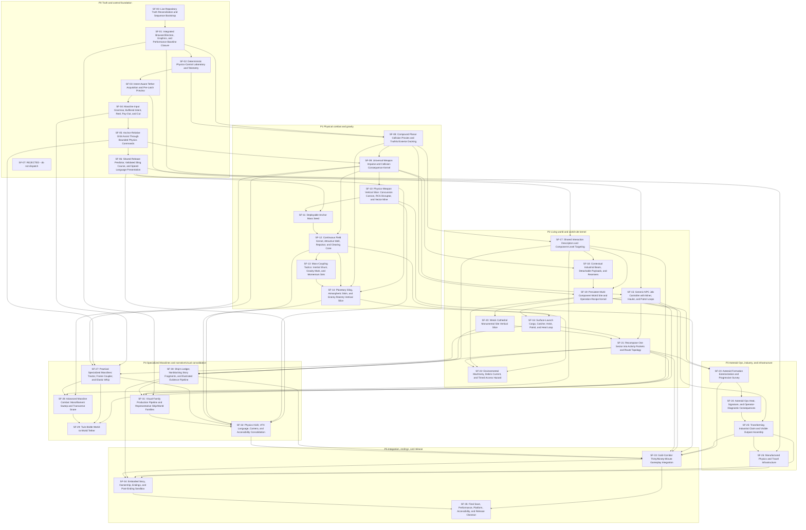

# Dependency Graph

The numeric sequence is the default controller order. Edges below show hard prerequisites, not every earlier prompt whose result may still be relevant.

## Interpretation

- The graph expresses minimum technical gates. The controller still runs numeric order unless SF-00 records a different evidence-backed schedule.
- A prompt may prove itself already satisfied and move directly to review; downstream tasks still revalidate the relevant owner.
- A missing visual-acceptance gate can permit a backend dependency for pure systems work, but a later player-facing prompt may remain blocked until vision review.
- Shared files and semantic owners create mutexes not shown here. The live worktree/lease audit remains mandatory.
