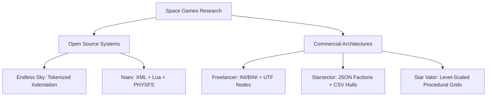

> **LEGACY RESEARCH DRAFT — scope reviewed 2026-07-13.**
> This uncited 2026-07-12 draft is retained as a concept catalogue, not as current evidence, licensing advice, implementation authority, or build status. Its architectural observations are useful hypotheses; its exact counts, statistics, “comprehensive” labels, asset-license conclusions, and SpaceFace inventory claims require revalidation. Use `design/depth-program/research/verified/README.md` and `design/depth-program/BUILD_PLAN.md` for the committed evidence base and current execution plan, and `design/depth-program/research/SALVAGE_NOTES.md` for the salvage assessment.

# SpaceFace Master Asset Depth & Production Pipeline Blueprint

This document records an early technical research pass comparing **SpaceFace** against five space games. It proposes asset-reuse questions, a Blender hard-surface workflow, and a 5x5 catalogue of visual and interactive concepts. Treat those proposals as candidates to validate against the current code, provenance records, measured runtime evidence, and the verified depth corpus before implementation.

---

## 1. Technical Repository & Code-Level Crawl



### 1.1 Endless Sky (Open Source)
* **Code Repository:** `github.com/endless-sky/endless-sky`
* **Parser Architecture:** Built on a custom C++ text parser (`src/GameData.cpp` and `src/Parser.cpp`). It reads human-readable `.txt` config files with strict indentation rules. Space-separated tokens dictate the hierarchy:
  ```txt
  ship "Kestrel"
      sprite "ship/kestrel"
      attributes
          cost 1500000
          mass 110
      gun -22 -37
      engine -14 91 0.8
  ```
* **Directory Layout & Paths:**
  - `data/` (Root configuration data): Holds definitions for ships (`ships.txt`), star systems (`map.txt`), items (`outfits.txt`), and factions (`governments.txt`).
  - `images/` (Visual assets): Contains sprites. Ships are stored under `images/ship/` (singular), and weapon animations are stored under `images/projectile/`.
  - `src/` (Core engine): `src/Ship.cpp` parses ship attributes, while `src/Planet.cpp` parses worlds and coordinates.
* **Collision Detection:** The C++ engine (`src/Sprite.cpp` and `src/Outline.cpp`) automatically scans the alpha channel of image sprites in `images/ship/`. It traces non-transparent pixels to generate polygonal collision shapes at runtime, avoiding manual hitbox coordinate definitions. A 1-pixel transparent border is enforced to ensure accurate targeting UI brackets.
* **Asset licensing and adaptation questions:**
  - **License:** The source code is GPLv3. The assets (found in the `images/` and `sounds/` trees) are licensed under CC-BY-SA 4.0, Public Domain (CC0), or CC-BY 3.0.
  - **Asset reuse:** Do not infer reusable rights from a repository-wide summary. Verify the license, author, source file, derivative terms, attribution, and distribution compatibility for each candidate before ingestion; record that provenance alongside the asset.

### 1.2 Naev (Open Source)
* **Code Repository:** `codeberg.org/naev/naev` (migrated from GitHub).
* **Parser Architecture:** Relies on C-based XML loading powered by `libxml2` (integrated in `src/ssys.c`, `src/ship.c`, and `src/outfit.c`), alongside a heavy migration of logic to Rust.
* **Directory Layout & Paths:**
  - `dat/ssys/`: Individual `.ssys` XML files defining star system properties (nebula opacity, volatility, gravity wells, space dust).
  - `dat/ships/`: XML templates defining ship size classes, hardpoints, and variant inheritance.
  - `dat/outfits/`: XML templates mapping thruster engines, reactors, shield generators, and armor plates.
  - `dat/events/` and `dat/missions/`: Complex Lua scripts mapping interactive events.
* **Scripting Hooks:** Uses the Lua C API to register event hooks (e.g., `onshootany` or `ondock`). Dialogs and stories are handled via a custom Visual Novel framework (`vn` module) in Lua:
  ```lua
  local vn = require("vn")
  function accept()
      vn.run(function()
          vn.msg("Commander, we found wreckage near the asteroid belt. Scan it immediately.")
      end)
  end
  ```
* **Virtual Filesystem:** Employs `PHYSFS` to merge the core assets and custom player plugins into a single, unified virtual filesystem at runtime.
* **Asset licensing and adaptation questions:**
  - **License:** Engine code is GPLv3. Visual assets (PNG sprites rendered from Blender meshes) are mostly CC-BY 3.0 or CC-BY-SA 3.0.
  - **Asset reuse:** The artwork repository may contain useful source meshes, but each candidate still needs file-level provenance and compatibility review before adaptation. A compatible candidate can then be rebuilt for SpaceFace's materials, silhouettes, LODs, collision, and runtime pipeline without treating automatic decimation as the quality strategy.

---

## 2. Commercial Game Depth Audit

### 2.1 Freelancer (Commercial)
* **Data Architecture:** Configured via INI files (frequently compressed into binary-encoded BINI formats to optimize load times). Editing requires tools like `BINIQDU` to convert to text.
* **Mesh & Collision Structures:**
  - **3D Geometry:** Compound model files (`.cmp`) store meshes, hardpoints, and material assignments. UTF (Universal Texture Format) node hierarchies allow model exploration:
    ```
    \\Nodes\\3D\\Mesh
    \\Nodes\\3D\\Hardpoints
    ```
  - **Textures:** Managed in Material Library files (`.mat`) that link DDS texture sheets to mesh geometry.
  - **Hitboxes:** Bounded in physical collision files (`.sur`) that contain simplified convex hulls for projectile and environment impact checks.
* **Design Tricks for Depth:**
  - **Trade Lanes:** Interactive docking rings in space. Entering a lane forces the ship into a fast-travel vector with visual speed-lines and custom engine SFX. Lanes can be disrupted by destroying a ring, forcing ships out of cruise.
  - **Hazard Zones:** Defined in `system.ini` using `[Zone]` blocks (spherical or ellipsoidal shapes). These zones restrict sensor ranges, drain shields, or corrode hulls (e.g., in radioactive clouds).
  - **Wreckages:** Hidden deep within hazard zones, containing specialized "prototype" weapons that can be salvaged.

### 2.2 Starsector (Commercial)
* **Data Architecture:** Spreadsheet-driven design centered around `.csv` files and JSON-based `.faction` configurations.
* **Directory Layout & Paths:**
  - `data/hulls/ship_data.csv`: Master registry defining base statistics (Armor, Hull, Flux Capacity, Flux Dissipation, OP) for every ship.
  - `data/world/factions/`: Holds `.faction` JSON files configuring faction behavior:
    ```json
    {
      "id": "concord",
      "color": [58, 120, 255, 255],
      "knownShips": {
        "hulls": ["ship_kestrel", "ship_wasp"]
      },
      "priorityShips": {
        "hulls": ["ship_kestrel"]
      },
      "illegalCommodities": ["contraband", "unrefined_ore"]
    }
    ```
* **Scripting API:** Java classes (e.g., inheriting from `BaseCampaignPlugin` and `CampaignFleetAPI`) control faction fleet composition, economic supply/demand changes, and random station events.
* **Modular Customization:** Ships feature an Ordnance Point (OP) budget. Players can mount weapons on visual slots and install "hullmods" (e.g., Hardened Shields) that modify performance.

### 2.3 Star Valor (Commercial)
* **Data Architecture:** Unity engine configurations utilizing procedural generation models.
* **Design Tricks for Depth:**
  - **Sector Level-Scaling:** Sectors are assigned levels (e.g., Level 1-50). Level values scale enemy pilot AI, drop rates, and equipment tiers in station shops.
  - **Maneuverability Classes:** Ships are sorted into size classes (1 to 6). Small ships remain viable in the late game due to their high speed, while large ships function as slow, heavily armored weapon platforms.

---

## 3. SpaceFace Current Inventory & Code Audit

To align SpaceFace with the depth seen in these games, we audited the existing codebase.

### 3.1 Current Implementation Inventory
* **Factions:** Defined as a static array of JavaScript objects in [factions.js](file:///C:/Users/93rob/Documents/GitHub/SpaceFace/src/data/factions.js). It supports starting reputation, home sectors, and basic relations. Hostility is evaluated at runtime by the scanner.
* **Sectors:** Configured as a 24-sector coordinate network in [sectors.js](file:///C:/Users/93rob/Documents/GitHub/SpaceFace/src/data/sectors.js) and [frontierRegions/index.js](file:///C:/Users/93rob/Documents/GitHub/SpaceFace/src/data/frontierRegions/index.js). Fixed system entities (stations, gates, fields) are merged via [sectorAnchors.js](file:///C:/Users/93rob/Documents/GitHub/SpaceFace/src/data/sectorAnchors.js).
* **Visual Mappings:** Contained in [partsLibrary.js](file:///C:/Users/93rob/Documents/GitHub/SpaceFace/src/render/partsLibrary.js). Mappings include:
  - `HULL_FILE_BY_DEF_ID`: Mappings for 13 ship hulls.
  - `WHOLE_SHIP_FILE_BY_DEF_ID`: Maps `'ship_kestrel'` to `'wholeships/kestrel.glb'`.
  - `WHOLE_SHIP_FILE_BY_HOSTILE_ID` and `WHOLE_SHIP_FILE_BY_TRAFFIC_ROLE`: Map specific silhouettes for NPC patrols and civilian traffic.
  - `PLACE_FILES`: Maps 3D GLBs for stations, Buoys, and Beacons.

### 3.2 Visual & Mechanical Gaps
1. **No Faction Ship Silhouettes:** NPCs share generic hulls. There is no mapping in [partsLibrary.js](file:///C:/Users/93rob/Documents/GitHub/SpaceFace/src/render/partsLibrary.js) that links faction IDs (e.g., `faction_choir`) to customized ship models.
2. **No Dynamic Narrative Hooks:** SpaceFace has no dialog engine or local event scripting system comparable to Naev's Lua VN modules.
3. **No Vertical Scale:** Planets are background projections. The game lacks vertical structures like Freelancer's planetary mooring elevators, which create depth on the y-axis.
4. **No Trade Lanes:** Fast travel between stations is restricted to manual autopilot, without physical lane structures or disruption zones.
5. **No Unique Wreckage Hulls:** Derelict wreckages use generic procedural fallbacks instead of unique models.

---

## 4. Free Asset Sourcing & Ingestion Blueprint

This legacy blueprint outlines how candidate assets might be sourced, rebuilt, textured, and compiled. Current production work must preserve visual quality and derive performance envelopes from measured scenes rather than inherit the fixed caps below.

### 4.1 Online Asset Sourcing Guide
* **Sketchfab:** Search for tags like `lowpoly space`, `sci-fi prop`, or `modular spaceship`. Filter under **CC-BY** (requires attribution) or **CC0** (public domain).
* **OpenGameArt:** Look in the "3D Art" section under the Sci-Fi tag. Focus on assets with CC-BY or CC0 licenses.
* **BlenderKit:** Use the built-in Blender add-on to search for CC0/CC-BY hard-surface greebles, pipes, and panel meshes.
* **BlendSwap:** Look for community-shared hard-surface spaceship packs.

### 4.2 Ingestion and geometry workflow (Blender pass)
1. **Import Mesh:** Import the `.gltf`, `.fbx`, or `.blend` asset into a clean Blender file.
2. **Clean Topology:** Delete hidden geometry, double vertices (`Merge by Distance`), and internal faces.
3. **Build measured LODs without a fixed quality ceiling:**
   - Preserve the authored silhouette, material breakup, sockets, collision intent, and details that remain visible at the asset's real presentation sizes.
   - Remove hidden/internal geometry and merge compatible static material roles first; use retopology or selective simplification where measurements show a real cost.
   - Author and inspect each LOD at its in-game screen coverage. Triangle count, texture resolution, draw calls, and compression are evidence to tune, not universal maximums.
   - Use a Decimate modifier only when visual comparison shows that it preserves silhouette and shading; do not apply a global collapse ratio as an acceptance rule.

### 4.3 PBR Material & ORM Baking Standard
To ensure consistent lighting in Three.js, all assets must conform to standard PBR channels:

```
Combined ORM Map (R: Ambient Occlusion | G: Roughness | B: Metallic)
  ├── Red Channel   <-- Baked Ambient Occlusion Map
  ├── Green Channel <-- Baked Roughness Map
  └── Blue Channel  <-- Baked Metallic Map
```

#### Step-by-Step ORM Packing in Blender:
1. UV-unwrap the decimated mesh onto a single coordinate sheet.
2. In the **Shader Editor**, create a new image texture (e.g., `asset_name_orm.png`) at 1024x1024 resolution. Set its Color Space to **Non-Color**.
3. Under the **Render Properties** tab, switch the Render Engine to **Cycles**.
4. Bake **Ambient Occlusion**: Set Bake Type to *Ambient Occlusion* and click *Bake*. Save this image as `ao.png`.
5. Bake **Roughness**: Connect the roughness node chain to an *Emission* node. Set Bake Type to *Emit* and bake. Save as `roughness.png`.
6. Bake **Metallic**: Connect the metallic node chain to an *Emission* node. Set Bake Type to *Emit* and bake. Save as `metallic.png`.
7. **Channel Packing (Blender Compositor):**
   - Open the Compositor and check *Use Nodes*.
   - Add three *Image* nodes and load `ao.png`, `roughness.png`, and `metallic.png`.
   - Add a *Combine Color* node (RGB mode). Connect the AO image to Red (R), Roughness to Green (G), and Metallic to Blue (B).
   - Connect the output to a *File Output* node. Render to output the finalized `asset_name_orm.png`.

### 4.4 Exporter and Metadata Stamp
1. Save the model as a standard `.glb` file. Ensure the material names match SpaceFace standards:
   - `Material_Hull`: Main metallic body.
   - `Material_Accent`: Faction trim color.
   - `Material_Emissive`: Engine glow and running lights.
2. Run the finalization tool to inject metadata:
   ```bash
   node tools/art/finalize_part.mjs assets/ships/parts/places/landmark_chronos.glb --type place
   ```
   This stamps the GLTF extras with the necessary metadata parsed by [assetLoader.js](file:///C:/Users/93rob/Documents/GitHub/SpaceFace/src/core/assetLoader.js).
3. Run the optimization builder to compress geometry and transcode textures to KTX2:
   ```bash
   npm run build:sg04:release-assets
   ```

---

## 5. Lore Catalog & Interaction Design (5x5 Grid)

This catalog registers 25 concepts designed to build world depth.

### 5.1 Factions
To be registered in [factions.js](file:///C:/Users/93rob/Documents/GitHub/SpaceFace/src/data/factions.js).

#### 1. The Ashen Ascendancy (`faction_ash`)
The Ashen Ascendancy is a xenophobic mining cult that arose in the radiation-choked sectors of the outer rim. They worship stellar collapse and believe that the raw materials harvested from dying stars hold sacred properties. Their pilots are trained to navigate high-volatility solar storms, showing no fear of hull decay.

* **Aesthetic:** Jagged, volcanic geometries with dark carbon plates and bright glowing orange lines (`Material_Emissive`).
* **Gameplay:** Highly hostile to outsiders. Sells specialized heat sinks and radiation-resistant hull modules. Players can build reputation by delivering raw stellar crystals harvested from outer hazards.

#### 2. Aegis Logistics Corp (`faction_alc`)
Aegis Logistics Corp is a corporate military syndicate managing the trade networks of the core sectors. They prioritize efficiency and rule of law above all else, maintaining custom checkpoints across jump gates. Their fleets are sleek, uniform, and heavily armed to secure trade lanes from pirate incursions.

* **Aesthetic:** Matte white hulls with cyan panel lines and polished gold accents.
* **Gameplay:** Enforces strict cargo scans. Carrying contraband in their territory results in immediate fines or combat. Offers shipping contracts and trade-lane license upgrades.

#### 3. Sker Junkers Syndicate (`faction_junker`)
The Sker Junkers are a loose syndicate of scrap-dealers, salvagers, and pirates operating from toxic debris fields. They survive by stripping destroyed fleets and rebuilding them into frankensteined vessels. They value resourcefulness and black-market trade over formal laws.

* **Aesthetic:** Mismatched metal plating, yellow hazard stripes, and exposed wiring.
* **Gameplay:** Sells cheap engine modifications and salvage claws. Players can trade scrap metal for components and take bounty contracts targeting ALC cargo runs.

#### 4. The Veil Resurgent (`faction_veil`)
The Veil Resurgent is a secret society of scientists and anomaly-worshippers studying gravity-well phenomena. They inhabit nebula-rich sectors, building hidden research hubs to study ancient alien monuments. They keep their distance from core politics, protecting their research with gravity-well weapons.

* **Aesthetic:** Dark chrome plating with glowing green runes and floating rings.
* **Gameplay:** Offers anomaly scanning missions. Sells gravitational tethers and long-range survey probes.

#### 5. Nighthawk Mercenary Coalition (`faction_nighthawk`)
The Nighthawk Coalition is a professional bounty-hunting network specializing in stealth operations. They operate out of dark sectors, taking contracts from corporations and factions to eliminate pirates or secure high-value cargo. They value credit payouts and discretion above all else.

* **Aesthetic:** Charcoal grey hulls with royal purple accents and low-signature heat vents.
* **Gameplay:** Sells sensor-jamming modules and stealth thrusters. Players can check their bounty boards for high-reward, high-difficulty combat missions.

---

### 5.2 Planets & Moons
Planets provide background visual identity and mooring points.

#### 1. Hesperia Prime
Hesperia Prime is a massive gas giant with golden rings, located in the core sector. The planet features a massive space elevator mooring cable that extends into orbit, serving as a key trade hub. The orbital terminal is surrounded by cargo containers and transport traffic.

* **Aesthetic:** A large gas giant with golden rings, set against core blue nebula fog.
* **Gameplay:** Players can dock at the space elevator mooring ring to trade commodities. Fuel and basic repairs are cheap here.

#### 2. Aethelgard
Aethelgard is a volcanic planet characterized by constant tectonic activity. Large lava flows and ash plumes are visible from orbit, creating a hazy red atmosphere in the local sector. The planet's orbit is rich in metallic ore deposits, drawing heavy industrial mining operations.

* **Aesthetic:** Volcanic rock with glowing red fissures, set against an ash-colored nebula.
* **Gameplay:** Contains rich metallic asteroid fields. Navigating near the planet causes minor radiation build-up on unshielded hulls.

#### 3. Cinder Glade
Cinder Glade is a toxic moon orbiting Tethys. The surface is covered in green geysers that vent gas into space, creating local gas clouds. Sker Junker outposts are built into the moon's craters, trading in scrap and contraband.

* **Aesthetic:** A cracked green moon venting glowing gas clouds.
* **Gameplay:** Players can harvest gas resources using gas-scoop modules or trade contraband at the local black market station.

#### 4. Zephyr-9
Zephyr-9 is a water world characterized by storm clouds and hurricanes. A network of orbital drydocks surrounds the planet, serving as the primary manufacturing hub for the Free Frontier coalition. The docks are brightly lit and visible from across the sector.

* **Aesthetic:** Blue oceans with white cloud storms, surrounded by glowing shipyard gantries.
* **Gameplay:** Serves as a shipyard. Sells high-tier hull parts and ship variants.

#### 5. Ophion's Eye
Ophion's Eye is a dark void planet located in an anomaly sector. It is surrounded by a swirling violet nebula that generates static electricity, disrupting ship systems. The planet is a key location for research, housing ancient monuments that emit gravitational waves.

* **Aesthetic:** A dark planet in a violet nebula with visible lightning storms.
* **Gameplay:** Causes periodic sensor blackouts. Players must use specialized shields to navigate the sector safely.

---

### 5.3 Historical Battle Wreckages
Wreckages provide high-risk exploration and salvaging opportunities.

#### 1. The Goliath Graveyard
The Goliath Graveyard is the site of a battle between the Solar Concord Navy and the old Outer Rim Coalition. The center of the wreckage is the broken hull of the battleship *Goliath*, surrounded by interceptor debris and unexploded mines.

* **Aesthetic:** Rusty steel plates, floating ship sections, and blinking emergency lights.
* **Gameplay:** High risk of collision. Hacking the *Goliath's* database reveals coordinates to military weapon blueprints.

#### 2. The Sker Ambush
The Sker Ambush is a debris field resulting from a pirate raid on an ALC cargo fleet. The area is littered with cargo pods, container frames, and destroyed transport hulls, drawing scrappers and scavengers to the sector.

* **Aesthetic:** Mismatched cargo pods, steel girders, and yellow shipping crates.
* **Gameplay:** Players can use tow tethers to salvage cargo containers or mine the freighter hulls for metal alloys.

#### 3. The Silent Fleet
The Silent Fleet is a collection of exploration vessels that froze in place when an unstable jump gate collapsed. The ships are preserved in quantum ice needles, drifting silently in the anomaly sector.

* **Aesthetic:** Frost-covered ship hulls encased in glowing green crystal needles.
* **Gameplay:** Players must use lasers to melt the quantum ice to access the cargo bays, risking hull damage from cold exposure.

#### 4. Charon Smelter Husks
Charon Smelter Husks are the remains of a mining fleet destroyed by an unstable solar flare. The ships are fused with the metallic asteroids they were mining, creating an irregular layout of rock and metal.

* **Aesthetic:** Melted iron structures, charred asteroid rocks, and industrial drills.
* **Gameplay:** Rich in platinum and rare metals. Players must navigate tight tunnels to mine the deposits.

#### 5. The Breach at Vesta
The Breach at Vesta is the remains of a defensive line destroyed during an invasion. The area is filled with torn defense platforms, laser grids, and active mines, creating a hazardous zone.

* **Aesthetic:** Broken gun turrets, exposed wiring, and red warning lights.
* **Gameplay:** Safe navigation requires sensor-jamming modules. Rewards include military-grade scrap and weapon blueprints.

---

### 5.4 Space Landmarks & Wonders
Landmarks serve as distinct visual indicators and navigational aids.

#### 1. The Chronos Spire
The Chronos Spire is a navigation tower built by a forgotten civilization. It is a slender structure that emits a high-intensity cyan beam, serving as a beacon visible from across the sector.

* **Aesthetic:** Sleek white stone-like material with glowing cyan conduits.
* **Gameplay:** Approaching the spire recalibrates the ship's navigation computer, revealing neighboring sectors on the map.

#### 2. The Obelisk of Ophion
The Obelisk of Ophion is a floating monolith located in the Ophion anomaly field. It is made of dark obsidian and features green runes that spin slowly, generating a low magnetic hum.

* **Aesthetic:** Dark obsidian stone with glowing green markings, surrounded by a static haze.
* **Gameplay:** Distorts radar ranges. Scanning the obelisk provides research points and unlocks advanced tech trees.

#### 3. The Giga-Gantry
The Giga-Gantry is an abandoned orbital shipyard structure. It consists of an interlocking lattice of iron beams built around a small asteroid, once used to construct capital ships.

* **Aesthetic:** Rusted iron beams, scaffolding, and yellow crane arms.
* **Gameplay:** Serves as a free repair dock. Players who align their ship with the construction cradle receive free hull repairs.

#### 4. Wormhole Gateway Ring
The Wormhole Gateway Ring is a ruined jump gate that has decayed into a stable wormhole. It features a circular ring of debris held together by purple energy arcs, connecting core and fringe sectors.

* **Aesthetic:** Circular debris ring with a purple energy vortex.
* **Gameplay:** Entering the ring transports the player directly to Ashfall Reach, bypassing intermediate gates.

#### 5. The Aegis Mooring Hub
The Aegis Mooring Hub is a massive traffic control station in the core sector. It features docking arms that extend miles outward, managing commercial traffic.

* **Aesthetic:** A large grey space station with blue lights and docking arms.
* **Gameplay:** Increases cruise engine recharge rates in its vicinity.

---

### 5.5 Interactive Props & Debris
Props populate space, providing interactive gameplay feedback.

#### 1. ALC Cargo Silo
The ALC Cargo Silo is a large cylindrical container tethered to navigation buoys. It holds premium trade goods and is monitored by core patrols.

* **Aesthetic:** Matte white cylinder with blue stripes and locked hazard hatches.
* **Gameplay:** Can be breached with impact charges or hacked to retrieve cargo.

#### 2. Solar Collector Array
The Solar Collector Array consists of rotating solar panels that gather energy from the local star, supplying power to nearby stations.

* **Aesthetic:** Blue solar panels that rotate to track the sun.
* **Gameplay:** Flying near the panels charges the player's shields and booster reserves.

#### 3. Atmospheric Sensor Satellite
The Atmospheric Sensor Satellite features a spinning dish used to monitor solar storms and nebula gases.

* **Aesthetic:** Gold foil body, silver dish, and blinking blue lights.
* **Gameplay:** Hacking the satellite downloads local sector data, revealing resource deposits.

#### 4. Automated Mining Excavator
The Automated Mining Excavator is a mechanical drill anchored to large asteroids, processing raw ore.

* **Aesthetic:** A yellow industrial frame with a rotating drill head and pistons.
* **Gameplay:** Players can tether to the drill to siphon processed ore or scrap it for raw materials.

#### 5. Aegis Custom Buoy
The Aegis Custom Buoy is a patrol beacon that scans passing traffic for contraband.

* **Aesthetic:** White cylinder with warning lights and a rotating sensor array.
* **Gameplay:** Scans passing ships. Carrying contraband triggers an alert to Concord patrols.

---

## 6. Implementation Strategy for SpaceFace

To integrate these concepts into SpaceFace:
1. **Factions:** Add the 5 new factions (`faction_ash`, `faction_alc`, `faction_junker`, `faction_veil`, `faction_nighthawk`) to `src/data/factions.js`.
2. **Landmarks:** Map the 5 landmarks (e.g., `landmark_chronos_spire`, `landmark_goliath_graveyard`) in `src/data/sectorAnchors.js` to populate empty sectors.
3. **Asset Production:** Run imported models through the Blender pass, conforming materials, stamping metadata, and compiling release assets using the optimization scripts.
