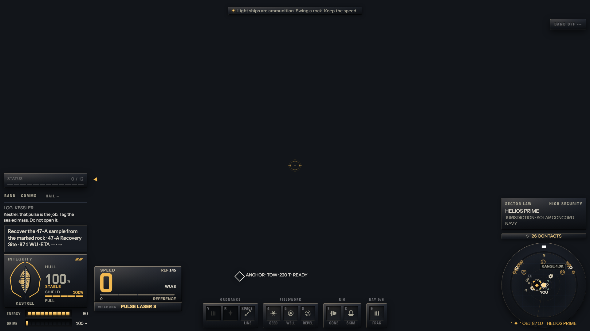
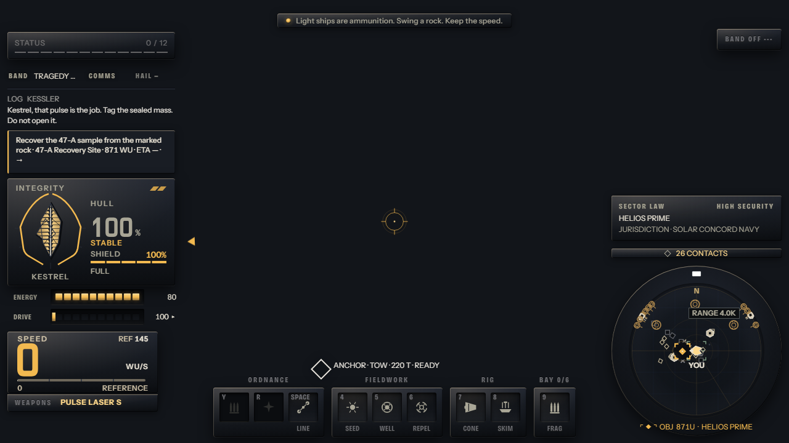
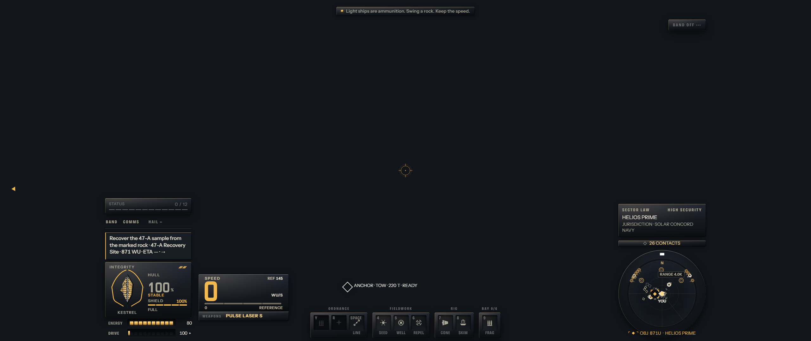
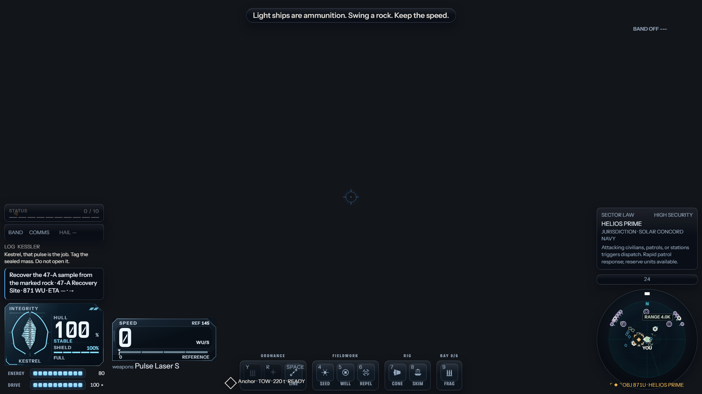

# Flight HUD — 2026-09-18

**For the owner: look at the three pictures, then veto or continue.** Everything below them is
supporting detail.

**Status: NOT PASSED.** Two reviewers who did not build the HUD scored it 4/10. The bar is 7.
Both say the next step is fewer, bigger instruments plus a colour reserved for threat. That
second point bends the one-accent rule, so it is your call; see "Your call" at the bottom.

The flight HUD is rebuilt as the first surface of one design system, called **Deckplate**. The
instruments are meant to read as this ship's own machined hardware: gunmetal plates under one
warm light from the top left, legends cut into the metal, and one accent colour, a warm lamp.
The lamp turns red for danger, and there is no second hue. Station, pause and the chart are
**not** restyled. They come after the HUD passes, built from the same parts.

## The live stills

These are captured from the real game route: title, New Game, flight, seed 47. The capture runs
headless, so the 3D world is not drawn and the sky is flat dark. The HUD itself is live.

**1920 × 1080**

**1280 × 720**

**2560 × 1080** (the capture matrix's 2560 slot is ultrawide 21:9; the HUD sits in a centred
16:9 safe box)

**Before**: the retired "glass" register (smoked cards, cold cyan), same route, 1920:

## Critic scores

The scores come from a second agent that did not build the HUD. It judged only the pixels,
against the taste law and five craft rules. The bar: **PASS needs 7/10 overall and no category
below 6.**

### Verdict: NOT PASSED (4/10). Nothing else restyles yet.

| Pass | Build | Composition | Hierarchy | Type | Material & light | Distinct | Motion | Overall |
|---|---|---|---|---|---|---|---|---|
| 1 | first deckplate build (earlier session) | — | — | — | — | — | — | **5** · iterate |
| 2 | after palette + collision fixes | 4 | 4 | 5 | 4 | 4 | 4 | **4** · iterate |
| 3 | after hierarchy pass (pictures above) | 4 | 4 | 4 | 3 | 4 | 4 | **4** · iterate |

Pass 1's per-category scores were not kept. Each pass used a fresh critic. The critic scored
motion from stills only, so that score is inferred.

**What moved.** Specific defects were fixed: the tow tag sat on the weapon rail, the left column
ran off the top at 1280, the speed plate slid under the tray at 2560, and "SPACE" spilled out of
its keycap. The speed reading went from "reads as a battery icon" to "the clearest single read
on screen."

**What did not move.** The score stayed at 4 because both critics, independently, now ask for
structural changes that paint cannot deliver:

1. **Fewer, bigger instruments.** The left side is about eight separate boxes. Fold integrity,
   energy, drive, speed and weapons into one instrument cluster on one chassis. Fold status,
   comms, log and objective into one comms strip.
2. **A channel reserved for threat.** Amber lights nearly everything, so a hostile would have no
   colour of its own to stand out with.
3. **Real material, not one gradient on every plate.** The second critic scored material and
   light 3 and named the same problem as the first: the same bevel on every panel reads as
   dark-mode app cards, not as a machine. Tether state is still a text line, not an instrument.

**Both critics said to protect three things.** The Kestrel hull glyph with its hatched plating is
the one instrument that reads as *this* ship. The big amber speed numeral with its reference bar
reads well. The ordnance / fieldwork / rig / bay tray, with its inset key wells and verbs, has
character. Any next pass grows from these.

## What changed

**The design system** (`src/ui/deckplate/`). Later screens assemble these parts. They do not
hand-roll panels.
- **Tokens:** a gunmetal ramp, warm bone ink, a three-heat lamp plus its red danger state, one
  key-light direction, two type voices (etched legend and reading), one spacing unit, 2–3 px
  machined corners, three motion curves and four durations.
- **Materials:** machined plate, etched legend, lamp emitter, recessed channel.
- **Components:** gauge, target bracket (breathes when idle, snaps on lock), contact row,
  annunciator (escalates, then degrades), equipment socket, vital bar.
- **Motion:** a way to replay one-shot animations such as a bracket latching, with no timers
  and no held animation loop. Reduced motion switches every oscillation off and shows a steady
  lamp plus a word.

**The flight HUD, built on it.** The HUD's DOM contract is unchanged. Only the paint and
layout moved.
- Every panel is a machined plate. The glass-and-neon register is retired.
- The speed reading is the largest numeral on the deck. The zero glyph is no longer slashed,
  because it read as a battery icon.
- Hull integrity stays quiet while the hull is whole (smaller, dimmer). It steps forward on
  damage, and turns the lamp red when critical.
- The weapon readout is bolted under the speed gauge as its nameplate.
- The aim reticle, lock ring, lead pip, radar, tow-line marks and the tactical map palette are
  all on the lamp. Friendly contacts are warm bone, so the lamp itself means goal or selection.
  Hostile is the lamp driven red.
- Offscreen tow-target tags ride an ellipse around the reticle. They no longer pin to the
  screen edge on top of the weapon rail. The offscreen objective arrow steps off the side
  columns instead of sitting on them.
- The comms tape is an etched strip, not a card. The sector-law entry card is three short lines,
  not a paragraph; screen readers still get the full text. The top tutorial line is demoted to a
  quiet caption.
- 1280 × 720: the left column no longer runs off the top of the screen, because its reserve now
  matches the speed deck's real size. 2560 × 1080: the speed deck no longer slides under the
  ordnance tray.

## Proof it works

- **Live stills.** The three HUD pictures come from the real game route (`node
  scripts/ui-stills.mjs --only=flight`) at each viewport, on the build committed with this page.
  The "before" picture is the same route on the retired register.
  One exception: the roster count reads "24 CONTACTS" because another lane has an in-progress
  edit to that text. That edit is not part of this work.
- **Controls do what they claim** (`node scripts/ui-look.mjs --only=flight`). Opening the comms
  log changed the screen as claimed. The hail control is disabled when no contact is selected, so
  the change measured after clicking it was the session finishing its load. That is **not** proof
  that hail works. The band key and the weapon readout changed in paint only; their behaviour is
  untouched. The run also logged the dev route failing to open "flight" as a screen. Flight is the
  default route, not a pushable screen, so this is believed to be harness behaviour, but it was
  not verified.
- **Accessibility and correctness floors all pass:** 12 px type floor, WCAG contrast, UI a11y,
  identity colours, native titles, and UI effects (no idle animation loop; reduced-motion safe).
  The one new movement, the hull figures stepping forward on damage, is switched off under
  reduced motion. The new plates (weapon nameplate, band key) have forced-colours and
  high-contrast variants; the reticle has a forced-colours variant.
- **Layout geometry** (`check:ui:layout --only=flight`): 0 findings for clipping, overlap or
  offscreen, at 1920. The full 35-screen sweep stalled on the loaded machine before it reached
  flight. `check:ui:budgets` shows flight at 852 DOM nodes against a 1500 budget. That check still
  reports red because its reference captures predate any UI change ("baseline stale"), and
  re-shooting them is an hours-long matrix run that was not started.
- **Focused tests:** 265 of 272 across every suite that touches the changed files pass. The 7 that
  fail were already failing before this work; each was re-run against the committed code. They
  are:
  - a radar font-size regex that predates the font helper;
  - a massline camera-push contract owned by another lane;
  - two stylesheet-text assertions (right-dock and comms-tape rules) absent before this work;
  - three HUD projection-count tests.
- **`check:baseline`:** 14 of 15 groups pass. In the 15th, two long simulation scenarios timed out
  while other agents' processes loaded the machine. Both pass when run on their own (58 s and
  95 s).
- **Laws held.** This pass changed only `src/ui/` (plus this page). Pass 1 also touched
  `styles/hud.css` and the dev bench harness under `tools/`; neither is a gameplay file. There are no gameplay or input
  changes, no new GL context, and no screen that goes black.

## Known gaps and follow-ups

**Your call (a design decision, not a technical one).** The one-accent rule and the critics'
"reserve a colour for threat" pull against each other. There are two ways to resolve it:
- **A. Allow one reserved hostile colour.** Everything else stays on the warm lamp.
- **B. Keep one accent, but spend it only on things you act on.** Shield %, energy lamps, the
  weapon name, the contact count and the edge arrow drop to bone white. The lamp then means
  "act here", and red (the lamp driven to failure) pops without a second hue.

**If you continue:** the next unit is the structural rebuild the critics describe. That means one
instrument cluster, one comms strip, a tether gauge centred under the reticle (tension arc or
spool lamp), and different finishes for different parts of the machine. That work changes the
HUD's layout, not just its paint, and it gets re-scored the same way.

**Smaller items found along the way:**
- The star chart shares the tactical-map palette, so it picked up the warm marks. It stays
  legible, but its symbol key still shows the old cyan swatches. Align it when the chart gets its
  turn.
- The offscreen RELEASE / ALIGN tow marks still pin to the screen rectangle, because a test locks
  that behaviour. Only the acquisition and denial tags moved to the reticle ellipse.
- The objective card ends in "ETA —·→" when no route ETA exists, which reads as broken data.
  "NAVY" wraps onto its own line in the sector-law card. The band name truncates at 1280.
- The fast bench view (`ui-bench --shot=flight`) did not draw the HUD this session. Under load it
  showed the stale background still. The live captures above are the evidence instead.
- Another lane is editing the roster count text ("24 CONTACTS", in `hudAttention.js`). That edit
  is not part of this work.
