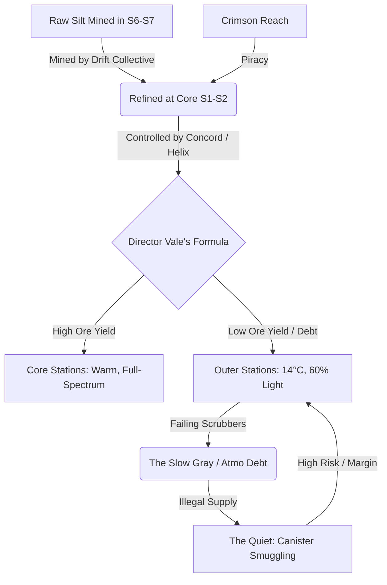

# SpaceFace Story Development: The Atmospheric Economy (The "Silt" Layer)

This document establishes the central scarce resource for *SpaceFace*’s world design, inspired by the environmental-economic systems of Paolo Bacigalupi (*The Windup Girl*, *The Water Knife*).

---

## 1. The Scarce Resource: Catalytic Silt ("Silt")

The underlying resource that organizes the entire solar economy is not ore, fuel, or currency. It is **Catalytic Silt** (colloquially called **"Silt"**, **"Gray Silt"**, or **"The Slurry"**).

### Physical Properties & Mechanics
*   **The Function:** Silt is a heavy, dense, dark-gray slurry of synthetic rare-earth silicates. It is the reactive medium lining the channels of station and ship recycler grids. When electrically stimulated, Silt splits carbon dioxide and other toxic metabolic byproducts back into breathable oxygen.
*   **The Poisoning:** Silt is not permanent. It degrades. Human breath carries moisture and trace organic contaminants; industrial work leaks hydraulic fumes, micro-plastics, and thruster exhaust. These impurities chemically "poison" the Silt's porous crystalline structure over time. 
*   **The Cycle:** Degraded Silt becomes inert, turning a pale, chalky gray. It must be chemically washed, re-doped with raw catalytic metals, or completely replaced.
*   **The Consequence:** Without fresh Silt, scrubbers saturate. The air becomes "heavy" — CO2 levels rise (hypercapnia). Station residents don't die instantly; they enter the **"Slow Gray"** — a state of permanent metabolic lethargy, headaches, and cognitive decline. The lower decks of the Pit have been breathing poisoned, unserviced Silt for fourteen years.

---

## 2. Integration in the Commodity Tables

Silt is financialized and traded across the sectors, appearing on the market boards in distinct forms:

| Commodity Name | Category | Weight / Unit | Core Value | Black-Market Value | Sector Availability |
| :--- | :--- | :--- | :--- | :--- | :--- |
| **Raw Silt Ore** | Raw Mineral | 1.0t (bulk) | Low (50cr) | Low (30cr) | Outer Industrial (S6–S7) |
| **Refined Slurry** | Chemical | 150kg (canister) | High (600cr) | Very High (900cr) | Core Refinery (S1–S2) |
| **Spent Silt (Chalk)** | Waste | 150kg (canister) | None (0cr) | Low (50cr) | Industrial / Smuggler |
| **Atmo Token** | Digital Derivative | N/A | Variable | Volatile | Meridian Exchange (S3) |

### Systemic Functions:
*   **Raw Silt Ore:** Mined from high-radiation, toxic asteroid rings in Skerris Deep. The labor is brutal; the miners breath the worst air to extract the raw mineral that will eventually keep the core warm and bright.
*   **Refined Slurry:** Standardized, sealed canisters. Crucial for resetting recycler grids. Transporting them requires a "Concord Logistics License" under REG 44-C. Smuggling them in hidden ship hulls is the Quiet's primary high-margin business.
*   **Spent Silt ("Chalk"):** Inert waste. Factions like the Vael buy it to chemically wash and stretch it with cheap additives, selling "stretched slurry" back to poor stations.
*   **Atmo Tokens:** Financial vouchers traded on the Meridian Exchange. They represent a legal claim to a specific volume of Silt-equivalent atmospheric scrubbing capacity in the Concord network. Factions trade these to manipulate their station metrics and avoid automated "Atmo Debt" penalties.

---

## 3. Faction Behaviors & Systemic Incentives

Every faction's actions are driven by Silt control, though their official rhetoric claims otherwise:

### Solar Concord Navy (CONCORD)
*   **The Pretense:** Customs enforcement, pirate interdiction, and keeping the peace.
*   **The Reality:** Guarding the Silt distribution lines. Concord patrols enforce "Silt Quotas" at gate checkpoints. They scan cargo holds not for weapons, but for unregistered or stolen Silt canisters. Under **REG 44-C**, unauthorized possession of Silt is classified as "Logistical Theft," resulting in immediate seizure and reallocation to Core administrative depots.

### Meridian Trade Syndicate (MTS)
*   **The Pretense:** Maintaining open, competitive commodity markets.
*   **The Reality:** Manipulating the Silt futures market. MTS monitors the "Clear Air Index." When a mining outpost’s ore output dips, MTS artificially raises the cost of Silt refills or levies retroactive "Atmo processing adjustments" to bankrupt the colony. They then buy the mining claims for pennies, seal the old shafts, and move the salvaged recycler grids to Helios Prime.

### Crimson Reach (REACH)
*   **The Pretense:** Rebel independence from Concord tyranny.
*   **The Reality:** Desperate survival piracy. Because they are locked out of the official Concord allocation queue, Reach pirate bases are constantly running dry of Silt. They target Concord Silt transports and MTS supply runs. A Reach clan will trade ten crates of high-grade heavy weapons for a single canister of Core-refined catalyst slurry.

### The Drift Miners Collective
*   **The Pretense:** Independent worker solidarity.
*   **The Reality:** The extraction colony debt trap. The Collective mines the raw Silt ore, but they lack the high-temperature chemical refineries to process it. They must sell the raw ore to Helix/MTS at rock-bottom prices, then use the proceeds to buy back Refined Slurry at an inflated markup just to keep their habitats at 14°C and 60% spectrum.

### The Quiet
*   **The Pretense:** Smuggling weapons, chemicals, and personnel.
*   **The Reality:** The shadow logistics network. The Quiet are primarily Silt brokers who smuggle. They move "black canisters" to failing outer stations that Vale’s allocation formula has cut off. They charge exorbitant rates, but without them, the outer stations would fall into the "Slow Gray" and eventually suffocate.

---

## 4. NPC Dialog & Atmospheric Jargon

NPCs do not discuss "environmental collapse" or "oxygen levels." They talk about the practical reality of Silt and how it alters their bodies, contracts, and survival.

### Jargon & Slang
*   **"Silt-Headed" / "Breathing Gray":** Suffering from chronic carbon dioxide poisoning. Used to describe someone who is slow to respond, makes mistakes, or looks chronically exhausted.
    *   *“Don’t put Kessler on the scales today. He’s breathing gray.”*
*   **"The Chalk":** Dead, poisoned Silt that has turned white. A symbol of neglect and impending station death.
    *   *“The filters in Shaft 7 are nothing but chalk.”*
*   **"Vale’s Breath":** High-spectrum, warm, perfectly scrubbed air, found only on Core stations.
    *   *“Ten minutes in the administrative lounge. Cleanest Vale’s Breath you ever tasted.”*
*   **"Dry Scrubbers":** Out of Silt. Running on reserve tanks.
*   **"The Slurry Run":** A high-risk smuggler contract carrying unregistered Refined Silt.

### NPC Dialog Snippets

*   **Voss (Mining Claims, Hollow Station):**
    > "The claim is dry. We pulled twelve tons of raw ore, but Helix rejected the grade. Said the Silt was too dirty to refine. They took the canisters anyway. We’re down to 12 degrees on the residential ring. Tell the crew to wrap their boots."

*   **Slate (Hull Patches, Pit Shipyard):**
    > "I did the welds on the recycler intake. Double-pass. It’ll hold the pressure, but it won't help the head. The grid is packed with chalk. You can taste the grease in your spit. Don't look at me, Captain. I weld steel. I don't grow air."

*   **Drift (Ore Ledgers, Meridian Exchange):**
    > "Vale's ledger showed a 0.4t discrepancy in the Silt allocation for Sector 4. I wrote it down as shipping loss. The exchange doesn't audit losses under a ton. But the air in Sector 4 is heavy this week. You can feel it in the calves when you walk the stairs."

*   **Hale (Customs, Gate 3):**
    > "The manifest says titanium. The scan says 12,400 kilograms. The seal is Concord ALA. Under REG 44-C, I don't break Concord seals. If the Pit is short of Silt this cycle, they can file an appeal with Logistics Oversight. I don't change the numbers on the sheet. I just sign it."

---

## 5. The Ritchie Connection: Contract 47-A Re-evaluated

The Bacigalupi Silt economy integrates directly with the Ritchie-style reveal in **NPC-ECOLOGY.md**:

1.  **The Theft:** The 12.4 tons of "TITANIUM ALLOY" the player carried in **Contract 47-A** (the B0 opening run) was actually the **Pit's primary recycler catalyst grid**, pre-loaded with high-grade, un-degraded Core-refined Silt.
2.  **The Impact:** When Vale approved the decommissioning of Shaft 7 under manifest code `VALE-ALA-47A`, he didn't just sign a property transfer. He signed the order that took the Pit's primary catalytic resource and routed it to Helios Prime to maintain the Core's pristine "Vale's Breath."
3.  **The Result:** The Pit's lower decks didn't fail to produce ore because they were lazy; they failed because they were breathing un-scrubbed air, which slowed their arms, dulled their eyes, and guaranteed they would fail the production formula. The theft itself created the debt that justified the neglect.
