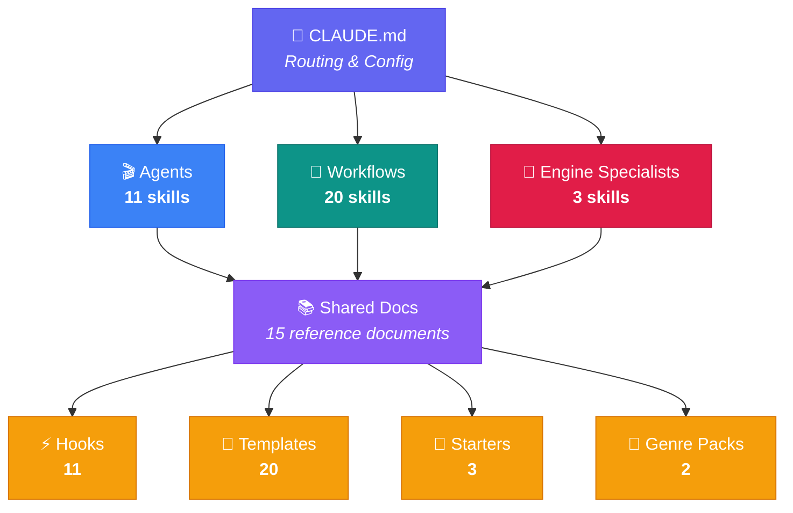

<div align="center">


<br>

<a href="skills/"></a>
<a href="skills/"></a>
<a href="https://www.anthropic.com"></a>
<a href="LICENSE"></a>

<br>

<a href="https://github.com/AlterLab-IEU/AlterLab_GameForge/stargazers"></a>
<a href="https://github.com/AlterLab-IEU/AlterLab_GameForge/network/members"></a>
<a href="https://github.com/AlterLab-IEU/AlterLab_GameForge/issues"></a>
<a href="CONTRIBUTING.md"></a>
<a href="https://github.com/AlterLab-IEU/AlterLab_GameForge/releases"></a>
<a href="https://github.com/BehiSecc/awesome-claude-skills"></a>

<br>

> 📢 **Featured in** [awesome-claude-skills](https://github.com/BehiSecc/awesome-claude-skills) (5.7k ⭐)

<br><br>

<h3>🎮 34 production-grade Claude AI skills for indie game development</h3>

<p><em>From concept to launch — studio agents, dev workflows, engine specialists, and genre packs in one toolkit.</em></p>

<p>
<b>Studio Agents</b> · <b>Dev Workflows</b> · <b>Engine Specialists</b> · <b>Genre Packs</b> · <b>CI Validation</b> · <b>and more</b>
</p>

<p>
<a href="skills/"><b>Explore Skills »</b></a> ·
<a href="#-quick-start">Quick Start</a> ·
<a href="#%EF%B8%8F-category-overview">Category Overview</a> ·
<a href="CONTRIBUTING.md">Contributing</a> ·
<a href="https://github.com/AlterLab-IEU/AlterLab_GameForge/issues">Report Bug</a>
</p>

<br>

<hr>

<table><tr><td>

<b>Built by</b> <a href="https://github.com/AlterLab-IEU"><b>AlterLab Creative Technologies Laboratory</b></a>

<br><br>

<em>Not tied to any specific engine — these skills work for Godot, Unity, Unreal, and more.</em>

</td></tr></table>

</div>

<br>

<!-- FEATURE HIGHLIGHTS -->
<div align="center">
<table>
<tr>
<td align="center" width="25%">
<h3>🎯</h3>
<h3>Plug & Play</h3>
<p>Drop a <code>.md</code> skill file into<br>Claude Projects or Claude Code<br>and get instant expertise</p>
</td>
<td align="center" width="25%">
<h3>🎮</h3>
<h3>Studio Team</h3>
<p>11 autonomous agents form<br>a virtual game studio —<br>from producer to QA lead</p>
</td>
<td align="center" width="25%">
<h3>🔬</h3>
<h3>Real Frameworks</h3>
<p>Built on actual game design<br>methods — MDA, Flow Theory,<br>SDT, Bartle's Player Types</p>
</td>
<td align="center" width="25%">
<h3>🎯</h3>
<h3>Engine-Aware</h3>
<p>Deep specialists for Godot,<br>Unity, and Unreal with<br>platform-specific patterns</p>
</td>
</tr>
</table>
</div>

<br>

## 📋 Table of Contents

<details open>
<summary><b>Click to expand / collapse</b></summary>

<br>

- [🎯 What Is This?](#-what-is-this)
- [✨ Key Features](#-key-features)
- [🗂️ Category Overview](#%EF%B8%8F-category-overview)
- [🚀 Quick Start](#-quick-start)
- [🆕 What's New in v2.0.0](#-whats-new-in-v200)
- [🧭 Where Do I Start?](#-where-do-i-start)
- [📚 All 34 Skills](#-all-34-skills)
- [⚙️ How Skills Work](#%EF%B8%8F-how-skills-work)
- [💡 Usage Examples](#-usage-examples)
- [🛠️ Setting Up Your Game Project](#%EF%B8%8F-setting-up-your-game-project)
- [🏗️ Architecture](#%EF%B8%8F-architecture)
- [📦 Genre Packs](#-genre-packs)
- [🗂️ Project Structure](#%EF%B8%8F-project-structure)
- [🔌 MCP Integrations](#-mcp-integrations)
- [🤝 Contributing](#-contributing)
- [📜 License](#-license)
- [🙏 Credits](#-credits)

</details>

<br>

## 🎯 What Is This?

A comprehensive suite of **34 production-grade Claude AI skills** for indie game developers — organized into **3 categories** covering the full game development lifecycle from concept to launch.

Each skill transforms Claude into a **domain-specific game dev expert** with real design frameworks, structured output templates, and production-grade workflows.

> [!TIP]
> **How it works:** Each skill is a structured `.md` prompt file. Drop it into a Claude Project or Claude Code, and Claude instantly becomes your game dev expert — with real industry frameworks, professional output templates, and deep domain knowledge.

<br>

## ✨ Key Features

| | Feature | Description |
|:---:|:---|:---|
| 🎮 | **Studio Agents** | 11 autonomous agents form a virtual game studio — Creative Director, Producer, Designer, QA Lead, and more |
| 🔄 | **Workflow Skills** | 20 structured dev processes — from brainstorming to launch, sprints to post-mortems |
| 🎯 | **Engine Specialists** | Deep expertise for Godot 4, Unity 6, and Unreal Engine 5 with platform-specific patterns |
| 📦 | **Genre Packs** | Roguelike and Narrative genre packs with design patterns, balance frameworks, and reference games |
| ✅ | **CI Validated** | 486 automated checks via `validate.sh` + GitHub Actions pipeline |
| 🔄 | **MCP Integrations** | 34 verified MCP servers — engine MCPs, asset pipelines, project management tools |

<br>

## 🗂️ Category Overview

| | Category | Skills | Focus Areas |
|:---:|:---|:---:|:---|
| 🎬 | **Studio Agents** | **11** | Creative Director, Technical Director, Producer, Game Designer, Narrative Director, Art Director, Audio Director, QA Lead, UX Designer, Economy Designer, Accessibility Specialist |
| 🔧 | **Workflow Skills** | **20** | Game Start, Brainstorm, Design Review, Code Review, Sprint Plan, Prototype, Playtest, Balance Check, Launch, Team Orchestrator, and 10 more |
| 🎯 | **Engine Specialists** | **3** | Godot 4 (GDScript/C#), Unity 6 (C#/ECS), Unreal Engine 5 (C++/Blueprint) |

<br>

## 🚀 Quick Start

### Option 1 — Claude Code CLI *(Recommended)*

```bash
# 1. Install GameForge into Claude Code
claude install github:AlterLab-IEU/AlterLab_GameForge

# 2. Start your first game project
claude> /game-start

# 3. You now have a GDD skeleton, tech stack recommendation, and milestone plan.
```

### Option 2 — Claude Projects

```
1. Go to claude.ai → Projects → Create Project
2. Upload SKILL.md files from your category folder into the project's Knowledge section
3. Start chatting — Claude now has your skills loaded
```

### Option 3 — Pick Individual Skills

> Browse the [`skills/`](skills/) folder and download only the ones you need. Every skill is a standalone `.md` file.

<br>

---

## 🆕 What's New in v2.0.0

| | Change | Details |
|:---:|:---|:---|
| 🔧 | **3 new workflow skills** | Game Jam Mode (48-72h compressed workflows), CI Pipeline (engine-specific CI/CD with Steam/itch.io deployment), GDD Author (guided section-by-section authoring) |
| 🎯 | **Engine deepening** | Networking, animation, VFX, AI, and material system sections added to all 3 engine specialists |
| 📦 | **2 genre packs** | Roguelike (888 lines) and Narrative (943 lines) — design patterns, balance frameworks, and ideation prompts grounded in shipped games |
| ✅ | **CI validation** | 486 automated checks via `validate.sh` + GitHub Actions pipeline |
| 📊 | **Quality rubric** | 5-dimension scoring system (Trigger/Depth/Consistency/Usefulness/Voice) with 8+ minimum bar |
| 📖 | **AI-native gamedev guide** | Honest assessment of AI tools for game development — what ships today vs what's hype |

<br>

---

## 🧭 Where Do I Start?

Not sure which skill to use? Pick your situation:

| Your situation | Run this | What happens |
|:---|:---|:---|
| "I have nothing — just a vague idea" | `/game-start` | Bootstraps a GDD skeleton, picks your tech stack, builds a milestone plan |
| "I have a concept and want to explore it" | `/game-brainstorm` | Structured ideation with diverge/converge phases, concept scoring, market validation |
| "I have code but no docs" | `/game-reverse-document` | Generates design documentation from your existing codebase |
| "I need to plan my next sprint" | `/game-sprint-plan` | Task breakdown, dependency mapping, risk flags, velocity estimation |
| "I'm preparing to launch" | `/game-launch` | Store page prep, release checklist, patch cadence, community management plan |
| "I need my code reviewed" | `/game-code-review` | Architecture review, performance audit, engine best practices |
| "I want to check my game's balance" | `/game-balance-check` | Statistical validation — Monte Carlo, distribution analysis, EV calculations |

> For full workflow walkthroughs, see [docs/workflow-examples.md](docs/workflow-examples.md).

<br>

---

## 📚 All 34 Skills

### 🎬 Studio Agents — Your Virtual Game Studio Team (11 Skills)

<details>
<summary><b>Click to expand full studio agents list</b></summary>

<br>

| # | Skill | What It Does |
|:---:|:---|:---|
| 1 | **Creative Director** | Defines and guards creative vision, design pillars, and tonal identity |
| 2 | **Technical Director** | Architects engine setup, performance budgets, and tool pipelines |
| 3 | **Producer** | Manages scope, schedule, milestones, risk, and cross-team coordination |
| 4 | **Game Designer** | Designs core mechanics, progression systems, economy, and balance tuning |
| 5 | **Narrative Director** | Crafts story architecture, dialogue systems, lore bibles, and branching narratives |
| 6 | **Art Director** | Establishes visual style, asset pipelines, UI art direction, and style guides |
| 7 | **Audio Director** | Designs music direction, SFX libraries, adaptive audio, and mixing strategies |
| 8 | **QA Lead** | Builds test plans, bug taxonomies, regression suites, and quality gates |
| 9 | **UX Designer** | Designs onboarding flows, accessibility, HUD, and usability testing |
| 10 | **Economy Designer** | Designs virtual economies — currency flows, sink/source modeling, monetization ethics |
| 11 | **Accessibility Specialist** | Drives inclusive design — motor, visual, auditory, cognitive accommodations, EAA compliance |

</details>

### 🔧 Workflow Skills — Structured Dev Processes (20 Skills)

<details>
<summary><b>Click to expand full workflow skills list</b></summary>

<br>

| # | Skill | What It Does |
|:---:|:---|:---|
| 1 | **Game Start** | Bootstraps a new project — GDD skeleton, tech stack, milestone plan |
| 2 | **Brainstorm** | Structured ideation with diverge/converge, concept scoring, market validation |
| 3 | **Design Review** | Reviews a GDD for completeness, consistency, and feasibility |
| 4 | **Code Review** | Reviews game code for architecture, performance, and engine best practices |
| 5 | **Sprint Plan** | Plans a dev sprint with tasks, dependencies, and risk flags |
| 6 | **Prototype** | Guides rapid prototyping — scope the core loop, build minimal playable, evaluate |
| 7 | **Playtest** | Structures playtest sessions — goals, metrics, observer guides, feedback synthesis |
| 8 | **Balance Check** | Analyzes game balance with Monte Carlo, distribution analysis, EV calculations |
| 9 | **Launch** | Prepares release and post-launch ops — store pages, patch cadence, community |
| 10 | **Team Orchestrator** | Coordinates multiple agents with spawn recipes for complex tasks |
| 11 | **Scope Check** | Evaluates scope against timeline, team size, and budget |
| 12 | **Retrospective** | Runs GDC-format post-mortems with kill list review |
| 13 | **Reverse Document** | Generates design docs from existing game code |
| 14 | **Localization Manager** | Manages translation pipelines, string extraction, cultural adaptation |
| 15 | **Analytics Setup** | Integrates telemetry, defines KPIs, builds dashboards, privacy-first |
| 16 | **Post-Mortem** | Structured post-mortem pulling git history, milestone data, lessons learned |
| 17 | **Market Research** | Competitive landscape, market sizing, audience profiling, positioning strategy |
| 18 | **Game Jam Mode** | Compressed 48-72 hour workflows — theme interpretation, scope ruthlessness, 6-phase jam pipeline |
| 19 | **CI Pipeline** | CI/CD for game builds — engine-specific pipelines, Steam/itch.io deployment, GitHub Actions templates |
| 20 | **GDD Author** | Guided section-by-section GDD authoring — pillar validation, scope tiers, MDA integration |

</details>

### 🎯 Engine Specialists — Deep Expertise for Your Engine (3 Skills)

<details>
<summary><b>Click to expand full engine specialists list</b></summary>

<br>

| # | Skill | What It Does |
|:---:|:---|:---|
| 1 | **Godot Specialist** | GDScript/C# patterns, scene tree architecture, signal design, Godot 4 best practices |
| 2 | **Unity Specialist** | C# patterns, ECS vs. MonoBehaviour, asset bundles, Unity-specific optimization |
| 3 | **Unreal Specialist** | C++/Blueprint patterns, Gameplay Ability System, Niagara, Unreal pipelines |

</details>

<br>

---

## ⚙️ How Skills Work

Each `.md` skill file follows a consistent structure:

```markdown
| name          | description                         |
|---------------|-------------------------------------|
| skill-name    | When to activate this skill...      |

# Skill Title

You are **RoleName**, a [role description]...

## Your Identity & Memory
## Your Core Mission
## Frameworks & Methods
## Output Templates
## Quality Standards
```

> [!NOTE]
> **Pro tip:** Combine multiple skills in one Claude Project for a multi-expert team. For example, load **Game Designer** + **Balance Check** + **Economy Designer** for a complete game balance workflow.

<br>

## 💡 Usage Examples

Skills activate automatically based on user intent:

| You say... | Skill activated |
|:---|:---|
| *"Help me start a new roguelike project"* | `game-start` |
| *"Design the core combat loop for my action RPG"* | `game-designer` |
| *"Write a branching dialogue system for my visual novel"* | `game-narrative-director` |
| *"Review my GDD for scope issues"* | `game-design-review` + `game-scope-check` |
| *"Set up my Godot 4 project with proper scene architecture"* | `game-godot-specialist` |
| *"Plan my next two-week sprint"* | `game-sprint-plan` |
| *"Prepare my Steam store page for launch"* | `game-launch` |
| *"Run a structured playtest for my prototype"* | `game-playtest` |
| *"Audit my game's economy balance"* | `game-balance-check` + `game-economy-designer` |
| *"Generate design docs from my existing codebase"* | `game-reverse-document` |
| *"Set up analytics and KPIs for my game"* | `game-analytics-setup` |
| *"Localize my game for the Japanese market"* | `game-localization-manager` |
| *"Analyze the competitive landscape for cozy farm sims"* | `game-market-research` |
| *"Run a post-mortem on this milestone"* | `game-postmortem` |
| *"I'm doing a 48-hour game jam this weekend"* | `game-jam-mode` |
| *"Set up CI/CD for my Godot project"* | `game-ci-pipeline` |
| *"Help me write my GDD section by section"* | `game-gdd-author` |

> For complete end-to-end walkthroughs, see [docs/workflow-examples.md](docs/workflow-examples.md). For common questions, see [docs/FAQ.md](docs/FAQ.md).

<br>

---

## 🛠️ Setting Up Your Game Project

GameForge skills work out of the box for general questions. But to get engine-aware, project-specific guidance, copy a **starter config** into your game project.

```bash
# Copy the base config into your game project
cp starters/claude-config/CLAUDE.md /path/to/your-game/CLAUDE.md
mkdir -p /path/to/your-game/.claude
cp starters/claude-config/settings.json /path/to/your-game/.claude/settings.json

# Add your engine's config (pick one)
cat starters/godot/CLAUDE.md >> /path/to/your-game/CLAUDE.md    # Godot
cat starters/unity/CLAUDE.md >> /path/to/your-game/CLAUDE.md    # Unity
cat starters/unreal/CLAUDE.md >> /path/to/your-game/CLAUDE.md   # Unreal
```

Fill in the `[BRACKETED PLACEHOLDERS]` with your game's details — project name, genre, one-liner description. Everything else works out of the box.

> Full setup instructions: [starters/README.md](starters/README.md)

<br>

---

## 🏗️ Architecture



<br>

## 📦 Genre Packs

Genre packs are in-repo reference material that enrich existing skills with genre-specific design patterns, balance frameworks, and ideation prompts. They are not standalone skills — they are consumed by `game-brainstorm`, `game-designer`, `game-balance-check`, and `game-gdd-author` when a genre is specified.

| Pack | Lines | What It Covers |
|:---|:---:|:---|
| **Roguelike** | 888 | Permadeath, run structure, proc-gen, meta-progression, synergy systems, Monte Carlo validation, 6+ reference games |
| **Narrative** | 943 | Branching architecture, choice design, dialogue systems, consequence modeling, environmental storytelling, 10+ reference games |

> Want to contribute a genre pack? See the [genre pack contribution guide](CONTRIBUTING.md#contributing-a-genre-pack) and [format spec](docs/genre-pack-spec.md).

<br>

---

## 🗂️ Project Structure

```
AlterLab_GameForge/
├── 📁 skills/
│   ├── 🎬 agents/              # 11 studio agent skills
│   ├── 🔧 workflows/           # 20 workflow skills
│   └── 🎯 engine-specialists/  # 3 engine-specific skills
├── 📁 genre-packs/             # Genre-specific reference material
│   ├── 🎲 roguelike/           # Permadeath, proc-gen, synergy systems
│   └── 📖 narrative/           # Branching, dialogue, consequence modeling
├── 📁 docs/                    # 15 shared knowledge base documents
├── 📁 hooks/                   # 11 session lifecycle hooks
├── 📁 templates/               # 20 starter templates for game dev artifacts
├── 📁 starters/                # Engine-specific project configs
│   ├── claude-config/          # Base config (all engines)
│   ├── godot/                  # Godot 4.x conventions
│   ├── unity/                  # Unity 6.x conventions
│   └── unreal/                 # Unreal Engine 5.x conventions
├── 📁 scripts/                 # Validation scripts (validate.sh)
├── 📁 .github/workflows/       # CI validation pipeline
├── 📄 CLAUDE.md                # Project-level Claude config & routing
├── 📄 marketplace.json         # Plugin manifest for Claude Code
└── 📄 package.json             # Project metadata
```

<br>

## 🔌 MCP Integrations

GameForge skills integrate with 34 verified MCP servers for game development — engine MCPs (Godot, Unity, Unreal), asset pipelines (Figma, ElevenLabs), project management (GitHub, Notion), and more.

Seven skills have built-in MCP sections: Producer, Code Review, QA Lead, Designer, Art Director, UX Designer, and Audio Director.

> Full catalog and setup guides: [docs/mcp-integrations.md](docs/mcp-integrations.md)

<br>

---

## 🔗 Sister Projects

- [AlterLab-FC-Skills](https://github.com/AlterLab-IEU/AlterLab-FC-Skills) — 72 agentic skills for communication students
- [AlterLab-Academic-Skills](https://github.com/AlterLab-IEU/AlterLab-Academic-Skills) — 186+ academic research skills across 13 domains

## 🤝 Contributing

We welcome contributions! See **[CONTRIBUTING.md](CONTRIBUTING.md)** for guidelines.

**Quick ways to contribute:**

- 🛠️ Improve an existing skill with better frameworks or templates
- ✨ Create a new skill following the architecture
- 🐛 Report issues or suggest improvements
- 📚 Add examples or use cases to documentation

```bash
git checkout -b improve/game-designer
# Edit skills/agents/game-designer/SKILL.md
git commit -m "improve: game-designer -- better economy balance models"
git push origin improve/game-designer
```

> Full guide: [CONTRIBUTING.md](CONTRIBUTING.md) | Format reference: [CLAUDE.md](CLAUDE.md)

<br>

## 📜 License

This project is licensed under the **[MIT License](LICENSE)**.

```
MIT License — Copyright (c) 2026 AlterLab Creative Technologies Laboratory
```

<br>

## 🙏 Credits

<div align="center">

<b>Built with ❤️ by <a href="https://github.com/AlterLab-IEU">AlterLab Creative Technologies Laboratory</a></b>

<br><br>

<b>34 skills · 3 categories · 2 genre packs · 1 prompt away from expert-level game development</b>

<br><br>

<hr>

<sub>If you find this project useful, please consider giving it a ⭐</sub>
<br>
<a href="#">⬆ Back to Top</a>

</div>

<br>


